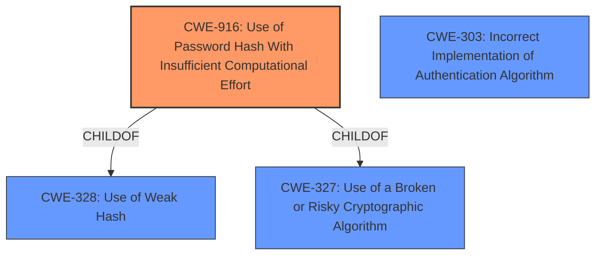

# Enhanced Analysis for CVE-2020-14516

# Summary

| CWE ID | CWE Name | Confidence | CWE Abstraction Level | CWE Vulnerability Mapping Label | CWE-Vulnerability Mapping Notes |
|---|---|---|---|---|---|
| CWE-916 | Use of Password Hash With Insufficient Computational Effort | 1.0 | Base | Allowed | Primary CWE |
| CWE-328 | Use of Weak Hash | 0.7 | Base | Allowed | Secondary Candidate |
| CWE-303 | Incorrect Implementation of Authentication Algorithm | 0.6 | Base | Allowed | Secondary Candidate |

## Evidence and Confidence

*   **Confidence Score:** 0.9
*   **Evidence Strength:** HIGH

## Relationship Analysis

The primary CWE, CWE-916, is related to CWE-328 (Use of Weak Hash) and CWE-327 (Use of a Broken or Risky Cryptographic Algorithm) as a child. These relationships suggest that the insufficient computational effort is a specific type of weak hashing, and weak hashing is a type of broken or risky cryptography. CWE-303 is related to the incorrect implemention of authentication. The analysis favors CWE-916 due to its specificity regarding password hashing and the explicit mention of insufficient computational effort in the summary, making it the most accurate representation of the vulnerability.



## Vulnerability Chain

The vulnerability chain starts with the **improper implementation** of the SHA-256 hashing algorithm, leading to the **use of a password hash with insufficient computational effort** (CWE-916). This allows a remote, unauthenticated attacker to create new users, modify configuration data, and gain unauthorized control.

## Summary of Analysis

The initial assessment strongly points to CWE-916 as the primary weakness, supported by the "**password hash is created with insufficient computational effort making it easier to crack**" statement in the "CVE Reference Links Content Summary". This is further reinforced by the vulnerability description highlighting the issue with SHA-256 implementation preventing proper hashing. The relationship graph influenced the decision by providing context to other cryptography related issues.

CWE-916 is at the optimal level of specificity because it directly addresses the root cause—the inadequate computational effort in password hashing. While CWE-328 (Use of Weak Hash) is a parent, CWE-916 provides more precise details about the nature of the weakness.

**CWE Considerations:**

*   **CWE-916: Use of Password Hash With Insufficient Computational Effort (Primary):** The vulnerability description and summary explicitly mention the improper hashing and insufficient computational effort, aligning perfectly with CWE-916's description. This leads to a high confidence level.
*   **CWE-328: Use of Weak Hash (Secondary):** This is a broader category than CWE-916, but still relevant as the **improper SHA-256 implementation** results in a weak hash.
*   **CWE-303: Incorrect Implementation of Authentication Algorithm (Secondary):** This is related to authentication algorithms.

Relevant CWE Information:

# Enhanced Context (25 CWEs)
The following CWEs were identified as potentially relevant to this vulnerability:

## CWE-328: Use of Weak Hash
**Abstraction Level**: Base
**Similarity Score**: 0.81
**Source**: dense

**Description**:
The product uses an algorithm that produces a digest (output value) that does not meet security expectations for a hash function that allows an adversary to reasonably determine the original input (preimage attack), find another input that can produce the same hash (2nd preimage attack), or find multiple inputs that evaluate to the same hash (birthday attack).

**Mapping Guidance**:
- Usage: Allowed
- Rationale: This CWE entry is at the Base level of abstraction, which is a preferred level of abstraction for mapping to the root causes of vulnerabilities.

## CWE-916: Use of Password Hash With Insufficient Computational Effort
**Abstraction Level**: Base
**Similarity Score**: 0.79
**Source**: dense

**Description**:
The product generates a hash for a password, but it uses a scheme that does not provide a sufficient level of computational effort that would make password cracking attacks infeasible or expensive.

**Mapping Guidance**:
- Usage: Allowed
- Rationale: This CWE entry is at the Base level of abstraction, which is a preferred level of abstraction for mapping to the root causes of vulnerabilities.

## CWE-303: Incorrect Implementation of Authentication Algorithm
**Abstraction Level**: Base
**Similarity Score**: 0.78
**Source**: dense

**Description**:
The requirements for the product dictate the use of an established authentication algorithm, but the implementation of the algorithm is incorrect.

**Mapping Guidance**:
- Usage: Allowed
- Rationale: This CWE entry is at the Base level of abstraction, which is a preferred level of abstraction for mapping to the root causes of vulnerabilities.


## CWE Relationship Analysis

Current CWEs represent these abstraction levels: .


### Vulnerability Chain Analysis

**Chain starting from CWE-327:**
- 327 (Use of a Broken or Risky Cryptographic Algorithm) - ROOT


**Chain starting from CWE-303:**
- 303 (Incorrect Implementation of Authentication Algorithm) - ROOT


### CWE Relationship Diagram

```mermaid
graph TD
    classDef primary fill:#f96,stroke:#333,stroke-width:2px
    classDef secondary fill:#69f,stroke:#333
    classDef tertiary fill:#9e9,stroke:#333
```