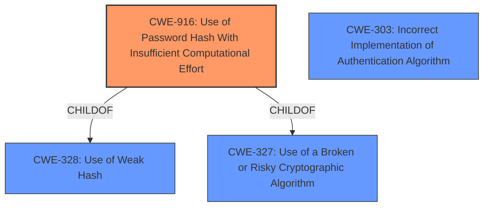

# Analysis for CVE-2020-14516

# Summary

| CWE ID | CWE Name | Confidence | CWE Abstraction Level | CWE Vulnerability Mapping Label | CWE-Vulnerability Mapping Notes |
|---|---|---|---|---|---|
| CWE-916 | Use of Password Hash With Insufficient Computational Effort | 1.0 | Base | Allowed | Primary CWE |
| CWE-328 | Use of Weak Hash | 0.7 | Base | Allowed | Secondary Candidate |
| CWE-303 | Incorrect Implementation of Authentication Algorithm | 0.6 | Base | Allowed | Secondary Candidate |

## Evidence and Confidence

*   **Confidence Score:** 0.9
*   **Evidence Strength:** HIGH

## Relationship Analysis

The primary CWE, CWE-916, is related to CWE-328 (Use of Weak Hash) and CWE-327 (Use of a Broken or Risky Cryptographic Algorithm) as a child. These relationships suggest that the insufficient computational effort is a specific type of weak hashing, and weak hashing is a type of broken or risky cryptography. CWE-303 is related to the incorrect implemention of authentication. The analysis favors CWE-916 due to its specificity regarding password hashing and the explicit mention of insufficient computational effort in the summary, making it the most accurate representation of the vulnerability.

## Vulnerability Chain

The vulnerability chain starts with the **improper implementation** of the SHA-256 hashing algorithm, leading to the **use of a password hash with insufficient computational effort** (CWE-916). This allows a remote, unauthenticated attacker to create new users, modify configuration data, and gain unauthorized control.

## Summary of Analysis

The initial assessment strongly points to CWE-916 as the primary weakness, supported by the "**password hash is created with insufficient computational effort making it easier to crack**" statement in the "CVE Reference Links Content Summary". This is further reinforced by the vulnerability description highlighting the issue with SHA-256 implementation preventing proper hashing. The relationship graph influenced the decision by providing context to other cryptography related issues.

CWE-916 is at the optimal level of specificity because it directly addresses the root cause—the inadequate computational effort in password hashing. While CWE-328 (Use of Weak Hash) is a parent, CWE-916 provides more precise details about the nature of the weakness.

**CWE Considerations:**

*   **CWE-916: Use of Password Hash With Insufficient Computational Effort (Primary):** The vulnerability description and summary explicitly mention the improper hashing and insufficient computational effort, aligning perfectly with CWE-916's description. This leads to a high confidence level.
*   **CWE-328: Use of Weak Hash (Secondary):** This is a broader category than CWE-916, but still relevant as the **improper SHA-256 implementation** results in a weak hash.
*   **CWE-303: Incorrect Implementation of Authentication Algorithm (Secondary):** This is related to authentication algorithms.

Relevant CWE Information:

# Enhanced Context (25 CWEs)
The following CWEs were identified as potentially relevant to this vulnerability:

## CWE-328: Use of Weak Hash
**Abstraction Level**: Base
**Similarity Score**: 0.81
**Source**: dense

**Description**:
The product uses an algorithm that produces a digest (output value) that does not meet security expectations for a hash function that allows an adversary to reasonably determine the original input (preimage attack), find another input that can produce the same hash (2nd preimage attack), or find multiple inputs that evaluate to the same hash (birthday attack).

**Mapping Guidance**:
- Usage: Allowed
- Rationale: This CWE entry is at the Base level of abstraction, which is a preferred level of abstraction for mapping to the root causes of vulnerabilities.

## CWE-916: Use of Password Hash With Insufficient Computational Effort
**Abstraction Level**: Base
**Similarity Score**: 0.79
**Source**: dense

**Description**:
The product generates a hash for a password, but it uses a scheme that does not provide a sufficient level of computational effort that would make password cracking attacks infeasible or expensive.

**Mapping Guidance**:
- Usage: Allowed
- Rationale: This CWE entry is at the Base level of abstraction, which is a preferred level of abstraction for mapping to the root causes of vulnerabilities.

## CWE-303: Incorrect Implementation of Authentication Algorithm
**Abstraction Level**: Base
**Similarity Score**: 0.78
**Source**: dense

**Description**:
The requirements for the product dictate the use of an established authentication algorithm, but the implementation of the algorithm is incorrect.

**Mapping Guidance**:
- Usage: Allowed
- Rationale: This CWE entry is at the Base level of abstraction, which is a preferred level of abstraction for mapping to the root causes of vulnerabilities.

# Enhanced Query for CVE-2020-14516

## Vulnerability Description
In Rockwell Automation FactoryTalk Services Platform Versions 6.10.00 and 6.11.00, there is an issue with the implementation of the SHA-256 hashing algorithm with FactoryTalk Services Platform that prevents the user password from being hashed properly.

### Vulnerability Description Key Phrases
- **impact:** prevent the user password from being hashed properly
- **product:** Rockwell Automation FactoryTalk Services Platform
- **version:** 6.10.00 and 6.11.00
- **component:** SHA-256 hashing algorithm

## CVE Reference Links Content Summary
Based on the provided content, here's an analysis of the vulnerability:

**Root Cause of Vulnerability:**

*   The root cause is the improper implementation of the SHA-256 hashing algorithm within the FactoryTalk Services Platform. This leads to user passwords not being hashed properly. The password hash is created with insufficient computational effort making it easier to crack.

**Weaknesses/Vulnerabilities Present:**

*   **CWE-916: Use of Password Hash with Insufficient Computational Effort:** This is the core vulnerability, indicating a weakness in how the system handles password hashing, making it susceptible to attacks.

**Impact of Exploitation:**

*   A remote, unauthenticated attacker could create new users in the FactoryTalk Services Platform administration console.
*   These new users could then be used to modify or delete configuration and application data in other FactoryTalk software connected to the platform. This could lead to system instability, data loss, and unauthorized control over critical infrastructure.

**Attack Vectors:**

*   The attack vector is remote and unauthenticated, meaning an attacker can exploit the vulnerability over a network without needing any prior credentials.

**Required Attacker Capabilities/Position:**

*   The attacker needs network access to the vulnerable FactoryTalk Services Platform.
*   They require low skill to exploit the vulnerability.

**Additional Information:**

*   The vulnerability affects FactoryTalk Services Platform versions 6.10.00 and 6.11.00.
*   The vulnerability has been assigned a CVSS v3 base score of 10.0, indicating a critical severity.
*   The vulnerability affects critical infrastructure sectors including chemical, commercial facilities, critical manufacturing, energy, government facilities, and water/wastewater systems.
*   No public exploits are known at the time of the advisory.

This information provides more technical details than the original CVE description placeholder.

## Retriever Results

### Top Combined Results

| Rank | CWE ID | Name | Abstraction | Usage  | Retrievers | Individual Scores |
|------|--------|------|-------------|-------|------------|-------------------|
| 1 | 916 | Use of Password Hash With Insufficient Computational Effort | Base | Allowed | sparse | 0.127 |
| 2 | 328 | Use of Weak Hash | Base | Allowed | sparse | 0.088 |
| 3 | 306 | Missing Authentication for Critical Function | Base | Allowed | sparse | 0.079 |
| 4 | 676 | Use of Potentially Dangerous Function | Base | Allowed | sparse | 0.078 |
| 5 | 287 | Improper Authentication | Class | Discouraged | sparse | 0.075 |
| 6 | 836 | Use of Password Hash Instead of Password for Authentication | Base | Allowed | dense | 0.519 |
| 7 | 613 | Insufficient Session Expiration | Base | Allowed | graph | 0.002 |
| 8 | 248 | Uncaught Exception | Base | Allowed | sparse | 0.074 |
| 9 | 732 | Incorrect Permission Assignment for Critical Resource | Class | Allowed-with-Review | sparse | 0.072 |
| 10 | 327 | Use of a Broken or Risky Cryptographic Algorithm | Class | Allowed-with-Review | sparse | 0.071 |

# Complete CWE Specifications

## CWE-916: Use of Password Hash With Insufficient Computational Effort
**Abstraction:** Base
**Status:** Incomplete

### Description
The product generates a hash for a password, but it uses a scheme that does not provide a sufficient level of computational effort that would make password cracking attacks infeasible or expensive.

### Extended Description

Many password storage mechanisms compute a hash and store the hash, instead of storing the original password in plaintext. In this design, authentication involves accepting an incoming password, computing its hash, and comparing it to the stored hash.

Many hash algorithms are designed to execute quickly with minimal overhead, even cryptographic hashes. However, this efficiency is a problem for password storage, because it can reduce an attacker's workload for brute-force password cracking. If an attacker can obtain the hashes through some other method (such as SQL injection on a database that stores hashes), then the attacker can store the hashes offline and use various techniques to crack the passwords by computing hashes efficiently. Without a built-in workload, modern attacks can compute large numbers of hashes, or even exhaust the entire space of all possible passwords, within a very short amount of time, using massively-parallel computing (such as cloud computing) and GPU, ASIC, or FPGA hardware. In such a scenario, an efficient hash algorithm helps the attacker.

There are several properties of a hash scheme that are relevant to its strength against an offline, massively-parallel attack:

  - The amount of CPU time required to compute the hash ("stretching")

  - The amount of memory required to compute the hash ("memory-hard" operations)

  - Including a random value, along with the password, as input to the hash computation ("salting")

  - Given a hash, there is no known way of determining an input (e.g., a password) that produces this hash value, other than by guessing possible inputs ("one-way" hashing)

  - Relative to the number of all possible hashes that can be generated by the scheme, there is a low likelihood of producing the same hash for multiple different inputs ("collision resistance")

Note that the security requirements for the product may vary depending on the environment and the value of the passwords. Different schemes might not provide all of these properties, yet may still provide sufficient security for the environment. Conversely, a solution might be very strong in preserving one property, which still being very weak for an attack against another property, or it might not be able to significantly reduce the efficiency of a massively-parallel attack.

### Alternative Terms
None

### Relationships
ChildOf -> CWE-328
ChildOf -> CWE-327

### Mapping Guidance
**Usage:** Allowed
**Rationale:** This CWE entry is at the Base level of abstraction, which is a preferred level of abstraction for mapping to the root causes of vulnerabilities.
**Comments:** Carefully read both the name and description to ensure that this mapping is an appropriate fit. Do not try to 'force' a mapping to a lower-level Base/Variant simply to comply with this preferred level of abstraction.
**Reasons:**
- Acceptable-Use

### Observed Examples
- **CVE-2008-1526:** Router does not use a salt with a hash, making it easier to crack passwords.
- **CVE-2006-1058:** Router does not use a salt with a hash, making it easier to crack passwords.
- **CVE-2008-4905:** Blogging software uses a hard-coded salt when calculating a password hash.

## CWE-328: Use of Weak Hash
**Abstraction:** Base
**Status:** Draft

### Description
The product uses an algorithm that produces a digest (output value) that does not meet security expectations for a hash function that allows an adversary to reasonably determine the original input (preimage attack), find another input that can produce the same hash (2nd preimage attack), or find multiple inputs that evaluate to the same hash (birthday attack).

### Extended Description

A hash function is defined as an algorithm that maps arbitrarily sized data into a fixed-sized digest (output) such that the following properties hold:

  1. The algorithm is not invertible (also called "one-way" or "not reversible")

  1. The algorithm is deterministic; the same input produces the same digest every time

 Building on this definition, a cryptographic hash function must also ensure that a malicious actor cannot leverage the hash function to have a reasonable chance of success at determining any of the following:

  1. the original input (preimage attack), given only the digest

  1. another input that can produce the same digest (2nd preimage attack), given the original input

  1. a set of two or more inputs that evaluate to the same digest (birthday attack), given the actor can arbitrarily choose the inputs to be hashed and can do so a reasonable amount of times

What is regarded as "reasonable" varies by context and threat model, but in general, "reasonable" could cover any attack that is more efficient than brute force (i.e., on average, attempting half of all possible combinations). Note that some attacks might be more efficient than brute force but are still not regarded as achievable in the real world.

Any algorithm that does not meet the above conditions will generally be considered weak for general use in hashing.

In addition to algorithmic weaknesses, a hash function can be made weak by using the hash in a security context that breaks its security guarantees. For example, using a hash function without a salt for storing passwords (that are sufficiently short) could enable an adversary to create a "rainbow table" [REF-637] to recover the password under certain conditions; this attack works against such hash functions as MD5, SHA-1, and SHA-2.

### Alternative Terms
None

### Relationships
ChildOf -> CWE-326
ChildOf -> CWE-327

### Mapping Guidance
**Usage:** Allowed
**Rationale:** This CWE entry is at the Base level of abstraction, which is a preferred level of abstraction for mapping to the root causes of vulnerabilities.
**Comments:** Carefully read both the name and description to ensure that this mapping is an appropriate fit. Do not try to 'force' a mapping to a lower-level Base/Variant simply to comply with this preferred level of abstraction.
**Reasons:**
- Acceptable-Use

### Additional Notes
**[Maintenance]** Since CWE 4.4, various cryptography-related entries including CWE-328 have been slated for extensive research, analysis, and community consultation to define consistent terminology, improve relationships, and reduce overlap or duplication. As of CWE 4.6, this work is still ongoing.

### Observed Examples
- **CVE-2022-30320:** Programmable Logic Controller (PLC) uses a protocol with a cryptographically insecure hashing algorithm for passwords.
- **CVE-2005-4900:** SHA-1 algorithm is not collision-resistant.
- **CVE-2020-25685:** DNS product uses a weak hash (CRC32 or SHA-1) of the query name, allowing attacker to forge responses by computing domain names with the same hash.

## CWE-306: Missing Authentication for Critical Function
**Abstraction:** Base
**Status:** Draft

### Description
The product does not perform any authentication for functionality that requires a provable user identity or consumes a significant amount of resources.

### Extended Description
Not provided

### Alternative Terms
None

### Relationships
ChildOf -> CWE-287
ChildOf -> CWE-287

### Mapping Guidance
**Usage:** Allowed
**Rationale:** This CWE entry is at the Base level of abstraction, which is a preferred level of abstraction for mapping to the root causes of vulnerabilities.
**Comments:** Carefully read both the name and description to ensure that this mapping is an appropriate fit. Do not try to 'force' a mapping to a lower-level Base/Variant simply to comply with this preferred level of abstraction.
**Reasons:**
- Acceptable-Use

### Observed Examples
- **CVE-2022-31260:** Chain: a digital asset management program has an undisclosed backdoor in the legacy version of a PHP script (CWE-912) that could allow an unauthenticated user to export metadata (CWE-306)
- **CVE-2022-29951:** TCP-based protocol in Programmable Logic Controller (PLC) has no authentication.
- **CVE-2022-29952:** Condition Monitor firmware uses a protocol that does not require authentication.

## CWE-676: Use of Potentially Dangerous Function
**Abstraction:** Base
**Status:** Draft

### Description
The product invokes a potentially dangerous function that could introduce a vulnerability if it is used incorrectly, but the function can also be used safely.

### Extended Description
Not provided

### Alternative Terms
None

### Relationships
ChildOf -> CWE-1177

### Mapping Guidance
**Usage:** Allowed
**Rationale:** This CWE entry is at the Base level of abstraction, which is a preferred level of abstraction for mapping to the root causes of vulnerabilities.
**Comments:** Carefully read both the name and description to ensure that this mapping is an appropriate fit. Do not try to 'force' a mapping to a lower-level Base/Variant simply to comply with this preferred level of abstraction.
**Reasons:**
- Acceptable-Use

### Additional Notes
**[Relationship]** This weakness is different than CWE-242 (Use of Inherently Dangerous Function). CWE-242 covers functions with such significant security problems that they can never be guaranteed to be safe. Some functions, if used properly, do not directly pose a security risk, but can introduce a weakness if not called correctly. These are regarded as potentially dangerous. A well-known example is the strcpy() function. When provided with a destination buffer that is larger than its source, strcpy() will not overflow. However, it is so often misused that some developers prohibit strcpy() entirely.

### Observed Examples
- **CVE-2007-1470:** Library has multiple buffer overflows using sprintf() and strcpy()
- **CVE-2009-3849:** Buffer overflow using strcat()
- **CVE-2006-2114:** Buffer overflow using strcpy()

## CWE-287: Improper Authentication
**Abstraction:** Class
**Status:** Draft

### Description
When an actor claims to have a given identity, the product does not prove or insufficiently proves that the claim is correct.

### Extended Description
Not provided

### Alternative Terms
authentification: An alternate term is "authentification", which appears to be most commonly used by people from non-English-speaking countries.
AuthN: "AuthN" is typically used as an abbreviation of "authentication" within the web application security community. It is also distinct from "AuthZ," which is an abbreviation of "authorization." The use of "Auth" as an abbreviation is discouraged, since it could be used for either authentication or authorization.
AuthC: "AuthC" is used as an abbreviation of "authentication," but it appears to used less frequently than "AuthN."

### Relationships
ChildOf -> CWE-284
ChildOf -> CWE-284

### Mapping Guidance
**Usage:** Discouraged
**Rationale:** This CWE entry might be misused when lower-level CWE entries are likely to be applicable. It is a level-1 Class (i.e., a child of a Pillar).
**Comments:** Consider children or descendants, beginning with CWE-1390: Weak Authentication or CWE-306: Missing Authentication for Critical Function.
**Reasons:**
- Frequent Misuse
**Suggested Alternatives:**
- CWE-1390: Weak Authentication
- CWE-306: Missing Authentication for Critical Function

### Additional Notes
**[Relationship]** This can be resultant from SQL injection vulnerabilities and other issues.

**[Maintenance]** The Taxonomy_Mappings to ISA/IEC 62443 were added in CWE 4.10, but they are still under review and might change in future CWE versions. These draft mappings were performed by members of the "Mapping CWE to 62443" subgroup of the CWE-CAPEC ICS/OT Special Interest Group (SIG), and their work is incomplete as of CWE 4.10. The mappings are included to facilitate discussion and review by the broader ICS/OT community, and they are likely to change in future CWE versions.

### Observed Examples
- **CVE-2022-35248:** Chat application skips validation when Central Authentication Service (CAS) is enabled, effectively removing the second factor from two-factor authentication
- **CVE-2022-36436:** Python-based authentication proxy does not enforce password authentication during the initial handshake, allowing the client to bypass authentication by specifying a 'None' authentication type.
- **CVE-2022-30034:** Chain: Web UI for a Python RPC framework does not use regex anchors to validate user login emails (CWE-777), potentially allowing bypass of OAuth (CWE-1390).

## CWE-836: Use of Password Hash Instead of Password for Authentication
**Abstraction:** Base
**Status:** Incomplete

### Description
The product records password hashes in a data store, receives a hash of a password from a client, and compares the supplied hash to the hash obtained from the data store.

### Extended Description

Some authentication mechanisms rely on the client to generate the hash for a password, possibly to reduce load on the server or avoid sending the password across the network. However, when the client is used to generate the hash, an attacker can bypass the authentication by obtaining a copy of the hash, e.g. by using SQL injection to compromise a database of authentication credentials, or by exploiting an information exposure. The attacker could then use a modified client to replay the stolen hash without having knowledge of the original password.

As a result, the server-side comparison against a client-side hash does not provide any more security than the use of passwords without hashing.

### Alternative Terms
None

### Relationships
ChildOf -> CWE-1390
PeerOf -> CWE-602

### Mapping Guidance
**Usage:** Allowed
**Rationale:** This CWE entry is at the Base level of abstraction, which is a preferred level of abstraction for mapping to the root causes of vulnerabilities.
**Comments:** Carefully read both the name and description to ensure that this mapping is an appropriate fit. Do not try to 'force' a mapping to a lower-level Base/Variant simply to comply with this preferred level of abstraction.
**Reasons:**
- Acceptable-Use

### Observed Examples
- **CVE-2009-1283:** Product performs authentication with user-supplied password hashes that can be obtained from a separate SQL injection vulnerability (CVE-2009-1282).
- **CVE-2005-3435:** Product allows attackers to bypass authentication by obtaining the password hash for another user and specifying the hash in the pwd argument.

## CWE-613: Insufficient Session Expiration
**Abstraction:** Base
**Status:** Incomplete

### Description
According to WASC, "Insufficient Session Expiration is when a web site permits an attacker to reuse old session credentials or session IDs for authorization."

### Extended Description
Not provided

### Alternative Terms
None

### Relationships
ChildOf -> CWE-672
ChildOf -> CWE-672
CanPrecede -> CWE-287

### Mapping Guidance
**Usage:** Allowed
**Rationale:** This CWE entry is at the Base level of abstraction, which is a preferred level of abstraction for mapping to the root causes of vulnerabilities.
**Comments:** Carefully read both the name and description to ensure that this mapping is an appropriate fit. Do not try to 'force' a mapping to a lower-level Base/Variant simply to comply with this preferred level of abstraction.
**Reasons:**
- Acceptable-Use

### Additional Notes
**[Other]** The lack of proper session expiration may improve the likely success of certain attacks. For example, an attacker may intercept a session ID, possibly via a network sniffer or Cross-site Scripting attack. Although short session expiration times do not help if a stolen token is immediately used, they will protect against ongoing replaying of the session ID. In another scenario, a user might access a web site from a shared computer (such as at a library, Internet cafe, or open work environment). Insufficient Session Expiration could allow an attacker to use the browser's back button to access web pages previously accessed by the victim.

## CWE-248: Uncaught Exception
**Abstraction:** Base
**Status:** Draft

### Description
An exception is thrown from a function, but it is not caught.

### Extended Description
When an exception is not caught, it may cause the program to crash or expose sensitive information.

### Alternative Terms
None

### Relationships
ChildOf -> CWE-705
ChildOf -> CWE-755
ChildOf -> CWE-703
ChildOf -> CWE-703

### Mapping Guidance
**Usage:** Allowed
**Rationale:** This CWE entry is at the Base level of abstraction, which is a preferred level of abstraction for mapping to the root causes of vulnerabilities.
**Comments:** Carefully read both the name and description to ensure that this mapping is an appropriate fit. Do not try to 'force' a mapping to a lower-level Base/Variant simply to comply with this preferred level of abstraction.
**Reasons:**
- Acceptable-Use

### Observed Examples
- **CVE-2023-41151:** SDK for OPC Unified Architecture (OPC UA) server has uncaught exception when a socket is blocked for writing but the server tries to send an error
- **CVE-2023-21087:** Java code in a smartphone OS can encounter a "boot loop" due to an uncaught exception

## CWE-732: Incorrect Permission Assignment for Critical Resource
**Abstraction:** Class
**Status:** Draft

### Description
The product specifies permissions for a security-critical resource in a way that allows that resource to be read or modified by unintended actors.

### Extended Description
When a resource is given a permission setting that provides access to a wider range of actors than required, it could lead to the exposure of sensitive information, or the modification of that resource by unintended parties. This is especially dangerous when the resource is related to program configuration, execution, or sensitive user data. For example, consider a misconfigured storage account for the cloud that can be read or written by a public or anonymous user.

### Alternative Terms
None

### Relationships
ChildOf -> CWE-285
ChildOf -> CWE-668

### Mapping Guidance
**Usage:** Allowed-with-Review
**Rationale:** While the name itself indicates an assignment of permissions for resources, this is often misused for vulnerabilities in which "permissions" are not checked, which is an "authorization" weakness (CWE-285 or descendants) within CWE's model [REF-1287].
**Comments:** Closely analyze the specific mistake that is allowing the resource to be exposed, and perform a CWE mapping for that mistake.
**Reasons:**
- Frequent Misuse

### Additional Notes
**[Maintenance]** The relationships between privileges, permissions, and actors (e.g. users and groups) need further refinement within the Research view. One complication is that these concepts apply to two different pillars, related to control of resources (CWE-664) and protection mechanism failures (CWE-693).

### Observed Examples
- **CVE-2022-29527:** Go application for cloud management creates a world-writable sudoers file that allows local attackers to inject sudo rules and escalate privileges to root by winning a race condition.
- **CVE-2009-3482:** Anti-virus product sets insecure "Everyone: Full Control" permissions for files under the "Program Files" folder, allowing attackers to replace executables with Trojan horses.
- **CVE-2009-3897:** Product creates directories with 0777 permissions at installation, allowing users to gain privileges and access a socket used for authentication.

## CWE-327: Use of a Broken or Risky Cryptographic Algorithm
**Abstraction:** Class
**Status:** Draft

### Description
The product uses a broken or risky cryptographic algorithm or protocol.

### Extended Description

Cryptographic algorithms are the methods by which data is scrambled to prevent observation or influence by unauthorized actors. Insecure cryptography can be exploited to expose sensitive information, modify data in unexpected ways, spoof identities of other users or devices, or other impacts.

It is very difficult to produce a secure algorithm, and even high-profile algorithms by accomplished cryptographic experts have been broken. Well-known techniques exist to break or weaken various kinds of cryptography. Accordingly, there are a small number of well-understood and heavily studied algorithms that should be used by most products. Using a non-standard or known-insecure algorithm is dangerous because a determined adversary may be able to break the algorithm and compromise whatever data has been protected.

Since the state of cryptography advances so rapidly, it is common for an algorithm to be considered "unsafe" even if it was once thought to be strong. This can happen when new attacks are discovered, or if computing power increases so much that the cryptographic algorithm no longer provides the amount of protection that was originally thought.

For a number of reasons, this weakness is even more challenging to manage with hardware deployment of cryptographic algorithms as opposed to software implementation. First, if a flaw is discovered with hardware-implemented cryptography, the flaw cannot be fixed in most cases without a recall of the product, because hardware is not easily replaceable like software. Second, because the hardware product is expected to work for years, the adversary's computing power will only increase over time.

### Alternative Terms
None

### Relationships
ChildOf -> CWE-693
PeerOf -> CWE-311

### Mapping Guidance
**Usage:** Allowed-with-Review
**Rationale:** This CWE entry is a Class and might have Base-level children that would be more appropriate
**Comments:** Examine children of this entry to see if there is a better fit
**Reasons:**
- Abstraction

### Additional Notes
**[Maintenance]** Since CWE 4.4, various cryptography-related entries, including CWE-327 and CWE-1240, have been slated for extensive research, analysis, and community consultation to define consistent terminology, improve relationships, and reduce overlap or duplication. As of CWE 4.6, this work is still ongoing.

**[Maintenance]** The Taxonomy_Mappings to ISA/IEC 62443 were added in CWE 4.10, but they are still under review and might change in future CWE versions. These draft mappings were performed by members of the "Mapping CWE to 62443" subgroup of the CWE-CAPEC ICS/OT Special Interest Group (SIG), and their work is incomplete as of CWE 4.10. The mappings are included to facilitate discussion and review by the broader ICS/OT community, and they are likely to change in future CWE versions.

### Observed Examples
- **CVE-2022-30273:** SCADA-based protocol supports a legacy encryption mode that uses Tiny Encryption Algorithm (TEA) in ECB mode, which leaks patterns in messages and cannot protect integrity
- **CVE-2022-30320:** Programmable Logic Controller (PLC) uses a protocol with a cryptographically insecure hashing algorithm for passwords.
- **CVE-2008-3775:** Product uses "ROT-25" to obfuscate the password in the registry.

