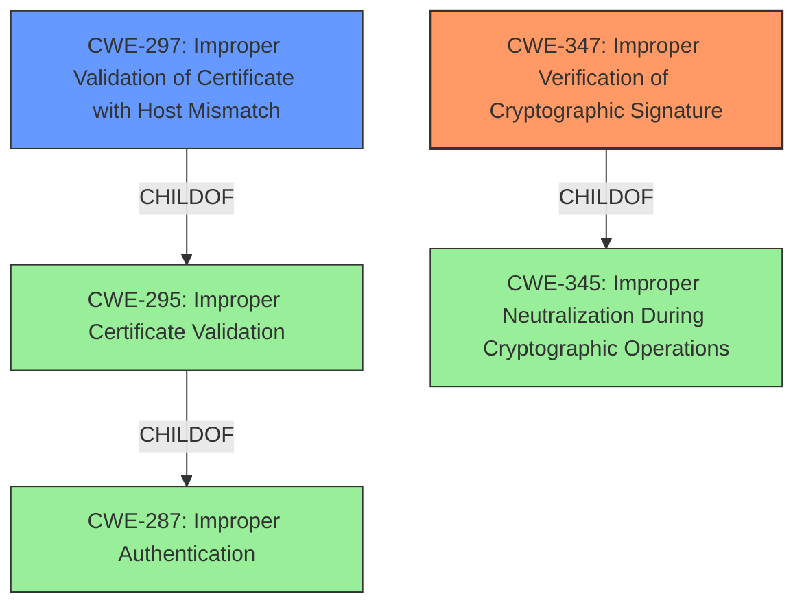

# Analysis for CVE-2020-1464

# Summary
| CWE ID | CWE Name | Confidence | CWE Abstraction Level | CWE Vulnerability Mapping Label | CWE-Vulnerability Mapping Notes |
|---|---|---|---|---|---|
| CWE-347 | Improper Verification of Cryptographic Signature | 1.0 | Base | Primary | Allowed |
| CWE-297 | Improper Validation of Certificate with Host Mismatch | 0.7 | Variant | Secondary | Allowed |

## Evidence and Confidence

*   **Confidence Score:** 0.9
*   **Evidence Strength:** HIGH

## Relationship Analysis
The primary CWE is CWE-347, which is a Base level weakness, and a child of CWE-345 (Improper Neutralization During Cryptographic Operations). CWE-297 is a Variant of CWE-295 (Improper Certificate Validation), which in turn is a child of CWE-287 (Improper Authentication). The relationship between CWE-297 and CWE-347 is that both deal with cryptographic validation issues, but CWE-347 is more general while CWE-297 is specific to certificate validation with host mismatch. Since the provided description focuses on file signature validation in general, CWE-347 is selected as the primary, with CWE-297 as a possible secondary candidate if the issue were specifically related to host mismatch in certificate validation, which it is not.

## Vulnerability Chain
The vulnerability chain starts with the **incorrect validation of file signatures**, leading to the ability to **bypass security features** and **load improperly signed files**.

## Summary of Analysis
The vulnerability description clearly states that Windows **incorrectly validates file signatures**. This aligns directly with CWE-347 (Improper Verification of Cryptographic Signature), which describes a product that "does not verify, or incorrectly verifies, the cryptographic signature for data." The CVE Reference Links Content Summary reinforces this by stating that the `MsiSIPVerifyIndirectData` function only checks the beginning of the file and ignores appended data, leading to **improper validation of the file format**.

The Retriever Results also lists CWE-347 as the top candidate, with a score of 0.456. The Mapping Guidance for CWE-347 states that it is at the Base level of abstraction, which is preferred, and that it is ALLOWED for use.

Other CWEs were considered but deemed less appropriate:

*   CWE-295 (Improper Certificate Validation): While related to cryptographic validation, it is specific to certificates. The vulnerability description does not explicitly mention certificates, so CWE-347 is a better fit.
*   CWE-297 (Improper Validation of Certificate with Host Mismatch): This is a variant of CWE-295 and even more specific, making it less suitable.
*   CWE-328 (Use of Weak Hash): This relates to using a weak hashing algorithm, which is not mentioned in the vulnerability description.
*   CWE-73 (External Control of File Name or Path): This is about user-controlled file paths, which is not the primary issue here.
*   CWE-787 (Out-of-bounds Write): This is a memory corruption issue, not directly related to signature validation.

Therefore, the primary CWE is CWE-347, accurately capturing the root cause of the vulnerability. CWE-297 is added as a secondary candidate because certificate validation could be related. The selection is based on direct evidence from the vulnerability description and supported by the Retriever Results. The selected CWE is at the optimal level of specificity (Base) and aligns with MITRE's mapping guidance.