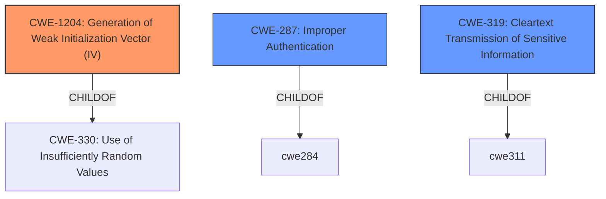

# Analysis for CVE-2020-1472

# Summary
| CWE ID    | CWE Name                                                        | Confidence | CWE Abstraction Level | CWE Vulnerability Mapping Label | CWE-Vulnerability Mapping Notes |
| :-------- | :-------------------------------------------------------------- | :--------- | :-------------------- | :------------------------------ | :---------------------------- |
| CWE-1204 | Generation of Weak Initialization Vector (IV)        | 0.9      | Base                  | Primary CWE                     | Allowed                     |
| CWE-287     | Improper Authentication                                          | 0.6     | Class                  | Secondary Candidate                     | Discouraged                     |
| CWE-319 | Cleartext Transmission of Sensitive Information | 0.5      | Base                  | Secondary Candidate                     | Allowed                     |

## Evidence and Confidence

*   **Confidence Score:** 0.9
*   **Evidence Strength:** HIGH

## Relationship Analysis
The primary relationship influencing the CWE selection is the ChildOf relationship between CWE-1204 and its parent, CWE-330. This indicates that CWE-1204 is a specific type of insufficient randomness, focusing on the generation of Initialization Vectors in cryptographic operations. Additionally, the Retriever Results and the vulnerability description specifically mention the usage of a static IV, further solidifying the choice of CWE-1204. CWE-287 is a class level CWE that is too high level, and the mapping guidance recommends against it.

## Vulnerability Chain
The vulnerability chain starts with the **root cause** of a **weak cryptographic practice (CWE-1204)**, specifically the use of a static IV. This leads to **improper authentication (CWE-287)**, allowing an attacker to bypass security checks. Ultimately, this results in **elevation of privilege**, where the attacker gains unauthorized access and control over the domain.

## Summary of Analysis
The initial assessment focused on the **elevation of privilege vulnerability**, but the CVE Reference Links Content Summary provided strong evidence pointing to a cryptographic flaw. The description clearly states that the vulnerability arises from the Netlogon protocol's use of a static, zero-value IV in AES-CFB8 mode. The use of weak crypto is a **root cause** of the vulnerability.

The evidence supporting CWE-1204 is strong, as it aligns directly with the technical details of the vulnerability: "The protocol reuses a static, zero-value initialization vector (IV) in AES-CFB8 mode. This violates the security requirements of AES-CFB8 which require a random IV."

The relationship analysis, particularly the ChildOf relationship between CWE-1204 and CWE-330, further strengthens the selection. CWE-1204 is a specific type of insufficient randomness.

The final decision to prioritize CWE-1204 is based on the detailed technical evidence, the Retriever Results, and the hierarchical relationships within the CWE structure. This ensures that the selected CWE is at the optimal level of specificity, accurately representing the root cause of the vulnerability.

Relevant CWE Information:

# Enhanced Context (25 CWEs)

## CWE-1204: Generation of Weak Initialization Vector (IV)
**Abstraction:** Base
**Similarity Score**: 6733.02
**Source**: sparse

**Description**:
The product uses a cryptographic primitive that uses an Initialization
			Vector (IV), but the product does not generate IVs that are
			sufficiently unpredictable or unique according to the expected
			cryptographic requirements for that primitive.
			

**Mapping Guidance**:
- Usage: Allowed
- Rationale: This CWE entry is at the Base level of abstraction, which is a preferred level of abstraction for mapping to the root causes of vulnerabilities.

**Observed Examples**
- **CVE-2020-1472:** ZeroLogon vulnerability - use of a static IV of all zeroes in AES-CFB8 mode

**Technical Explanation:**
CWE-1204 (Confidence: 0.9): This CWE accurately describes the root cause of the vulnerability. The Netlogon protocol's use of a static IV violates the cryptographic requirements for AES-CFB8, leading to a weakened encryption scheme. The "CVE Reference Links Content Summary" states: "The protocol reuses a static, zero-value initialization vector (IV) in AES-CFB8 mode. This violates the security requirements of AES-CFB8 which require a random IV." This aligns perfectly with the CWE description. The security implication is that an attacker can bypass authentication, leading to domain takeover. The MITRE mapping guidance ALLOWs for this CWE at the Base level of abstraction.
Other CWEs Considered but Not Used:

CWE-287 Improper Authentication: While the vulnerability leads to an authentication bypass, CWE-287 is a class-level CWE, and the root cause is the weak IV generation. Therefore, CWE-1204 is a more precise and appropriate choice. Also the mapping guidance for CWE-287 is Discouraged.
CWE-319 Cleartext Transmission of Sensitive Information: This CWE is not applicable because the vulnerability lies in the encryption process itself, not in the transmission of data in cleartext.