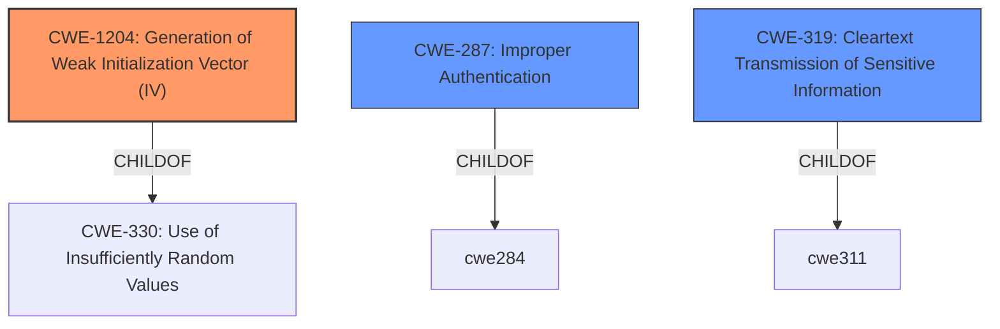

# Analysis for CVE-2020-1472

# Summary
| CWE ID    | CWE Name                                                        | Confidence | CWE Abstraction Level | CWE Vulnerability Mapping Label | CWE-Vulnerability Mapping Notes |
| :-------- | :-------------------------------------------------------------- | :--------- | :-------------------- | :------------------------------ | :---------------------------- |
| CWE-1204 | Generation of Weak Initialization Vector (IV)        | 0.9      | Base                  | Primary CWE                     | Allowed                     |
| CWE-287     | Improper Authentication                                          | 0.6     | Class                  | Secondary Candidate                     | Discouraged                     |
| CWE-319 | Cleartext Transmission of Sensitive Information | 0.5      | Base                  | Secondary Candidate                     | Allowed                     |

## Evidence and Confidence

*   **Confidence Score:** 0.9
*   **Evidence Strength:** HIGH

## Relationship Analysis
The primary relationship influencing the CWE selection is the ChildOf relationship between CWE-1204 and its parent, CWE-330. This indicates that CWE-1204 is a specific type of insufficient randomness, focusing on the generation of Initialization Vectors in cryptographic operations. Additionally, the Retriever Results and the vulnerability description specifically mention the usage of a static IV, further solidifying the choice of CWE-1204. CWE-287 is a class level CWE that is too high level, and the mapping guidance recommends against it.

## Vulnerability Chain
The vulnerability chain starts with the **root cause** of a **weak cryptographic practice (CWE-1204)**, specifically the use of a static IV. This leads to **improper authentication (CWE-287)**, allowing an attacker to bypass security checks. Ultimately, this results in **elevation of privilege**, where the attacker gains unauthorized access and control over the domain.

## Summary of Analysis
The initial assessment focused on the **elevation of privilege vulnerability**, but the CVE Reference Links Content Summary provided strong evidence pointing to a cryptographic flaw. The description clearly states that the vulnerability arises from the Netlogon protocol's use of a static, zero-value IV in AES-CFB8 mode. The use of weak crypto is a **root cause** of the vulnerability.

The evidence supporting CWE-1204 is strong, as it aligns directly with the technical details of the vulnerability: "The protocol reuses a static, zero-value initialization vector (IV) in AES-CFB8 mode. This violates the security requirements of AES-CFB8 which require a random IV."

The relationship analysis, particularly the ChildOf relationship between CWE-1204 and CWE-330, further strengthens the selection. CWE-1204 is a specific type of insufficient randomness.

The final decision to prioritize CWE-1204 is based on the detailed technical evidence, the Retriever Results, and the hierarchical relationships within the CWE structure. This ensures that the selected CWE is at the optimal level of specificity, accurately representing the root cause of the vulnerability.

Relevant CWE Information:

# Enhanced Context (25 CWEs)

## CWE-1204: Generation of Weak Initialization Vector (IV)
**Abstraction:** Base
**Similarity Score**: 6733.02
**Source**: sparse

**Description**:
The product uses a cryptographic primitive that uses an Initialization
			Vector (IV), but the product does not generate IVs that are
			sufficiently unpredictable or unique according to the expected
			cryptographic requirements for that primitive.
			

**Mapping Guidance**:
- Usage: Allowed
- Rationale: This CWE entry is at the Base level of abstraction, which is a preferred level of abstraction for mapping to the root causes of vulnerabilities.

**Observed Examples**
- **CVE-2020-1472:** ZeroLogon vulnerability - use of a static IV of all zeroes in AES-CFB8 mode

**Technical Explanation:**
CWE-1204 (Confidence: 0.9): This CWE accurately describes the root cause of the vulnerability. The Netlogon protocol's use of a static IV violates the cryptographic requirements for AES-CFB8, leading to a weakened encryption scheme. The "CVE Reference Links Content Summary" states: "The protocol reuses a static, zero-value initialization vector (IV) in AES-CFB8 mode. This violates the security requirements of AES-CFB8 which require a random IV." This aligns perfectly with the CWE description. The security implication is that an attacker can bypass authentication, leading to domain takeover. The MITRE mapping guidance ALLOWs for this CWE at the Base level of abstraction.
Other CWEs Considered but Not Used:

CWE-287 Improper Authentication: While the vulnerability leads to an authentication bypass, CWE-287 is a class-level CWE, and the root cause is the weak IV generation. Therefore, CWE-1204 is a more precise and appropriate choice. Also the mapping guidance for CWE-287 is Discouraged.
CWE-319 Cleartext Transmission of Sensitive Information: This CWE is not applicable because the vulnerability lies in the encryption process itself, not in the transmission of data in cleartext.

# Enhanced Query for CVE-2020-1472

## Vulnerability Description
An **elevation of privilege vulnerability** exists when an attacker establishes a vulnerable Netlogon secure channel connection to a domain controller, using the Netlogon Remote Protocol (MS-NRPC). An attacker who successfully exploited the vulnerability could run a specially crafted application on a device on the network.
To exploit the vulnerability, an unauthenticated attacker would be required to use MS-NRPC to connect to a domain controller to obtain domain administrator access.
Microsoft is addressing the vulnerability in a phased two-part rollout. These updates address the vulnerability by modifying how Netlogon handles the usage of Netlogon secure channels.
For guidelines on how to manage the changes required for this vulnerability and more information on the phased rollout, see  How to manage the changes in Netlogon secure channel connections associated with CVE-2020-1472 (updated September 28, 2020).
When the second phase of Windows updates become available in Q1 2021, customers will be notified via a revision to this security vulnerability. If you wish to be notified when these updates are released, we recommend that you register for the security notifications mailer to be alerted of content changes to this advisory. See Microsoft Technical Security Notifications.

### Vulnerability Description Key Phrases
- **rootcause:** **elevation of privilege vulnerability**
- **impact:** run a specially crafted application on a device on the network
- **vector:** establish a vulnerable Netlogon secure channel connection to a domain controller
- **attacker:** attacker
- **product:** Netlogon

## CVE Reference Links Content Summary
Based on the provided content, here's a breakdown of the CVE-2020-1472 vulnerability:

**Root Cause:**

*   The root cause lies in a flaw within the Netlogon Remote Protocol (MS-NRPC), specifically how it handles authentication. The protocol reuses a static, zero-value initialization vector (IV) in AES-CFB8 mode. This violates the security requirements of AES-CFB8 which require a random IV.

**Weaknesses/Vulnerabilities:**

*   **Authentication Bypass:** The static IV allows an attacker to bypass authentication using a trivial statistical attack. By providing a known client challenge of all zeros, there's a 1 in 256 chance of successful authentication.
*   **Protocol-Level Flaw:** The vulnerability is not implementation-specific, it's a flaw in the Netlogon protocol itself. Any implementation (like Samba) that accurately follows the flawed protocol becomes vulnerable.
*   **Weak Cryptography:** The use of a static IV with AES-CFB8 makes the encryption weak, allowing the authentication bypass.
*  **Server Password Modification:** Exploitation involves changing a server password via an insecure `netlogon` service.

**Impact of Exploitation:**

*   **Domain Takeover:** Successfully changing a Domain Controller (DC) password enables an attacker to disclose the entire password database including the `krbtgt` password, unsalted MD4 password hashes, and LM password hashes (if stored).
*   **Golden Ticket Attack:** By knowing the `krbtgt` password, an attacker can issue a "golden ticket" allowing them to regain domain access at any point.
*   **Session Key Disclosure:** Attackers can disclose session keys.
*   **Denial of Service:** A compromised trust account (e.g. a member server’s account) could be subjected to a denial of service.
*   **Privilege Escalation:** The primary risk is that an attacker can gain domain administrator privileges by changing the DC password.
*   **Lateral Movement**: This may allow lateral movement within the network after a DC is compromised.

**Attack Vectors:**

*   **Network Access:** The attack is network-based, requiring the attacker to be on the same network as the target domain controller.
*   **Unauthenticated:** The vulnerability can be exploited by an unauthenticated attacker, meaning no valid domain credentials are required to initiate the attack.
*   **Netlogon protocol**: the attack targets the NETLOGON service, and relies on a crafted client request.

**Required Attacker Capabilities/Position:**

*   **Network proximity:** The attacker needs to be on the same network as the vulnerable domain controller.
*   **Ability to craft network packets:** The attacker needs the ability to construct the specific network messages needed for the authentication bypass.
*  **Non domain-joined clients:** The attacker may be on a machine that is not domain joined if the  `-patch` option is used.

**Additional Details from the Content:**

*   **Samba's Default Protection:** Samba versions 4.8 and above have a default setting of "server schannel = yes" which effectively provides a mitigation against the publicly known exploits. This setting is equivalent to Microsoft's 'FullSecureChannelProtection=1'.
*   **Vulnerable Configurations:** Samba versions before 4.8 are vulnerable unless "server schannel = yes" is configured. Versions 4.8 and above are vulnerable if the 'server schannel' setting is changed to 'no' or 'auto'.
*   **Patching:** Samba released patches to correct the issue (4.10.18, 4.11.13, 4.12.7), which address the authentication bypass as well as adding client-specified challenge checks to avoid false-positives when the schannel is enabled.
*   **Mitigation:** Setting "server schannel = yes" in smb.conf and restarting Samba on all domain controllers.
*  **`require schannel = yes`:** It should be  `server schannel = yes` (or just removing any explicit setting).
*   **False Positives:** Some initial exploit attempts only demonstrated a bypass in ServerAuthenticate3 without a compromise. Samba's added checks address this.
* **Non AD Domain impact**: NT4-like domains do not provide a replication service. While still vulnerable the risks are less.
* **File Servers and domain members:** These do not run the vulnerable NETLOGON service. However it's still advisable to patch and make sure that `client schannel = no` is not set.
* **Microsoft Fix**: The equivalent Microsoft fix is a registry key `FullSecureChannelProtection=1`

This information is consistent with the official CVE description and expands on the details provided by the official Samba advisory.

## Retriever Results

### Top Combined Results

| Rank | CWE ID | Name | Abstraction | Usage  | Retrievers | Individual Scores |
|------|--------|------|-------------|-------|------------|-------------------|
| 1 | 1204 | Generation of Weak Initialization Vector (IV) | Base | Allowed | sparse | 2.064 |
| 2 | 923 | Improper Restriction of Communication Channel to Intended Endpoints | Class | Allowed-with-Review | sparse | 1.022 |
| 3 | 287 | Improper Authentication | Class | Discouraged | sparse | 0.999 |
| 4 | 23 | Relative Path Traversal | Base | Allowed | sparse | 0.998 |
| 5 | 863 | Incorrect Authorization | Class | Allowed-with-Review | sparse | 0.995 |
| 6 | 1386 | Insecure Operation on Windows Junction / Mount Point | Base | Allowed | dense | 0.599 |
| 7 | 322 | Key Exchange without Entity Authentication | Base | Allowed | graph | 0.003 |
| 8 | 502 | Deserialization of Untrusted Data | Base | Allowed | sparse | 0.984 |
| 9 | 201 | Insertion of Sensitive Information Into Sent Data | Base | Allowed | sparse | 0.983 |
| 10 | 319 | Cleartext Transmission of Sensitive Information | Base | Allowed | sparse | 0.979 |

# Complete CWE Specifications

## CWE-1204: Generation of Weak Initialization Vector (IV)
**Abstraction:** Base
**Status:** Incomplete

### Description
The product uses a cryptographic primitive that uses an Initialization
			Vector (IV), but the product does not generate IVs that are
			sufficiently unpredictable or unique according to the expected
			cryptographic requirements for that primitive.
			

### Extended Description
By design, some cryptographic primitives (such as block ciphers) require that IVs must have certain properties for the uniqueness and/or unpredictability of an IV. Primitives may vary in how important these properties are. If these properties are not maintained, e.g. by a bug in the code, then the cryptography may be weakened or broken by attacking the IVs themselves.

### Alternative Terms
None

### Relationships
ChildOf -> CWE-330

### Mapping Guidance
**Usage:** Allowed
**Rationale:** This CWE entry is at the Base level of abstraction, which is a preferred level of abstraction for mapping to the root causes of vulnerabilities.
**Comments:** Carefully read both the name and description to ensure that this mapping is an appropriate fit. Do not try to 'force' a mapping to a lower-level Base/Variant simply to comply with this preferred level of abstraction.
**Reasons:**
- Acceptable-Use

### Additional Notes
**[Maintenance]** As of CWE 4.5, terminology related to randomness, entropy, and predictability can vary widely. Within the developer and other communities, "randomness" is used heavily. However, within cryptography, "entropy" is distinct, typically implied as a measurement. There are no commonly-used definitions, even within standards documents and cryptography papers. Future versions of CWE will attempt to define these terms and, if necessary, distinguish between them in ways that are appropriate for different communities but do not reduce the usability of CWE for mapping, understanding, or other scenarios.

### Observed Examples
- **CVE-2020-1472:** ZeroLogon vulnerability - use of a static IV of all zeroes in AES-CFB8 mode
- **CVE-2011-3389:** BEAST attack in SSL 3.0 / TLS 1.0. In CBC mode, chained initialization vectors are non-random, allowing decryption of HTTPS traffic using a chosen plaintext attack.
- **CVE-2001-0161:** wireless router does not use 6 of the 24 bits for WEP encryption, making it easier for attackers to decrypt traffic

## CWE-923: Improper Restriction of Communication Channel to Intended Endpoints
**Abstraction:** Class
**Status:** Incomplete

### Description
The product establishes a communication channel to (or from) an endpoint for privileged or protected operations, but it does not properly ensure that it is communicating with the correct endpoint.

### Extended Description

Attackers might be able to spoof the intended endpoint from a different system or process, thus gaining the same level of access as the intended endpoint.

While this issue frequently involves authentication between network-based clients and servers, other types of communication channels and endpoints can have this weakness.

### Alternative Terms
None

### Relationships
ChildOf -> CWE-284

### Mapping Guidance
**Usage:** Allowed-with-Review
**Rationale:** This CWE entry is a Class and might have Base-level children that would be more appropriate
**Comments:** Examine children of this entry to see if there is a better fit
**Reasons:**
- Abstraction

### Observed Examples
- **CVE-2022-30319:** S-bus functionality in a home automation product performs access control using an IP allowlist, which can be bypassed by a forged IP address.
- **CVE-2022-22547:** A troubleshooting tool exposes a web server on a random port between 9000-65535 that could be used for information gathering
- **CVE-2022-4390:** A WAN interface on a router has firewall restrictions enabled for IPv4, but it does not for IPv6, which is enabled by default

## CWE-287: Improper Authentication
**Abstraction:** Class
**Status:** Draft

### Description
When an actor claims to have a given identity, the product does not prove or insufficiently proves that the claim is correct.

### Extended Description
Not provided

### Alternative Terms
authentification: An alternate term is "authentification", which appears to be most commonly used by people from non-English-speaking countries.
AuthN: "AuthN" is typically used as an abbreviation of "authentication" within the web application security community. It is also distinct from "AuthZ," which is an abbreviation of "authorization." The use of "Auth" as an abbreviation is discouraged, since it could be used for either authentication or authorization.
AuthC: "AuthC" is used as an abbreviation of "authentication," but it appears to used less frequently than "AuthN."

### Relationships
ChildOf -> CWE-284
ChildOf -> CWE-284

### Mapping Guidance
**Usage:** Discouraged
**Rationale:** This CWE entry might be misused when lower-level CWE entries are likely to be applicable. It is a level-1 Class (i.e., a child of a Pillar).
**Comments:** Consider children or descendants, beginning with CWE-1390: Weak Authentication or CWE-306: Missing Authentication for Critical Function.
**Reasons:**
- Frequent Misuse
**Suggested Alternatives:**
- CWE-1390: Weak Authentication
- CWE-306: Missing Authentication for Critical Function

### Additional Notes
**[Relationship]** This can be resultant from SQL injection vulnerabilities and other issues.

**[Maintenance]** The Taxonomy_Mappings to ISA/IEC 62443 were added in CWE 4.10, but they are still under review and might change in future CWE versions. These draft mappings were performed by members of the "Mapping CWE to 62443" subgroup of the CWE-CAPEC ICS/OT Special Interest Group (SIG), and their work is incomplete as of CWE 4.10. The mappings are included to facilitate discussion and review by the broader ICS/OT community, and they are likely to change in future CWE versions.

### Observed Examples
- **CVE-2022-35248:** Chat application skips validation when Central Authentication Service (CAS) is enabled, effectively removing the second factor from two-factor authentication
- **CVE-2022-36436:** Python-based authentication proxy does not enforce password authentication during the initial handshake, allowing the client to bypass authentication by specifying a 'None' authentication type.
- **CVE-2022-30034:** Chain: Web UI for a Python RPC framework does not use regex anchors to validate user login emails (CWE-777), potentially allowing bypass of OAuth (CWE-1390).

## CWE-23: Relative Path Traversal
**Abstraction:** Base
**Status:** Draft

### Description
The product uses external input to construct a pathname that should be within a restricted directory, but it does not properly neutralize sequences such as ".." that can resolve to a location that is outside of that directory.

### Extended Description
This allows attackers to traverse the file system to access files or directories that are outside of the restricted directory.

### Alternative Terms
Zip Slip: "Zip slip" is an attack that uses file archives (e.g., ZIP, tar, rar, etc.) that contain filenames with path traversal sequences that cause the files to be written outside of the directory under which the archive is expected to be extracted [REF-1282]. It is most commonly used for relative path traversal (CWE-23) and link following (CWE-59).

### Relationships
ChildOf -> CWE-22
ChildOf -> CWE-22
ChildOf -> CWE-22

### Mapping Guidance
**Usage:** Allowed
**Rationale:** This CWE entry is at the Base level of abstraction, which is a preferred level of abstraction for mapping to the root causes of vulnerabilities.
**Comments:** Carefully read both the name and description to ensure that this mapping is an appropriate fit. Do not try to 'force' a mapping to a lower-level Base/Variant simply to comply with this preferred level of abstraction.
**Reasons:**
- Acceptable-Use

### Observed Examples
- **CVE-2024-37032:** Large language model (LLM) management tool does not validate the format of a digest value (CWE-1287) from a private, untrusted model registry, enabling relative path traversal (CWE-23), a.k.a. Probllama
- **CVE-2022-45918:** Chain: a learning management tool debugger uses external input to locate previous session logs (CWE-73) and does not properly validate the given path (CWE-20), allowing for filesystem path traversal using "../" sequences (CWE-24)
- **CVE-2019-20916:** Python package manager does not correctly restrict the filename specified in a Content-Disposition header, allowing arbitrary file read using path traversal sequences such as "../"

## CWE-863: Incorrect Authorization
**Abstraction:** Class
**Status:** Incomplete

### Description
The product performs an authorization check when an actor attempts to access a resource or perform an action, but it does not correctly perform the check.

### Extended Description
Not provided

### Alternative Terms
AuthZ: "AuthZ" is typically used as an abbreviation of "authorization" within the web application security community. It is distinct from "AuthN" (or, sometimes, "AuthC") which is an abbreviation of "authentication." The use of "Auth" as an abbreviation is discouraged, since it could be used for either authentication or authorization.

### Relationships
ChildOf -> CWE-285
ChildOf -> CWE-284

### Mapping Guidance
**Usage:** Allowed-with-Review
**Rationale:** This CWE entry is a Class and might have Base-level children that would be more appropriate
**Comments:** Examine children of this entry to see if there is a better fit
**Reasons:**
- Abstraction

### Additional Notes
**[Terminology]** 

Assuming a user with a given identity, authorization is the process of determining whether that user can access a given resource, based on the user's privileges and any permissions or other access-control specifications that apply to the resource.

### Observed Examples
- **CVE-2021-39155:** Chain: A microservice integration and management platform compares the hostname in the HTTP Host header in a case-sensitive way (CWE-178, CWE-1289), allowing bypass of the authorization policy (CWE-863) using a hostname with mixed case or other variations.
- **CVE-2019-15900:** Chain: sscanf() call is used to check if a username and group exists, but the return value of sscanf() call is not checked (CWE-252), causing an uninitialized variable to be checked (CWE-457), returning success to allow authorization bypass for executing a privileged (CWE-863).
- **CVE-2009-2213:** Gateway uses default "Allow" configuration for its authorization settings.

## CWE-1386: Insecure Operation on Windows Junction / Mount Point
**Abstraction:** Base
**Status:** Incomplete

### Description
The product opens a file or directory, but it does not properly prevent the name from being associated with a junction or mount point to a destination that is outside of the intended control sphere.

### Extended Description

Depending on the intended action being performed, this could allow an attacker to cause the product to read, write, delete, or otherwise operate on unauthorized files.

In Windows, NTFS5 allows for file system objects called reparse points. Applications can create a hard link from one directory to another directory, called a junction point. They can also create a mapping from a directory to a drive letter, called a mount point. If a file is used by a privileged program, but it can be replaced with a hard link to a sensitive file (e.g., AUTOEXEC.BAT), an attacker could excalate privileges. When the process opens the file, the attacker can assume the privileges of that process, tricking the privileged process to read, modify, or delete the sensitive file, preventing the program from accurately processing data. Note that one can also point to registries and semaphores.

### Alternative Terms
None

### Relationships
ChildOf -> CWE-59

### Mapping Guidance
**Usage:** Allowed
**Rationale:** This CWE entry is at the Base level of abstraction, which is a preferred level of abstraction for mapping to the root causes of vulnerabilities.
**Comments:** Carefully read both the name and description to ensure that this mapping is an appropriate fit. Do not try to 'force' a mapping to a lower-level Base/Variant simply to comply with this preferred level of abstraction.
**Reasons:**
- Acceptable-Use

### Additional Notes
**[Terminology]** Symbolic links, hard links, junctions, and mount points can be confusing terminology, as there are differences in how they operate between UNIX-based systems and Windows, and there are interactions between them.

**[Maintenance]** This entry is still under development and will continue to see updates and content improvements.

### Observed Examples
- **CVE-2021-26426:** Privileged service allows attackers to delete unauthorized files using a directory junction, leading to arbitrary code execution as SYSTEM.
- **CVE-2020-0863:** By creating a mount point and hard links, an attacker can abuse a service to allow users arbitrary file read permissions.
- **CVE-2019-1161:** Chain: race condition (CWE-362) in anti-malware product allows deletion of files by creating a junction (CWE-1386) and using hard links during the time window in which a temporary file is created and deleted.

## CWE-322: Key Exchange without Entity Authentication
**Abstraction:** Base
**Status:** Draft

### Description
The product performs a key exchange with an actor without verifying the identity of that actor.

### Extended Description
Performing a key exchange will preserve the integrity of the information sent between two entities, but this will not guarantee that the entities are who they claim they are. This may enable an attacker to impersonate an actor by modifying traffic between the two entities. Typically, this involves a victim client that contacts a malicious server that is impersonating a trusted server. If the client skips authentication or ignores an authentication failure, the malicious server may request authentication information from the user. The malicious server can then use this authentication information to log in to the trusted server using the victim's credentials, sniff traffic between the victim and trusted server, etc.

### Alternative Terms
None

### Relationships
ChildOf -> CWE-306
CanPrecede -> CWE-923
PeerOf -> CWE-295

### Mapping Guidance
**Usage:** Allowed
**Rationale:** This CWE entry is at the Base level of abstraction, which is a preferred level of abstraction for mapping to the root causes of vulnerabilities.
**Comments:** Carefully read both the name and description to ensure that this mapping is an appropriate fit. Do not try to 'force' a mapping to a lower-level Base/Variant simply to comply with this preferred level of abstraction.
**Reasons:**
- Acceptable-Use

## CWE-502: Deserialization of Untrusted Data
**Abstraction:** Base
**Status:** Draft

### Description
The product deserializes untrusted data without sufficiently ensuring that the resulting data will be valid.

### Extended Description
Not provided

### Alternative Terms
Marshaling, Unmarshaling: Marshaling and unmarshaling are effectively synonyms for serialization and deserialization, respectively.
Pickling, Unpickling: In Python, the "pickle" functionality is used to perform serialization and deserialization.
PHP Object Injection: Some PHP application researchers use this term when attacking unsafe use of the unserialize() function; but it is also used for CWE-915.

### Relationships
ChildOf -> CWE-913
ChildOf -> CWE-913
PeerOf -> CWE-915

### Mapping Guidance
**Usage:** Allowed
**Rationale:** This CWE entry is at the Base level of abstraction, which is a preferred level of abstraction for mapping to the root causes of vulnerabilities.
**Comments:** Carefully read both the name and description to ensure that this mapping is an appropriate fit. Do not try to 'force' a mapping to a lower-level Base/Variant simply to comply with this preferred level of abstraction.
**Reasons:**
- Acceptable-Use

### Additional Notes
**[Maintenance]** The relationships between CWE-502 and CWE-915 need further exploration. CWE-915 is more narrowly scoped to object modification, and is not necessarily used for deserialization.

### Observed Examples
- **CVE-2019-12799:** chain: bypass of untrusted deserialization issue (CWE-502) by using an assumed-trusted class (CWE-183)
- **CVE-2015-8103:** Deserialization issue in commonly-used Java library allows remote execution.
- **CVE-2015-4852:** Deserialization issue in commonly-used Java library allows remote execution.

## CWE-201: Insertion of Sensitive Information Into Sent Data
**Abstraction:** Base
**Status:** Draft

### Description
The code transmits data to another actor, but a portion of the data includes sensitive information that should not be accessible to that actor.

### Extended Description
Not provided

### Alternative Terms
None

### Relationships
ChildOf -> CWE-200
CanAlsoBe -> CWE-209
CanAlsoBe -> CWE-202

### Mapping Guidance
**Usage:** Allowed
**Rationale:** This CWE entry is at the Base level of abstraction, which is a preferred level of abstraction for mapping to the root causes of vulnerabilities.
**Comments:** Carefully read both the name and description to ensure that this mapping is an appropriate fit. Do not try to 'force' a mapping to a lower-level Base/Variant simply to comply with this preferred level of abstraction.
**Reasons:**
- Acceptable-Use

### Additional Notes
**[Other]** Sensitive information could include data that is sensitive in and of itself (such as credentials or private messages), or otherwise useful in the further exploitation of the system (such as internal file system structure).

### Observed Examples
- **CVE-2022-0708:** Collaboration platform does not clear team emails in a response, allowing leak of email addresses

## CWE-319: Cleartext Transmission of Sensitive Information
**Abstraction:** Base
**Status:** Draft

### Description
The product transmits sensitive or security-critical data in cleartext in a communication channel that can be sniffed by unauthorized actors.

### Extended Description

Many communication channels can be "sniffed" (monitored) by adversaries during data transmission. For example, in networking, packets can traverse many intermediary nodes from the source to the destination, whether across the internet, an internal network, the cloud, etc. Some actors might have privileged access to a network interface or any link along the channel, such as a router, but they might not be authorized to collect the underlying data. As a result, network traffic could be sniffed by adversaries, spilling security-critical data.

Applicable communication channels are not limited to software products. Applicable channels include hardware-specific technologies such as internal hardware networks and external debug channels, supporting remote JTAG debugging. When mitigations are not applied to combat adversaries within the product's threat model, this weakness significantly lowers the difficulty of exploitation by such adversaries.

When full communications are recorded or logged, such as with a packet dump, an adversary could attempt to obtain the dump long after the transmission has occurred and try to "sniff" the cleartext from the recorded communications in the dump itself. Even if the information is encoded in a way that is not human-readable, certain techniques could determine which encoding is being used, then decode the information. 

### Alternative Terms
None

### Relationships
ChildOf -> CWE-311
ChildOf -> CWE-311

### Mapping Guidance
**Usage:** Allowed
**Rationale:** This CWE entry is at the Base level of abstraction, which is a preferred level of abstraction for mapping to the root causes of vulnerabilities.
**Comments:** Carefully read both the name and description to ensure that this mapping is an appropriate fit. Do not try to 'force' a mapping to a lower-level Base/Variant simply to comply with this preferred level of abstraction.
**Reasons:**
- Acceptable-Use

### Additional Notes
**[Maintenance]** The Taxonomy_Mappings to ISA/IEC 62443 were added in CWE 4.10, but they are still under review and might change in future CWE versions. These draft mappings were performed by members of the "Mapping CWE to 62443" subgroup of the CWE-CAPEC ICS/OT Special Interest Group (SIG), and their work is incomplete as of CWE 4.10. The mappings are included to facilitate discussion and review by the broader ICS/OT community, and they are likely to change in future CWE versions.

### Observed Examples
- **CVE-2022-29519:** Programmable Logic Controller (PLC) sends sensitive information in plaintext, including passwords and session tokens.
- **CVE-2022-30312:** Building Controller uses a protocol that transmits authentication credentials in plaintext.
- **CVE-2022-31204:** Programmable Logic Controller (PLC) sends password in plaintext.

