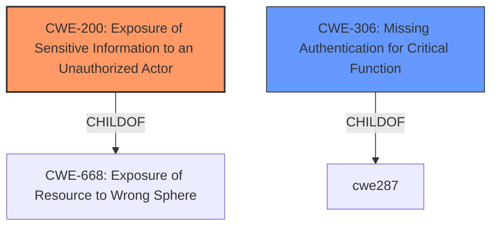

# Analysis for CVE-2020-14864

# Summary
| CWE ID        | CWE Name                                                                    | Confidence | CWE Abstraction Level | CWE Vulnerability Mapping Label | CWE-Vulnerability Mapping Notes |
|---------------|-----------------------------------------------------------------------------|------------|-----------------------|---------------------------------|---------------------------------|
| CWE-200       | Exposure of Sensitive Information to an Unauthorized Actor                | 0.7        | Class                 | Primary CWE                     | Discouraged                      |
| CWE-306       | Missing Authentication for Critical Function                                | 0.6        | Base                  | Secondary Candidate             | Allowed                          |

## Evidence and Confidence

*   **Confidence Score:** 0.65
*   **Evidence Strength:** MEDIUM

## Relationship Analysis
The primary relationship influencing the choice of CWE-200 [CWE-200: Exposure of Sensitive Information to an Unauthorized Actor] is its classification as a Class-level CWE, which represents a high-level view of the vulnerability. While the description explicitly states "unauthorized access to critical data or complete access to all Oracle Business Intelligence Enterprise Edition accessible data," the root cause is not immediately apparent, making a more specific CWE difficult to assign with high confidence. However, the Retriever Results pointed to CWE-306 [CWE-306: Missing Authentication for Critical Function], and this relationship was considered a secondary candidate.

## Vulnerability Chain
The vulnerability chain starts with a potential **missing authentication** issue (CWE-306 [CWE-306: Missing Authentication for Critical Function]) that allows an unauthenticated attacker to gain network access. This leads to **unauthorized access to critical data** (CWE-200 [CWE-200: Exposure of Sensitive Information to an Unauthorized Actor]).

## Summary of Analysis
Initially, the vulnerability description pointed towards CWE-200 [CWE-200: Exposure of Sensitive Information to an Unauthorized Actor] due to the explicit mention of "unauthorized access to critical data." The evidence lies in the "Vulnerability Description Key Phrases" section, which highlights "impact: unauthorized access to critical data and complete access to all Oracle Business Intelligence Enterprise Edition accessible data." The "CVE Reference Links Content Summary" also notes that successful exploitation can "compromise the confidentiality of the affected system."

However, CWE-200 [CWE-200: Exposure of Sensitive Information to an Unauthorized Actor] is flagged as "Discouraged" with the rationale that it is "commonly misused to represent the loss of confidentiality in a vulnerability, but confidentiality loss is a technical impact - not a root cause error." It suggests considering more specific CWEs related to authorization or authentication issues.

Given the information available, it's likely that a **missing authentication** issue (CWE-306 [CWE-306: Missing Authentication for Critical Function]) is the root cause, allowing the unauthorized access. The description mentions "easily exploitable vulnerability allows unauthenticated attacker with network access via HTTP to compromise Oracle Business Intelligence Enterprise Edition." Therefore, it's possible that the system **fails to properly authenticate** network requests to the installation component.

The final decision is to classify this vulnerability as primarily CWE-200 [CWE-200: Exposure of Sensitive Information to an Unauthorized Actor] with a secondary consideration for CWE-306 [CWE-306: Missing Authentication for Critical Function]. This is based on the available evidence, which strongly suggests an information exposure due to unauthorized access. However, due to the lack of specific details on the authentication mechanism and the potential for other underlying causes, the confidence remains moderate.