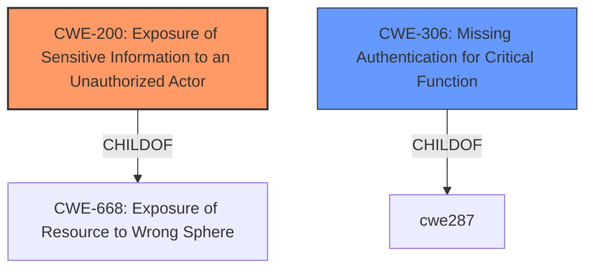

# Analysis for CVE-2020-14864

# Summary
| CWE ID        | CWE Name                                                                    | Confidence | CWE Abstraction Level | CWE Vulnerability Mapping Label | CWE-Vulnerability Mapping Notes |
|---------------|-----------------------------------------------------------------------------|------------|-----------------------|---------------------------------|---------------------------------|
| CWE-200       | Exposure of Sensitive Information to an Unauthorized Actor                | 0.7        | Class                 | Primary CWE                     | Discouraged                      |
| CWE-306       | Missing Authentication for Critical Function                                | 0.6        | Base                  | Secondary Candidate             | Allowed                          |

## Evidence and Confidence

*   **Confidence Score:** 0.65
*   **Evidence Strength:** MEDIUM

## Relationship Analysis
The primary relationship influencing the choice of CWE-200 [CWE-200: Exposure of Sensitive Information to an Unauthorized Actor] is its classification as a Class-level CWE, which represents a high-level view of the vulnerability. While the description explicitly states "unauthorized access to critical data or complete access to all Oracle Business Intelligence Enterprise Edition accessible data," the root cause is not immediately apparent, making a more specific CWE difficult to assign with high confidence. However, the Retriever Results pointed to CWE-306 [CWE-306: Missing Authentication for Critical Function], and this relationship was considered a secondary candidate.



## Vulnerability Chain
The vulnerability chain starts with a potential **missing authentication** issue (CWE-306 [CWE-306: Missing Authentication for Critical Function]) that allows an unauthenticated attacker to gain network access. This leads to **unauthorized access to critical data** (CWE-200 [CWE-200: Exposure of Sensitive Information to an Unauthorized Actor]).

## Summary of Analysis
Initially, the vulnerability description pointed towards CWE-200 [CWE-200: Exposure of Sensitive Information to an Unauthorized Actor] due to the explicit mention of "unauthorized access to critical data." The evidence lies in the "Vulnerability Description Key Phrases" section, which highlights "impact: unauthorized access to critical data and complete access to all Oracle Business Intelligence Enterprise Edition accessible data." The "CVE Reference Links Content Summary" also notes that successful exploitation can "compromise the confidentiality of the affected system."

However, CWE-200 [CWE-200: Exposure of Sensitive Information to an Unauthorized Actor] is flagged as "Discouraged" with the rationale that it is "commonly misused to represent the loss of confidentiality in a vulnerability, but confidentiality loss is a technical impact - not a root cause error." It suggests considering more specific CWEs related to authorization or authentication issues.

Given the information available, it's likely that a **missing authentication** issue (CWE-306 [CWE-306: Missing Authentication for Critical Function]) is the root cause, allowing the unauthorized access. The description mentions "easily exploitable vulnerability allows unauthenticated attacker with network access via HTTP to compromise Oracle Business Intelligence Enterprise Edition." Therefore, it's possible that the system **fails to properly authenticate** network requests to the installation component.

The final decision is to classify this vulnerability as primarily CWE-200 [CWE-200: Exposure of Sensitive Information to an Unauthorized Actor] with a secondary consideration for CWE-306 [CWE-306: Missing Authentication for Critical Function]. This is based on the available evidence, which strongly suggests an information exposure due to unauthorized access. However, due to the lack of specific details on the authentication mechanism and the potential for other underlying causes, the confidence remains moderate.

# Enhanced Query for CVE-2020-14864

## Vulnerability Description
Vulnerability in the Oracle Business Intelligence Enterprise Edition product of Oracle Fusion Middleware (component Installation). Supported versions that are affected are 5.5.0.0.0, 12.2.1.3.0 and 12.2.1.4.0. Easily exploitable vulnerability allows unauthenticated attacker with network access via HTTP to compromise Oracle Business Intelligence Enterprise Edition. Successful attacks of this vulnerability can result in unauthorized access to critical data or complete access to all Oracle Business Intelligence Enterprise Edition accessible data. CVSS 3.1 Base Score 7.5 (Confidentiality impacts). CVSS Vector (CVSS3.1/AVN/ACL/PRN/UIN/SU/CH/IN/AN).

### Vulnerability Description Key Phrases
- **impact:** unauthorized access to critical data and complete access to all Oracle Business Intelligence Enterprise Edition accessible data
- **attacker:** unauthenticated attacker with network access via HTTP
- **product:** Oracle Business Intelligence Enterprise Edition
- **version:** 5.5.0.0.0 and 12.2.1.3.0 and 12.2.1.4.0
- **component:** Installation

### CWE for similar CVE Descriptions
### Primary CWE Match
CWE-NVD-noinfo

#### Top CWEs
- CWE-NVD-noinfo (Count: 376)
- CWE-200 (Count: 22)
- CWE-863 (Count: 3)

## CVE Reference Links Content Summary
```
{
  "guidelines": "1. First verify if the content relates to the CVE specified based on the official description\n2. If the content does not relate to this CVE, respond with \"UNRELATED\"\n3. If no useful vulnerability information is found, respond with \"NOINFO\" \n4. For relevant content, extract:\n   - Root cause of vulnerability\n   - Weaknesses/vulnerabilities present\n   - Impact of exploitation\n   - Attack vectors\n   - Required attacker capabilities/position\n\nAdditional instructions:\n- Preserve original technical details and descriptions\n- Remove unrelated content\n- Translate non-English content to English\n- Note if the content provides more detail than the official CVE description",
  "response": {
    "matches": [
      {
        "cve": "CVE-2020-14864",
        "content": "The provided document contains information about CVE-2020-14864. \n\nAccording to the Oracle Critical Patch Update Advisory - October 2020, CVE-2020-14864 affects Oracle Business Intelligence Enterprise Edition's installation component. It is remotely exploitable without authentication. A successful exploit can potentially lead to a compromise of confidentiality, but has no impact on the integrity or availability of the system. This vulnerability has a CVSS v3.1 base score of 7.5. The attack vector is network, attack complexity is low, no privileges are required, no user interaction is required and scope is unchanged.",
        "root_cause": "The root cause of the vulnerability lies within the installation component of Oracle Business Intelligence Enterprise Edition.",
        "vulnerabilities": [
          "The vulnerability is present in the installation component of Oracle Business Intelligence Enterprise Edition."
        ],
        "impact": "Successful exploitation of this vulnerability can compromise the confidentiality of the affected system. There is no impact on the integrity or availability of the system.",
         "attack_vector": "The vulnerability is exploitable over a network without requiring user credentials.",
        "attacker_capabilities": "The attacker does not need any special privileges or a specific user interaction to exploit this vulnerability."
      }
    ]
  }
}
```

## Retriever Results

### Top Combined Results

| Rank | CWE ID | Name | Abstraction | Usage  | Retrievers | Individual Scores |
|------|--------|------|-------------|-------|------------|-------------------|
| 1 | 173 | Improper Handling of Alternate Encoding | Variant | Allowed | sparse | 0.228 |
| 2 | 611 | Improper Restriction of XML External Entity Reference | Base | Allowed | sparse | 0.189 |
| 3 | 36 | Absolute Path Traversal | Base | Allowed | sparse | 0.188 |
| 4 | 502 | Deserialization of Untrusted Data | Base | Allowed | sparse | 0.174 |
| 5 | 790 | Improper Filtering of Special Elements | Class | Allowed-with-Review | sparse | 0.169 |
| 6 | 200 | Exposure of Sensitive Information to an Unauthorized Actor | Class | Discouraged | dense | 0.542 |
| 7 | 289 | Authentication Bypass by Alternate Name | Base | Allowed | graph | 0.002 |
| 8 | 306 | Missing Authentication for Critical Function | Base | Allowed | sparse | 0.167 |
| 9 | 732 | Incorrect Permission Assignment for Critical Resource | Class | Allowed-with-Review | sparse | 0.164 |
| 10 | 1236 | Improper Neutralization of Formula Elements in a CSV File | Base | Allowed | sparse | 0.156 |


# Complete CWE Specifications


## CWE-173: Improper Handling of Alternate Encoding
**Abstraction:** Variant
**Status:** Draft

### Description
The product does not properly handle when an input uses an alternate encoding that is valid for the control sphere to which the input is being sent.

### Extended Description
Not provided

### Alternative Terms
None

### Relationships
ChildOf -> CWE-172
CanPrecede -> CWE-289

### Mapping Guidance
**Usage:** Allowed
**Rationale:** This CWE entry is at the Variant level of abstraction, which is a preferred level of abstraction for mapping to the root causes of vulnerabilities.
**Comments:** Carefully read both the name and description to ensure that this mapping is an appropriate fit. Do not try to 'force' a mapping to a lower-level Base/Variant simply to comply with this preferred level of abstraction.
**Reasons:**
- Acceptable-Use


## CWE-611: Improper Restriction of XML External Entity Reference
**Abstraction:** Base
**Status:** Draft

### Description
The product processes an XML document that can contain XML entities with URIs that resolve to documents outside of the intended sphere of control, causing the product to embed incorrect documents into its output.

### Extended Description


XML documents optionally contain a Document Type Definition (DTD), which, among other features, enables the definition of XML entities. It is possible to define an entity by providing a substitution string in the form of a URI. The XML parser can access the contents of this URI and embed these contents back into the XML document for further processing.


By submitting an XML file that defines an external entity with a file:// URI, an attacker can cause the processing application to read the contents of a local file. For example, a URI such as "file:///c:/winnt/win.ini" designates (in Windows) the file C:\Winnt\win.ini, or file:///etc/passwd designates the password file in Unix-based systems. Using URIs with other schemes such as http://, the attacker can force the application to make outgoing requests to servers that the attacker cannot reach directly, which can be used to bypass firewall restrictions or hide the source of attacks such as port scanning.


Once the content of the URI is read, it is fed back into the application that is processing the XML. This application may echo back the data (e.g. in an error message), thereby exposing the file contents.


### Alternative Terms
XXE: An acronym used for the term "XML eXternal Entities"

### Relationships
ChildOf -> CWE-610
ChildOf -> CWE-610
PeerOf -> CWE-441

### Mapping Guidance
**Usage:** Allowed
**Rationale:** This CWE entry is at the Base level of abstraction, which is a preferred level of abstraction for mapping to the root causes of vulnerabilities.
**Comments:** Carefully read both the name and description to ensure that this mapping is an appropriate fit. Do not try to 'force' a mapping to a lower-level Base/Variant simply to comply with this preferred level of abstraction.
**Reasons:**
- Acceptable-Use


### Additional Notes
**[Relationship]** CWE-918 (SSRF) and CWE-611 (XXE) are closely related, because they both involve web-related technologies and can launch outbound requests to unexpected destinations. However, XXE can be performed client-side, or in other contexts in which the software is not acting directly as a server, so the "Server" portion of the SSRF acronym does not necessarily apply.


### Observed Examples
- **CVE-2022-42745:** Recruiter software allows reading arbitrary files using XXE
- **CVE-2005-1306:** A browser control can allow remote attackers to determine the existence of files via Javascript containing XML script.
- **CVE-2012-5656:** XXE during SVG image conversion


## CWE-36: Absolute Path Traversal
**Abstraction:** Base
**Status:** Draft

### Description
The product uses external input to construct a pathname that should be within a restricted directory, but it does not properly neutralize absolute path sequences such as "/abs/path" that can resolve to a location that is outside of that directory.

### Extended Description
This allows attackers to traverse the file system to access files or directories that are outside of the restricted directory.

### Alternative Terms
None

### Relationships
ChildOf -> CWE-22
ChildOf -> CWE-22
ChildOf -> CWE-22

### Mapping Guidance
**Usage:** Allowed
**Rationale:** This CWE entry is at the Base level of abstraction, which is a preferred level of abstraction for mapping to the root causes of vulnerabilities.
**Comments:** Carefully read both the name and description to ensure that this mapping is an appropriate fit. Do not try to 'force' a mapping to a lower-level Base/Variant simply to comply with this preferred level of abstraction.
**Reasons:**
- Acceptable-Use


### Observed Examples
- **CVE-2022-31503:** Python package constructs filenames using an unsafe os.path.join call on untrusted input, allowing absolute path traversal because os.path.join resets the pathname to an absolute path that is specified as part of the input.
- **CVE-2002-1345:** Multiple FTP clients write arbitrary files via absolute paths in server responses
- **CVE-2001-1269:** ZIP file extractor allows full path


## CWE-502: Deserialization of Untrusted Data
**Abstraction:** Base
**Status:** Draft

### Description
The product deserializes untrusted data without sufficiently ensuring that the resulting data will be valid.

### Extended Description
Not provided

### Alternative Terms
Marshaling, Unmarshaling: Marshaling and unmarshaling are effectively synonyms for serialization and deserialization, respectively.
Pickling, Unpickling: In Python, the "pickle" functionality is used to perform serialization and deserialization.
PHP Object Injection: Some PHP application researchers use this term when attacking unsafe use of the unserialize() function; but it is also used for CWE-915.

### Relationships
ChildOf -> CWE-913
ChildOf -> CWE-913
PeerOf -> CWE-915

### Mapping Guidance
**Usage:** Allowed
**Rationale:** This CWE entry is at the Base level of abstraction, which is a preferred level of abstraction for mapping to the root causes of vulnerabilities.
**Comments:** Carefully read both the name and description to ensure that this mapping is an appropriate fit. Do not try to 'force' a mapping to a lower-level Base/Variant simply to comply with this preferred level of abstraction.
**Reasons:**
- Acceptable-Use


### Additional Notes
**[Maintenance]** The relationships between CWE-502 and CWE-915 need further exploration. CWE-915 is more narrowly scoped to object modification, and is not necessarily used for deserialization.


### Observed Examples
- **CVE-2019-12799:** chain: bypass of untrusted deserialization issue (CWE-502) by using an assumed-trusted class (CWE-183)
- **CVE-2015-8103:** Deserialization issue in commonly-used Java library allows remote execution.
- **CVE-2015-4852:** Deserialization issue in commonly-used Java library allows remote execution.


## CWE-790: Improper Filtering of Special Elements
**Abstraction:** Class
**Status:** Incomplete

### Description
The product receives data from an upstream component, but does not filter or incorrectly filters special elements before sending it to a downstream component.

### Extended Description
Not provided

### Alternative Terms
None

### Relationships
ChildOf -> CWE-138

### Mapping Guidance
**Usage:** Allowed-with-Review
**Rationale:** This CWE entry is a Class and might have Base-level children that would be more appropriate
**Comments:** Examine children of this entry to see if there is a better fit
**Reasons:**
- Abstraction


## CWE-200: Exposure of Sensitive Information to an Unauthorized Actor
**Abstraction:** Class
**Status:** Draft

### Description
The product exposes sensitive information to an actor that is not explicitly authorized to have access to that information.

### Extended Description


There are many different kinds of mistakes that introduce information exposures. The severity of the error can range widely, depending on the context in which the product operates, the type of sensitive information that is revealed, and the benefits it may provide to an attacker. Some kinds of sensitive information include:


  - private, personal information, such as personal messages, financial data, health records, geographic location, or contact details

  - system status and environment, such as the operating system and installed packages

  - business secrets and intellectual property

  - network status and configuration

  - the product's own code or internal state

  - metadata, e.g. logging of connections or message headers

  - indirect information, such as a discrepancy between two internal operations that can be observed by an outsider

Information might be sensitive to different parties, each of which may have their own expectations for whether the information should be protected. These parties include:

  - the product's own users

  - people or organizations whose information is created or used by the product, even if they are not direct product users

  - the product's administrators, including the admins of the system(s) and/or networks on which the product operates

  - the developer

Information exposures can occur in different ways:

  - the code  **explicitly inserts**  sensitive information into resources or messages that are intentionally made accessible to unauthorized actors, but should not contain the information - i.e., the information should have been "scrubbed" or "sanitized"

  - a different weakness or mistake  **indirectly inserts**  the sensitive information into resources, such as a web script error revealing the full system path of the program.

  - the code manages resources that intentionally contain sensitive information, but the resources are  **unintentionally made accessible**  to unauthorized actors. In this case, the information exposure is resultant - i.e., a different weakness enabled the access to the information in the first place.

It is common practice to describe any loss of confidentiality as an "information exposure," but this can lead to overuse of CWE-200 in CWE mapping. From the CWE perspective, loss of confidentiality is a technical impact that can arise from dozens of different weaknesses, such as insecure file permissions or out-of-bounds read. CWE-200 and its lower-level descendants are intended to cover the mistakes that occur in behaviors that explicitly manage, store, transfer, or cleanse sensitive information.

### Alternative Terms
Information Disclosure: This term is frequently used in vulnerability advisories to describe a consequence or technical impact, for any vulnerability that has a loss of confidentiality. Often, CWE-200 can be misused to represent the loss of confidentiality, even when the mistake - i.e., the weakness - is not directly related to the mishandling of the information itself, such as an out-of-bounds read that accesses sensitive memory contents; here, the out-of-bounds read is the primary weakness, not the disclosure of the memory. In addition, this phrase is also used frequently in policies and legal documents, but it does not refer to any disclosure of security-relevant information.
Information Leak: This is a frequently used term, however the "leak" term has multiple uses within security. In some cases it deals with the accidental exposure of information from a different weakness, but in other cases (such as "memory leak"), this deals with improper tracking of resources, which can lead to exhaustion. As a result, CWE is actively avoiding usage of the "leak" term.

### Relationships
ChildOf -> CWE-668

### Mapping Guidance
**Usage:** Discouraged
**Rationale:** CWE-200 is commonly misused to represent the loss of confidentiality in a vulnerability, but confidentiality loss is a technical impact - not a root cause error. As of CWE 4.9, over 400 CWE entries can lead to a loss of confidentiality. Other options are often available. [REF-1287].
**Comments:** If an error or mistake causes information to be disclosed, then use the CWE ID for that error. Consider starting with improper authorization (CWE-285), insecure permissions (CWE-732), improper authentication (CWE-287), etc. Also consider children such as Insertion of Sensitive Information Into Sent Data (CWE-201), Observable Discrepancy (CWE-203), Insertion of Sensitive Information into Externally-Accessible File or Directory (CWE-538), or others.
**Reasons:**
- Frequent Misuse


### Additional Notes
**[Maintenance]** As a result of mapping analysis in the 2020 Top 25 and more recent versions, this weakness is under review, since it is frequently misused in mapping to cover many problems that lead to loss of confidentiality. See Mapping Notes, Extended Description, and Alternate Terms.


### Observed Examples
- **CVE-2022-31162:** Rust library leaks Oauth client details in application debug logs
- **CVE-2021-25476:** Digital Rights Management (DRM) capability for mobile platform leaks pointer information, simplifying ASLR bypass
- **CVE-2001-1483:** Enumeration of valid usernames based on inconsistent responses


## CWE-289: Authentication Bypass by Alternate Name
**Abstraction:** Base
**Status:** Incomplete

### Description
The product performs authentication based on the name of a resource being accessed, or the name of the actor performing the access, but it does not properly check all possible names for that resource or actor.

### Extended Description
Not provided

### Alternative Terms
None

### Relationships
ChildOf -> CWE-1390

### Mapping Guidance
**Usage:** Allowed
**Rationale:** This CWE entry is at the Base level of abstraction, which is a preferred level of abstraction for mapping to the root causes of vulnerabilities.
**Comments:** Carefully read both the name and description to ensure that this mapping is an appropriate fit. Do not try to 'force' a mapping to a lower-level Base/Variant simply to comply with this preferred level of abstraction.
**Reasons:**
- Acceptable-Use


### Additional Notes
**[Relationship]** Overlaps equivalent encodings, canonicalization, authorization, multiple trailing slash, trailing space, mixed case, and other equivalence issues.

**[Theoretical]** Alternate names are useful in data driven manipulation attacks, not just for authentication.


### Observed Examples
- **CVE-2003-0317:** Protection mechanism that restricts URL access can be bypassed using URL encoding.
- **CVE-2004-0847:** Bypass of authentication for files using "\" (backslash) or "%5C" (encoded backslash).


## CWE-306: Missing Authentication for Critical Function
**Abstraction:** Base
**Status:** Draft

### Description
The product does not perform any authentication for functionality that requires a provable user identity or consumes a significant amount of resources.

### Extended Description
Not provided

### Alternative Terms
None

### Relationships
ChildOf -> CWE-287
ChildOf -> CWE-287

### Mapping Guidance
**Usage:** Allowed
**Rationale:** This CWE entry is at the Base level of abstraction, which is a preferred level of abstraction for mapping to the root causes of vulnerabilities.
**Comments:** Carefully read both the name and description to ensure that this mapping is an appropriate fit. Do not try to 'force' a mapping to a lower-level Base/Variant simply to comply with this preferred level of abstraction.
**Reasons:**
- Acceptable-Use


### Observed Examples
- **CVE-2022-31260:** Chain: a digital asset management program has an undisclosed backdoor in the legacy version of a PHP script (CWE-912) that could allow an unauthenticated user to export metadata (CWE-306)
- **CVE-2022-29951:** TCP-based protocol in Programmable Logic Controller (PLC) has no authentication.
- **CVE-2022-29952:** Condition Monitor firmware uses a protocol that does not require authentication.


## CWE-732: Incorrect Permission Assignment for Critical Resource
**Abstraction:** Class
**Status:** Draft

### Description
The product specifies permissions for a security-critical resource in a way that allows that resource to be read or modified by unintended actors.

### Extended Description
When a resource is given a permission setting that provides access to a wider range of actors than required, it could lead to the exposure of sensitive information, or the modification of that resource by unintended parties. This is especially dangerous when the resource is related to program configuration, execution, or sensitive user data. For example, consider a misconfigured storage account for the cloud that can be read or written by a public or anonymous user.

### Alternative Terms
None

### Relationships
ChildOf -> CWE-285
ChildOf -> CWE-668

### Mapping Guidance
**Usage:** Allowed-with-Review
**Rationale:** While the name itself indicates an assignment of permissions for resources, this is often misused for vulnerabilities in which "permissions" are not checked, which is an "authorization" weakness (CWE-285 or descendants) within CWE's model [REF-1287].
**Comments:** Closely analyze the specific mistake that is allowing the resource to be exposed, and perform a CWE mapping for that mistake.
**Reasons:**
- Frequent Misuse


### Additional Notes
**[Maintenance]** The relationships between privileges, permissions, and actors (e.g. users and groups) need further refinement within the Research view. One complication is that these concepts apply to two different pillars, related to control of resources (CWE-664) and protection mechanism failures (CWE-693).


### Observed Examples
- **CVE-2022-29527:** Go application for cloud management creates a world-writable sudoers file that allows local attackers to inject sudo rules and escalate privileges to root by winning a race condition.
- **CVE-2009-3482:** Anti-virus product sets insecure "Everyone: Full Control" permissions for files under the "Program Files" folder, allowing attackers to replace executables with Trojan horses.
- **CVE-2009-3897:** Product creates directories with 0777 permissions at installation, allowing users to gain privileges and access a socket used for authentication.


## CWE-1236: Improper Neutralization of Formula Elements in a CSV File
**Abstraction:** Base
**Status:** Incomplete

### Description
The product saves user-provided information into a Comma-Separated Value (CSV) file, but it does not neutralize or incorrectly neutralizes special elements that could be interpreted as a command when the file is opened by a spreadsheet product.

### Extended Description
User-provided data is often saved to traditional databases. This data can be exported to a CSV file, which allows users to read the data using spreadsheet software such as Excel, Numbers, or Calc. This software interprets entries beginning with '=' as formulas, which are then executed by the spreadsheet software. The software's formula language often allows methods to access hyperlinks or the local command line, and frequently allows enough characters to invoke an entire script. Attackers can populate data fields which, when saved to a CSV file, may attempt information exfiltration or other malicious activity when automatically executed by the spreadsheet software.

### Alternative Terms
CSV Injection
Formula Injection
Excel Macro Injection

### Relationships
ChildOf -> CWE-74
ChildOf -> CWE-74

### Mapping Guidance
**Usage:** Allowed
**Rationale:** This CWE entry is at the Base level of abstraction, which is a preferred level of abstraction for mapping to the root causes of vulnerabilities.
**Comments:** Carefully read both the name and description to ensure that this mapping is an appropriate fit. Do not try to 'force' a mapping to a lower-level Base/Variant simply to comply with this preferred level of abstraction.
**Reasons:**
- Acceptable-Use


### Observed Examples
- **CVE-2019-12134:** Low privileged user can trigger CSV injection through a contact form field value
- **CVE-2019-4521:** Cloud management product allows arbitrary command execution via CSV injection
- **CVE-2019-17661:** CSV injection in content management system via formula code in a first or last name

