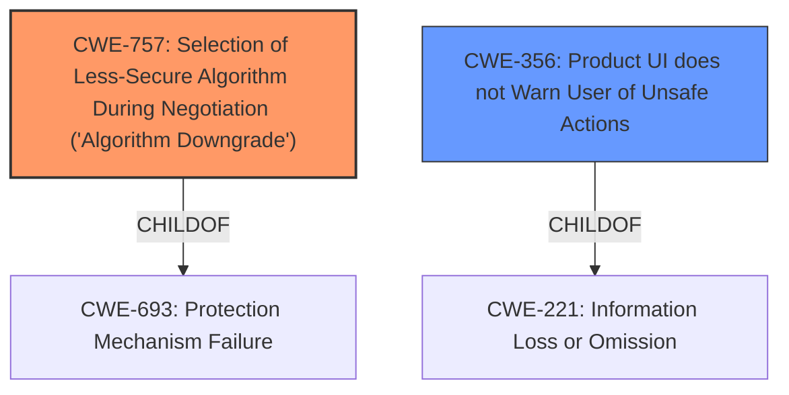

# Raw Analyzer Response for CVE-2020-14929

# Summary
| CWE ID | CWE Name | Confidence | CWE Abstraction Level | CWE Vulnerability Mapping Label | CWE-Vulnerability Mapping Notes |
|---|---|---|---|---|---|
| CWE-757 | Selection of Less-Secure Algorithm During Negotiation ('Algorithm Downgrade') | 0.9 | Base | Allowed | Primary CWE |
| CWE-356 | Product UI does not Warn User of Unsafe Actions | 0.6 | Base | Allowed | Secondary CWE |

## Evidence and Confidence

*   **Confidence Score:** 0.8
*   **Evidence Strength:** HIGH

## Relationship Analysis
The primary CWE, CWE-757, is a base-level weakness related to the selection of a less secure algorithm during negotiation. It is a child of CWE-693.
CWE-356 is a base-level weakness related to the product UI not warning the user of unsafe actions and is a child of CWE-221.

## Vulnerability Chain
The vulnerability chain involves the `alpine` email client's **failure to maintain a secure connection** after a `/tls` command in specific circumstances with PREAUTH enabled, leading to a silent downgrade to an insecure connection. This can then enable man-in-the-middle attacks, resulting in the loss of confidentiality and integrity. The product UI does not warn the user of the insecure action taken.

## Summary of Analysis
Initially, the analysis focused on identifying the core weakness related to the **insecure connection**. The "Vulnerability Description Key Phrases" highlighted the "**insecure connection**" as the primary weakness. The "CVE Reference Links Content Summary" indicated that the `alpine` client silently switched to an insecure connection, which aligns with CWE-757, "Selection of Less-Secure Algorithm During Negotiation ('Algorithm Downgrade')". This CWE accurately represents the root cause, where the client **fails to select the strongest available algorithm** and instead opts for a less secure connection. The fact that the UI doesn't warn the user about this downgrade is also relevant, which is why CWE-356 "Product UI does not Warn User of Unsafe Actions" was also selected as a secondary CWE.

The relationship analysis showed that CWE-757 is a child of CWE-693, "Protection Mechanism Failure". Given the specific nature of the vulnerability (downgrading to a less secure algorithm), CWE-757 was deemed a more precise fit than its parent.

The retriever results listed CWE-757 as a top candidate based on dense analysis, which further validated the selection of this CWE.

The evidence from the vulnerability description supports this classification. The CVE summary explicitly states the **silent downgrade** to an insecure connection.

The selection of CWE-757 and CWE-356 is at the optimal level of specificity because they directly address the root cause (**algorithm downgrade**) and the lack of user awareness (**no warning in UI**), respectively.

Relevant CWE Information:

# Enhanced Context (25 CWEs)
The following CWEs were identified as potentially relevant to this vulnerability:

## CWE-1204: Generation of Weak Initialization Vector (IV)
**Abstraction Level**: Base
**Similarity Score**: 0.81
**Source**: dense

**Description**:
The product uses a cryptographic primitive that uses an Initialization
			Vector (IV), but the product does not generate IVs that are
			sufficiently unpredictable or unique according to the expected
			cryptographic requirements for that primitive.

**CWE-1240: Use of a Cryptographic Primitive with a Risky Implementation**
**Abstraction Level**: Base
**Similarity Score**: 0.81
**Source**: dense

**Description**:
To fulfill the need for a cryptographic primitive, the product implements a cryptographic algorithm using a non-standard, unproven, or disallowed/non-compliant cryptographic implementation.

**CWE-330: Use of Insufficiently Random Values**
**Abstraction Level**: Class
**Similarity Score**: 0.79
**Source**: dense

**Description**:
The product uses insufficiently random numbers or values in a security context that depends on unpredictable numbers.

**CWE-1391: Use of Weak Credentials**
**Abstraction Level**: Class
**Similarity Score**: 0.78
**Source**: dense

**Description**:
The product uses weak credentials (such as a default key or hard-coded password) that can be calculated, derived, reused, or guessed by an attacker.

**CWE-331: Insufficient Entropy**
**Abstraction Level**: Base
**Similarity Score**: 0.77
**Source**: dense

**Description**:
The product uses an algorithm or scheme that produces insufficient entropy, leaving patterns or clusters of values that are more likely to occur than others.

**CWE-203: Observable Discrepancy**
**Abstraction Level**: Base
**Similarity Score**: 0.77
**Source**: dense

**Description**:
The product behaves differently or sends different responses under different circumstances in a way that is observable to an unauthorized actor, which exposes security-relevant information about the state of the product, such as whether a particular operation was successful or not.

**CWE-208: Observable Timing Discrepancy**
**Abstraction Level**: Base
**Similarity Score**: 0.76
**Source**: dense

**Description**:
Two separate operations in a product require different amounts of time to complete, in a way that is observable to an actor and reveals security-relevant information about the state of the product, such as whether a particular operation was successful or not.

**CWE-335: Incorrect Usage of Seeds in Pseudo-Random Number Generator (PRNG)**
**Abstraction Level**: Base
**Similarity Score**: 0.76
**Source**: dense

**Description**:
The product uses a Pseudo-Random Number Generator (PRNG) but does not correctly manage seeds.

**CWE-328: Use of Weak Hash**
**Abstraction Level**: Base
**Similarity Score**: 0.76
**Source**: dense

**Description**:
The product uses an algorithm that produces a digest (output value) that does not meet security expectations for a hash function that allows an adversary to reasonably determine the original input (preimage attack), find another input that can produce the same hash (2nd preimage attack), or find multiple inputs that evaluate to the same hash (birthday attack).

**CWE-327: Use of a Broken or Risky Cryptographic Algorithm**
**Abstraction Level**: Class
**Similarity Score**: 0.76
**Source**: dense

**Description**:
The product uses a broken or risky cryptographic algorithm or protocol.

**CWE-338: Use of Cryptographically Weak Pseudo-Random Number Generator (PRNG)**
**Abstraction Level**: Base
**Similarity Score**: 0.72
**Source**: sparse

**Description**:
The product uses a Pseudo-Random Number Generator (PRNG) in a security context, but the PRNG's algorithm is not cryptographically strong.

**CWE-385: Covert Timing Channel**
**Abstraction Level**: base
**Similarity Score**: 4.33
**Source**: graph

**Description**:
CWE-385: Covert Timing Channel

**CWE-325: Missing Cryptographic Step**
**Abstraction Level**: base
**Similarity Score**: 2.77
**Source**: graph

**Description**:
CWE-325: Missing Cryptographic Step

**CWE-617: Reachable Assertion**
**Abstraction Level**: base
**Similarity Score**: 2.47
**Source**: graph

**Description**:
CWE-617: Reachable Assertion

**CWE-253: Incorrect Check of Function Return Value**
**Abstraction Level**: base
**Similarity Score**: 2.33
**Source**: graph

**Description**:
CWE-253: Incorrect Check of Function Return Value

**CWE-804: Guessable CAPTCHA**
**Abstraction Level**: base
**Similarity Score**: 2.21
**Source**: graph

**Description**:
CWE-804: Guessable CAPTCHA

**CWE-193: Off-by-one Error**
**Abstraction Level**: base
**Similarity Score**: 2.21
**Source**: graph

**Description**:
CWE-193: Off-by-one Error

**CWE-1272: Sensitive Information Uncleared Before Debug/Power State Transition**