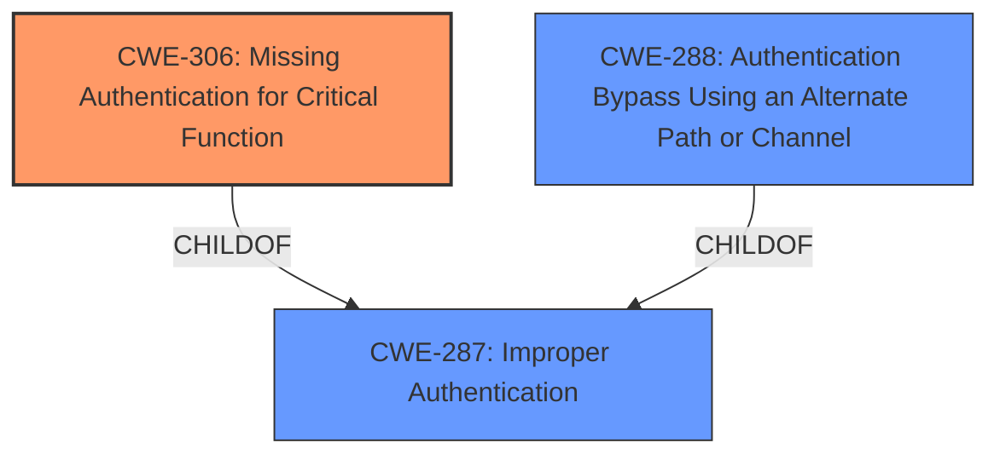

# Analysis for CVE-2020-15077

# Summary
| CWE ID | CWE Name | Confidence | CWE Abstraction Level | CWE Vulnerability Mapping Label | CWE-Vulnerability Mapping Notes |
|---|---|---|---|---|---|
| CWE-306 | Missing Authentication for Critical Function | 0.9 | Base | Allowed | Primary CWE |
| CWE-288 | Authentication Bypass Using an Alternate Path or Channel | 0.6 | Base | Allowed | Secondary Candidate |

## Evidence and Confidence

*   **Confidence Score:** 0.9
*   **Evidence Strength:** MEDIUM

## Relationship Analysis
The primary relationship that influenced my decision was the hierarchical relationship between CWE-287 (Improper Authentication) and its children, specifically CWE-306 (Missing Authentication for Critical Function) and CWE-288 (Authentication Bypass Using an Alternate Path or Channel). Since the vulnerability involves a complete lack of authentication for a critical function, CWE-306 is a more precise fit than its parent CWE-287. CWE-288 was considered because the vulnerability description mentions a bypass, suggesting an alternate path might exist. However, the description focuses more on the absence of authentication rather than an explicit alternate path.

## Vulnerability Chain
The chain of events is as follows: The OpenVPN Access Server is configured with deferred authentication, but due to a **missing authentication** check (CWE-306), remote attackers can **bypass authentication** and gain access to control channel data. This could potentially lead to further information leaks.

## Summary of Analysis
Initially, the vulnerability description points to an authentication bypass. The retriever results and similar CVE descriptions both suggest CWE-306 as the primary candidate.

The vulnerability description states that OpenVPN Access Server allows remote attackers to **bypass authentication** and access control channel data on servers configured with deferred authentication. This directly aligns with the description of CWE-306, which states that "The product does not perform any authentication for functionality that requires a provable user identity or consumes a significant amount of resources." The **impact** is a clear authentication **bypass** which can then be used to potentially trigger further information leaks.

CWE-287 (Improper Authentication) was considered but deemed too general. The vulnerability isn't about an authentication mechanism that is flawed; it's about the complete absence of one for a critical function. Similarly, while CWE-288 (Authentication Bypass Using an Alternate Path or Channel) could be applicable, the primary issue is the **lack of authentication** rather than a specific alternate path being exploited.

Therefore, CWE-306 is the most specific and accurate representation of the vulnerability, as it directly addresses the root cause of the authentication **bypass**. The selection is at the optimal level of specificity (Base) and is supported by the vulnerability description.

Relevant CWE Information:

# Enhanced Context (25 CWEs)

## CWE-208: Observable Timing Discrepancy
**Abstraction Level**: Base
**Similarity Score**: 0.81
**Source**: dense

**Description**:
Two separate operations in a product require different amounts of time to complete, in a way that is observable to an actor and reveals security-relevant information about the state of the product, such as whether a particular operation was successful or not.

**Mapping Guidance**:
- Usage: Allowed
- Rationale: This CWE entry is at the Base level of abstraction, which is a preferred level of abstraction for mapping to the root causes of vulnerabilities.

## CWE-303: Incorrect Implementation of Authentication Algorithm
**Abstraction Level**: Base
**Similarity Score**: 0.79
**Source**: dense

**Description**:
The requirements for the product dictate the use of an established authentication algorithm, but the implementation of the algorithm is incorrect.

**Mapping Guidance**:
- Usage: Allowed
- Rationale: This CWE entry is at the Base level of abstraction, which is a preferred level of abstraction for mapping to the root causes of vulnerabilities.

## CWE-203: Observable Discrepancy
**Abstraction Level**: Base
**Similarity Score**: 0.78
**Source**: dense

**Description**:
The product behaves differently or sends different responses under different circumstances in a way that is observable to an unauthorized actor, which exposes security-relevant information about the state of the product, such as whether a particular operation was successful or not.

**Mapping Guidance**:
- Usage: Allowed
- Rationale: This CWE entry is at the Base level of abstraction, which is a preferred level of abstraction for mapping to the root causes of vulnerabilities.

## CWE-1391: Use of Weak Credentials
**Abstraction Level**: Class
**Similarity Score**: 0.77
**Source**: dense

**Description**:
The product uses weak credentials (such as a default key or hard-coded password) that can be calculated, derived, reused, or guessed by an attacker.

**Mapping Guidance**:
- Usage: Allowed-with-Review
- Rationale: This CWE entry is a Class and might have Base-level children that would be more appropriate

## CWE-345: Insufficient Verification of Data Authenticity
**Abstraction Level**: Class
**Similarity Score**: 0.77
**Source**: dense

**Description**:
The product does not sufficiently verify the origin or authenticity of data, in a way that causes it to accept invalid data.

**Mapping Guidance**:
- Usage: Discouraged
- Rationale: This CWE entry is a level-1 Class (i.e., a child of a Pillar). It might have lower-level children that would be more appropriate

## CWE-204: Observable Response Discrepancy
**Abstraction Level**: Base
**Similarity Score**: 0.77
**Source**: dense

**Description**:
The product provides different responses to incoming requests in a way that reveals internal state information to an unauthorized actor outside of the intended control sphere.

**Mapping Guidance**:
- Usage: Allowed
- Rationale: This CWE entry is at the Base level of abstraction, which is a preferred level of abstraction for mapping to the root causes of vulnerabilities.

## CWE-807: Reliance on Untrusted Inputs in a Security Decision
**Abstraction Level**: Base
**Similarity Score**: 0.77
**Source**: dense

**Description**:
The product uses a protection mechanism that relies on the existence or values of an input, but the input can be modified by an untrusted actor in a way that bypasses the protection mechanism.

**Mapping Guidance**:
- Usage: Allowed
- Rationale: This CWE entry is at the Base level of abstraction, which is a preferred level of abstraction for mapping to the root causes of vulnerabilities.

## CWE-1390: Weak Authentication
**Abstraction Level**: Class
**Similarity Score**: 0.77
**Source**: dense

**Description**:
The product uses an authentication mechanism to restrict access to specific users or identities, but the mechanism does not sufficiently prove that the claimed identity is correct.

**Mapping Guidance**:
- Usage: Allowed-with-Review
- Rationale: This CWE entry is a Class and might have Base-level children that would be more appropriate

## CWE-226: Sensitive Information in Resource Not Removed Before Reuse
**Abstraction Level**: Base
**Similarity Score**: 0.77
**Source**: dense

**Description**:
The product releases a resource such as memory or a file so that it can be made available for reuse, but it does not clear or "zeroize" the information contained in the resource before the product performs a critical state transition or makes the resource available for reuse by other entities.

**Mapping Guidance**:
- Usage: Allowed
- Rationale: This CWE entry is at the Base level of abstraction, which is a preferred level of abstraction for mapping to the root causes of vulnerabilities.

## CWE-703: Improper Check or Handling of Exceptional Conditions
**Abstraction Level**: Pillar
**Similarity Score**: 0.77
**Source**: dense

**Description**:
The product does not properly anticipate or handle exceptional conditions that rarely occur during normal operation of the product.

**Mapping Guidance**:
- Usage: Discouraged
- Rationale: This CWE entry is extremely high-level, a Pillar.

## CWE-226: Sensitive Information in Resource Not Removed Before Reuse
**Abstraction Level**: Base
**Similarity Score**: 4410.55
**Source**: sparse

**Description**:
The product releases a resource such as memory or a file so that it can be made available for reuse, but it does not clear or "zeroize" the information contained in the resource before the product performs a critical state transition or makes the resource available for reuse by other entities.

**Mapping Guidance**:
- Usage: Allowed