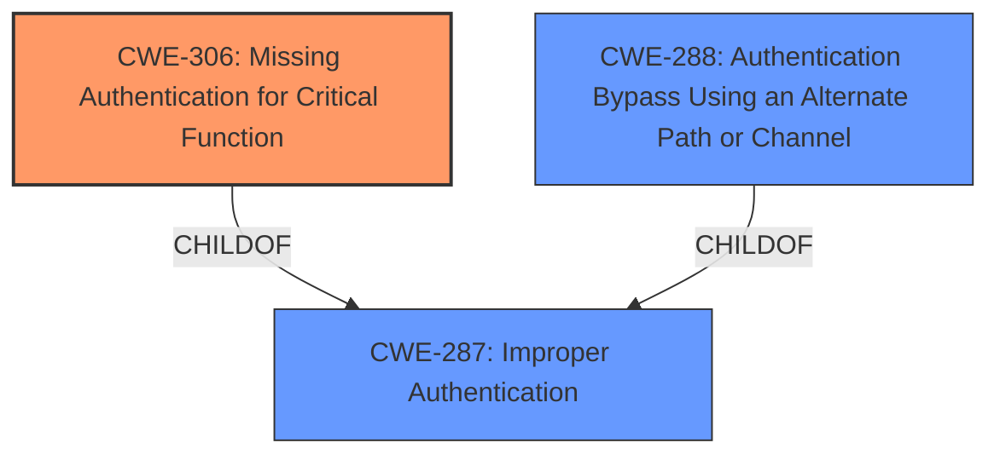

# Analysis for CVE-2020-15077

# Summary
| CWE ID | CWE Name | Confidence | CWE Abstraction Level | CWE Vulnerability Mapping Label | CWE-Vulnerability Mapping Notes |
|---|---|---|---|---|---|
| CWE-306 | Missing Authentication for Critical Function | 0.9 | Base | Allowed | Primary CWE |
| CWE-288 | Authentication Bypass Using an Alternate Path or Channel | 0.6 | Base | Allowed | Secondary Candidate |

## Evidence and Confidence

*   **Confidence Score:** 0.9
*   **Evidence Strength:** MEDIUM

## Relationship Analysis
The primary relationship that influenced my decision was the hierarchical relationship between CWE-287 (Improper Authentication) and its children, specifically CWE-306 (Missing Authentication for Critical Function) and CWE-288 (Authentication Bypass Using an Alternate Path or Channel). Since the vulnerability involves a complete lack of authentication for a critical function, CWE-306 is a more precise fit than its parent CWE-287. CWE-288 was considered because the vulnerability description mentions a bypass, suggesting an alternate path might exist. However, the description focuses more on the absence of authentication rather than an explicit alternate path.

## Vulnerability Chain
The chain of events is as follows: The OpenVPN Access Server is configured with deferred authentication, but due to a **missing authentication** check (CWE-306), remote attackers can **bypass authentication** and gain access to control channel data. This could potentially lead to further information leaks.

## Summary of Analysis
Initially, the vulnerability description points to an authentication bypass. The retriever results and similar CVE descriptions both suggest CWE-306 as the primary candidate.

The vulnerability description states that OpenVPN Access Server allows remote attackers to **bypass authentication** and access control channel data on servers configured with deferred authentication. This directly aligns with the description of CWE-306, which states that "The product does not perform any authentication for functionality that requires a provable user identity or consumes a significant amount of resources." The **impact** is a clear authentication **bypass** which can then be used to potentially trigger further information leaks.

CWE-287 (Improper Authentication) was considered but deemed too general. The vulnerability isn't about an authentication mechanism that is flawed; it's about the complete absence of one for a critical function. Similarly, while CWE-288 (Authentication Bypass Using an Alternate Path or Channel) could be applicable, the primary issue is the **lack of authentication** rather than a specific alternate path being exploited.

Therefore, CWE-306 is the most specific and accurate representation of the vulnerability, as it directly addresses the root cause of the authentication **bypass**. The selection is at the optimal level of specificity (Base) and is supported by the vulnerability description.

Relevant CWE Information:

# Enhanced Context (25 CWEs)

## CWE-208: Observable Timing Discrepancy
**Abstraction Level**: Base
**Similarity Score**: 0.81
**Source**: dense

**Description**:
Two separate operations in a product require different amounts of time to complete, in a way that is observable to an actor and reveals security-relevant information about the state of the product, such as whether a particular operation was successful or not.

**Mapping Guidance**:
- Usage: Allowed
- Rationale: This CWE entry is at the Base level of abstraction, which is a preferred level of abstraction for mapping to the root causes of vulnerabilities.

## CWE-303: Incorrect Implementation of Authentication Algorithm
**Abstraction Level**: Base
**Similarity Score**: 0.79
**Source**: dense

**Description**:
The requirements for the product dictate the use of an established authentication algorithm, but the implementation of the algorithm is incorrect.

**Mapping Guidance**:
- Usage: Allowed
- Rationale: This CWE entry is at the Base level of abstraction, which is a preferred level of abstraction for mapping to the root causes of vulnerabilities.

## CWE-203: Observable Discrepancy
**Abstraction Level**: Base
**Similarity Score**: 0.78
**Source**: dense

**Description**:
The product behaves differently or sends different responses under different circumstances in a way that is observable to an unauthorized actor, which exposes security-relevant information about the state of the product, such as whether a particular operation was successful or not.

**Mapping Guidance**:
- Usage: Allowed
- Rationale: This CWE entry is at the Base level of abstraction, which is a preferred level of abstraction for mapping to the root causes of vulnerabilities.

## CWE-1391: Use of Weak Credentials
**Abstraction Level**: Class
**Similarity Score**: 0.77
**Source**: dense

**Description**:
The product uses weak credentials (such as a default key or hard-coded password) that can be calculated, derived, reused, or guessed by an attacker.

**Mapping Guidance**:
- Usage: Allowed-with-Review
- Rationale: This CWE entry is a Class and might have Base-level children that would be more appropriate

## CWE-345: Insufficient Verification of Data Authenticity
**Abstraction Level**: Class
**Similarity Score**: 0.77
**Source**: dense

**Description**:
The product does not sufficiently verify the origin or authenticity of data, in a way that causes it to accept invalid data.

**Mapping Guidance**:
- Usage: Discouraged
- Rationale: This CWE entry is a level-1 Class (i.e., a child of a Pillar). It might have lower-level children that would be more appropriate

## CWE-204: Observable Response Discrepancy
**Abstraction Level**: Base
**Similarity Score**: 0.77
**Source**: dense

**Description**:
The product provides different responses to incoming requests in a way that reveals internal state information to an unauthorized actor outside of the intended control sphere.

**Mapping Guidance**:
- Usage: Allowed
- Rationale: This CWE entry is at the Base level of abstraction, which is a preferred level of abstraction for mapping to the root causes of vulnerabilities.

## CWE-807: Reliance on Untrusted Inputs in a Security Decision
**Abstraction Level**: Base
**Similarity Score**: 0.77
**Source**: dense

**Description**:
The product uses a protection mechanism that relies on the existence or values of an input, but the input can be modified by an untrusted actor in a way that bypasses the protection mechanism.

**Mapping Guidance**:
- Usage: Allowed
- Rationale: This CWE entry is at the Base level of abstraction, which is a preferred level of abstraction for mapping to the root causes of vulnerabilities.

## CWE-1390: Weak Authentication
**Abstraction Level**: Class
**Similarity Score**: 0.77
**Source**: dense

**Description**:
The product uses an authentication mechanism to restrict access to specific users or identities, but the mechanism does not sufficiently prove that the claimed identity is correct.

**Mapping Guidance**:
- Usage: Allowed-with-Review
- Rationale: This CWE entry is a Class and might have Base-level children that would be more appropriate

## CWE-226: Sensitive Information in Resource Not Removed Before Reuse
**Abstraction Level**: Base
**Similarity Score**: 0.77
**Source**: dense

**Description**:
The product releases a resource such as memory or a file so that it can be made available for reuse, but it does not clear or "zeroize" the information contained in the resource before the product performs a critical state transition or makes the resource available for reuse by other entities.

**Mapping Guidance**:
- Usage: Allowed
- Rationale: This CWE entry is at the Base level of abstraction, which is a preferred level of abstraction for mapping to the root causes of vulnerabilities.

## CWE-703: Improper Check or Handling of Exceptional Conditions
**Abstraction Level**: Pillar
**Similarity Score**: 0.77
**Source**: dense

**Description**:
The product does not properly anticipate or handle exceptional conditions that rarely occur during normal operation of the product.

**Mapping Guidance**:
- Usage: Discouraged
- Rationale: This CWE entry is extremely high-level, a Pillar.

## CWE-226: Sensitive Information in Resource Not Removed Before Reuse
**Abstraction Level**: Base
**Similarity Score**: 4410.55
**Source**: sparse

**Description**:
The product releases a resource such as memory or a file so that it can be made available for reuse, but it does not clear or "zeroize" the information contained in the resource before the product performs a critical state transition or makes the resource available for reuse by other entities.

**Mapping Guidance**:
- Usage: Allowed

# Enhanced Query for CVE-2020-15077

## Vulnerability Description
OpenVPN Access Server 2.8.7 and earlier versions allows a remote attackers to bypass authentication and access control channel data on servers configured with deferred authentication, which can be used to potentially trigger further information leaks.

### Vulnerability Description Key Phrases
- **impact:** bypass authentication and access control channel data
- **attacker:** remote attackers
- **product:** OpenVPN Access Server
- **version:** 2.8.7 and earlier versions

### CWE for similar CVE Descriptions
### Primary CWE Match
CWE-306

#### Top CWEs
- CWE-306 (Count: 6)

## CVE Reference Links Content Summary
UNRELATED

## Retriever Results

### Top Combined Results

| Rank | CWE ID | Name | Abstraction | Usage  | Retrievers | Individual Scores |
|------|--------|------|-------------|-------|------------|-------------------|
| 1 | 305 | Authentication Bypass by Primary Weakness | Base | Allowed | sparse | 0.095 |
| 2 | 306 | Missing Authentication for Critical Function | Base | Allowed | sparse | 0.070 |
| 3 | 288 | Authentication Bypass Using an Alternate Path or Channel | Base | Allowed | sparse | 0.069 |
| 4 | 522 | Insufficiently Protected Credentials | Class | Allowed-with-Review | sparse | 0.069 |
| 5 | 201 | Insertion of Sensitive Information Into Sent Data | Base | Allowed | sparse | 0.066 |
| 6 | 303 | Incorrect Implementation of Authentication Algorithm | Base | Allowed | dense | 0.529 |
| 7 | 226 | Sensitive Information in Resource Not Removed Before Reuse | Base | Allowed | graph | 0.002 |
| 8 | 287 | Improper Authentication | Class | Discouraged | sparse | 0.066 |
| 9 | 863 | Incorrect Authorization | Class | Allowed-with-Review | sparse | 0.064 |
| 10 | 208 | Observable Timing Discrepancy | Base | Allowed | sparse | 0.064 |

# Complete CWE Specifications

## CWE-305: Authentication Bypass by Primary Weakness
**Abstraction:** Base
**Status:** Draft

### Description
The authentication algorithm is sound, but the implemented mechanism can be bypassed as the result of a separate weakness that is primary to the authentication error.

### Extended Description
Not provided

### Alternative Terms
None

### Relationships
ChildOf -> CWE-1390

### Mapping Guidance
**Usage:** Allowed
**Rationale:** This CWE entry is at the Base level of abstraction, which is a preferred level of abstraction for mapping to the root causes of vulnerabilities.
**Comments:** Carefully read both the name and description to ensure that this mapping is an appropriate fit. Do not try to 'force' a mapping to a lower-level Base/Variant simply to comply with this preferred level of abstraction.
**Reasons:**
- Acceptable-Use

### Additional Notes
**[Relationship]** Most "authentication bypass" errors are resultant, not primary.

### Observed Examples
- **CVE-2002-1374:** The provided password is only compared against the first character of the real password.
- **CVE-2000-0979:** The password is not properly checked, which allows remote attackers to bypass access controls by sending a 1-byte password that matches the first character of the real password.
- **CVE-2001-0088:** Chain: Forum software does not properly initialize an array, which inadvertently sets the password to a single character, allowing remote attackers to easily guess the password and gain administrative privileges.

## CWE-306: Missing Authentication for Critical Function
**Abstraction:** Base
**Status:** Draft

### Description
The product does not perform any authentication for functionality that requires a provable user identity or consumes a significant amount of resources.

### Extended Description
Not provided

### Alternative Terms
None

### Relationships
ChildOf -> CWE-287
ChildOf -> CWE-287

### Mapping Guidance
**Usage:** Allowed
**Rationale:** This CWE entry is at the Base level of abstraction, which is a preferred level of abstraction for mapping to the root causes of vulnerabilities.
**Comments:** Carefully read both the name and description to ensure that this mapping is an appropriate fit. Do not try to 'force' a mapping to a lower-level Base/Variant simply to comply with this preferred level of abstraction.
**Reasons:**
- Acceptable-Use

### Observed Examples
- **CVE-2022-31260:** Chain: a digital asset management program has an undisclosed backdoor in the legacy version of a PHP script (CWE-912) that could allow an unauthenticated user to export metadata (CWE-306)
- **CVE-2022-29951:** TCP-based protocol in Programmable Logic Controller (PLC) has no authentication.
- **CVE-2022-29952:** Condition Monitor firmware uses a protocol that does not require authentication.

## CWE-288: Authentication Bypass Using an Alternate Path or Channel
**Abstraction:** Base
**Status:** Incomplete

### Description
The product requires authentication, but the product has an alternate path or channel that does not require authentication.

### Extended Description
Not provided

### Alternative Terms
None

### Relationships
ChildOf -> CWE-306
ChildOf -> CWE-284
PeerOf -> CWE-420

### Mapping Guidance
**Usage:** Allowed
**Rationale:** This CWE entry is at the Base level of abstraction, which is a preferred level of abstraction for mapping to the root causes of vulnerabilities.
**Comments:** Carefully read both the name and description to ensure that this mapping is an appropriate fit. Do not try to 'force' a mapping to a lower-level Base/Variant simply to comply with this preferred level of abstraction.
**Reasons:**
- Acceptable-Use

### Additional Notes
**[Relationship]** overlaps Unprotected Alternate Channel

### Observed Examples
- **CVE-2000-1179:** Router allows remote attackers to read system logs without authentication by directly connecting to the login screen and typing certain control characters.
- **CVE-1999-1454:** Attackers with physical access to the machine may bypass the password prompt by pressing the ESC (Escape) key.
- **CVE-1999-1077:** OS allows local attackers to bypass the password protection of idled sessions via the programmer's switch or CMD-PWR keyboard sequence, which brings up a debugger that the attacker can use to disable the lock.

## CWE-522: Insufficiently Protected Credentials
**Abstraction:** Class
**Status:** Incomplete

### Description
The product transmits or stores authentication credentials, but it uses an insecure method that is susceptible to unauthorized interception and/or retrieval.

### Extended Description
Not provided

### Alternative Terms
None

### Relationships
ChildOf -> CWE-1390
ChildOf -> CWE-287
ChildOf -> CWE-668

### Mapping Guidance
**Usage:** Allowed-with-Review
**Rationale:** This CWE entry is a Class and might have Base-level children that would be more appropriate
**Comments:** Examine children of this entry to see if there is a better fit
**Reasons:**
- Abstraction

### Observed Examples
- **CVE-2022-30018:** A messaging platform serializes all elements of User/Group objects, making private information available to adversaries
- **CVE-2022-29959:** Initialization file contains credentials that can be decoded using a "simple string transformation"
- **CVE-2022-35411:** Python-based RPC framework enables pickle functionality by default, allowing clients to unpickle untrusted data.

## CWE-201: Insertion of Sensitive Information Into Sent Data
**Abstraction:** Base
**Status:** Draft

### Description
The code transmits data to another actor, but a portion of the data includes sensitive information that should not be accessible to that actor.

### Extended Description
Not provided

### Alternative Terms
None

### Relationships
ChildOf -> CWE-200
CanAlsoBe -> CWE-209
CanAlsoBe -> CWE-202

### Mapping Guidance
**Usage:** Allowed
**Rationale:** This CWE entry is at the Base level of abstraction, which is a preferred level of abstraction for mapping to the root causes of vulnerabilities.
**Comments:** Carefully read both the name and description to ensure that this mapping is an appropriate fit. Do not try to 'force' a mapping to a lower-level Base/Variant simply to comply with this preferred level of abstraction.
**Reasons:**
- Acceptable-Use

### Additional Notes
**[Other]** Sensitive information could include data that is sensitive in and of itself (such as credentials or private messages), or otherwise useful in the further exploitation of the system (such as internal file system structure).

### Observed Examples
- **CVE-2022-0708:** Collaboration platform does not clear team emails in a response, allowing leak of email addresses

## CWE-303: Incorrect Implementation of Authentication Algorithm
**Abstraction:** Base
**Status:** Draft

### Description
The requirements for the product dictate the use of an established authentication algorithm, but the implementation of the algorithm is incorrect.

### Extended Description
This incorrect implementation may allow authentication to be bypassed.

### Alternative Terms
None

### Relationships
ChildOf -> CWE-1390

### Mapping Guidance
**Usage:** Allowed
**Rationale:** This CWE entry is at the Base level of abstraction, which is a preferred level of abstraction for mapping to the root causes of vulnerabilities.
**Comments:** Carefully read both the name and description to ensure that this mapping is an appropriate fit. Do not try to 'force' a mapping to a lower-level Base/Variant simply to comply with this preferred level of abstraction.
**Reasons:**
- Acceptable-Use

### Observed Examples
- **CVE-2003-0750:** Conditional should have been an 'or' not an 'and'.

## CWE-226: Sensitive Information in Resource Not Removed Before Reuse
**Abstraction:** Base
**Status:** Draft

### Description
The product releases a resource such as memory or a file so that it can be made available for reuse, but it does not clear or "zeroize" the information contained in the resource before the product performs a critical state transition or makes the resource available for reuse by other entities.

### Extended Description

When resources are released, they can be made available for reuse. For example, after memory is de-allocated, an operating system may make the memory available to another process, or disk space may be reallocated when a file is deleted. As removing information requires time and additional resources, operating systems do not usually clear the previously written information.

Even when the resource is reused by the same process, this weakness can arise when new data is not as large as the old data, which leaves portions of the old data still available. Equivalent errors can occur in other situations where the length of data is variable but the associated data structure is not. If memory is not cleared after use, the information may be read by less trustworthy parties when the memory is reallocated.

This weakness can apply in hardware, such as when a device or system switches between power, sleep, or debug states during normal operation, or when execution changes to different users or privilege levels.

### Alternative Terms
None

### Relationships
ChildOf -> CWE-459
ChildOf -> CWE-212
CanPrecede -> CWE-201

### Mapping Guidance
**Usage:** Allowed
**Rationale:** This CWE entry is at the Base level of abstraction, which is a preferred level of abstraction for mapping to the root causes of vulnerabilities.
**Comments:** Carefully read both the name and description to ensure that this mapping is an appropriate fit. Do not try to 'force' a mapping to a lower-level Base/Variant simply to comply with this preferred level of abstraction.
**Reasons:**
- Acceptable-Use

### Additional Notes
**[Relationship]** There is a close association between CWE-226 and CWE-212. The difference is partially that of perspective. CWE-226 is geared towards the final stage of the resource lifecycle, in which the resource is deleted, eliminated, expired, or otherwise released for reuse. Technically, this involves a transfer to a different control sphere, in which the original contents of the resource are no longer relevant. CWE-212, however, is intended for sensitive data in resources that are intentionally shared with others, so they are still active. This distinction is useful from the perspective of the CWE research view (CWE-1000).

**[Maintenance]** This entry needs modification to clarify the differences with CWE-212. The description also combines two problems that are distinct from the CWE research perspective: the inadvertent transfer of information to another sphere, and improper initialization/shutdown. Some of the associated taxonomy mappings reflect these different uses.

**[Research Gap]** This is frequently found for network packets, but it can also exist in local memory allocation, files, etc.

### Observed Examples
- **CVE-2019-3733:** Cryptography library does not clear heap memory before release
- **CVE-2003-0001:** Ethernet NIC drivers do not pad frames with null bytes, leading to infoleak from malformed packets.
- **CVE-2003-0291:** router does not clear information from DHCP packets that have been previously used

## CWE-287: Improper Authentication
**Abstraction:** Class
**Status:** Draft

### Description
When an actor claims to have a given identity, the product does not prove or insufficiently proves that the claim is correct.

### Extended Description
Not provided

### Alternative Terms
authentification: An alternate term is "authentification", which appears to be most commonly used by people from non-English-speaking countries.
AuthN: "AuthN" is typically used as an abbreviation of "authentication" within the web application security community. It is also distinct from "AuthZ," which is an abbreviation of "authorization." The use of "Auth" as an abbreviation is discouraged, since it could be used for either authentication or authorization.
AuthC: "AuthC" is used as an abbreviation of "authentication," but it appears to used less frequently than "AuthN."

### Relationships
ChildOf -> CWE-284
ChildOf -> CWE-284

### Mapping Guidance
**Usage:** Discouraged
**Rationale:** This CWE entry might be misused when lower-level CWE entries are likely to be applicable. It is a level-1 Class (i.e., a child of a Pillar).
**Comments:** Consider children or descendants, beginning with CWE-1390: Weak Authentication or CWE-306: Missing Authentication for Critical Function.
**Reasons:**
- Frequent Misuse
**Suggested Alternatives:**
- CWE-1390: Weak Authentication
- CWE-306: Missing Authentication for Critical Function

### Additional Notes
**[Relationship]** This can be resultant from SQL injection vulnerabilities and other issues.

**[Maintenance]** The Taxonomy_Mappings to ISA/IEC 62443 were added in CWE 4.10, but they are still under review and might change in future CWE versions. These draft mappings were performed by members of the "Mapping CWE to 62443" subgroup of the CWE-CAPEC ICS/OT Special Interest Group (SIG), and their work is incomplete as of CWE 4.10. The mappings are included to facilitate discussion and review by the broader ICS/OT community, and they are likely to change in future CWE versions.

### Observed Examples
- **CVE-2022-35248:** Chat application skips validation when Central Authentication Service (CAS) is enabled, effectively removing the second factor from two-factor authentication
- **CVE-2022-36436:** Python-based authentication proxy does not enforce password authentication during the initial handshake, allowing the client to bypass authentication by specifying a 'None' authentication type.
- **CVE-2022-30034:** Chain: Web UI for a Python RPC framework does not use regex anchors to validate user login emails (CWE-777), potentially allowing bypass of OAuth (CWE-1390).

## CWE-863: Incorrect Authorization
**Abstraction:** Class
**Status:** Incomplete

### Description
The product performs an authorization check when an actor attempts to access a resource or perform an action, but it does not correctly perform the check.

### Extended Description
Not provided

### Alternative Terms
AuthZ: "AuthZ" is typically used as an abbreviation of "authorization" within the web application security community. It is distinct from "AuthN" (or, sometimes, "AuthC") which is an abbreviation of "authentication." The use of "Auth" as an abbreviation is discouraged, since it could be used for either authentication or authorization.

### Relationships
ChildOf -> CWE-285
ChildOf -> CWE-284

### Mapping Guidance
**Usage:** Allowed-with-Review
**Rationale:** This CWE entry is a Class and might have Base-level children that would be more appropriate
**Comments:** Examine children of this entry to see if there is a better fit
**Reasons:**
- Abstraction

### Additional Notes
**[Terminology]** 

Assuming a user with a given identity, authorization is the process of determining whether that user can access a given resource, based on the user's privileges and any permissions or other access-control specifications that apply to the resource.

### Observed Examples
- **CVE-2021-39155:** Chain: A microservice integration and management platform compares the hostname in the HTTP Host header in a case-sensitive way (CWE-178, CWE-1289), allowing bypass of the authorization policy (CWE-863) using a hostname with mixed case or other variations.
- **CVE-2019-15900:** Chain: sscanf() call is used to check if a username and group exists, but the return value of sscanf() call is not checked (CWE-252), causing an uninitialized variable to be checked (CWE-457), returning success to allow authorization bypass for executing a privileged (CWE-863).
- **CVE-2009-2213:** Gateway uses default "Allow" configuration for its authorization settings.

## CWE-208: Observable Timing Discrepancy
**Abstraction:** Base
**Status:** Incomplete

### Description
Two separate operations in a product require different amounts of time to complete, in a way that is observable to an actor and reveals security-relevant information about the state of the product, such as whether a particular operation was successful or not.

### Extended Description
In security-relevant contexts, even small variations in timing can be exploited by attackers to indirectly infer certain details about the product's internal operations. For example, in some cryptographic algorithms, attackers can use timing differences to infer certain properties about a private key, making the key easier to guess. Timing discrepancies effectively form a timing side channel.

### Alternative Terms
None

### Relationships
ChildOf -> CWE-203
CanPrecede -> CWE-385
CanPrecede -> CWE-327

### Mapping Guidance
**Usage:** Allowed
**Rationale:** This CWE entry is at the Base level of abstraction, which is a preferred level of abstraction for mapping to the root causes of vulnerabilities.
**Comments:** Carefully read both the name and description to ensure that this mapping is an appropriate fit. Do not try to 'force' a mapping to a lower-level Base/Variant simply to comply with this preferred level of abstraction.
**Reasons:**
- Acceptable-Use

### Additional Notes
**[Relationship]** Often primary in cryptographic applications and algorithms.

**[Maintenance]** CWE 4.16 removed a demonstrative example for a hardware module because it was inaccurate and unable to be adapted. The CWE team is developing an alternative.

### Observed Examples
- **CVE-2019-10071:** Java-oriented framework compares HMAC signatures using String.equals() instead of a constant-time algorithm, causing timing discrepancies
- **CVE-2019-10482:** Smartphone OS uses comparison functions that are not in constant time, allowing side channels
- **CVE-2014-0984:** Password-checking function in router terminates validation of a password entry when it encounters the first incorrect character, which allows remote attackers to obtain passwords via a brute-force attack that relies on timing differences in responses to incorrect password guesses, aka a timing side-channel attack.

