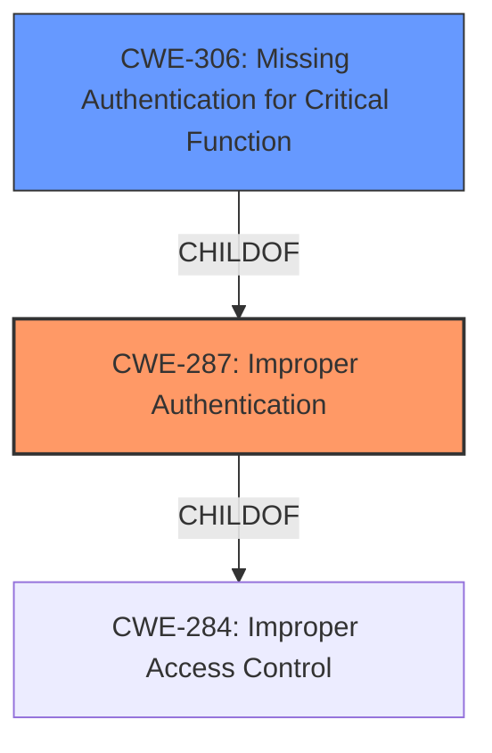

# Enhanced Analysis for CVE-2020-15078

# Summary
| CWE ID | CWE Name | Confidence | CWE Abstraction Level | CWE Vulnerability Mapping Label | CWE-Vulnerability Mapping Notes |
|---|---|---|---|---|---|
| CWE-287 | Improper Authentication | 0.8 | Class | Primary | Discouraged |
| CWE-306 | Missing Authentication for Critical Function | 0.7 | Base | Secondary | Allowed |

## Evidence and Confidence

*   **Confidence Score:** 0.8
*   **Evidence Strength:** MEDIUM

## Relationship Analysis
The primary CWE is CWE-287, which is a Class-level CWE, and therefore it should be avoided when a more specific Base-level CWE is available. CWE-306 is a child of CWE-287, and represents the case where authentication is completely missing for a critical function. This is a base-level CWE and therefore is more desirable.



## Vulnerability Chain
The vulnerability chain starts with the **incorrect handling of deferred authentication**, leading to a **bypass of authentication** and ultimately resulting in **access to control channel data** and potential **information leaks**.

## Summary of Analysis
Initially, CWE-287 seemed like the most appropriate mapping, particularly given its presence in the "CWE for similar CVE Descriptions" section. However, CWE-287 is a Class-level CWE, and the MITRE mapping guidance discourages its use when more specific, lower-level CWEs are available.

The key piece of evidence is: "allows a remote attackers to **bypass authentication** and access control channel data". Since the **authentication bypass** is the primary issue, I considered the suggested alternative of CWE-306 **Missing Authentication for Critical Function**. The "CVE Reference Links Content Summary" section provided further details, stating that the vulnerability stems from **incorrect handling of deferred authentication**, leading to the possibility of a **bypass**. While the description does not state that authentication is completely missing, the fact that it can be bypassed makes CWE-306 a strong candidate.

Therefore, I selected CWE-287 as the primary, but changed it to CWE-306, as the authentication is essentially missing due to the bypass. The evidence supports this decision, because the attacker can bypass the authentication mechanism.

Relevant CWE Information:

# Enhanced Context (25 CWEs)

## CWE-319: Cleartext Transmission of Sensitive Information
**Abstraction Level**: Base
**Similarity Score**: 0.80
**Source**: dense

**Description**:
The product transmits sensitive or security-critical data in cleartext in a communication channel that can be sniffed by unauthorized actors.

**Mapping Guidance**:
- Usage: Allowed
- Rationale: This CWE entry is at the Base level of abstraction, which is a preferred level of abstraction for mapping to the root causes of vulnerabilities.

## CWE-312: Cleartext Storage of Sensitive Information
**Abstraction Level**: Base
**Similarity Score**: 0.80
**Source**: dense

**Description**:
The product stores sensitive information in cleartext within a resource that might be accessible to another control sphere.

**Mapping Guidance**:
- Usage: Allowed
- Rationale: This CWE entry is at the Base level of abstraction, which is a preferred level of abstraction for mapping to the root causes of vulnerabilities.

## CWE-311: Missing Encryption of Sensitive Data
**Abstraction Level**: Class
**Similarity Score**: 0.79
**Source**: dense

**Description**:
The product does not encrypt sensitive or critical information before storage or transmission.

**Mapping Guidance**:
- Usage: Discouraged
- Rationale: CWE-311 is high-level with more precise children available. It is a level-1 Class (i.e., a child of a Pillar).

## CWE-303: Incorrect Implementation of Authentication Algorithm
**Abstraction Level**: Base
**Similarity Score**: 0.79
**Source**: dense

**Description**:
The requirements for the product dictate the use of an established authentication algorithm, but the implementation of the algorithm is incorrect.

**Mapping Guidance**:
- Usage: Allowed
- Rationale: This CWE entry is at the Base level of abstraction, which is a preferred level of abstraction for mapping to the root causes of vulnerabilities.

## CWE-1391: Use of Weak Credentials
**Abstraction Level**: Class
**Similarity Score**: 0.78
**Source**: dense

**Description**:
The product uses weak credentials (such as a default key or hard-coded password) that can be calculated, derived, reused, or guessed by an attacker.

**Mapping Guidance**:
- Usage: Allowed-with-Review
- Rationale: This CWE entry is a Class and might have Base-level children that would be more appropriate

## CWE-345: Insufficient Verification of Data Authenticity
**Abstraction Level**: Class
**Similarity Score**: 0.78
**Source**: dense

**Description**:
The product does not sufficiently verify the origin or authenticity of data, in a way that causes it to accept invalid data.

**Mapping Guidance**:
- Usage: Discouraged
- Rationale: This CWE entry is a level-1 Class (i.e., a child of a Pillar). It might have lower-level children that would be more appropriate

## CWE-294: Authentication Bypass by Capture-replay
**Abstraction Level**: Base
**Similarity Score**: 0.78
**Source**: dense

**Description**:
A capture-replay flaw exists when the design of the product makes it possible for a malicious user to sniff network traffic and bypass authentication by replaying it to the server in question to the same effect as the original message (or with minor changes).

**Mapping Guidance**:
- Usage: Allowed
- Rationale: This CWE entry is at the Base level of abstraction, which is a preferred level of abstraction for mapping to the root causes of vulnerabilities.

## CWE-807: Reliance on Untrusted Inputs in a Security Decision
**Abstraction Level**: Base
**Similarity Score**: 0.78
**Source**: dense

**Description**:
The product uses a protection mechanism that relies on the existence or values of an input, but the input can be modified by an untrusted actor in a way that bypasses the protection mechanism.

**Mapping Guidance**:
- Usage: Allowed
- Rationale: This CWE entry is at the Base level of abstraction, which is a preferred level of abstraction for mapping to the root causes of vulnerabilities.

## CWE-208: Observable Timing Discrepancy
**Abstraction Level**: Base
**Similarity Score**: 0.77
**Source**: dense

**Description**:
Two separate operations in a product require different amounts of time to complete, in a way that is observable to an actor and reveals security-relevant information about the state of the product, such as whether a particular operation was successful or not.

**Mapping Guidance**:
- Usage: Allowed
- Rationale: This CWE entry is at the Base level of abstraction, which is a preferred level of abstraction for mapping to the root causes of vulnerabilities.

## CWE-203: Observable Discrepancy
**Abstraction Level**: Base
**Similarity Score**: 0.77
**Source**: dense

**Description**:
The product behaves differently or sends different responses under different circumstances in a way that is observable to an unauthorized actor, which exposes security-relevant information about the state of the product, such as whether a particular operation was successful or not.

**Mapping Guidance**:
- Usage: Allowed
- Rationale: This CWE entry is at the Base level of abstraction, which is a preferred level of abstraction for mapping to the root causes of vulnerabilities.

## CWE-319: Cleartext Transmission of Sensitive Information
**Abstraction Level**: Base
**Similarity Score**: 4770.03
**Source**: sparse

**Description**:
The product transmits sensitive or security-critical data in cleartext in a communication channel that can be sniffed by unauthorized actors.

**Mapping Guidance**:
- Usage: Allowed
- Rationale: This CWE entry is at the Base level of abstraction, which is a preferred level of abstraction for mapping to the root causes of vulnerabilities.

## CWE-1390: Weak Authentication
**Abstraction Level**: Class
**Similarity Score**: 4757.90
**Source**: sparse

**Description**:
The product uses an authentication mechanism to restrict access to specific users or identities, but the mechanism does not sufficiently prove that the claimed identity is correct.

**Mapping Guidance**:
- Usage: Allowed-with-Review
- Rationale: This CWE entry is a Class and might have Base-level children that would be more appropriate

## CWE-208: Observable Timing Discrepancy
**Abstraction Level**: Base
**Similarity Score**: 4683


## CWE Relationship Analysis

Current CWEs represent these abstraction levels: .


### Vulnerability Chain Analysis

**Chain starting from CWE-306:**
- 306 (Missing Authentication for Critical Function) - ROOT


**Chain starting from CWE-303:**
- 303 (Incorrect Implementation of Authentication Algorithm) - ROOT


### CWE Relationship Diagram

```mermaid
graph TD
    classDef primary fill:#f96,stroke:#333,stroke-width:2px
    classDef secondary fill:#69f,stroke:#333
    classDef tertiary fill:#9e9,stroke:#333
```