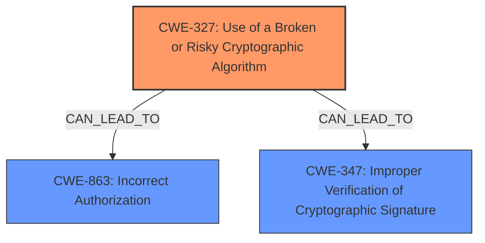

# Analysis for CVE-2020-15084

# Summary
| CWE ID | CWE Name | Confidence | CWE Abstraction Level | CWE Vulnerability Mapping Label | CWE-Vulnerability Mapping Notes |
|---|---|---|---|---|---|
| CWE-327 | Use of a Broken or Risky Cryptographic Algorithm | 0.9 | Class | Allowed-with-Review | Primary CWE |
| CWE-863 | Incorrect Authorization | 0.7 | Class | Allowed-with-Review | Secondary Candidate |
| CWE-347 | Improper Verification of Cryptographic Signature | 0.6 | Base | Allowed | Secondary Candidate |

## Evidence and Confidence

*   **Confidence Score:** 0.8
*   **Evidence Strength:** HIGH

## Relationship Analysis
The primary CWE is CWE-327, "Use of a Broken or Risky Cryptographic Algorithm", because the vulnerability stems from the lack of enforcement of the 'algorithms' configuration, which can lead to the use of unexpected and potentially insecure algorithms. CWE-863, "Incorrect Authorization", is a related Class-level CWE, as the end result is an authorization bypass, but the root cause is the cryptographic issue. CWE-347, "Improper Verification of Cryptographic Signature", is also related as the improper enforcement of algorithms leads to incorrect signature verification.



## Vulnerability Chain
The vulnerability chain starts with the **lack of enforcement of the 'algorithms' configuration entry** in the express-jwt library, which leads to the potential use of **risky cryptographic algorithms** (CWE-327), and ultimately results in an **authorization bypass**.

## Summary of Analysis
The initial assessment was focused on identifying the root cause of the vulnerability. The vulnerability description and the CVE reference links content summary clearly indicate that the **root cause** is the **library's failure to enforce the 'algorithms' configuration**. This **weakness** can lead to the use of broken or risky cryptographic algorithms, ultimately resulting in an authorization bypass.

Evidence:
- "The express-jwt library, in versions before 6.0.0, **does not enforce the 'algorithms' configuration entry**."
- "**rootcause:** **not enforcing algorithms entry in configuration**"
- "**weaknesses:** The library **does not enforce the 'algorithms' configuration**, leading to potential use of unexpected algorithms."

The retriever results and graph relationships support the selection of CWE-327 as the primary CWE. The other suggested CWEs, such as CWE-863 (Incorrect Authorization) and CWE-347 (Improper Verification of Cryptographic Signature), are consequences of the root cause.

The selected CWEs are at the optimal level of specificity because they directly address the root cause of the vulnerability and its immediate consequences. CWE-327 accurately describes the use of potentially insecure cryptographic algorithms due to the lack of algorithm enforcement.

CWE-327 is rated as the primary CWE with a confidence score of 0.9, as it directly addresses the root cause.

CWE-863 and CWE-347 were considered but deemed secondary because they represent the impact and a related weakness, respectively, rather than the fundamental flaw.

**CWE Analysis:**

*   **CWE-327: Use of a Broken or Risky Cryptographic Algorithm**
    *   **Technical Explanation:** The express-jwt library, by not enforcing the `algorithms` configuration, allows for the potential use of weaker or broken cryptographic algorithms. This can happen if the `secret` is obtained from libraries like `jwks-rsa` and the attacker crafts a JWT token with a different, weaker algorithm.
    *   **Security Implications:** Using a broken or risky cryptographic algorithm can lead to unauthorized access, data modification, or other security breaches.
    *   **Relationships:** This is a Class-level CWE. It is the primary cause that can lead to other weaknesses such as incorrect authorization (CWE-863) or improper verification of cryptographic signature (CWE-347).
    *   **Mapping Guidance Influence:** The "Allowed-with-Review" usage suggests examining children for a better fit, but none of the children fit more accurately than CWE-327 itself.
*   **CWE-863: Incorrect Authorization**
    *   **Technical Explanation:** The failure to enforce the `algorithms` configuration leads to an authorization bypass. If an attacker can use a different algorithm, they can potentially bypass the intended authorization checks.
    *   **Security Implications:** An authorization bypass allows an attacker to gain unauthorized access to resources or perform actions they should not be allowed to perform.
    *   **Relationships:** This is a Class-level CWE and a potential consequence of CWE-327.
    *   **Mapping Guidance Influence:** The "Allowed-with-Review" usage suggests examining children for a better fit, but none of the children fit more accurately than CWE-863 itself.
*   **CWE-347: Improper Verification of Cryptographic Signature**
    *   **Technical Explanation:** When the `algorithms` are not enforced, the library might not properly verify the cryptographic signature of the JWT token. This allows attackers to potentially forge tokens and bypass authentication.
    *   **Security Implications:** Improper verification of cryptographic signatures can lead to unauthorized access and data manipulation.
    *   **Relationships:** This is a Base-level CWE and is a potential consequence of CWE-327.
    *   **Mapping Guidance Influence:** The "Allowed" usage indicates that it is an acceptable mapping, but it is a secondary consequence of the primary root cause.

**CWEs Considered but Not Used:**

*   CWE-1240: Use of a Cryptographic Primitive with a Risky Implementation - While related to cryptography, it is more about the implementation of the primitive rather than the algorithm choice itself, making CWE-327 a better fit.
*   CWE-287: Improper Authentication - While the impact is authentication bypass, the root cause is the cryptographic algorithm, making CWE-327 more appropriate.
*   CWE-330: Use of Insufficiently Random Values - This is not relevant as the vulnerability does not involve random number generation.
*   CWE-345: Insufficient Verification of Data Authenticity - CWE-347 is a more specific version of this.
*   CWE-1336: Improper Neutralization of Special Elements Used in a Template Engine and CWE-917: Improper Neutralization of Special Elements used in an Expression Language Statement ('Expression Language Injection') are related to injection attacks, which are not the primary issue in this case.

# Enhanced Query for CVE-2020-15084

## Vulnerability Description
In express-jwt (NPM package) up and including version 5.3.3, the algorithms entry to be specified in the configuration is not being enforced. When algorithms is not specified in the configuration, with the combination of jwks-rsa, it may lead to authorization bypass. You are affected by this vulnerability if all of the following conditions apply - You are using express-jwt - You do not have **algorithms** configured in your express-jwt configuration. - You are using libraries such as jwks-rsa as the **secret**. You can fix this by specifying **algorithms** in the express-jwt configuration. See linked GHSA for example. This is also fixed in version 6.0.0.

### Vulnerability Description Key Phrases
- **rootcause:** **not enforcing algorithms entry in configuration**
- **impact:** authorization bypass
- **product:** express-jwt
- **version:** up and including 5.3.3

## CVE Reference Links Content Summary
```
{
  "vulnerability": {
    "root_cause": "The express-jwt library, in versions before 6.0.0, does not enforce the 'algorithms' configuration entry. When 'algorithms' is not specified, and the 'secret' is obtained from libraries like jwks-rsa, it can lead to an authorization bypass.",
    "weaknesses": [
      "The library does not enforce the 'algorithms' configuration, leading to potential use of unexpected algorithms.",
       "Lack of input validation/enforcement"
    ],
    "impact": "An attacker can bypass authentication and authorization mechanisms if the server relies on express-jwt for verifying JWT tokens.  This can lead to unauthorized access to sensitive resources or actions.",
    "attack_vectors": "An attacker can craft a JWT token with a different algorithm than the server expects.  If the server does not have `algorithms` configured to restrict allowed algorithms, the server may process the token even if it has not been signed with a legitimate secret.",
    "required_capabilities": "The attacker needs to be able to create a JWT token, choose a signing algorithm, and send it to the server with express-jwt in place."
  }
}
```

## Retriever Results

### Top Combined Results

| Rank | CWE ID | Name | Abstraction | Usage  | Retrievers | Individual Scores |
|------|--------|------|-------------|-------|------------|-------------------|
| 1 | 327 | Use of a Broken or Risky Cryptographic Algorithm | Class | Allowed-with-Review | sparse | 0.750 |
| 2 | 863 | Incorrect Authorization | Class | Allowed-with-Review | sparse | 0.724 |
| 3 | 347 | Improper Verification of Cryptographic Signature | Base | Allowed | sparse | 0.708 |
| 4 | 1336 | Improper Neutralization of Special Elements Used in a Template Engine | Base | Allowed | sparse | 0.691 |
| 5 | 201 | Insertion of Sensitive Information Into Sent Data | Base | Allowed | sparse | 0.682 |
| 6 | 834 | Excessive Iteration | Class | Discouraged | dense | 0.528 |
| 7 | 226 | Sensitive Information in Resource Not Removed Before Reuse | Base | Allowed | graph | 0.002 |
| 8 | 287 | Improper Authentication | Class | Discouraged | sparse | 0.680 |
| 9 | 668 | Exposure of Resource to Wrong Sphere | Class | Discouraged | sparse | 0.624 |
| 10 | 1240 | Use of a Cryptographic Primitive with a Risky Implementation | Base | Allowed | sparse | 0.617 |


# Complete CWE Specifications


## CWE-327: Use of a Broken or Risky Cryptographic Algorithm
**Abstraction:** Class
**Status:** Draft

### Description
The product uses a broken or risky cryptographic algorithm or protocol.

### Extended Description


Cryptographic algorithms are the methods by which data is scrambled to prevent observation or influence by unauthorized actors. Insecure cryptography can be exploited to expose sensitive information, modify data in unexpected ways, spoof identities of other users or devices, or other impacts.


It is very difficult to produce a secure algorithm, and even high-profile algorithms by accomplished cryptographic experts have been broken. Well-known techniques exist to break or weaken various kinds of cryptography. Accordingly, there are a small number of well-understood and heavily studied algorithms that should be used by most products. Using a non-standard or known-insecure algorithm is dangerous because a determined adversary may be able to break the algorithm and compromise whatever data has been protected.


Since the state of cryptography advances so rapidly, it is common for an algorithm to be considered "unsafe" even if it was once thought to be strong. This can happen when new attacks are discovered, or if computing power increases so much that the cryptographic algorithm no longer provides the amount of protection that was originally thought.


For a number of reasons, this weakness is even more challenging to manage with hardware deployment of cryptographic algorithms as opposed to software implementation. First, if a flaw is discovered with hardware-implemented cryptography, the flaw cannot be fixed in most cases without a recall of the product, because hardware is not easily replaceable like software. Second, because the hardware product is expected to work for years, the adversary's computing power will only increase over time.


### Alternative Terms
None

### Relationships
ChildOf -> CWE-693
PeerOf -> CWE-311

### Mapping Guidance
**Usage:** Allowed-with-Review
**Rationale:** This CWE entry is a Class and might have Base-level children that would be more appropriate
**Comments:** Examine children of this entry to see if there is a better fit
**Reasons:**
- Abstraction


### Additional Notes
**[Maintenance]** Since CWE 4.4, various cryptography-related entries, including CWE-327 and CWE-1240, have been slated for extensive research, analysis, and community consultation to define consistent terminology, improve relationships, and reduce overlap or duplication. As of CWE 4.6, this work is still ongoing.

**[Maintenance]** The Taxonomy_Mappings to ISA/IEC 62443 were added in CWE 4.10, but they are still under review and might change in future CWE versions. These draft mappings were performed by members of the "Mapping CWE to 62443" subgroup of the CWE-CAPEC ICS/OT Special Interest Group (SIG), and their work is incomplete as of CWE 4.10. The mappings are included to facilitate discussion and review by the broader ICS/OT community, and they are likely to change in future CWE versions.


### Observed Examples
- **CVE-2022-30273:** SCADA-based protocol supports a legacy encryption mode that uses Tiny Encryption Algorithm (TEA) in ECB mode, which leaks patterns in messages and cannot protect integrity
- **CVE-2022-30320:** Programmable Logic Controller (PLC) uses a protocol with a cryptographically insecure hashing algorithm for passwords.
- **CVE-2008-3775:** Product uses "ROT-25" to obfuscate the password in the registry.


## CWE-863: Incorrect Authorization
**Abstraction:** Class
**Status:** Incomplete

### Description
The product performs an authorization check when an actor attempts to access a resource or perform an action, but it does not correctly perform the check.

### Extended Description
Not provided

### Alternative Terms
AuthZ: "AuthZ" is typically used as an abbreviation of "authorization" within the web application security community. It is distinct from "AuthN" (or, sometimes, "AuthC") which is an abbreviation of "authentication." The use of "Auth" as an abbreviation is discouraged, since it could be used for either authentication or authorization.

### Relationships
ChildOf -> CWE-285
ChildOf -> CWE-284

### Mapping Guidance
**Usage:** Allowed-with-Review
**Rationale:** This CWE entry is a Class and might have Base-level children that would be more appropriate
**Comments:** Examine children of this entry to see if there is a better fit
**Reasons:**
- Abstraction


### Additional Notes
**[Terminology]** 

Assuming a user with a given identity, authorization is the process of determining whether that user can access a given resource, based on the user's privileges and any permissions or other access-control specifications that apply to the resource.


### Observed Examples
- **CVE-2021-39155:** Chain: A microservice integration and management platform compares the hostname in the HTTP Host header in a case-sensitive way (CWE-178, CWE-1289), allowing bypass of the authorization policy (CWE-863) using a hostname with mixed case or other variations.
- **CVE-2019-15900:** Chain: sscanf() call is used to check if a username and group exists, but the return value of sscanf() call is not checked (CWE-252), causing an uninitialized variable to be checked (CWE-457), returning success to allow authorization bypass for executing a privileged (CWE-863).
- **CVE-2009-2213:** Gateway uses default "Allow" configuration for its authorization settings.


## CWE-347: Improper Verification of Cryptographic Signature
**Abstraction:** Base
**Status:** Draft

### Description
The product does not verify, or incorrectly verifies, the cryptographic signature for data.

### Extended Description
Not provided

### Alternative Terms
None

### Relationships
ChildOf -> CWE-345
ChildOf -> CWE-345

### Mapping Guidance
**Usage:** Allowed
**Rationale:** This CWE entry is at the Base level of abstraction, which is a preferred level of abstraction for mapping to the root causes of vulnerabilities.
**Comments:** Carefully read both the name and description to ensure that this mapping is an appropriate fit. Do not try to 'force' a mapping to a lower-level Base/Variant simply to comply with this preferred level of abstraction.
**Reasons:**
- Acceptable-Use


### Observed Examples
- **CVE-2002-1796:** Does not properly verify signatures for "trusted" entities.
- **CVE-2005-2181:** Insufficient verification allows spoofing.
- **CVE-2005-2182:** Insufficient verification allows spoofing.


## CWE-1336: Improper Neutralization of Special Elements Used in a Template Engine
**Abstraction:** Base
**Status:** Incomplete

### Description
The product uses a template engine to insert or process externally-influenced input, but it does not neutralize or incorrectly neutralizes special elements or syntax that can be interpreted as template expressions or other code directives when processed by the engine.

### Extended Description


Many web applications use template engines that allow developers to insert externally-influenced values into free text or messages in order to generate a full web page, document, message, etc. Such engines include Twig, Jinja2, Pug, Java Server Pages, FreeMarker, Velocity, ColdFusion, Smarty, and many others - including PHP itself. Some CMS (Content Management Systems) also use templates.


Template engines often have their own custom command or expression language. If an attacker can influence input into a template before it is processed, then the attacker can invoke arbitrary expressions, i.e. perform injection attacks. For example, in some template languages, an attacker could inject the expression "{{7*7}}" and determine if the output returns "49" instead. The syntax varies depending on the language.


In some cases, XSS-style attacks can work, which can obscure the root cause if the developer does not closely investigate the root cause of the error.


Template engines can be used on the server or client, so both "sides" could be affected by injection. The mechanisms of attack or the affected technologies might be different, but the mistake is fundamentally the same.


### Alternative Terms
Server-Side Template Injection / SSTI: This term is used for injection into template engines being used by a server.
Client-Side Template Injection / CSTI: This term is used for injection into template engines being used by a client.

### Relationships
ChildOf -> CWE-94

### Mapping Guidance
**Usage:** Allowed
**Rationale:** This CWE entry is at the Base level of abstraction, which is a preferred level of abstraction for mapping to the root causes of vulnerabilities.
**Comments:** Carefully read both the name and description to ensure that this mapping is an appropriate fit. Do not try to 'force' a mapping to a lower-level Base/Variant simply to comply with this preferred level of abstraction.
**Reasons:**
- Acceptable-Use


### Additional Notes
**[Relationship]** Since expression languages are often used in templating languages, there may be some overlap with CWE-917 (Expression Language Injection). XSS (CWE-79) is also co-located with template injection.

**[Maintenance]** The interrelationships and differences between CWE-917 and CWE-1336 need to be further clarified.


### Observed Examples
- **CVE-2024-34359:** Chain: Python bindings for LLM library do not use a sandboxed environment when parsing a template and constructing a prompt, allowing jinja2 Server Side Template Injection and code execution - one variant of a "prompt injection" attack.
- **CVE-2017-16783:** server-side template injection in content management server
- **CVE-2020-9437:** authentication / identity management product has client-side template injection


## CWE-201: Insertion of Sensitive Information Into Sent Data
**Abstraction:** Base
**Status:** Draft

### Description
The code transmits data to another actor, but a portion of the data includes sensitive information that should not be accessible to that actor.

### Extended Description
Not provided

### Alternative Terms
None

### Relationships
ChildOf -> CWE-200
CanAlsoBe -> CWE-209
CanAlsoBe -> CWE-202

### Mapping Guidance
**Usage:** Allowed
**Rationale:** This CWE entry is at the Base level of abstraction, which is a preferred level of abstraction for mapping to the root causes of vulnerabilities.
**Comments:** Carefully read both the name and description to ensure that this mapping is an appropriate fit. Do not try to 'force' a mapping to a lower-level Base/Variant simply to comply with this preferred level of abstraction.
**Reasons:**
- Acceptable-Use


### Additional Notes
**[Other]** Sensitive information could include data that is sensitive in and of itself (such as credentials or private messages), or otherwise useful in the further exploitation of the system (such as internal file system structure).


### Observed Examples
- **CVE-2022-0708:** Collaboration platform does not clear team emails in a response, allowing leak of email addresses


## CWE-834: Excessive Iteration
**Abstraction:** Class
**Status:** Incomplete

### Description
The product performs an iteration or loop without sufficiently limiting the number of times that the loop is executed.

### Extended Description
If the iteration can be influenced by an attacker, this weakness could allow attackers to consume excessive resources such as CPU or memory. In many cases, a loop does not need to be infinite in order to cause enough resource consumption to adversely affect the product or its host system; it depends on the amount of resources consumed per iteration.

### Alternative Terms
None

### Relationships
ChildOf -> CWE-691

### Mapping Guidance
**Usage:** Discouraged
**Rationale:** This CWE entry is a level-1 Class (i.e., a child of a Pillar). It might have lower-level children that would be more appropriate
**Comments:** Examine children of this entry to see if there is a better fit
**Reasons:**
- Abstraction


### Observed Examples
- **CVE-2011-1027:** Chain: off-by-one error (CWE-193) leads to infinite loop (CWE-835) using invalid hex-encoded characters.
- **CVE-2006-6499:** Chain: web browser crashes due to infinite loop - "bad looping logic [that relies on] floating point math [CWE-1339] to exit the loop [CWE-835]"


## CWE-226: Sensitive Information in Resource Not Removed Before Reuse
**Abstraction:** Base
**Status:** Draft

### Description
The product releases a resource such as memory or a file so that it can be made available for reuse, but it does not clear or "zeroize" the information contained in the resource before the product performs a critical state transition or makes the resource available for reuse by other entities.

### Extended Description


When resources are released, they can be made available for reuse. For example, after memory is de-allocated, an operating system may make the memory available to another process, or disk space may be reallocated when a file is deleted. As removing information requires time and additional resources, operating systems do not usually clear the previously written information.


Even when the resource is reused by the same process, this weakness can arise when new data is not as large as the old data, which leaves portions of the old data still available. Equivalent errors can occur in other situations where the length of data is variable but the associated data structure is not. If memory is not cleared after use, the information may be read by less trustworthy parties when the memory is reallocated.


This weakness can apply in hardware, such as when a device or system switches between power, sleep, or debug states during normal operation, or when execution changes to different users or privilege levels.


### Alternative Terms
None

### Relationships
ChildOf -> CWE-459
ChildOf -> CWE-212
CanPrecede -> CWE-201

### Mapping Guidance
**Usage:** Allowed
**Rationale:** This CWE entry is at the Base level of abstraction, which is a preferred level of abstraction for mapping to the root causes of vulnerabilities.
**Comments:** Carefully read both the name and description to ensure that this mapping is an appropriate fit. Do not try to 'force' a mapping to a lower-level Base/Variant simply to comply with this preferred level of abstraction.
**Reasons:**
- Acceptable-Use


### Additional Notes
**[Relationship]** There is a close association between CWE-226 and CWE-212. The difference is partially that of perspective. CWE-226 is geared towards the final stage of the resource lifecycle, in which the resource is deleted, eliminated, expired, or otherwise released for reuse. Technically, this involves a transfer to a different control sphere, in which the original contents of the resource are no longer relevant. CWE-212, however, is intended for sensitive data in resources that are intentionally shared with others, so they are still active. This distinction is useful from the perspective of the CWE research view (CWE-1000).

**[Maintenance]** This entry needs modification to clarify the differences with CWE-212. The description also combines two problems that are distinct from the CWE research perspective: the inadvertent transfer of information to another sphere, and improper initialization/shutdown. Some of the associated taxonomy mappings reflect these different uses.

**[Research Gap]** This is frequently found for network packets, but it can also exist in local memory allocation, files, etc.


### Observed Examples
- **CVE-2019-3733:** Cryptography library does not clear heap memory before release
- **CVE-2003-0001:** Ethernet NIC drivers do not pad frames with null bytes, leading to infoleak from malformed packets.
- **CVE-2003-0291:** router does not clear information from DHCP packets that have been previously used


## CWE-287: Improper Authentication
**Abstraction:** Class
**Status:** Draft

### Description
When an actor claims to have a given identity, the product does not prove or insufficiently proves that the claim is correct.

### Extended Description
Not provided

### Alternative Terms
authentification: An alternate term is "authentification", which appears to be most commonly used by people from non-English-speaking countries.
AuthN: "AuthN" is typically used as an abbreviation of "authentication" within the web application security community. It is also distinct from "AuthZ," which is an abbreviation of "authorization." The use of "Auth" as an abbreviation is discouraged, since it could be used for either authentication or authorization.
AuthC: "AuthC" is used as an abbreviation of "authentication," but it appears to used less frequently than "AuthN."

### Relationships
ChildOf -> CWE-284
ChildOf -> CWE-284

### Mapping Guidance
**Usage:** Discouraged
**Rationale:** This CWE entry might be misused when lower-level CWE entries are likely to be applicable. It is a level-1 Class (i.e., a child of a Pillar).
**Comments:** Consider children or descendants, beginning with CWE-1390: Weak Authentication or CWE-306: Missing Authentication for Critical Function.
**Reasons:**
- Frequent Misuse
**Suggested Alternatives:**
- CWE-1390: Weak Authentication
- CWE-306: Missing Authentication for Critical Function


### Additional Notes
**[Relationship]** This can be resultant from SQL injection vulnerabilities and other issues.

**[Maintenance]** The Taxonomy_Mappings to ISA/IEC 62443 were added in CWE 4.10, but they are still under review and might change in future CWE versions. These draft mappings were performed by members of the "Mapping CWE to 62443" subgroup of the CWE-CAPEC ICS/OT Special Interest Group (SIG), and their work is incomplete as of CWE 4.10. The mappings are included to facilitate discussion and review by the broader ICS/OT community, and they are likely to change in future CWE versions.


### Observed Examples
- **CVE-2022-35248:** Chat application skips validation when Central Authentication Service (CAS) is enabled, effectively removing the second factor from two-factor authentication
- **CVE-2022-36436:** Python-based authentication proxy does not enforce password authentication during the initial handshake, allowing the client to bypass authentication by specifying a 'None' authentication type.
- **CVE-2022-30034:** Chain: Web UI for a Python RPC framework does not use regex anchors to validate user login emails (CWE-777), potentially allowing bypass of OAuth (CWE-1390).


## CWE-668: Exposure of Resource to Wrong Sphere
**Abstraction:** Class
**Status:** Draft

### Description
The product exposes a resource to the wrong control sphere, providing unintended actors with inappropriate access to the resource.

### Extended Description


Resources such as files and directories may be inadvertently exposed through mechanisms such as insecure permissions, or when a program accidentally operates on the wrong object. For example, a program may intend that private files can only be provided to a specific user. This effectively defines a control sphere that is intended to prevent attackers from accessing these private files. If the file permissions are insecure, then parties other than the user will be able to access those files.


A separate control sphere might effectively require that the user can only access the private files, but not any other files on the system. If the program does not ensure that the user is only requesting private files, then the user might be able to access other files on the system.


In either case, the end result is that a resource has been exposed to the wrong party.


### Alternative Terms
None

### Relationships
ChildOf -> CWE-664

### Mapping Guidance
**Usage:** Discouraged
**Rationale:** CWE-668 is high-level and is often misused as a catch-all when lower-level CWE IDs might be applicable. It is sometimes used for low-information vulnerability reports [REF-1287]. It is a level-1 Class (i.e., a child of a Pillar). It is not useful for trend analysis.
**Comments:** Closely analyze the specific mistake that is allowing the resource to be exposed, and perform a CWE mapping for that mistake.
**Reasons:**
- Frequent Misuse
- Abstraction


### Additional Notes
**[Theoretical]** A "control sphere" is a set of resources and behaviors that are accessible to a single actor, or a group of actors. A product's security model will typically define multiple spheres, possibly implicitly. For example, a server might define one sphere for "administrators" who can create new user accounts with subdirectories under /home/server/, and a second sphere might cover the set of users who can create or delete files within their own subdirectories. A third sphere might be "users who are authenticated to the operating system on which the product is installed." Each sphere has different sets of actors and allowable behaviors.


## CWE-1240: Use of a Cryptographic Primitive with a Risky Implementation
**Abstraction:** Base
**Status:** Draft

### Description
To fulfill the need for a cryptographic primitive, the product implements a cryptographic algorithm using a non-standard, unproven, or disallowed/non-compliant cryptographic implementation.

### Extended Description


Cryptographic protocols and systems depend on cryptographic primitives (and associated algorithms) as their basic building blocks. Some common examples of primitives are digital signatures, one-way hash functions, ciphers, and public key cryptography; however, the notion of "primitive" can vary depending on point of view. See "Terminology Notes" for further explanation of some concepts.


Cryptographic primitives are defined to accomplish one very specific task in a precisely defined and mathematically reliable fashion. For example, suppose that for a specific cryptographic primitive (such as an encryption routine), the consensus is that the primitive can only be broken after trying out N different inputs (where the larger the value of N, the stronger the cryptography). For an encryption scheme like AES-256, one would expect N to be so large as to be infeasible to execute in a reasonable amount of time.


If a vulnerability is ever found that shows that one can break a cryptographic primitive in significantly less than the expected number of attempts, then that primitive is considered weakened (or sometimes in extreme cases, colloquially it is "broken"). As a result, anything using this cryptographic primitive would now be considered insecure or risky. Thus, even breaking or weakening a seemingly small cryptographic primitive has the potential to render the whole system vulnerable, due to its reliance on the primitive. A historical example can be found in TLS when using DES. One would colloquially call DES the cryptographic primitive for transport encryption in this version of TLS. In the past, DES was considered strong, because no weaknesses were found in it; importantly, DES has a key length of 56 bits. Trying N=2^56 keys was considered impractical for most actors. Unfortunately, attacking a system with 56-bit keys is now practical via brute force, which makes defeating DES encryption practical. It is now practical for an adversary to read any information sent under this version of TLS and use this information to attack the system. As a result, it can be claimed that this use of TLS is weak, and that any system depending on TLS with DES could potentially render the entire system vulnerable to attack.


Cryptographic primitives and associated algorithms are only considered safe after extensive research and review from experienced cryptographers from academia, industry, and government entities looking for any possible flaws. Furthermore, cryptographic primitives and associated algorithms are frequently reevaluated for safety when new mathematical and attack techniques are discovered. As a result and over time, even well-known cryptographic primitives can lose their compliance status with the discovery of novel attacks that might either defeat the algorithm or reduce its robustness significantly.


If ad-hoc cryptographic primitives are implemented, it is almost certain that the implementation will be vulnerable to attacks that are well understood by cryptographers, resulting in the exposure of sensitive information and other consequences.


This weakness is even more difficult to manage for hardware-implemented deployment of cryptographic algorithms. First, because hardware is not patchable as easily as software, any flaw discovered after release and production typically cannot be fixed without a recall of the product. Secondly, the hardware product is often expected to work for years, during which time computation power available to the attacker only increases. Therefore, for hardware implementations of cryptographic primitives, it is absolutely essential that only strong, proven cryptographic primitives are used.


### Alternative Terms
None

### Relationships
ChildOf -> CWE-327

### Mapping Guidance
**Usage:** Allowed
**Rationale:** This CWE entry is at the Base level of abstraction, which is a preferred level of abstraction for mapping to the root causes of vulnerabilities.
**Comments:** Carefully read both the name and description to ensure that this mapping is an appropriate fit. Do not try to 'force' a mapping to a lower-level Base/Variant simply to comply with this preferred level of abstraction.
**Reasons:**
- Acceptable-Use


### Additional Notes
**[Terminology]** 

 Terminology for cryptography varies widely, from informal and colloquial to mathematically-defined, with different precision and formalism depending on whether the stakeholder is a developer, cryptologist, etc. Yet there is a need for CWE to be self-consistent while remaining understandable and acceptable to multiple audiences.


As of CWE 4.6, CWE terminology around "primitives" and "algorithms" is emerging as shown by the following example, subject to future consultation and agreement within the CWE and cryptography communities. Suppose one wishes to send encrypted data using a CLI tool such as OpenSSL. One might choose to use AES with a 256-bit key and require tamper protection (GCM mode, for instance). For compatibility's sake, one might also choose the ciphertext to be formatted to the PKCS#5 standard. In this case, the "cryptographic system" would be AES-256-GCM with PKCS#5 formatting. The "cryptographic function" would be AES-256 in the GCM mode of operation, and the "algorithm" would be AES. Colloquially, one would say that AES (and sometimes AES-256) is the "cryptographic primitive," because it is the algorithm that realizes the concept of symmetric encryption (without modes of operation or other protocol related modifications). In practice, developers and architects typically refer to base cryptographic algorithms (AES, SHA, etc.) as cryptographic primitives.


**[Maintenance]** Since CWE 4.4, various cryptography-related entries, including CWE-327 and CWE-1240, have been slated for extensive research, analysis, and community consultation to define consistent terminology, improve relationships, and reduce overlap or duplication. As of CWE 4.6, this work is still ongoing.


### Observed Examples
- **CVE-2020-4778:** software uses MD5, which is less safe than the default SHA-256 used by related products
- **CVE-2005-2946:** Default configuration of product uses MD5 instead of stronger algorithms that are available, simplifying forgery of certificates.
- **CVE-2019-3907:** identity card uses MD5 hash of a salt and password

