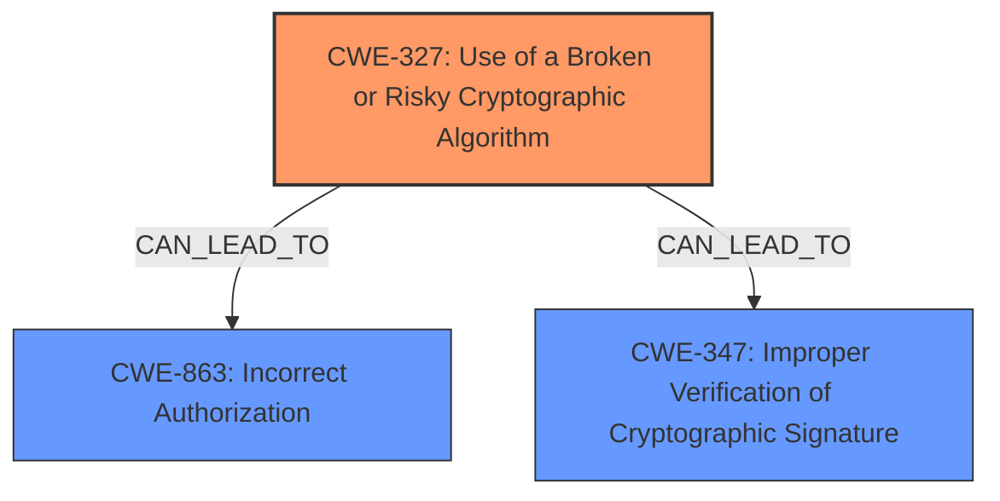

# Analysis Report for CVE-2020-15084

# Vulnerability Analysis Report: CVE-2020-15084

## Description


## Analysis (with Relationship Data)

# Summary
| CWE ID | CWE Name | Confidence | CWE Abstraction Level | CWE Vulnerability Mapping Label | CWE-Vulnerability Mapping Notes |
|---|---|---|---|---|---|
| CWE-327 | Use of a Broken or Risky Cryptographic Algorithm | 0.9 | Class | Allowed-with-Review | Primary CWE |
| CWE-863 | Incorrect Authorization | 0.7 | Class | Allowed-with-Review | Secondary Candidate |
| CWE-347 | Improper Verification of Cryptographic Signature | 0.6 | Base | Allowed | Secondary Candidate |

## Evidence and Confidence

*   **Confidence Score:** 0.8
*   **Evidence Strength:** HIGH

## Relationship Analysis
The primary CWE is CWE-327, "Use of a Broken or Risky Cryptographic Algorithm", because the vulnerability stems from the lack of enforcement of the 'algorithms' configuration, which can lead to the use of unexpected and potentially insecure algorithms. CWE-863, "Incorrect Authorization", is a related Class-level CWE, as the end result is an authorization bypass, but the root cause is the cryptographic issue. CWE-347, "Improper Verification of Cryptographic Signature", is also related as the improper enforcement of algorithms leads to incorrect signature verification.



## Vulnerability Chain
The vulnerability chain starts with the **lack of enforcement of the 'algorithms' configuration entry** in the express-jwt library, which leads to the potential use of **risky cryptographic algorithms** (CWE-327), and ultimately results in an **authorization bypass**.

## Summary of Analysis
The initial assessment was focused on identifying the root cause of the vulnerability. The vulnerability description and the CVE reference links content summary clearly indicate that the **root cause** is the **library's failure to enforce the 'algorithms' configuration**. This **weakness** can lead to the use of broken or risky cryptographic algorithms, ultimately resulting in an authorization bypass.

Evidence:
- "The express-jwt library, in versions before 6.0.0, **does not enforce the 'algorithms' configuration entry**."
- "**rootcause:** **not enforcing algorithms entry in configuration**"
- "**weaknesses:** The library **does not enforce the 'algorithms' configuration**, leading to potential use of unexpected algorithms."

The retriever results and graph relationships support the selection of CWE-327 as the primary CWE. The other suggested CWEs, such as CWE-863 (Incorrect Authorization) and CWE-347 (Improper Verification of Cryptographic Signature), are consequences of the root cause.

The selected CWEs are at the optimal level of specificity because they directly address the root cause of the vulnerability and its immediate consequences. CWE-327 accurately describes the use of potentially insecure cryptographic algorithms due to the lack of algorithm enforcement.

CWE-327 is rated as the primary CWE with a confidence score of 0.9, as it directly addresses the root cause.

CWE-863 and CWE-347 were considered but deemed secondary because they represent the impact and a related weakness, respectively, rather than the fundamental flaw.

**CWE Analysis:**

*   **CWE-327: Use of a Broken or Risky Cryptographic Algorithm**
    *   **Technical Explanation:** The express-jwt library, by not enforcing the `algorithms` configuration, allows for the potential use of weaker or broken cryptographic algorithms. This can happen if the `secret` is obtained from libraries like `jwks-rsa` and the attacker crafts a JWT token with a different, weaker algorithm.
    *   **Security Implications:** Using a broken or risky cryptographic algorithm can lead to unauthorized access, data modification, or other security breaches.
    *   **Relationships:** This is a Class-level CWE. It is the primary cause that can lead to other weaknesses such as incorrect authorization (CWE-863) or improper verification of cryptographic signature (CWE-347).
    *   **Mapping Guidance Influence:** The "Allowed-with-Review" usage suggests examining children for a better fit, but none of the children fit more accurately than CWE-327 itself.
*   **CWE-863: Incorrect Authorization**
    *   **Technical Explanation:** The failure to enforce the `algorithms` configuration leads to an authorization bypass. If an attacker can use a different algorithm, they can potentially bypass the intended authorization checks.
    *   **Security Implications:** An authorization bypass allows an attacker to gain unauthorized access to resources or perform actions they should not be allowed to perform.
    *   **Relationships:** This is a Class-level CWE and a potential consequence of CWE-327.
    *   **Mapping Guidance Influence:** The "Allowed-with-Review" usage suggests examining children for a better fit, but none of the children fit more accurately than CWE-863 itself.
*   **CWE-347: Improper Verification of Cryptographic Signature**
    *   **Technical Explanation:** When the `algorithms` are not enforced, the library might not properly verify the cryptographic signature of the JWT token. This allows attackers to potentially forge tokens and bypass authentication.
    *   **Security Implications:** Improper verification of cryptographic signatures can lead to unauthorized access and data manipulation.
    *   **Relationships:** This is a Base-level CWE and is a potential consequence of CWE-327.
    *   **Mapping Guidance Influence:** The "Allowed" usage indicates that it is an acceptable mapping, but it is a secondary consequence of the primary root cause.

**CWEs Considered but Not Used:**

*   CWE-1240: Use of a Cryptographic Primitive with a Risky Implementation - While related to cryptography, it is more about the implementation of the primitive rather than the algorithm choice itself, making CWE-327 a better fit.
*   CWE-287: Improper Authentication - While the impact is authentication bypass, the root cause is the cryptographic algorithm, making CWE-327 more appropriate.
*   CWE-330: Use of Insufficiently Random Values - This is not relevant as the vulnerability does not involve random number generation.
*   CWE-345: Insufficient Verification of Data Authenticity - CWE-347 is a more specific version of this.
*   CWE-1336: Improper Neutralization of Special Elements Used in a Template Engine and CWE-917: Improper Neutralization of Special Elements used in an Expression Language Statement ('Expression Language Injection') are related to injection attacks, which are not the primary issue in this case.


## CWE Relationship Analysis

Current CWEs represent these abstraction levels: .


### Vulnerability Chain Analysis

**Chain starting from CWE-1336:**
- 1336 (Improper Neutralization of Special Elements Used in a Template Engine) - ROOT


**Chain starting from CWE-287:**
- 287 (Improper Authentication) - ROOT


### CWE Relationship Diagram

```mermaid
graph TD
    classDef primary fill:#f96,stroke:#333,stroke-width:2px
    classDef secondary fill:#69f,stroke:#333
    classDef tertiary fill:#9e9,stroke:#333
```


*Report generated on 2025-04-01 18:49:58*
