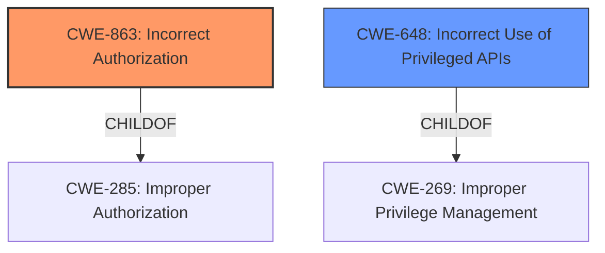

# Raw Analyzer Response for CVE-2020-15087

# Summary
| CWE ID | CWE Name | Confidence | CWE Abstraction Level | CWE Vulnerability Mapping Label | CWE-Vulnerability Mapping Notes |
|---|---|---|---|---|---|
| CWE-863 | Incorrect Authorization | 0.9 | Class | Primary | Allowed-with-Review |
| CWE-648 | Incorrect Use of Privileged APIs | 0.7 | Base | Secondary | Allowed |

## Evidence and Confidence

*   **Confidence Score:** 0.8
*   **Evidence Strength:** HIGH

## Relationship Analysis
The primary relationship influencing my decision is the hierarchical relationship where CWE-863 (Incorrect Authorization) is a child of CWE-285 (Improper Authorization). Additionally, CWE-648 (Incorrect Use of Privileged APIs) is a child of CWE-269 (Improper Privilege Management). The vulnerability involves **bypassing authorization checks** by **directly accessing internal APIs**, which aligns with an authorization issue rather than a broader authentication problem. The abstraction levels guided the selection, preferring the more specific Class and Base levels over the more general Pillar level.

## Vulnerability Chain
The vulnerability chain starts with the **incorrect authorization** implementation, which leads to authenticated users being able to **bypass authorization checks** by **directly accessing internal APIs**. This results in unauthorized access and potential privilege escalation.

## Summary of Analysis
The initial analysis focused on identifying the **root cause** of the vulnerability, which is related to authorization. The vulnerability description clearly states that authenticated users can **bypass authorization checks**, indicating an issue with how authorization is handled. The CVE Reference Links Content Summary reinforces this by highlighting the "lack of proper authorization checks" as the **root cause**.

Based on the evidence and the relationship analysis, CWE-863 (Incorrect Authorization) is the most appropriate primary CWE. It accurately reflects the **incorrect** implementation of authorization checks that allows users to **bypass** them. CWE-648 (Incorrect Use of Privileged APIs) is a secondary CWE because the vulnerability involves **directly accessing internal APIs**, which can be considered privileged APIs.

The CWEs selected are at the optimal level of specificity. CWE-863 is a Class-level CWE, providing a more specific classification than its parent, CWE-285 (Improper Authorization), which is discouraged due to its high-level nature. CWE-648 is a Base-level CWE, offering a granular view of the issue related to privileged APIs. These choices are supported by MITRE's mapping guidance, which favors Base and Variant levels of abstraction when available.

Relevant CWE Information:

# Enhanced Context (25 CWEs)
The following CWEs were identified as potentially relevant to this vulnerability:

## CWE-668: Exposure of Resource to Wrong Sphere
**Abstraction Level**: Class
**Similarity Score**: 0.77
**Source**: dense

**Description**:
The product exposes a resource to the wrong control sphere, providing unintended actors with inappropriate access to the resource.

**Mapping Guidance**:
- Usage: Discouraged
- Rationale: CWE-668 is high-level and is often misused as a catch-all when lower-level CWE IDs might be applicable. It is sometimes used for low-information vulnerability reports [REF-1287]. It is a level-1 Class (i.e., a child of a Pillar). It is not useful for trend analysis.

## CWE-610: Externally Controlled Reference to a Resource in Another Sphere
**Abstraction Level**: Class
**Similarity Score**: 0.74
**Source**: dense

**Description**:
The product uses an externally controlled name or reference that resolves to a resource that is outside of the intended control sphere.

**Mapping Guidance**:
- Usage: Discouraged
- Rationale: This CWE entry is a level-1 Class (i.e., a child of a Pillar). It might have lower-level children that would be more appropriate

## CWE-664: Improper Control of a Resource Through its Lifetime
**Abstraction Level**: Pillar
**Similarity Score**: 0.74
**Source**: dense

**Description**:
The product does not maintain or incorrectly maintains control over a resource throughout its lifetime of creation, use, and release.

**Mapping Guidance**:
- Usage: Discouraged
- Rationale: This CWE entry is high-level when lower-level children are available.

## CWE-669: Incorrect Resource Transfer Between Spheres
**Abstraction Level**: Class
**Similarity Score**: 0.74
**Source**: dense

**Description**:
The product does not properly transfer a resource/behavior to another sphere, or improperly imports a resource/behavior from another sphere, in a manner that provides unintended control over that resource.

**Mapping Guidance**:
- Usage: Allowed-with-Review
- Rationale: This CWE entry is a Class and might have Base-level children that would be more appropriate

## CWE-552: Files or Directories Accessible to External Parties
**Abstraction Level**: Base
**Similarity Score**: 0.74
**Source**: dense

**Description**:
The product makes files or directories accessible to unauthorized actors, even though they should not be.

**Mapping Guidance**:
- Usage: Allowed
- Rationale: This CWE entry is at the Base level of abstraction, which is a preferred level of abstraction for mapping to the root causes of vulnerabilities.

## CWE-653: Improper Isolation or Compartmentalization
**Abstraction Level**: Class
**Similarity Score**: 0.74
**Source**: dense

**Description**:
The product does not properly compartmentalize or isolate functionality, processes, or resources that require different privilege levels, rights, or permissions.

**Mapping Guidance**:
- Usage: Allowed
- Rationale: This CWE entry is at the Base level of abstraction, which is a preferred level of abstraction for mapping to the root causes of vulnerabilities.

## CWE-538: Insertion of Sensitive Information into Externally-Accessible File or Directory
**Abstraction Level**: Base
**Similarity Score**: 0.73
**Source**: dense

**Description**:
The product places sensitive information into files or directories that are accessible to actors who are allowed to have access to the files, but not to the sensitive information.

**Mapping Guidance**:
- Usage: Allowed
- Rationale: This CWE entry is at the Base level of abstraction, which is a preferred level of abstraction for mapping to the root causes of vulnerabilities.

## CWE-807: Reliance on Untrusted Inputs in a Security Decision
**Abstraction Level**: Base
**Similarity Score**: 0.73
**Source**: dense

**Description**:
The product uses a protection mechanism that relies on the existence or values of an input, but the input can be modified by an untrusted actor in a way that bypasses the protection mechanism.

**Mapping Guidance**:
- Usage: Allowed
- Rationale: This CWE entry is at the Base level of abstraction, which is a preferred level of abstraction for mapping to the root causes of vulnerabilities.

## CWE-497: Exposure of Sensitive System Information to an Unauthorized Control Sphere
**Abstraction Level**: Base
**Similarity Score**: 0.73
**Source**: dense

**Description**:
The product does not properly prevent sensitive system-level information from being accessed by unauthorized actors who do not have the same level of access to the underlying system as the product does.

**Mapping Guidance**:
- Usage: Allowed
- Rationale: This CWE entry is at the Base level of abstraction, which is a preferred level of abstraction for mapping to the root causes of vulnerabilities.

## CWE-41: Improper Resolution of Path Equivalence
**Abstraction Level**: Base
**Similarity Score**: 0.73
**Source**: dense

**Description**:
The product is vulnerable to file system contents disclosure through path equivalence. Path equivalence involves the use of special characters in file and directory names. The associated manipulations are intended to generate multiple names for the same object.

**Mapping Guidance**:
- Usage: Allowed
- Rationale: This CWE entry is at the Base level of abstraction, which is a preferred level of abstraction for mapping to the root causes of vulnerabilities.

## CWE-285: Improper Authorization
**Abstraction Level**: Class
**Similarity Score**: 5420.65
**Source**: sparse

**Description**:
The product does not perform or incorrectly performs an authorization check when an actor attempts to access a resource or perform an action.

### Mapping Guidance
**Usage:** Discouraged
**Rationale:** CWE-285 is high-level and lower-level CWEs can frequently be used instead. It is a level-1 Class (i.e., a child of a Pillar).
**Comments:** Look at CWE-285