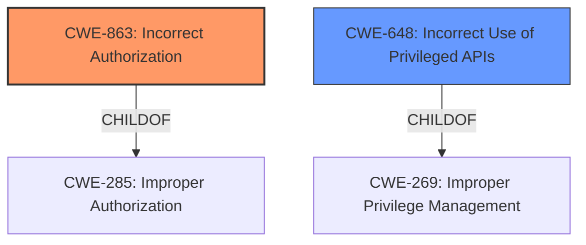

# Analysis for CVE-2020-15087

# Summary
| CWE ID | CWE Name | Confidence | CWE Abstraction Level | CWE Vulnerability Mapping Label | CWE-Vulnerability Mapping Notes |
|---|---|---|---|---|---|
| CWE-863 | Incorrect Authorization | 0.9 | Class | Primary | Allowed-with-Review |
| CWE-648 | Incorrect Use of Privileged APIs | 0.7 | Base | Secondary | Allowed |

## Evidence and Confidence

*   **Confidence Score:** 0.8
*   **Evidence Strength:** HIGH

## Relationship Analysis
The primary relationship influencing my decision is the hierarchical relationship where CWE-863 (Incorrect Authorization) is a child of CWE-285 (Improper Authorization). Additionally, CWE-648 (Incorrect Use of Privileged APIs) is a child of CWE-269 (Improper Privilege Management). The vulnerability involves **bypassing authorization checks** by **directly accessing internal APIs**, which aligns with an authorization issue rather than a broader authentication problem. The abstraction levels guided the selection, preferring the more specific Class and Base levels over the more general Pillar level.

## Vulnerability Chain
The vulnerability chain starts with the **incorrect authorization** implementation, which leads to authenticated users being able to **bypass authorization checks** by **directly accessing internal APIs**. This results in unauthorized access and potential privilege escalation.

## Summary of Analysis
The initial analysis focused on identifying the **root cause** of the vulnerability, which is related to authorization. The vulnerability description clearly states that authenticated users can **bypass authorization checks**, indicating an issue with how authorization is handled. The CVE Reference Links Content Summary reinforces this by highlighting the "lack of proper authorization checks" as the **root cause**.

Based on the evidence and the relationship analysis, CWE-863 (Incorrect Authorization) is the most appropriate primary CWE. It accurately reflects the **incorrect** implementation of authorization checks that allows users to **bypass** them. CWE-648 (Incorrect Use of Privileged APIs) is a secondary CWE because the vulnerability involves **directly accessing internal APIs**, which can be considered privileged APIs.

The CWEs selected are at the optimal level of specificity. CWE-863 is a Class-level CWE, providing a more specific classification than its parent, CWE-285 (Improper Authorization), which is discouraged due to its high-level nature. CWE-648 is a Base-level CWE, offering a granular view of the issue related to privileged APIs. These choices are supported by MITRE's mapping guidance, which favors Base and Variant levels of abstraction when available.

Relevant CWE Information:

# Enhanced Context (25 CWEs)
The following CWEs were identified as potentially relevant to this vulnerability:

## CWE-668: Exposure of Resource to Wrong Sphere
**Abstraction Level**: Class
**Similarity Score**: 0.77
**Source**: dense

**Description**:
The product exposes a resource to the wrong control sphere, providing unintended actors with inappropriate access to the resource.

**Mapping Guidance**:
- Usage: Discouraged
- Rationale: CWE-668 is high-level and is often misused as a catch-all when lower-level CWE IDs might be applicable. It is sometimes used for low-information vulnerability reports [REF-1287]. It is a level-1 Class (i.e., a child of a Pillar). It is not useful for trend analysis.

## CWE-610: Externally Controlled Reference to a Resource in Another Sphere
**Abstraction Level**: Class
**Similarity Score**: 0.74
**Source**: dense

**Description**:
The product uses an externally controlled name or reference that resolves to a resource that is outside of the intended control sphere.

**Mapping Guidance**:
- Usage: Discouraged
- Rationale: This CWE entry is a level-1 Class (i.e., a child of a Pillar). It might have lower-level children that would be more appropriate

## CWE-664: Improper Control of a Resource Through its Lifetime
**Abstraction Level**: Pillar
**Similarity Score**: 0.74
**Source**: dense

**Description**:
The product does not maintain or incorrectly maintains control over a resource throughout its lifetime of creation, use, and release.

**Mapping Guidance**:
- Usage: Discouraged
- Rationale: This CWE entry is high-level when lower-level children are available.

## CWE-669: Incorrect Resource Transfer Between Spheres
**Abstraction Level**: Class
**Similarity Score**: 0.74
**Source**: dense

**Description**:
The product does not properly transfer a resource/behavior to another sphere, or improperly imports a resource/behavior from another sphere, in a manner that provides unintended control over that resource.

**Mapping Guidance**:
- Usage: Allowed-with-Review
- Rationale: This CWE entry is a Class and might have Base-level children that would be more appropriate

## CWE-552: Files or Directories Accessible to External Parties
**Abstraction Level**: Base
**Similarity Score**: 0.74
**Source**: dense

**Description**:
The product makes files or directories accessible to unauthorized actors, even though they should not be.

**Mapping Guidance**:
- Usage: Allowed
- Rationale: This CWE entry is at the Base level of abstraction, which is a preferred level of abstraction for mapping to the root causes of vulnerabilities.

## CWE-653: Improper Isolation or Compartmentalization
**Abstraction Level**: Class
**Similarity Score**: 0.74
**Source**: dense

**Description**:
The product does not properly compartmentalize or isolate functionality, processes, or resources that require different privilege levels, rights, or permissions.

**Mapping Guidance**:
- Usage: Allowed
- Rationale: This CWE entry is at the Base level of abstraction, which is a preferred level of abstraction for mapping to the root causes of vulnerabilities.

## CWE-538: Insertion of Sensitive Information into Externally-Accessible File or Directory
**Abstraction Level**: Base
**Similarity Score**: 0.73
**Source**: dense

**Description**:
The product places sensitive information into files or directories that are accessible to actors who are allowed to have access to the files, but not to the sensitive information.

**Mapping Guidance**:
- Usage: Allowed
- Rationale: This CWE entry is at the Base level of abstraction, which is a preferred level of abstraction for mapping to the root causes of vulnerabilities.

## CWE-807: Reliance on Untrusted Inputs in a Security Decision
**Abstraction Level**: Base
**Similarity Score**: 0.73
**Source**: dense

**Description**:
The product uses a protection mechanism that relies on the existence or values of an input, but the input can be modified by an untrusted actor in a way that bypasses the protection mechanism.

**Mapping Guidance**:
- Usage: Allowed
- Rationale: This CWE entry is at the Base level of abstraction, which is a preferred level of abstraction for mapping to the root causes of vulnerabilities.

## CWE-497: Exposure of Sensitive System Information to an Unauthorized Control Sphere
**Abstraction Level**: Base
**Similarity Score**: 0.73
**Source**: dense

**Description**:
The product does not properly prevent sensitive system-level information from being accessed by unauthorized actors who do not have the same level of access to the underlying system as the product does.

**Mapping Guidance**:
- Usage: Allowed
- Rationale: This CWE entry is at the Base level of abstraction, which is a preferred level of abstraction for mapping to the root causes of vulnerabilities.

## CWE-41: Improper Resolution of Path Equivalence
**Abstraction Level**: Base
**Similarity Score**: 0.73
**Source**: dense

**Description**:
The product is vulnerable to file system contents disclosure through path equivalence. Path equivalence involves the use of special characters in file and directory names. The associated manipulations are intended to generate multiple names for the same object.

**Mapping Guidance**:
- Usage: Allowed
- Rationale: This CWE entry is at the Base level of abstraction, which is a preferred level of abstraction for mapping to the root causes of vulnerabilities.

## CWE-285: Improper Authorization
**Abstraction Level**: Class
**Similarity Score**: 5420.65
**Source**: sparse

**Description**:
The product does not perform or incorrectly performs an authorization check when an actor attempts to access a resource or perform an action.

### Mapping Guidance
**Usage:** Discouraged
**Rationale:** CWE-285 is high-level and lower-level CWEs can frequently be used instead. It is a level-1 Class (i.e., a child of a Pillar).
**Comments:** Look at CWE-285

# Enhanced Query for CVE-2020-15087

## Vulnerability Description
In Presto before version 337, authenticated users can bypass authorization checks by directly accessing internal APIs. This impacts Presto server installations with secure internal communication configured. This does not affect installations that have not configured secure internal communication, as these installations are inherently insecure. This only affects Presto server installations. This does NOT affect clients such as the CLI or JDBC driver. This vulnerability has been fixed in version 337. Additionally, this issue can be mitigated by blocking network access to internal APIs on the coordinator and workers.

### Vulnerability Description Key Phrases
- **impact:** bypass authorization checks
- **vector:** directly accessing internal APIs
- **attacker:** authenticated users
- **product:** Presto
- **version:** before version 337

## CVE Reference Links Content Summary
Based on the provided information, here's a breakdown of the vulnerability associated with CVE-2020-15087:

**Root Cause:**

- The vulnerability stems from a lack of proper authorization checks when accessing internal APIs in Presto (now Trino) server installations.

**Weaknesses/Vulnerabilities:**

- **Authorization Bypass:** Authenticated users could bypass authorization checks, gaining unauthorized access to internal APIs.
- **Insecure Internal Communication:** The vulnerability is specifically related to instances where secure internal communication is enabled in a cluster.

**Impact of Exploitation:**

- **Privilege Escalation:** A malicious attacker could exploit this vulnerability to escalate their privileges and gain access to internal APIs, potentially leading to further compromise of the system.

**Attack Vectors:**

- **Network Access:** The attack vector involves directly accessing internal APIs, which implies network access within the Trino cluster.
- **Authenticated Users:** The vulnerability is exploitable by authenticated users, meaning an attacker needs valid user credentials to exploit it.

**Required Attacker Capabilities/Position:**

- **Authenticated User:** The attacker needs to be an authenticated user of the Trino system.
- **Network Access:** The attacker needs to have network access to the internal APIs of the Trino coordinator and workers.
- **Secure Internal Communication Enabled:** The vulnerability is only exploitable when secure internal communication is configured for the Trino cluster.

**Additional Notes:**

- The vulnerability does *not* affect clients such as the CLI or JDBC driver.
- The issue was fixed in Trino version 337.
- Workarounds include blocking network access to internal APIs on the coordinator and workers.

This vulnerability allows an authenticated user with network access to internal APIs to bypass authorization checks and escalate privileges, thereby compromising the Trino server.

## Retriever Results

### Top Combined Results

| Rank | CWE ID | Name | Abstraction | Usage  | Retrievers | Individual Scores |
|------|--------|------|-------------|-------|------------|-------------------|
| 1 | 285 | Improper Authorization | Class | Discouraged | sparse | 0.181 |
| 2 | 863 | Incorrect Authorization | Class | Allowed-with-Review | sparse | 0.153 |
| 3 | 306 | Missing Authentication for Critical Function | Base | Allowed | sparse | 0.153 |
| 4 | 269 | Improper Privilege Management | Class | Discouraged | sparse | 0.152 |
| 5 | 287 | Improper Authentication | Class | Discouraged | sparse | 0.148 |
| 6 | 648 | Incorrect Use of Privileged APIs | Base | Allowed | dense | 0.492 |
| 7 | 613 | Insufficient Session Expiration | Base | Allowed | graph | 0.002 |
| 8 | 918 | Server-Side Request Forgery (SSRF) | Base | Allowed | sparse | 0.148 |
| 9 | 201 | Insertion of Sensitive Information Into Sent Data | Base | Allowed | sparse | 0.144 |
| 10 | 668 | Exposure of Resource to Wrong Sphere | Class | Discouraged | sparse | 0.143 |

# Complete CWE Specifications

## CWE-285: Improper Authorization
**Abstraction:** Class
**Status:** Draft

### Description
The product does not perform or incorrectly performs an authorization check when an actor attempts to access a resource or perform an action.

### Extended Description

Assuming a user with a given identity, authorization is the process of determining whether that user can access a given resource, based on the user's privileges and any permissions or other access-control specifications that apply to the resource.

When access control checks are not applied consistently - or not at all - users are able to access data or perform actions that they should not be allowed to perform. This can lead to a wide range of problems, including information exposures, denial of service, and arbitrary code execution.

### Alternative Terms
AuthZ: "AuthZ" is typically used as an abbreviation of "authorization" within the web application security community. It is distinct from "AuthN" (or, sometimes, "AuthC") which is an abbreviation of "authentication." The use of "Auth" as an abbreviation is discouraged, since it could be used for either authentication or authorization.

### Relationships
ChildOf -> CWE-284
ChildOf -> CWE-284

### Mapping Guidance
**Usage:** Discouraged
**Rationale:** CWE-285 is high-level and lower-level CWEs can frequently be used instead. It is a level-1 Class (i.e., a child of a Pillar).
**Comments:** Look at CWE-285's children and consider mapping to CWEs such as CWE-862: Missing Authorization, CWE-863: Incorrect Authorization, CWE-732: Incorrect Permission Assignment for Critical Resource, or others.
**Reasons:**
- Abstraction
**Suggested Alternatives:**
- CWE-862: Missing Authorization
- CWE-863: Incorrect Authorization
- CWE-732: Incorrect Permission Assignment for Critical Resource

### Observed Examples
- **CVE-2022-24730:** Go-based continuous deployment product does not check that a user has certain privileges to update or create an app, allowing adversaries to read sensitive repository information
- **CVE-2009-3168:** Web application does not restrict access to admin scripts, allowing authenticated users to reset administrative passwords.
- **CVE-2009-2960:** Web application does not restrict access to admin scripts, allowing authenticated users to modify passwords of other users.

## CWE-863: Incorrect Authorization
**Abstraction:** Class
**Status:** Incomplete

### Description
The product performs an authorization check when an actor attempts to access a resource or perform an action, but it does not correctly perform the check.

### Extended Description
Not provided

### Alternative Terms
AuthZ: "AuthZ" is typically used as an abbreviation of "authorization" within the web application security community. It is distinct from "AuthN" (or, sometimes, "AuthC") which is an abbreviation of "authentication." The use of "Auth" as an abbreviation is discouraged, since it could be used for either authentication or authorization.

### Relationships
ChildOf -> CWE-285
ChildOf -> CWE-284

### Mapping Guidance
**Usage:** Allowed-with-Review
**Rationale:** This CWE entry is a Class and might have Base-level children that would be more appropriate
**Comments:** Examine children of this entry to see if there is a better fit
**Reasons:**
- Abstraction

### Additional Notes
**[Terminology]** 

Assuming a user with a given identity, authorization is the process of determining whether that user can access a given resource, based on the user's privileges and any permissions or other access-control specifications that apply to the resource.

### Observed Examples
- **CVE-2021-39155:** Chain: A microservice integration and management platform compares the hostname in the HTTP Host header in a case-sensitive way (CWE-178, CWE-1289), allowing bypass of the authorization policy (CWE-863) using a hostname with mixed case or other variations.
- **CVE-2019-15900:** Chain: sscanf() call is used to check if a username and group exists, but the return value of sscanf() call is not checked (CWE-252), causing an uninitialized variable to be checked (CWE-457), returning success to allow authorization bypass for executing a privileged (CWE-863).
- **CVE-2009-2213:** Gateway uses default "Allow" configuration for its authorization settings.

## CWE-306: Missing Authentication for Critical Function
**Abstraction:** Base
**Status:** Draft

### Description
The product does not perform any authentication for functionality that requires a provable user identity or consumes a significant amount of resources.

### Extended Description
Not provided

### Alternative Terms
None

### Relationships
ChildOf -> CWE-287
ChildOf -> CWE-287

### Mapping Guidance
**Usage:** Allowed
**Rationale:** This CWE entry is at the Base level of abstraction, which is a preferred level of abstraction for mapping to the root causes of vulnerabilities.
**Comments:** Carefully read both the name and description to ensure that this mapping is an appropriate fit. Do not try to 'force' a mapping to a lower-level Base/Variant simply to comply with this preferred level of abstraction.
**Reasons:**
- Acceptable-Use

### Observed Examples
- **CVE-2022-31260:** Chain: a digital asset management program has an undisclosed backdoor in the legacy version of a PHP script (CWE-912) that could allow an unauthenticated user to export metadata (CWE-306)
- **CVE-2022-29951:** TCP-based protocol in Programmable Logic Controller (PLC) has no authentication.
- **CVE-2022-29952:** Condition Monitor firmware uses a protocol that does not require authentication.

## CWE-269: Improper Privilege Management
**Abstraction:** Class
**Status:** Draft

### Description
The product does not properly assign, modify, track, or check privileges for an actor, creating an unintended sphere of control for that actor.

### Extended Description
Not provided

### Alternative Terms
None

### Relationships
ChildOf -> CWE-284

### Mapping Guidance
**Usage:** Discouraged
**Rationale:** CWE-269 is commonly misused. It can be conflated with "privilege escalation," which is a technical impact that is listed in many low-information vulnerability reports [REF-1287]. It is not useful for trend analysis.
**Comments:** If an error or mistake allows privilege escalation, then use the CWE ID for that mistake. Avoid using CWE-269 when only phrases such as "privilege escalation" or "gain privileges" are available, as these indicate technical impact of the vulnerability - not the root cause weakness. If the root cause seems to be directly related to privileges, then examine the children of CWE-269 for additional hints, such as Execution with Unnecessary Privileges (CWE-250) or Incorrect Privilege Assignment (CWE-266).
**Reasons:**
- Frequent Misuse

### Additional Notes
**[Maintenance]** The relationships between privileges, permissions, and actors (e.g. users and groups) need further refinement within the Research view. One complication is that these concepts apply to two different pillars, related to control of resources (CWE-664) and protection mechanism failures (CWE-693).

### Observed Examples
- **CVE-2001-1555:** Terminal privileges are not reset when a user logs out.
- **CVE-2001-1514:** Does not properly pass security context to child processes in certain cases, allows privilege escalation.
- **CVE-2001-0128:** Does not properly compute roles.

## CWE-287: Improper Authentication
**Abstraction:** Class
**Status:** Draft

### Description
When an actor claims to have a given identity, the product does not prove or insufficiently proves that the claim is correct.

### Extended Description
Not provided

### Alternative Terms
authentification: An alternate term is "authentification", which appears to be most commonly used by people from non-English-speaking countries.
AuthN: "AuthN" is typically used as an abbreviation of "authentication" within the web application security community. It is also distinct from "AuthZ," which is an abbreviation of "authorization." The use of "Auth" as an abbreviation is discouraged, since it could be used for either authentication or authorization.
AuthC: "AuthC" is used as an abbreviation of "authentication," but it appears to used less frequently than "AuthN."

### Relationships
ChildOf -> CWE-284
ChildOf -> CWE-284

### Mapping Guidance
**Usage:** Discouraged
**Rationale:** This CWE entry might be misused when lower-level CWE entries are likely to be applicable. It is a level-1 Class (i.e., a child of a Pillar).
**Comments:** Consider children or descendants, beginning with CWE-1390: Weak Authentication or CWE-306: Missing Authentication for Critical Function.
**Reasons:**
- Frequent Misuse
**Suggested Alternatives:**
- CWE-1390: Weak Authentication
- CWE-306: Missing Authentication for Critical Function

### Additional Notes
**[Relationship]** This can be resultant from SQL injection vulnerabilities and other issues.

**[Maintenance]** The Taxonomy_Mappings to ISA/IEC 62443 were added in CWE 4.10, but they are still under review and might change in future CWE versions. These draft mappings were performed by members of the "Mapping CWE to 62443" subgroup of the CWE-CAPEC ICS/OT Special Interest Group (SIG), and their work is incomplete as of CWE 4.10. The mappings are included to facilitate discussion and review by the broader ICS/OT community, and they are likely to change in future CWE versions.

### Observed Examples
- **CVE-2022-35248:** Chat application skips validation when Central Authentication Service (CAS) is enabled, effectively removing the second factor from two-factor authentication
- **CVE-2022-36436:** Python-based authentication proxy does not enforce password authentication during the initial handshake, allowing the client to bypass authentication by specifying a 'None' authentication type.
- **CVE-2022-30034:** Chain: Web UI for a Python RPC framework does not use regex anchors to validate user login emails (CWE-777), potentially allowing bypass of OAuth (CWE-1390).

## CWE-648: Incorrect Use of Privileged APIs
**Abstraction:** Base
**Status:** Incomplete

### Description
The product does not conform to the API requirements for a function call that requires extra privileges. This could allow attackers to gain privileges by causing the function to be called incorrectly.

### Extended Description

When a product contains certain functions that perform operations requiring an elevated level of privilege, the caller of a privileged API must be careful to:

  - ensure that assumptions made by the APIs are valid, such as validity of arguments

  - account for known weaknesses in the design/implementation of the API

  - call the API from a safe context

If the caller of the API does not follow these requirements, then it may allow a malicious user or process to elevate their privilege, hijack the process, or steal sensitive data.

For instance, it is important to know if privileged APIs do not shed their privileges before returning to the caller or if the privileged function might make certain assumptions about the data, context or state information passed to it by the caller. It is important to always know when and how privileged APIs can be called in order to ensure that their elevated level of privilege cannot be exploited.

### Alternative Terms
None

### Relationships
ChildOf -> CWE-269

### Mapping Guidance
**Usage:** Allowed
**Rationale:** This CWE entry is at the Base level of abstraction, which is a preferred level of abstraction for mapping to the root causes of vulnerabilities.
**Comments:** Carefully read both the name and description to ensure that this mapping is an appropriate fit. Do not try to 'force' a mapping to a lower-level Base/Variant simply to comply with this preferred level of abstraction.
**Reasons:**
- Acceptable-Use

### Observed Examples
- **CVE-2003-0645:** A Unix utility that displays online help files, if installed setuid, could allow a local attacker to gain privileges when a particular file-opening function is called.

## CWE-613: Insufficient Session Expiration
**Abstraction:** Base
**Status:** Incomplete

### Description
According to WASC, "Insufficient Session Expiration is when a web site permits an attacker to reuse old session credentials or session IDs for authorization."

### Extended Description
Not provided

### Alternative Terms
None

### Relationships
ChildOf -> CWE-672
ChildOf -> CWE-672
CanPrecede -> CWE-287

### Mapping Guidance
**Usage:** Allowed
**Rationale:** This CWE entry is at the Base level of abstraction, which is a preferred level of abstraction for mapping to the root causes of vulnerabilities.
**Comments:** Carefully read both the name and description to ensure that this mapping is an appropriate fit. Do not try to 'force' a mapping to a lower-level Base/Variant simply to comply with this preferred level of abstraction.
**Reasons:**
- Acceptable-Use

### Additional Notes
**[Other]** The lack of proper session expiration may improve the likely success of certain attacks. For example, an attacker may intercept a session ID, possibly via a network sniffer or Cross-site Scripting attack. Although short session expiration times do not help if a stolen token is immediately used, they will protect against ongoing replaying of the session ID. In another scenario, a user might access a web site from a shared computer (such as at a library, Internet cafe, or open work environment). Insufficient Session Expiration could allow an attacker to use the browser's back button to access web pages previously accessed by the victim.

## CWE-918: Server-Side Request Forgery (SSRF)
**Abstraction:** Base
**Status:** Incomplete

### Description
The web server receives a URL or similar request from an upstream component and retrieves the contents of this URL, but it does not sufficiently ensure that the request is being sent to the expected destination.

### Extended Description
Not provided

### Alternative Terms
XSPA: Cross Site Port Attack
SSRF: Server-Side Request Forgery

### Relationships
ChildOf -> CWE-441
ChildOf -> CWE-610

### Mapping Guidance
**Usage:** Allowed
**Rationale:** This CWE entry is at the Base level of abstraction, which is a preferred level of abstraction for mapping to the root causes of vulnerabilities.
**Comments:** Carefully read both the name and description to ensure that this mapping is an appropriate fit. Do not try to 'force' a mapping to a lower-level Base/Variant simply to comply with this preferred level of abstraction.
**Reasons:**
- Acceptable-Use

### Additional Notes
**[Relationship]** CWE-918 (SSRF) and CWE-611 (XXE) are closely related, because they both involve web-related technologies and can launch outbound requests to unexpected destinations. However, XXE can be performed client-side, or in other contexts in which the software is not acting directly as a server, so the "Server" portion of the SSRF acronym does not necessarily apply.

### Observed Examples
- **CVE-2023-32786:** Chain: LLM integration framework has prompt injection (CWE-1427) that allows an attacker to force the service to retrieve data from an arbitrary URL, essentially providing SSRF (CWE-918) and potentially injecting content into downstream tasks.
- **CVE-2021-26855:** Server Side Request Forgery (SSRF) in mail server, as exploited in the wild per CISA KEV.
- **CVE-2021-21973:** Server Side Request Forgery in cloud platform, as exploited in the wild per CISA KEV.

## CWE-201: Insertion of Sensitive Information Into Sent Data
**Abstraction:** Base
**Status:** Draft

### Description
The code transmits data to another actor, but a portion of the data includes sensitive information that should not be accessible to that actor.

### Extended Description
Not provided

### Alternative Terms
None

### Relationships
ChildOf -> CWE-200
CanAlsoBe -> CWE-209
CanAlsoBe -> CWE-202

### Mapping Guidance
**Usage:** Allowed
**Rationale:** This CWE entry is at the Base level of abstraction, which is a preferred level of abstraction for mapping to the root causes of vulnerabilities.
**Comments:** Carefully read both the name and description to ensure that this mapping is an appropriate fit. Do not try to 'force' a mapping to a lower-level Base/Variant simply to comply with this preferred level of abstraction.
**Reasons:**
- Acceptable-Use

### Additional Notes
**[Other]** Sensitive information could include data that is sensitive in and of itself (such as credentials or private messages), or otherwise useful in the further exploitation of the system (such as internal file system structure).

### Observed Examples
- **CVE-2022-0708:** Collaboration platform does not clear team emails in a response, allowing leak of email addresses

## CWE-668: Exposure of Resource to Wrong Sphere
**Abstraction:** Class
**Status:** Draft

### Description
The product exposes a resource to the wrong control sphere, providing unintended actors with inappropriate access to the resource.

### Extended Description

Resources such as files and directories may be inadvertently exposed through mechanisms such as insecure permissions, or when a program accidentally operates on the wrong object. For example, a program may intend that private files can only be provided to a specific user. This effectively defines a control sphere that is intended to prevent attackers from accessing these private files. If the file permissions are insecure, then parties other than the user will be able to access those files.

A separate control sphere might effectively require that the user can only access the private files, but not any other files on the system. If the program does not ensure that the user is only requesting private files, then the user might be able to access other files on the system.

In either case, the end result is that a resource has been exposed to the wrong party.

### Alternative Terms
None

### Relationships
ChildOf -> CWE-664

### Mapping Guidance
**Usage:** Discouraged
**Rationale:** CWE-668 is high-level and is often misused as a catch-all when lower-level CWE IDs might be applicable. It is sometimes used for low-information vulnerability reports [REF-1287]. It is a level-1 Class (i.e., a child of a Pillar). It is not useful for trend analysis.
**Comments:** Closely analyze the specific mistake that is allowing the resource to be exposed, and perform a CWE mapping for that mistake.
**Reasons:**
- Frequent Misuse
- Abstraction

### Additional Notes
**[Theoretical]** A "control sphere" is a set of resources and behaviors that are accessible to a single actor, or a group of actors. A product's security model will typically define multiple spheres, possibly implicitly. For example, a server might define one sphere for "administrators" who can create new user accounts with subdirectories under /home/server/, and a second sphere might cover the set of users who can create or delete files within their own subdirectories. A third sphere might be "users who are authenticated to the operating system on which the product is installed." Each sphere has different sets of actors and allowable behaviors.

