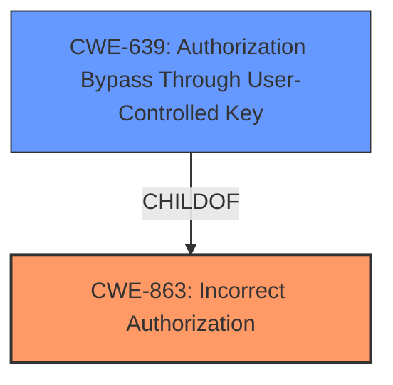

# Enhanced Analysis for CVE-2020-15126

# Summary
| CWE ID | CWE Name | Confidence | CWE Abstraction Level | CWE Vulnerability Mapping Label | CWE-Vulnerability Mapping Notes |
|---|---|---|---|---|---|
| CWE-863 | Incorrect Authorization | 1.0 | Class | Allowed-with-Review | Primary CWE |
| CWE-639 | Authorization Bypass Through User-Controlled Key | 0.7 | Base | Allowed | Secondary Candidate |

## Evidence and Confidence

*   **Confidence Score:** 0.85
*   **Evidence Strength:** HIGH

## Relationship Analysis
The primary relationship is between CWE-863 (Incorrect Authorization) and CWE-639 (Authorization Bypass Through User-Controlled Key), where CWE-639 is a child of CWE-863. This indicates that CWE-639 is a more specific case of incorrect authorization.



## Vulnerability Chain
The vulnerability chain starts with an authenticated user using the GraphQL viewer query, leading to **incorrect authorization** and finally resulting in the bypass of read security on the User object and linked objects.

## Summary of Analysis
The initial analysis pointed towards **incorrect authorization** as the root cause. The vulnerability description states that an authenticated user could bypass read security checks. The "CVE Reference Links Content Summary" confirms this, highlighting **inadequate authorization** as the primary weakness.

The Retriever Results also support this, with CWE-863 (Incorrect Authorization) being the top-ranked CWE. While CWE-639 (Authorization Bypass Through User-Controlled Key) is also a strong candidate due to its description of modifying key values to access other user's data, the vulnerability description focuses on bypassing read security checks, making CWE-863 a more appropriate primary classification.

The relationship analysis reinforces this decision, as CWE-639 is a child of CWE-863, representing a specific type of authorization bypass. However, since the description does not specifically mention user-controlled keys, I'm hesitant to make this the primary classification.

Therefore, CWE-863 is the optimal level of specificity, as it directly addresses the **incorrect authorization** mechanism that allows the bypass.

Relevant CWE Information:

# Enhanced Context (25 CWEs)

## CWE-863: Incorrect Authorization
**Abstraction:** Class
**Status:** Incomplete

### Description
The product performs an authorization check when an actor attempts to access a resource or perform an action, but it does not correctly perform the check.

### Extended Description
Not provided

### Alternative Terms
AuthZ: "AuthZ" is typically used as an abbreviation of "authorization" within the web application security community. It is distinct from "AuthN" (or, sometimes, "AuthC") which is an abbreviation of "authentication." The use of "Auth" as an abbreviation is discouraged, since it could be used for either authentication or authorization.

### Relationships
ChildOf -> CWE-285
ChildOf -> CWE-284

### Mapping Guidance
**Usage:** Allowed-with-Review
**Rationale:** This CWE entry is a Class and might have Base-level children that would be more appropriate
**Comments:** Examine children of this entry to see if there is a better fit
**Reasons:**
- Abstraction

### Additional Notes
**[Terminology]**

Assuming a user with a given identity, authorization is the process of determining whether that user can access a given resource, based on the user's privileges and any permissions or other access-control specifications that apply to the resource.

### Observed Examples
- **CVE-2021-39155:** Chain: A microservice integration and management platform compares the hostname in the HTTP Host header in a case-sensitive way (CWE-178, CWE-1289), allowing bypass of the authorization policy (CWE-863) using a hostname with mixed case or other variations.
- **CVE-2019-15900:** Chain: sscanf() call is used to check if a username and group exists, but the return value of sscanf() call is not checked (CWE-252), causing an uninitialized variable to be checked (CWE-457), returning success to allow authorization bypass for executing a privileged (CWE-863).
- **CVE-2009-2213:** Gateway uses default "Allow" configuration for its authorization settings.

## CWE-639: Authorization Bypass Through User-Controlled Key
**Abstraction:** Base
**Status:** Incomplete

### Description
The system's authorization functionality does not prevent one user from gaining access to another user's data or record by modifying the key value identifying the data.

### Extended Description
Retrieval of a user record occurs in the system based on some key value that is under user control. The key would typically identify a user-related record stored in the system and would be used to lookup that record for presentation to the user. It is likely that an attacker would have to be an authenticated user in the system. However, the authorization process would not properly check the data access operation to ensure that the authenticated user performing the operation has sufficient entitlements to perform the requested data access, hence bypassing any other authorization checks present in the system.

For example, attackers can look at places where user specific data is retrieved (e.g. search screens) and determine whether the key for the item being looked up is controllable externally. The key may be a hidden field in the HTML form field, might be passed as a URL parameter or as an unencrypted cookie variable, then in each of these cases it will be possible to tamper with the key value.

One manifestation of this weakness is when a system uses sequential or otherwise easily-guessable session IDs that would allow one user to easily switch to another user's session and read/modify their data.

### Alternative Terms
Insecure Direct Object Reference / IDOR: The "Insecure Direct Object Reference" term, as described in the OWASP Top Ten, is broader than this CWE because it also covers path traversal (CWE-22). Within the context of vulnerability theory, there is a similarity between the OWASP concept and CWE-706: Use of Incorrectly-Resolved Name or Reference.
Broken Object Level Authorization / BOLA: BOLA is used in the 2019 OWASP API Security Top 10 and is said to be the same as IDOR.
Horizontal Authorization: "Horizontal Authorization" is used to describe situations in which two users have the same privilege level, but must be prevented from accessing each other's resources. This is fairly common when using key-based access to resources in a multi-user context.

### Relationships
ChildOf -> CWE-863
ChildOf -> CWE-863
ChildOf -> CWE-284

### Mapping Guidance
**Usage:** Allowed
**Rationale:** This CWE entry is at the Base level of abstraction, which is a preferred level of abstraction for mapping to the root causes of vulnerabilities.
**Comments:** Carefully read both the name and description to ensure that this mapping is an appropriate fit. Do not try to 'force' a mapping to a lower-level Base/Variant simply to comply with this preferred level of abstraction.
**Reasons:**
- Acceptable-Use

### Observed Examples
- **CVE-2021-36539:** An educational application does not appropriately restrict file IDs to a particular user. The attacker can brute-force guess IDs, indicating IDOR.

## Other CWEs Considered
- CWE-502 (Deserialization of Untrusted Data), CWE-798 (Use of Hard-coded Credentials), CWE-202 (Exposure of Sensitive Information Through Data Queries), CWE-471 (Modification of Assumed-Immutable Data (MAID)), CWE-1004 (Sensitive Cookie Without 'HttpOnly' Flag), CWE-835 (Loop with Unreachable Exit Condition ('Infinite Loop')), CWE-306 (Missing Authentication for Critical Function): These were considered but deemed less relevant as they do not directly address the **incorrect authorization** issue.


## CWE Relationship Analysis

Current CWEs represent these abstraction levels: .


### Vulnerability Chain Analysis

**Chain starting from CWE-502:**
- 502 (Deserialization of Untrusted Data) - ROOT


**Chain starting from CWE-306:**
- 306 (Missing Authentication for Critical Function) - ROOT


### CWE Relationship Diagram

```mermaid
graph TD
    classDef primary fill:#f96,stroke:#333,stroke-width:2px
    classDef secondary fill:#69f,stroke:#333
    classDef tertiary fill:#9e9,stroke:#333
```