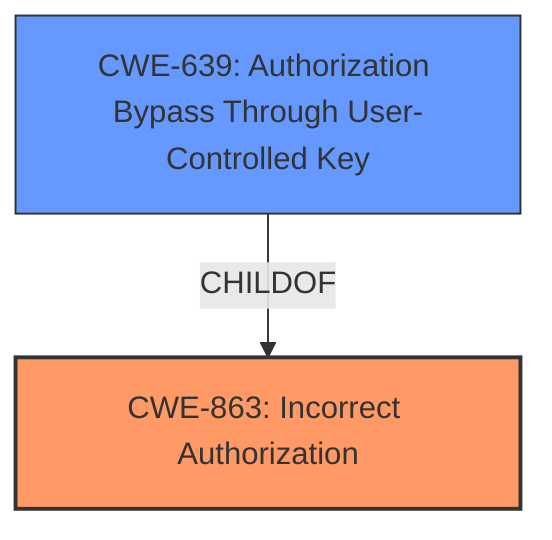

# Analysis for CVE-2020-15126

# Summary
| CWE ID | CWE Name | Confidence | CWE Abstraction Level | CWE Vulnerability Mapping Label | CWE-Vulnerability Mapping Notes |
|---|---|---|---|---|---|
| CWE-863 | Incorrect Authorization | 1.0 | Class | Allowed-with-Review | Primary CWE |
| CWE-639 | Authorization Bypass Through User-Controlled Key | 0.7 | Base | Allowed | Secondary Candidate |

## Evidence and Confidence

*   **Confidence Score:** 0.85
*   **Evidence Strength:** HIGH

## Relationship Analysis
The primary relationship is between CWE-863 (Incorrect Authorization) and CWE-639 (Authorization Bypass Through User-Controlled Key), where CWE-639 is a child of CWE-863. This indicates that CWE-639 is a more specific case of incorrect authorization.

## Vulnerability Chain
The vulnerability chain starts with an authenticated user using the GraphQL viewer query, leading to **incorrect authorization** and finally resulting in the bypass of read security on the User object and linked objects.

## Summary of Analysis
The initial analysis pointed towards **incorrect authorization** as the root cause. The vulnerability description states that an authenticated user could bypass read security checks. The "CVE Reference Links Content Summary" confirms this, highlighting **inadequate authorization** as the primary weakness.

The Retriever Results also support this, with CWE-863 (Incorrect Authorization) being the top-ranked CWE. While CWE-639 (Authorization Bypass Through User-Controlled Key) is also a strong candidate due to its description of modifying key values to access other user's data, the vulnerability description focuses on bypassing read security checks, making CWE-863 a more appropriate primary classification.

The relationship analysis reinforces this decision, as CWE-639 is a child of CWE-863, representing a specific type of authorization bypass. However, since the description does not specifically mention user-controlled keys, I'm hesitant to make this the primary classification.

Therefore, CWE-863 is the optimal level of specificity, as it directly addresses the **incorrect authorization** mechanism that allows the bypass.

Relevant CWE Information:

# Enhanced Context (25 CWEs)

## CWE-863: Incorrect Authorization
**Abstraction:** Class
**Status:** Incomplete

### Description
The product performs an authorization check when an actor attempts to access a resource or perform an action, but it does not correctly perform the check.

### Extended Description
Not provided

### Alternative Terms
AuthZ: "AuthZ" is typically used as an abbreviation of "authorization" within the web application security community. It is distinct from "AuthN" (or, sometimes, "AuthC") which is an abbreviation of "authentication." The use of "Auth" as an abbreviation is discouraged, since it could be used for either authentication or authorization.

### Relationships
ChildOf -> CWE-285
ChildOf -> CWE-284

### Mapping Guidance
**Usage:** Allowed-with-Review
**Rationale:** This CWE entry is a Class and might have Base-level children that would be more appropriate
**Comments:** Examine children of this entry to see if there is a better fit
**Reasons:**
- Abstraction

### Additional Notes
**[Terminology]**

Assuming a user with a given identity, authorization is the process of determining whether that user can access a given resource, based on the user's privileges and any permissions or other access-control specifications that apply to the resource.

### Observed Examples
- **CVE-2021-39155:** Chain: A microservice integration and management platform compares the hostname in the HTTP Host header in a case-sensitive way (CWE-178, CWE-1289), allowing bypass of the authorization policy (CWE-863) using a hostname with mixed case or other variations.
- **CVE-2019-15900:** Chain: sscanf() call is used to check if a username and group exists, but the return value of sscanf() call is not checked (CWE-252), causing an uninitialized variable to be checked (CWE-457), returning success to allow authorization bypass for executing a privileged (CWE-863).
- **CVE-2009-2213:** Gateway uses default "Allow" configuration for its authorization settings.

## CWE-639: Authorization Bypass Through User-Controlled Key
**Abstraction:** Base
**Status:** Incomplete

### Description
The system's authorization functionality does not prevent one user from gaining access to another user's data or record by modifying the key value identifying the data.

### Extended Description
Retrieval of a user record occurs in the system based on some key value that is under user control. The key would typically identify a user-related record stored in the system and would be used to lookup that record for presentation to the user. It is likely that an attacker would have to be an authenticated user in the system. However, the authorization process would not properly check the data access operation to ensure that the authenticated user performing the operation has sufficient entitlements to perform the requested data access, hence bypassing any other authorization checks present in the system.

For example, attackers can look at places where user specific data is retrieved (e.g. search screens) and determine whether the key for the item being looked up is controllable externally. The key may be a hidden field in the HTML form field, might be passed as a URL parameter or as an unencrypted cookie variable, then in each of these cases it will be possible to tamper with the key value.

One manifestation of this weakness is when a system uses sequential or otherwise easily-guessable session IDs that would allow one user to easily switch to another user's session and read/modify their data.

### Alternative Terms
Insecure Direct Object Reference / IDOR: The "Insecure Direct Object Reference" term, as described in the OWASP Top Ten, is broader than this CWE because it also covers path traversal (CWE-22). Within the context of vulnerability theory, there is a similarity between the OWASP concept and CWE-706: Use of Incorrectly-Resolved Name or Reference.
Broken Object Level Authorization / BOLA: BOLA is used in the 2019 OWASP API Security Top 10 and is said to be the same as IDOR.
Horizontal Authorization: "Horizontal Authorization" is used to describe situations in which two users have the same privilege level, but must be prevented from accessing each other's resources. This is fairly common when using key-based access to resources in a multi-user context.

### Relationships
ChildOf -> CWE-863
ChildOf -> CWE-863
ChildOf -> CWE-284

### Mapping Guidance
**Usage:** Allowed
**Rationale:** This CWE entry is at the Base level of abstraction, which is a preferred level of abstraction for mapping to the root causes of vulnerabilities.
**Comments:** Carefully read both the name and description to ensure that this mapping is an appropriate fit. Do not try to 'force' a mapping to a lower-level Base/Variant simply to comply with this preferred level of abstraction.
**Reasons:**
- Acceptable-Use

### Observed Examples
- **CVE-2021-36539:** An educational application does not appropriately restrict file IDs to a particular user. The attacker can brute-force guess IDs, indicating IDOR.

## Other CWEs Considered
- CWE-502 (Deserialization of Untrusted Data), CWE-798 (Use of Hard-coded Credentials), CWE-202 (Exposure of Sensitive Information Through Data Queries), CWE-471 (Modification of Assumed-Immutable Data (MAID)), CWE-1004 (Sensitive Cookie Without 'HttpOnly' Flag), CWE-835 (Loop with Unreachable Exit Condition ('Infinite Loop')), CWE-306 (Missing Authentication for Critical Function): These were considered but deemed less relevant as they do not directly address the **incorrect authorization** issue.

# Enhanced Query for CVE-2020-15126

## Vulnerability Description
In parser-server from version 3.5.0 and before 4.3.0, an authenticated user using the viewer GraphQL query can by pass all read security on his User object and can also by pass all objects linked via relation or Pointer on his User object.

### Vulnerability Description Key Phrases
- **impact:** bypass all read security on User object and linked objects
- **vector:** authenticated user using viewer GraphQL query
- **product:** parser-server
- **version:** 3.5.0 to 4.3.0

## CVE Reference Links Content Summary
Based on the provided content, here's the breakdown of CVE-2020-15126:

**Root Cause of Vulnerability:**

The vulnerability lies within the GraphQL viewer query in parse-server. An authenticated user could bypass read security checks on their User object and all related objects linked via relations or pointers. This indicates a flaw in how the GraphQL query handles authorization and data access control.

**Weaknesses/Vulnerabilities Present:**

*   **Inadequate Authorization:** The primary weakness is that the GraphQL viewer query does not correctly enforce read permissions. It allows access to user data and related data regardless of defined access control lists (ACLs).
*   **Data Exposure:** This vulnerability allows a user to potentially access sensitive information beyond what they are authorized to view.

**Impact of Exploitation:**

*   **Data Breach:** An attacker (authenticated user) can read data they are not intended to access, potentially including personal or sensitive information of other users, or data related to them.
*   **Bypass of Access Control:** The vulnerability allows bypassing the intended data access restrictions.
*   **Information Disclosure**: The attacker can potentially gain more information about system structure or data schemas through unauthorized access.

**Attack Vectors:**

*   The vulnerability is triggered using the GraphQL viewer query.
*   The attack vector is over the network by crafting specific GraphQL requests.

**Required Attacker Capabilities/Position:**

*   The attacker must be an authenticated user of the parse-server application.
*   The attacker needs to have knowledge of how to use the GraphQL API.

**Additional Details:**

*   The vulnerability affects parse-server versions 3.5.0 and later, prior to the fix in version 4.3.0.
*   The fix is linked to [commit 78239ac](https://github.com/parse-community/parse-server/commit/78239ac9071167fdf243c55ae4bc9a2c0b0d89aa).
*   The vulnerability is considered "High" severity.
*   The commit fixes the breach by updating `usersMutations.js` and `usersQueries.js`, likely adding the correct authorization checks for data access.

This information provides a comprehensive understanding of the vulnerability, its exploitation, and its remediation, aligning with the details available from the provided GitHub content.

## Retriever Results

### Top Combined Results

| Rank | CWE ID | Name | Abstraction | Usage  | Retrievers | Individual Scores |
|------|--------|------|-------------|-------|------------|-------------------|
| 1 | 863 | Incorrect Authorization | Class | Allowed-with-Review | sparse | 0.081 |
| 2 | 639 | Authorization Bypass Through User-Controlled Key | Base | Allowed | sparse | 0.074 |
| 3 | 1321 | Improperly Controlled Modification of Object Prototype Attributes ('Prototype Pollution') | Variant | Allowed | sparse | 0.074 |
| 4 | 502 | Deserialization of Untrusted Data | Base | Allowed | sparse | 0.073 |
| 5 | 798 | Use of Hard-coded Credentials | Base | Allowed | sparse | 0.073 |
| 6 | 202 | Exposure of Sensitive Information Through Data Queries | Base | Allowed | dense | 0.356 |
| 7 | 471 | Modification of Assumed-Immutable Data (MAID) | Base | Allowed | graph | 0.002 |
| 8 | 1004 | Sensitive Cookie Without 'HttpOnly' Flag | Variant | Allowed | sparse | 0.073 |
| 9 | 835 | Loop with Unreachable Exit Condition ('Infinite Loop') | Base | Allowed | sparse | 0.072 |
| 10 | 306 | Missing Authentication for Critical Function | Base | Allowed | sparse | 0.072 |

# Complete CWE Specifications

## CWE-863: Incorrect Authorization
**Abstraction:** Class
**Status:** Incomplete

### Description
The product performs an authorization check when an actor attempts to access a resource or perform an action, but it does not correctly perform the check.

### Extended Description
Not provided

### Alternative Terms
AuthZ: "AuthZ" is typically used as an abbreviation of "authorization" within the web application security community. It is distinct from "AuthN" (or, sometimes, "AuthC") which is an abbreviation of "authentication." The use of "Auth" as an abbreviation is discouraged, since it could be used for either authentication or authorization.

### Relationships
ChildOf -> CWE-285
ChildOf -> CWE-284

### Mapping Guidance
**Usage:** Allowed-with-Review
**Rationale:** This CWE entry is a Class and might have Base-level children that would be more appropriate
**Comments:** Examine children of this entry to see if there is a better fit
**Reasons:**
- Abstraction

### Additional Notes
**[Terminology]** 

Assuming a user with a given identity, authorization is the process of determining whether that user can access a given resource, based on the user's privileges and any permissions or other access-control specifications that apply to the resource.

### Observed Examples
- **CVE-2021-39155:** Chain: A microservice integration and management platform compares the hostname in the HTTP Host header in a case-sensitive way (CWE-178, CWE-1289), allowing bypass of the authorization policy (CWE-863) using a hostname with mixed case or other variations.
- **CVE-2019-15900:** Chain: sscanf() call is used to check if a username and group exists, but the return value of sscanf() call is not checked (CWE-252), causing an uninitialized variable to be checked (CWE-457), returning success to allow authorization bypass for executing a privileged (CWE-863).
- **CVE-2009-2213:** Gateway uses default "Allow" configuration for its authorization settings.

## CWE-639: Authorization Bypass Through User-Controlled Key
**Abstraction:** Base
**Status:** Incomplete

### Description
The system's authorization functionality does not prevent one user from gaining access to another user's data or record by modifying the key value identifying the data.

### Extended Description

Retrieval of a user record occurs in the system based on some key value that is under user control. The key would typically identify a user-related record stored in the system and would be used to lookup that record for presentation to the user. It is likely that an attacker would have to be an authenticated user in the system. However, the authorization process would not properly check the data access operation to ensure that the authenticated user performing the operation has sufficient entitlements to perform the requested data access, hence bypassing any other authorization checks present in the system.

For example, attackers can look at places where user specific data is retrieved (e.g. search screens) and determine whether the key for the item being looked up is controllable externally. The key may be a hidden field in the HTML form field, might be passed as a URL parameter or as an unencrypted cookie variable, then in each of these cases it will be possible to tamper with the key value.

One manifestation of this weakness is when a system uses sequential or otherwise easily-guessable session IDs that would allow one user to easily switch to another user's session and read/modify their data.

### Alternative Terms
Insecure Direct Object Reference / IDOR: The "Insecure Direct Object Reference" term, as described in the OWASP Top Ten, is broader than this CWE because it also covers path traversal (CWE-22). Within the context of vulnerability theory, there is a similarity between the OWASP concept and CWE-706: Use of Incorrectly-Resolved Name or Reference.
Broken Object Level Authorization / BOLA: BOLA is used in the 2019 OWASP API Security Top 10 and is said to be the same as IDOR.
Horizontal Authorization: "Horizontal Authorization" is used to describe situations in which two users have the same privilege level, but must be prevented from accessing each other's resources. This is fairly common when using key-based access to resources in a multi-user context.

### Relationships
ChildOf -> CWE-863
ChildOf -> CWE-863
ChildOf -> CWE-284

### Mapping Guidance
**Usage:** Allowed
**Rationale:** This CWE entry is at the Base level of abstraction, which is a preferred level of abstraction for mapping to the root causes of vulnerabilities.
**Comments:** Carefully read both the name and description to ensure that this mapping is an appropriate fit. Do not try to 'force' a mapping to a lower-level Base/Variant simply to comply with this preferred level of abstraction.
**Reasons:**
- Acceptable-Use

### Observed Examples
- **CVE-2021-36539:** An educational application does not appropriately restrict file IDs to a particular user. The attacker can brute-force guess IDs, indicating IDOR.

## CWE-1321: Improperly Controlled Modification of Object Prototype Attributes ('Prototype Pollution')
**Abstraction:** Variant
**Status:** Incomplete

### Description
The product receives input from an upstream component that specifies attributes that are to be initialized or updated in an object, but it does not properly control modifications of attributes of the object prototype.

### Extended Description

By adding or modifying attributes of an object prototype, it is possible to create attributes that exist on every object, or replace critical attributes with malicious ones. This can be problematic if the product depends on existence or non-existence of certain attributes, or uses pre-defined attributes of object prototype (such as hasOwnProperty, toString or valueOf).

This weakness is usually exploited by using a special attribute of objects called proto, constructor or prototype. Such attributes give access to the object prototype. This weakness is often found in code that assigns object attributes based on user input, or merges or clones objects recursively.

### Alternative Terms
None

### Relationships
ChildOf -> CWE-915
ChildOf -> CWE-913
CanPrecede -> CWE-471

### Mapping Guidance
**Usage:** Allowed
**Rationale:** This CWE entry is at the Variant level of abstraction, which is a preferred level of abstraction for mapping to the root causes of vulnerabilities.
**Comments:** Carefully read both the name and description to ensure that this mapping is an appropriate fit. Do not try to 'force' a mapping to a lower-level Base/Variant simply to comply with this preferred level of abstraction.
**Reasons:**
- Acceptable-Use

### Observed Examples
- **CVE-2018-3721:** Prototype pollution by merging objects.
- **CVE-2019-10744:** Prototype pollution by setting default values to object attributes recursively.
- **CVE-2019-11358:** Prototype pollution by merging objects recursively.

## CWE-502: Deserialization of Untrusted Data
**Abstraction:** Base
**Status:** Draft

### Description
The product deserializes untrusted data without sufficiently ensuring that the resulting data will be valid.

### Extended Description
Not provided

### Alternative Terms
Marshaling, Unmarshaling: Marshaling and unmarshaling are effectively synonyms for serialization and deserialization, respectively.
Pickling, Unpickling: In Python, the "pickle" functionality is used to perform serialization and deserialization.
PHP Object Injection: Some PHP application researchers use this term when attacking unsafe use of the unserialize() function; but it is also used for CWE-915.

### Relationships
ChildOf -> CWE-913
ChildOf -> CWE-913
PeerOf -> CWE-915

### Mapping Guidance
**Usage:** Allowed
**Rationale:** This CWE entry is at the Base level of abstraction, which is a preferred level of abstraction for mapping to the root causes of vulnerabilities.
**Comments:** Carefully read both the name and description to ensure that this mapping is an appropriate fit. Do not try to 'force' a mapping to a lower-level Base/Variant simply to comply with this preferred level of abstraction.
**Reasons:**
- Acceptable-Use

### Additional Notes
**[Maintenance]** The relationships between CWE-502 and CWE-915 need further exploration. CWE-915 is more narrowly scoped to object modification, and is not necessarily used for deserialization.

### Observed Examples
- **CVE-2019-12799:** chain: bypass of untrusted deserialization issue (CWE-502) by using an assumed-trusted class (CWE-183)
- **CVE-2015-8103:** Deserialization issue in commonly-used Java library allows remote execution.
- **CVE-2015-4852:** Deserialization issue in commonly-used Java library allows remote execution.

## CWE-798: Use of Hard-coded Credentials
**Abstraction:** Base
**Status:** Draft

### Description
The product contains hard-coded credentials, such as a password or cryptographic key.

### Extended Description

There are two main variations:

  - Inbound: the product contains an authentication mechanism that checks the input credentials against a hard-coded set of credentials. In this variant, a default administration account is created, and a simple password is hard-coded into the product and associated with that account. This hard-coded password is the same for each installation of the product, and it usually cannot be changed or disabled by system administrators without manually modifying the program, or otherwise patching the product. It can also be difficult for the administrator to detect.

  - Outbound: the product connects to another system or component, and it contains hard-coded credentials for connecting to that component. This variant applies to front-end systems that authenticate with a back-end service. The back-end service may require a fixed password that can be easily discovered. The programmer may simply hard-code those back-end credentials into the front-end product.

### Alternative Terms
None

### Relationships
ChildOf -> CWE-1391
ChildOf -> CWE-287
ChildOf -> CWE-344
ChildOf -> CWE-671
PeerOf -> CWE-257

### Mapping Guidance
**Usage:** Allowed
**Rationale:** This CWE entry is at the Base level of abstraction, which is a preferred level of abstraction for mapping to the root causes of vulnerabilities.
**Comments:** Carefully read both the name and description to ensure that this mapping is an appropriate fit. Do not try to 'force' a mapping to a lower-level Base/Variant simply to comply with this preferred level of abstraction.
**Reasons:**
- Acceptable-Use

### Additional Notes
**[Maintenance]** The Taxonomy_Mappings to ISA/IEC 62443 were added in CWE 4.10, but they are still under review and might change in future CWE versions. These draft mappings were performed by members of the "Mapping CWE to 62443" subgroup of the CWE-CAPEC ICS/OT Special Interest Group (SIG), and their work is incomplete as of CWE 4.10. The mappings are included to facilitate discussion and review by the broader ICS/OT community, and they are likely to change in future CWE versions.

### Observed Examples
- **CVE-2022-29953:** Condition Monitor firmware has a maintenance interface with hard-coded credentials
- **CVE-2022-29960:** Engineering Workstation uses hard-coded cryptographic keys that could allow for unathorized filesystem access and privilege escalation
- **CVE-2022-29964:** Distributed Control System (DCS) has hard-coded passwords for local shell access

## CWE-202: Exposure of Sensitive Information Through Data Queries
**Abstraction:** Base
**Status:** Draft

### Description
When trying to keep information confidential, an attacker can often infer some of the information by using statistics.

### Extended Description
In situations where data should not be tied to individual users, but a large number of users should be able to make queries that "scrub" the identity of users, it may be possible to get information about a user -- e.g., by specifying search terms that are known to be unique to that user.

### Alternative Terms
None

### Relationships
ChildOf -> CWE-1230

### Mapping Guidance
**Usage:** Allowed
**Rationale:** This CWE entry is at the Base level of abstraction, which is a preferred level of abstraction for mapping to the root causes of vulnerabilities.
**Comments:** Carefully read both the name and description to ensure that this mapping is an appropriate fit. Do not try to 'force' a mapping to a lower-level Base/Variant simply to comply with this preferred level of abstraction.
**Reasons:**
- Acceptable-Use

### Additional Notes
**[Maintenance]** 

The relationship between CWE-202 and CWE-612 needs to be investigated more closely, as they may be different descriptions of the same kind of problem. CWE-202 is also being considered for deprecation, as it is not clearly described and may have been misunderstood by CWE users. It could be argued that this issue is better covered by CAPEC; an attacker can utilize their data-query privileges to perform this kind of operation, and if the attacker should not be allowed to perform the operation - or if the sensitive data should not have been made accessible at all - then that is more appropriately classified as a separate CWE related to authorization (see the parent, CWE-1230).

### Observed Examples
- **CVE-2022-41935:** Wiki product allows an adversary to discover filenames via a series of queries starting with one letter and then iteratively extending the match.

## CWE-471: Modification of Assumed-Immutable Data (MAID)
**Abstraction:** Base
**Status:** Draft

### Description
The product does not properly protect an assumed-immutable element from being modified by an attacker.

### Extended Description
This occurs when a particular input is critical enough to the functioning of the application that it should not be modifiable at all, but it is. Certain resources are often assumed to be immutable when they are not, such as hidden form fields in web applications, cookies, and reverse DNS lookups.

### Alternative Terms
None

### Relationships
ChildOf -> CWE-664

### Mapping Guidance
**Usage:** Allowed
**Rationale:** This CWE entry is at the Base level of abstraction, which is a preferred level of abstraction for mapping to the root causes of vulnerabilities.
**Comments:** Carefully read both the name and description to ensure that this mapping is an appropriate fit. Do not try to 'force' a mapping to a lower-level Base/Variant simply to comply with this preferred level of abstraction.
**Reasons:**
- Acceptable-Use

### Additional Notes
**[Relationship]** MAID issues can be primary to many other weaknesses, and they are a major factor in languages that provide easy access to internal program constructs, such as PHP's register_globals and similar features. However, MAID issues can also be resultant from weaknesses that modify internal state; for example, a program might validate some data and store it in memory, but a buffer overflow could overwrite that validated data, leading to a change in program logic.

**[Theoretical]** There are many examples where the MUTABILITY property is a major factor in a vulnerability.

### Observed Examples
- **CVE-2002-1757:** Relies on $PHP_SELF variable for authentication.
- **CVE-2005-1905:** Gain privileges by modifying assumed-immutable code addresses that are accessed by a driver.

## CWE-1004: Sensitive Cookie Without 'HttpOnly' Flag
**Abstraction:** Variant
**Status:** Incomplete

### Description
The product uses a cookie to store sensitive information, but the cookie is not marked with the HttpOnly flag.

### Extended Description
The HttpOnly flag directs compatible browsers to prevent client-side script from accessing cookies. Including the HttpOnly flag in the Set-Cookie HTTP response header helps mitigate the risk associated with Cross-Site Scripting (XSS) where an attacker's script code might attempt to read the contents of a cookie and exfiltrate information obtained. When set, browsers that support the flag will not reveal the contents of the cookie to a third party via client-side script executed via XSS.

### Alternative Terms
None

### Relationships
ChildOf -> CWE-732

### Mapping Guidance
**Usage:** Allowed
**Rationale:** This CWE entry is at the Variant level of abstraction, which is a preferred level of abstraction for mapping to the root causes of vulnerabilities.
**Comments:** Carefully read both the name and description to ensure that this mapping is an appropriate fit. Do not try to 'force' a mapping to a lower-level Base/Variant simply to comply with this preferred level of abstraction.
**Reasons:**
- Acceptable-Use

### Observed Examples
- **CVE-2022-24045:** Web application for a room automation system has client-side Javascript that sets a sensitive cookie without the HTTPOnly security attribute, allowing the cookie to be accessed.
- **CVE-2014-3852:** CMS written in Python does not include the HTTPOnly flag in a Set-Cookie header, allowing remote attackers to obtain potentially sensitive information via script access to this cookie.
- **CVE-2015-4138:** Appliance for managing encrypted communications does not use HttpOnly flag.

## CWE-835: Loop with Unreachable Exit Condition ('Infinite Loop')
**Abstraction:** Base
**Status:** Incomplete

### Description
The product contains an iteration or loop with an exit condition that cannot be reached, i.e., an infinite loop.

### Extended Description
Not provided

### Alternative Terms
None

### Relationships
ChildOf -> CWE-834
ChildOf -> CWE-834

### Mapping Guidance
**Usage:** Allowed
**Rationale:** This CWE entry is at the Base level of abstraction, which is a preferred level of abstraction for mapping to the root causes of vulnerabilities.
**Comments:** Carefully read both the name and description to ensure that this mapping is an appropriate fit. Do not try to 'force' a mapping to a lower-level Base/Variant simply to comply with this preferred level of abstraction.
**Reasons:**
- Acceptable-Use

### Observed Examples
- **CVE-2022-22224:** Chain: an operating system does not properly process malformed Open Shortest Path First (OSPF) Type/Length/Value Identifiers (TLV) (CWE-703), which can cause the process to enter an infinite loop (CWE-835)
- **CVE-2022-25304:** A Python machine communication platform did not account for receiving a malformed packet with a null size, causing the receiving function to never update the message buffer and be caught in an infinite loop.
- **CVE-2011-1027:** Chain: off-by-one error (CWE-193) leads to infinite loop (CWE-835) using invalid hex-encoded characters.

## CWE-306: Missing Authentication for Critical Function
**Abstraction:** Base
**Status:** Draft

### Description
The product does not perform any authentication for functionality that requires a provable user identity or consumes a significant amount of resources.

### Extended Description
Not provided

### Alternative Terms
None

### Relationships
ChildOf -> CWE-287
ChildOf -> CWE-287

### Mapping Guidance
**Usage:** Allowed
**Rationale:** This CWE entry is at the Base level of abstraction, which is a preferred level of abstraction for mapping to the root causes of vulnerabilities.
**Comments:** Carefully read both the name and description to ensure that this mapping is an appropriate fit. Do not try to 'force' a mapping to a lower-level Base/Variant simply to comply with this preferred level of abstraction.
**Reasons:**
- Acceptable-Use

### Observed Examples
- **CVE-2022-31260:** Chain: a digital asset management program has an undisclosed backdoor in the legacy version of a PHP script (CWE-912) that could allow an unauthenticated user to export metadata (CWE-306)
- **CVE-2022-29951:** TCP-based protocol in Programmable Logic Controller (PLC) has no authentication.
- **CVE-2022-29952:** Condition Monitor firmware uses a protocol that does not require authentication.

