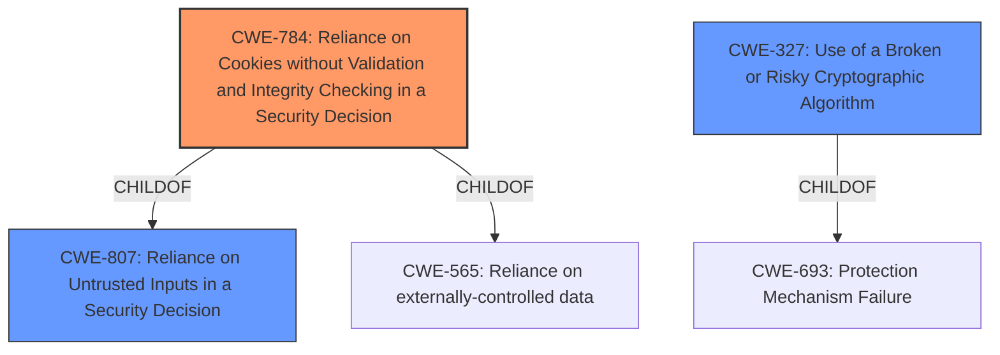

# Analysis for CVE-2020-15128

# Summary
| CWE ID    | CWE Name                                                            | Confidence | CWE Abstraction Level | CWE Vulnerability Mapping Label | CWE-Vulnerability Mapping Notes |
| --------- | ------------------------------------------------------------------- | ---------- | --------------------- | ------------------------------- | ----------------------------- |
| CWE-784   | Reliance on Cookies without Validation and Integrity Checking in a Security Decision| 0.90       | Variant               | Allowed                       | Primary CWE                    |
| CWE-327   | Use of a Broken or Risky Cryptographic Algorithm               | 0.70       | Class               | Allowed-with-Review                       | Secondary CWE                    |

## Evidence and Confidence

*   **Confidence Score:** 0.80
*   **Evidence Strength:** HIGH

## Relationship Analysis
The primary relationship that influenced my decision was the ChildOf relationship between CWE-784 and CWE-807 (Reliance on Untrusted Inputs in a Security Decision). CWE-784 is a more specific variant that deals with cookies, which fits the vulnerability description more accurately. The relationship of CWE-327 to CWE-693 (Protection Mechanism Failure) shows that it's a class of weakness, which makes it less specific than CWE-784.

## Vulnerability Chain
The vulnerability chain starts with the **lack of cookie name binding** in the encryption process. This leads to the possibility of **reusing encrypted values** across different cookies, if the attacker can control the initial cookie value. This ultimately results in potential **cookie value substitution** and **data exfiltration**, if other application vulnerabilities exist that expose the plaintext or allow user provided input to be stored in the cookies.

## Summary of Analysis
The analysis is primarily based on the vulnerability description and the CVE Reference Links Content Summary.

> The core issue is that encrypted cookie values were not cryptographically tied to the cookie name. This means that an attacker could potentially reuse encrypted cookie values across different cookies if they had the ability to control content in a cookie.

This statement from the CVE Reference Links Content Summary strongly supports the selection of CWE-784. The graph relationships helped to confirm that CWE-784 is a more specific and appropriate choice than its parent CWE-807.

CWE-784 is at the Variant level of abstraction, which is a preferred level. It is more specific than CWE-807, which deals with reliance on untrusted inputs in general. CWE-327 is a class and also less specific. Therefore, CWE-784 is the optimal level of specificity for this vulnerability.

Other CWEs Considered:

*   CWE-327: "Use of a Broken or Risky Cryptographic Algorithm" - While the vulnerability involves encryption, the primary issue isn't a broken algorithm itself, but rather how the encryption is applied (or not applied) in conjunction with cookie names. Therefore, this is a secondary concern.
*   CWE-312: "Cleartext Storage of Sensitive Information" - This CWE doesn't fit because the cookie values are encrypted, not stored in cleartext.
*   CWE-201: "Insertion of Sensitive Information Into Sent Data" - This is too general and does not capture the specific issue of cookie handling.

Relevant CWE Information:

# Enhanced Context (25 CWEs)
The following CWEs were identified as potentially relevant to this vulnerability:

## CWE-312: Cleartext Storage of Sensitive Information
**Abstraction Level**: Base
**Similarity Score**: 0.77
**Source**: dense

**Description**:
The product stores sensitive information in cleartext within a resource that might be accessible to another control sphere.

**Mapping Guidance**:
- Usage: Allowed
- Rationale: This CWE entry is at the Base level of abstraction, which is a preferred level of abstraction for mapping to the root causes of vulnerabilities.

## CWE-319: Cleartext Transmission of Sensitive Information
**Abstraction Level**: Base
**Similarity Score**: 0.77
**Source**: dense

**Description**:
The product transmits sensitive or security-critical data in cleartext in a communication channel that can be sniffed by unauthorized actors.

**Mapping Guidance**:
- Usage: Allowed
- Rationale: This CWE entry is at the Base level of abstraction, which is a preferred level of abstraction for mapping to the root causes of vulnerabilities.

## CWE-807: Reliance on Untrusted Inputs in a Security Decision
**Abstraction Level**: Base
**Similarity Score**: 0.77
**Source**: dense

**Description**:
The product uses a protection mechanism that relies on the existence or values of an input, but the input can be modified by an untrusted actor in a way that bypasses the protection mechanism.

**Mapping Guidance**:
- Usage: Allowed
- Rationale: This CWE entry is at the Base level of abstraction, which is a preferred level of abstraction for mapping to the root causes of vulnerabilities.

## CWE-226: Sensitive Information in Resource Not Removed Before Reuse
**Abstraction Level**: Base
**Similarity Score**: 0.76
**Source**: dense

**Description**:
The product releases a resource such as memory or a file so that it can be made available for reuse, but it does not clear or "zeroize" the information contained in the resource before the product performs a critical state transition or makes the resource available for reuse by other entities.

**Mapping Guidance**:
- Usage: Allowed
- Rationale: This CWE entry is at the Base level of abstraction, which is a preferred level of abstraction for mapping to the root causes of vulnerabilities.

## CWE-1391: Use of Weak Credentials
**Abstraction Level**: Class
**Similarity Score**: 0.76
**Source**: dense

**Description**:
The product uses weak credentials (such as a default key or hard-coded password) that can be calculated, derived, reused, or guessed by an attacker.

**Mapping Guidance**:
- Usage: Allowed-with-Review
- Rationale: This CWE entry is a Class and might have Base-level children that would be more appropriate

## CWE-614: Sensitive Cookie in HTTPS Session Without 'Secure' Attribute
**Abstraction Level**: Variant
**Similarity Score**: 0.76
**Source**: dense

**Description**:
The Secure attribute for sensitive cookies in HTTPS sessions is not set, which could cause the user agent to send those cookies in plaintext over an HTTP session.

**Mapping Guidance**:
- Usage: Allowed
- Rationale: This CWE entry is at the Variant level of abstraction, which is a preferred level of abstraction for mapping to the root causes of vulnerabilities.

## CWE-212: Improper Removal of Sensitive Information Before Storage or Transfer
**Abstraction Level**: Base
**Similarity Score**: 0.75
**Source**: dense

**Description**:
The product stores, transfers, or shares a resource that contains sensitive information, but it does not properly remove that information before the product makes the resource available to unauthorized actors.

**Mapping Guidance**:
- Usage: Allowed
- Rationale: This CWE entry is at the Base level of abstraction, which is a preferred level of abstraction for mapping to the root causes of vulnerabilities.

## CWE-303: Incorrect Implementation of Authentication Algorithm
**Abstraction Level**: Base
**Similarity Score**: 0.75
**Source**: dense

**Description**:
The requirements for the product dictate the use of an established authentication algorithm, but the implementation of the algorithm is incorrect.

**Mapping Guidance**:
- Usage: Allowed
- Rationale: This CWE entry is at the Base level of abstraction, which is a preferred level of abstraction for mapping to the root causes of vulnerabilities.

## CWE-1390: Weak Authentication
**Abstraction Level**: Class
**Similarity Score**: 0.75
**Source**: dense

**Description**:
The product uses an authentication mechanism to restrict access to specific users or identities, but the mechanism does not sufficiently prove that the claimed identity is correct.

**Mapping Guidance**:
- Usage: Allowed-with-Review
- Rationale: This CWE entry is a Class and might have Base-level children that would be more appropriate

## CWE-1240: Use of a Cryptographic Primitive with a Risky Implementation
**Abstraction Level**: Base
**Similarity Score**: 0.75
**Source**: dense

**