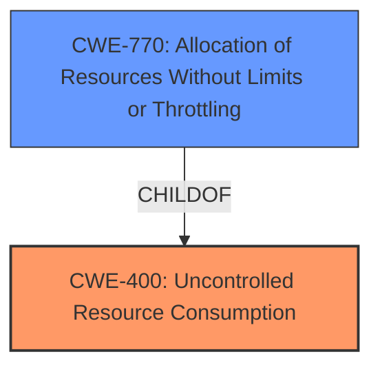

# Analysis for CVE-2020-15166

# Summary
| CWE ID | CWE Name | Confidence | CWE Abstraction Level | CWE Vulnerability Mapping Label | CWE-Vulnerability Mapping Notes |
|---|---|---|---|---|---|
| CWE-400 | Uncontrolled Resource Consumption | 0.8 | Class | Primary | Allowed-with-Review |
| CWE-770 | Allocation of Resources Without Limits or Throttling | 0.7 | Base | Secondary | Allowed |

## Evidence and Confidence

*   **Confidence Score:** 0.75
*   **Evidence Strength:** MEDIUM

## Relationship Analysis
The primary relationship that influenced the decision was the ChildOf relationship between CWE-770 and CWE-400. While CWE-400 is a broader class, the vulnerability specifically involves allocating resources without limits. This makes CWE-770 a more specific and appropriate choice. Other considered CWEs like CWE-295, CWE-306, and CWE-863 were ruled out because they focus on authentication, authorization, and certificate validation, which are not the core issues in this vulnerability.

## Vulnerability Chain
The vulnerability chain starts with the **improper handshake handling** in ZeroMQ, where connections are established prematurely. This leads to **resource consumption** as the server attempts to manage connections that will never properly complete. Finally, this **uncontrolled resource consumption** results in a denial-of-service condition.

## Summary of Analysis
The initial analysis focused on identifying the root cause of the denial-of-service vulnerability in ZeroMQ. The **Vulnerability Description** and **CVE Reference Links Content Summary** clearly point to an issue related to **resource consumption** due to **improper handshake handling**.

The Retriever Results highlighted several potential CWEs, including CWE-400, CWE-770, CWE-295, CWE-306 and CWE-863. After careful consideration, CWE-400 (Uncontrolled Resource Consumption) was selected as the primary CWE because the core issue is that the system does not properly control the allocation and maintenance of resources, allowing an attacker to exhaust them. From the CVE Reference Links Content Summary: "Although not explicitly detailed, the DoS could be caused by resource exhaustion when a malicious peer connects and sends messages without proper authentication, preventing legitimate users from utilizing the system."

CWE-770 (Allocation of Resources Without Limits or Throttling) was considered as a supporting CWE since the vulnerability involves allocating resources (connections) without properly limiting or throttling them.

CWE-295 (Improper Certificate Validation), CWE-306 (Missing Authentication for Critical Function), and CWE-863 (Incorrect Authorization) were ruled out because the vulnerability is not primarily related to certificate validation or authentication/authorization mechanisms. While the presence of CURVE/ZAP suggests security measures are in place, the core flaw lies in the **improper handling** of connections before the handshake is complete, leading to **resource exhaustion**.

The selected CWEs are at the optimal level of specificity because they accurately represent the root cause and the resulting impact of the vulnerability. CWE-400 captures the overall **uncontrolled resource consumption**, while CWE-770 specifies the **allocation of resources without limits**, contributing to the denial-of-service condition.

Relevant CWE Information:

# Enhanced Context (25 CWEs)
The following CWEs were identified as potentially relevant to this vulnerability:

## CWE-226: Sensitive Information in Resource Not Removed Before Reuse
**Abstraction Level**: Base
**Similarity Score**: 0.80
**Source**: dense

**Description**:
The product releases a resource such as memory or a file so that it can be made available for reuse, but it does not clear or "zeroize" the information contained in the resource before the product performs a critical state transition or makes the resource available for reuse by other entities.

**Mapping Guidance**:
- Usage: Allowed
- Rationale: This CWE entry is at the Base level of abstraction, which is a preferred level of abstraction for mapping to the root causes of vulnerabilities.

## CWE-404: Improper Resource Shutdown or Release
**Abstraction Level**: Class
**Similarity Score**: 0.79
**Source**: dense

**Description**:
The product does not release or incorrectly releases a resource before it is made available for re-use.

**Mapping Guidance**:
- Usage: Allowed-with-Review
- Rationale: This CWE entry is a Class and might have Base-level children that would be more appropriate

## CWE-789: Memory Allocation with Excessive Size Value
**Abstraction Level**: Variant
**Similarity Score**: 0.77
**Source**: dense

**Description**:
The product allocates memory based on an untrusted, large size value, but it does not ensure that the size is within expected limits, allowing arbitrary amounts of memory to be allocated.

**Mapping Guidance**:
- Usage: Allowed
- Rationale: This CWE entry is at the Variant level of abstraction, which is a preferred level of abstraction for mapping to the root causes of vulnerabilities.

## CWE-772: Missing Release of Resource after Effective Lifetime
**Abstraction Level**: Base
**Similarity Score**: 0.76
**Source**: dense

**Description**:
The product does not release a resource after its effective lifetime has ended, i.e., after the resource is no longer needed.

**Mapping Guidance**:
- Usage: Allowed
- Rationale: This CWE entry is at the Base level of abstraction, which is a preferred level of abstraction for mapping to the root causes of vulnerabilities.

## CWE-664: Improper Control of a Resource Through its Lifetime
**Abstraction Level**: Pillar
**Similarity Score**: 0.76
**Source**: dense

**Description**:
The product does not maintain or incorrectly maintains control over a resource throughout its lifetime of creation, use, and release.

**Mapping Guidance**:
- Usage: Discouraged
- Rationale: This CWE entry is high-level when lower-level children are available.

## CWE-405: Asymmetric Resource Consumption (Amplification)
**Abstraction Level**: Class
**Similarity Score**: 0.76
**Source**: dense

**Description**:
The product does not properly control situations in which an adversary can cause the product to consume or produce excessive resources without requiring the adversary to invest equivalent work or otherwise prove authorization, i.e., the adversary's influence is "asymmetric."

**Mapping Guidance**:
- Usage: Allowed-with-Review
- Rationale: This CWE entry is a Class and might have Base-level children that would be more appropriate

## CWE-667: Improper Locking
**Abstraction Level**: Class
**Similarity Score**: 0.75
**Source**: dense

**Description**:
The product does not properly acquire or release a lock on a resource, leading to unexpected resource state changes and behaviors.

**Mapping Guidance**:
- Usage: Allowed-with-Review
- Rationale: This CWE entry is a Class and might have Base-level children that would be more appropriate

## CWE-401: Missing Release of Memory after Effective Lifetime
**Abstraction Level**: Variant
**Similarity Score**: 0.75
**Source**: dense

**Description**:
The product does not sufficiently track and release allocated memory after it has been used, which slowly consumes remaining memory.

**Mapping Guidance**:
- Usage: Allowed
- Rationale: This CWE entry is at the Variant level of abstraction, which is a preferred level of abstraction for mapping to the root causes of vulnerabilities.

## CWE-212: Improper Removal of Sensitive Information Before Storage or Transfer
**Abstraction Level**: Base
**Similarity Score**: 0.75
**Source**: dense

**Description**:
The product stores, transfers, or shares a resource that contains sensitive information, but it does not properly remove that information before the product makes the resource available to unauthorized actors.

**Mapping Guidance**:
- Usage: Allowed
- Rationale: This CWE entry is at the Base level of abstraction, which is a preferred level of abstraction for mapping to the root causes of vulnerabilities.

## CWE-668: Exposure of Resource to Wrong Sphere
**Abstraction Level**: Class
**Similarity Score**: 0.75
**Source**: dense

**Description**:
The product exposes a resource to the wrong control sphere, providing unintended actors with inappropriate access to the resource.

**Mapping Guidance**:
- Usage: Discouraged
- Rationale: CWE-668 is high-level and is often misused as a catch-all when lower-level CWE IDs might be applicable. It is sometimes used for low-information vulnerability reports [REF-1287]. It is a level-1 Class (i.e., a child of a Pillar). It is not useful for trend analysis.

## CWE-770: Allocation of Resources Without Limits or Throttling
**Abstraction Level**: Base
**Similarity Score