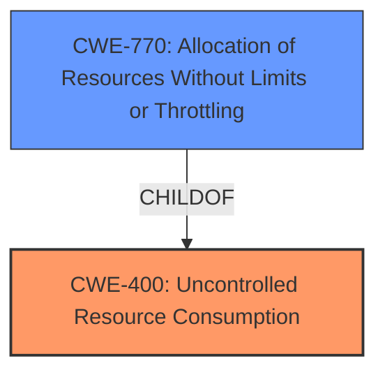

# Analysis for CVE-2020-15166

# Summary
| CWE ID | CWE Name | Confidence | CWE Abstraction Level | CWE Vulnerability Mapping Label | CWE-Vulnerability Mapping Notes |
|---|---|---|---|---|---|
| CWE-400 | Uncontrolled Resource Consumption | 0.8 | Class | Primary | Allowed-with-Review |
| CWE-770 | Allocation of Resources Without Limits or Throttling | 0.7 | Base | Secondary | Allowed |

## Evidence and Confidence

*   **Confidence Score:** 0.75
*   **Evidence Strength:** MEDIUM

## Relationship Analysis
The primary relationship that influenced the decision was the ChildOf relationship between CWE-770 and CWE-400. While CWE-400 is a broader class, the vulnerability specifically involves allocating resources without limits. This makes CWE-770 a more specific and appropriate choice. Other considered CWEs like CWE-295, CWE-306, and CWE-863 were ruled out because they focus on authentication, authorization, and certificate validation, which are not the core issues in this vulnerability.

## Vulnerability Chain
The vulnerability chain starts with the **improper handshake handling** in ZeroMQ, where connections are established prematurely. This leads to **resource consumption** as the server attempts to manage connections that will never properly complete. Finally, this **uncontrolled resource consumption** results in a denial-of-service condition.

## Summary of Analysis
The initial analysis focused on identifying the root cause of the denial-of-service vulnerability in ZeroMQ. The **Vulnerability Description** and **CVE Reference Links Content Summary** clearly point to an issue related to **resource consumption** due to **improper handshake handling**.

The Retriever Results highlighted several potential CWEs, including CWE-400, CWE-770, CWE-295, CWE-306 and CWE-863. After careful consideration, CWE-400 (Uncontrolled Resource Consumption) was selected as the primary CWE because the core issue is that the system does not properly control the allocation and maintenance of resources, allowing an attacker to exhaust them. From the CVE Reference Links Content Summary: "Although not explicitly detailed, the DoS could be caused by resource exhaustion when a malicious peer connects and sends messages without proper authentication, preventing legitimate users from utilizing the system."

CWE-770 (Allocation of Resources Without Limits or Throttling) was considered as a supporting CWE since the vulnerability involves allocating resources (connections) without properly limiting or throttling them.

CWE-295 (Improper Certificate Validation), CWE-306 (Missing Authentication for Critical Function), and CWE-863 (Incorrect Authorization) were ruled out because the vulnerability is not primarily related to certificate validation or authentication/authorization mechanisms. While the presence of CURVE/ZAP suggests security measures are in place, the core flaw lies in the **improper handling** of connections before the handshake is complete, leading to **resource exhaustion**.

The selected CWEs are at the optimal level of specificity because they accurately represent the root cause and the resulting impact of the vulnerability. CWE-400 captures the overall **uncontrolled resource consumption**, while CWE-770 specifies the **allocation of resources without limits**, contributing to the denial-of-service condition.

Relevant CWE Information:

# Enhanced Context (25 CWEs)
The following CWEs were identified as potentially relevant to this vulnerability:

## CWE-226: Sensitive Information in Resource Not Removed Before Reuse
**Abstraction Level**: Base
**Similarity Score**: 0.80
**Source**: dense

**Description**:
The product releases a resource such as memory or a file so that it can be made available for reuse, but it does not clear or "zeroize" the information contained in the resource before the product performs a critical state transition or makes the resource available for reuse by other entities.

**Mapping Guidance**:
- Usage: Allowed
- Rationale: This CWE entry is at the Base level of abstraction, which is a preferred level of abstraction for mapping to the root causes of vulnerabilities.

## CWE-404: Improper Resource Shutdown or Release
**Abstraction Level**: Class
**Similarity Score**: 0.79
**Source**: dense

**Description**:
The product does not release or incorrectly releases a resource before it is made available for re-use.

**Mapping Guidance**:
- Usage: Allowed-with-Review
- Rationale: This CWE entry is a Class and might have Base-level children that would be more appropriate

## CWE-789: Memory Allocation with Excessive Size Value
**Abstraction Level**: Variant
**Similarity Score**: 0.77
**Source**: dense

**Description**:
The product allocates memory based on an untrusted, large size value, but it does not ensure that the size is within expected limits, allowing arbitrary amounts of memory to be allocated.

**Mapping Guidance**:
- Usage: Allowed
- Rationale: This CWE entry is at the Variant level of abstraction, which is a preferred level of abstraction for mapping to the root causes of vulnerabilities.

## CWE-772: Missing Release of Resource after Effective Lifetime
**Abstraction Level**: Base
**Similarity Score**: 0.76
**Source**: dense

**Description**:
The product does not release a resource after its effective lifetime has ended, i.e., after the resource is no longer needed.

**Mapping Guidance**:
- Usage: Allowed
- Rationale: This CWE entry is at the Base level of abstraction, which is a preferred level of abstraction for mapping to the root causes of vulnerabilities.

## CWE-664: Improper Control of a Resource Through its Lifetime
**Abstraction Level**: Pillar
**Similarity Score**: 0.76
**Source**: dense

**Description**:
The product does not maintain or incorrectly maintains control over a resource throughout its lifetime of creation, use, and release.

**Mapping Guidance**:
- Usage: Discouraged
- Rationale: This CWE entry is high-level when lower-level children are available.

## CWE-405: Asymmetric Resource Consumption (Amplification)
**Abstraction Level**: Class
**Similarity Score**: 0.76
**Source**: dense

**Description**:
The product does not properly control situations in which an adversary can cause the product to consume or produce excessive resources without requiring the adversary to invest equivalent work or otherwise prove authorization, i.e., the adversary's influence is "asymmetric."

**Mapping Guidance**:
- Usage: Allowed-with-Review
- Rationale: This CWE entry is a Class and might have Base-level children that would be more appropriate

## CWE-667: Improper Locking
**Abstraction Level**: Class
**Similarity Score**: 0.75
**Source**: dense

**Description**:
The product does not properly acquire or release a lock on a resource, leading to unexpected resource state changes and behaviors.

**Mapping Guidance**:
- Usage: Allowed-with-Review
- Rationale: This CWE entry is a Class and might have Base-level children that would be more appropriate

## CWE-401: Missing Release of Memory after Effective Lifetime
**Abstraction Level**: Variant
**Similarity Score**: 0.75
**Source**: dense

**Description**:
The product does not sufficiently track and release allocated memory after it has been used, which slowly consumes remaining memory.

**Mapping Guidance**:
- Usage: Allowed
- Rationale: This CWE entry is at the Variant level of abstraction, which is a preferred level of abstraction for mapping to the root causes of vulnerabilities.

## CWE-212: Improper Removal of Sensitive Information Before Storage or Transfer
**Abstraction Level**: Base
**Similarity Score**: 0.75
**Source**: dense

**Description**:
The product stores, transfers, or shares a resource that contains sensitive information, but it does not properly remove that information before the product makes the resource available to unauthorized actors.

**Mapping Guidance**:
- Usage: Allowed
- Rationale: This CWE entry is at the Base level of abstraction, which is a preferred level of abstraction for mapping to the root causes of vulnerabilities.

## CWE-668: Exposure of Resource to Wrong Sphere
**Abstraction Level**: Class
**Similarity Score**: 0.75
**Source**: dense

**Description**:
The product exposes a resource to the wrong control sphere, providing unintended actors with inappropriate access to the resource.

**Mapping Guidance**:
- Usage: Discouraged
- Rationale: CWE-668 is high-level and is often misused as a catch-all when lower-level CWE IDs might be applicable. It is sometimes used for low-information vulnerability reports [REF-1287]. It is a level-1 Class (i.e., a child of a Pillar). It is not useful for trend analysis.

## CWE-770: Allocation of Resources Without Limits or Throttling
**Abstraction Level**: Base
**Similarity Score

# Enhanced Query for CVE-2020-15166

## Vulnerability Description
In ZeroMQ before version 4.3.3, there is a denial-of-service vulnerability. Users with TCP transport public endpoints, even with CURVE/ZAP enabled, are impacted. If a raw TCP socket is opened and connected to an endpoint that is fully configured with CURVE/ZAP, legitimate clients will not be able to exchange any message. Handshakes complete successfully, and messages are delivered to the library, but the server application never receives them. This is patched in version 4.3.3.

### Vulnerability Description Key Phrases
- **impact:** denial-of-service
- **attacker:** Users with TCP transport public endpoints
- **product:** ZeroMQ
- **version:** before version 4.3.3

## CVE Reference Links Content Summary
Based on the provided content, here's an analysis of CVE-2020-15166:

**Root Cause of Vulnerability:**

The vulnerability stems from ZeroMQ's improper handling of connecting peers before the handshake process is complete. Specifically, the library would establish a connection to the peer's pipe before the handshake, which should happen only after the handshake.

**Weaknesses/Vulnerabilities Present:**

- **Improper Handshake Handling:** The core weakness is the lack of proper synchronization between peer connection and handshake completion in ZeroMQ. The library created the pipe connection too early.
- **Denial of Service (DoS):** This vulnerability allows a remote, unauthenticated attacker to cause a denial-of-service condition.

**Impact of Exploitation:**

- **Denial of Service:** An unauthenticated remote attacker can connect to a ZeroMQ endpoint and disrupt service, even if CURVE encryption/authentication is enabled, legitimate authenticated clients can be impacted.
- **Resource Exhaustion:** Although not explicitly detailed, the DoS could be caused by resource exhaustion when a malicious peer connects and sends messages without proper authentication, preventing legitimate users from utilizing the system.
- **Service Disruption**: Legitimate clients can be prevented from exchanging messages.

**Attack Vectors:**

- **Network Connection:** The attack vector is network-based, where an attacker connects to a vulnerable ZeroMQ endpoint over TCP.
- **Unauthenticated Access:** No authentication or specific credentials are required for the attack, making it easily exploitable.

**Required Attacker Capabilities/Position:**

- **Network Access:** The attacker must have the ability to establish a TCP connection to the vulnerable ZeroMQ service.
- **No Authentication Needed:** The attacker does not need valid authentication credentials to perform the attack.

**Additional Notes:**
- The vulnerability impacts servers using the TCP transport with CURVE/ZAP security enabled.
- The fix involves delaying the connection to the peer pipe until after the handshake is completed.
- Multiple versions of libzmq (4.3.2 and prior, 4.2.5 and prior, 4.2.1 and prior, 4.1.4 and prior, 4.0.5 and prior) were affected and needed to be patched.
- The issue was found thanks to the oss-fuzz project and a reproducer test is provided.

## Retriever Results

### Top Combined Results

| Rank | CWE ID | Name | Abstraction | Usage  | Retrievers | Individual Scores |
|------|--------|------|-------------|-------|------------|-------------------|
| 1 | 400 | Uncontrolled Resource Consumption | Class | Discouraged | sparse | 0.153 |
| 2 | 295 | Improper Certificate Validation | Base | Allowed | sparse | 0.140 |
| 3 | 1286 | Improper Validation of Syntactic Correctness of Input | Base | Allowed | sparse | 0.140 |
| 4 | 306 | Missing Authentication for Critical Function | Base | Allowed | sparse | 0.139 |
| 5 | 863 | Incorrect Authorization | Class | Allowed-with-Review | sparse | 0.139 |
| 6 | 770 | Allocation of Resources Without Limits or Throttling | Base | Allowed | dense | 0.495 |
| 7 | 322 | Key Exchange without Entity Authentication | Base | Allowed | graph | 0.002 |
| 8 | 201 | Insertion of Sensitive Information Into Sent Data | Base | Allowed | sparse | 0.138 |
| 9 | 923 | Improper Restriction of Communication Channel to Intended Endpoints | Class | Allowed-with-Review | sparse | 0.138 |
| 10 | 401 | Missing Release of Memory after Effective Lifetime | Variant | Allowed | sparse | 0.138 |

# Complete CWE Specifications

## CWE-400: Uncontrolled Resource Consumption
**Abstraction:** Class
**Status:** Draft

### Description
The product does not properly control the allocation and maintenance of a limited resource, thereby enabling an actor to influence the amount of resources consumed, eventually leading to the exhaustion of available resources.

### Extended Description

Limited resources include memory, file system storage, database connection pool entries, and CPU. If an attacker can trigger the allocation of these limited resources, but the number or size of the resources is not controlled, then the attacker could cause a denial of service that consumes all available resources. This would prevent valid users from accessing the product, and it could potentially have an impact on the surrounding environment. For example, a memory exhaustion attack against an application could slow down the application as well as its host operating system.

There are at least three distinct scenarios which can commonly lead to resource exhaustion:

  - Lack of throttling for the number of allocated resources

  - Losing all references to a resource before reaching the shutdown stage

  - Not closing/returning a resource after processing

Resource exhaustion problems are often result due to an incorrect implementation of the following situations:

  - Error conditions and other exceptional circumstances.

  - Confusion over which part of the program is responsible for releasing the resource.

### Alternative Terms
Resource Exhaustion

### Relationships
ChildOf -> CWE-664

### Mapping Guidance
**Usage:** Discouraged
**Rationale:** CWE-400 is intended for incorrect behaviors in which the product is expected to track and restrict how many resources it consumes, but CWE-400 is often misused because it is conflated with the "technical impact" of vulnerabilities in which resource consumption occurs. It is sometimes used for low-information vulnerability reports. It is a level-1 Class (i.e., a child of a Pillar).
**Comments:** Closely analyze the specific mistake that is causing resource consumption, and perform a CWE mapping for that mistake. Consider children/descendants such as CWE-770: Allocation of Resources Without Limits or Throttling, CWE-771: Missing Reference to Active Allocated Resource, CWE-410: Insufficient Resource Pool, CWE-772: Missing Release of Resource after Effective Lifetime, CWE-834: Excessive Iteration, CWE-405: Asymmetric Resource Consumption (Amplification), and others.
**Reasons:**
- Frequent Misuse

### Additional Notes
**[Maintenance]** "Resource consumption" could be interpreted as a consequence instead of an insecure behavior, so this entry is being considered for modification. It appears to be referenced too frequently when more precise mappings are available. Some of its children, such as CWE-771, might be better considered as a chain.

**[Theoretical]** Vulnerability theory is largely about how behaviors and resources interact. "Resource exhaustion" can be regarded as either a consequence or an attack, depending on the perspective. This entry is an attempt to reflect the underlying weaknesses that enable these attacks (or consequences) to take place.

**[Other]** 

Database queries that take a long time to process are good DoS targets. An attacker would have to write a few lines of Perl code to generate enough traffic to exceed the site's ability to keep up. This would effectively prevent authorized users from using the site at all. Resources can be exploited simply by ensuring that the target machine must do much more work and consume more resources in order to service a request than the attacker must do to initiate a request.

A prime example of this can be found in old switches that were vulnerable to "macof" attacks (so named for a tool developed by Dugsong). These attacks flooded a switch with random IP and MAC address combinations, therefore exhausting the switch's cache, which held the information of which port corresponded to which MAC addresses. Once this cache was exhausted, the switch would fail in an insecure way and would begin to act simply as a hub, broadcasting all traffic on all ports and allowing for basic sniffing attacks.

**[Maintenance]** The Taxonomy_Mappings to ISA/IEC 62443 were added in CWE 4.10, but they are still under review and might change in future CWE versions. These draft mappings were performed by members of the "Mapping CWE to 62443" subgroup of the CWE-CAPEC ICS/OT Special Interest Group (SIG), and their work is incomplete as of CWE 4.10. The mappings are included to facilitate discussion and review by the broader ICS/OT community, and they are likely to change in future CWE versions.

### Observed Examples
- **CVE-2022-21668:** Chain: Python library does not limit the resources used to process images that specify a very large number of bands (CWE-1284), leading to excessive memory consumption (CWE-789) or an integer overflow (CWE-190).
- **CVE-2020-7218:** Go-based workload orchestrator does not limit resource usage with unauthenticated connections, allowing a DoS by flooding the service
- **CVE-2020-3566:** Resource exhaustion in distributed OS because of "insufficient" IGMP queue management, as exploited in the wild per CISA KEV.

## CWE-295: Improper Certificate Validation
**Abstraction:** Base
**Status:** Draft

### Description
The product does not validate, or incorrectly validates, a certificate.

### Extended Description
When a certificate is invalid or malicious, it might allow an attacker to spoof a trusted entity by interfering in the communication path between the host and client. The product might connect to a malicious host while believing it is a trusted host, or the product might be deceived into accepting spoofed data that appears to originate from a trusted host.

### Alternative Terms
None

### Relationships
ChildOf -> CWE-287
ChildOf -> CWE-287
PeerOf -> CWE-322

### Mapping Guidance
**Usage:** Allowed
**Rationale:** This CWE entry is at the Base level of abstraction, which is a preferred level of abstraction for mapping to the root causes of vulnerabilities.
**Comments:** Carefully read both the name and description to ensure that this mapping is an appropriate fit. Do not try to 'force' a mapping to a lower-level Base/Variant simply to comply with this preferred level of abstraction.
**Reasons:**
- Acceptable-Use

### Observed Examples
- **CVE-2019-12496:** A Go framework for robotics, drones, and IoT devices skips verification of root CA certificates by default.
- **CVE-2014-1266:** chain: incorrect "goto" in Apple SSL product bypasses certificate validation, allowing Adversary-in-the-Middle (AITM) attack (Apple "goto fail" bug). CWE-705 (Incorrect Control Flow Scoping) -> CWE-561 (Dead Code) -> CWE-295 (Improper Certificate Validation) -> CWE-393 (Return of Wrong Status Code) -> CWE-300 (Channel Accessible by Non-Endpoint).
- **CVE-2021-22909:** Chain: router's firmware update procedure uses curl with "-k" (insecure) option that disables certificate validation (CWE-295), allowing adversary-in-the-middle (AITM) compromise with a malicious firmware image (CWE-494).

## CWE-1286: Improper Validation of Syntactic Correctness of Input
**Abstraction:** Base
**Status:** Incomplete

### Description
The product receives input that is expected to be well-formed - i.e., to comply with a certain syntax - but it does not validate or incorrectly validates that the input complies with the syntax.

### Extended Description

Often, complex inputs are expected to follow a particular syntax, which is either assumed by the input itself, or declared within metadata such as headers. The syntax could be for data exchange formats, markup languages, or even programming languages. When untrusted input is not properly validated for the expected syntax, attackers could cause parsing failures, trigger unexpected errors, or expose latent vulnerabilities that might not be directly exploitable if the input had conformed to the syntax.

### Alternative Terms
None

### Relationships
ChildOf -> CWE-20

### Mapping Guidance
**Usage:** Allowed
**Rationale:** This CWE entry is at the Base level of abstraction, which is a preferred level of abstraction for mapping to the root causes of vulnerabilities.
**Comments:** Carefully read both the name and description to ensure that this mapping is an appropriate fit. Do not try to 'force' a mapping to a lower-level Base/Variant simply to comply with this preferred level of abstraction.
**Reasons:**
- Acceptable-Use

### Additional Notes
**[Maintenance]** This entry is still under development and will continue to see updates and content improvements.

### Observed Examples
- **CVE-2016-4029:** Chain: incorrect validation of intended decimal-based IP address format (CWE-1286) enables parsing of octal or hexadecimal formats (CWE-1389), allowing bypass of an SSRF protection mechanism (CWE-918).
- **CVE-2007-5893:** HTTP request with missing protocol version number leads to crash

## CWE-306: Missing Authentication for Critical Function
**Abstraction:** Base
**Status:** Draft

### Description
The product does not perform any authentication for functionality that requires a provable user identity or consumes a significant amount of resources.

### Extended Description
Not provided

### Alternative Terms
None

### Relationships
ChildOf -> CWE-287
ChildOf -> CWE-287

### Mapping Guidance
**Usage:** Allowed
**Rationale:** This CWE entry is at the Base level of abstraction, which is a preferred level of abstraction for mapping to the root causes of vulnerabilities.
**Comments:** Carefully read both the name and description to ensure that this mapping is an appropriate fit. Do not try to 'force' a mapping to a lower-level Base/Variant simply to comply with this preferred level of abstraction.
**Reasons:**
- Acceptable-Use

### Observed Examples
- **CVE-2022-31260:** Chain: a digital asset management program has an undisclosed backdoor in the legacy version of a PHP script (CWE-912) that could allow an unauthenticated user to export metadata (CWE-306)
- **CVE-2022-29951:** TCP-based protocol in Programmable Logic Controller (PLC) has no authentication.
- **CVE-2022-29952:** Condition Monitor firmware uses a protocol that does not require authentication.

## CWE-863: Incorrect Authorization
**Abstraction:** Class
**Status:** Incomplete

### Description
The product performs an authorization check when an actor attempts to access a resource or perform an action, but it does not correctly perform the check.

### Extended Description
Not provided

### Alternative Terms
AuthZ: "AuthZ" is typically used as an abbreviation of "authorization" within the web application security community. It is distinct from "AuthN" (or, sometimes, "AuthC") which is an abbreviation of "authentication." The use of "Auth" as an abbreviation is discouraged, since it could be used for either authentication or authorization.

### Relationships
ChildOf -> CWE-285
ChildOf -> CWE-284

### Mapping Guidance
**Usage:** Allowed-with-Review
**Rationale:** This CWE entry is a Class and might have Base-level children that would be more appropriate
**Comments:** Examine children of this entry to see if there is a better fit
**Reasons:**
- Abstraction

### Additional Notes
**[Terminology]** 

Assuming a user with a given identity, authorization is the process of determining whether that user can access a given resource, based on the user's privileges and any permissions or other access-control specifications that apply to the resource.

### Observed Examples
- **CVE-2021-39155:** Chain: A microservice integration and management platform compares the hostname in the HTTP Host header in a case-sensitive way (CWE-178, CWE-1289), allowing bypass of the authorization policy (CWE-863) using a hostname with mixed case or other variations.
- **CVE-2019-15900:** Chain: sscanf() call is used to check if a username and group exists, but the return value of sscanf() call is not checked (CWE-252), causing an uninitialized variable to be checked (CWE-457), returning success to allow authorization bypass for executing a privileged (CWE-863).
- **CVE-2009-2213:** Gateway uses default "Allow" configuration for its authorization settings.

## CWE-770: Allocation of Resources Without Limits or Throttling
**Abstraction:** Base
**Status:** Incomplete

### Description
The product allocates a reusable resource or group of resources on behalf of an actor without imposing any restrictions on the size or number of resources that can be allocated, in violation of the intended security policy for that actor.

### Extended Description

Code frequently has to work with limited resources, so programmers must be careful to ensure that resources are not consumed too quickly, or too easily. Without use of quotas, resource limits, or other protection mechanisms, it can be easy for an attacker to consume many resources by rapidly making many requests, or causing larger resources to be used than is needed. When too many resources are allocated, or if a single resource is too large, then it can prevent the code from working correctly, possibly leading to a denial of service.

### Alternative Terms
None

### Relationships
ChildOf -> CWE-400
ChildOf -> CWE-665
ChildOf -> CWE-400

### Mapping Guidance
**Usage:** Allowed
**Rationale:** This CWE entry is at the Base level of abstraction, which is a preferred level of abstraction for mapping to the root causes of vulnerabilities.
**Comments:** Carefully read both the name and description to ensure that this mapping is an appropriate fit. Do not try to 'force' a mapping to a lower-level Base/Variant simply to comply with this preferred level of abstraction.
**Reasons:**
- Acceptable-Use

### Additional Notes
**[Relationship]** This entry is different from uncontrolled resource consumption (CWE-400) in that there are other weaknesses that are related to inability to control resource consumption, such as holding on to a resource too long after use, or not correctly keeping track of active resources so that they can be managed and released when they are finished (CWE-771).

**[Theoretical]** Vulnerability theory is largely about how behaviors and resources interact. "Resource exhaustion" can be regarded as either a consequence or an attack, depending on the perspective. This entry is an attempt to reflect one of the underlying weaknesses that enable these attacks (or consequences) to take place.

### Observed Examples
- **CVE-2022-21668:** Chain: Python library does not limit the resources used to process images that specify a very large number of bands (CWE-1284), leading to excessive memory consumption (CWE-789) or an integer overflow (CWE-190).
- **CVE-2009-4017:** Language interpreter does not restrict the number of temporary files being created when handling a MIME request with a large number of parts..
- **CVE-2009-2726:** Driver does not use a maximum width when invoking sscanf style functions, causing stack consumption.

## CWE-322: Key Exchange without Entity Authentication
**Abstraction:** Base
**Status:** Draft

### Description
The product performs a key exchange with an actor without verifying the identity of that actor.

### Extended Description
Performing a key exchange will preserve the integrity of the information sent between two entities, but this will not guarantee that the entities are who they claim they are. This may enable an attacker to impersonate an actor by modifying traffic between the two entities. Typically, this involves a victim client that contacts a malicious server that is impersonating a trusted server. If the client skips authentication or ignores an authentication failure, the malicious server may request authentication information from the user. The malicious server can then use this authentication information to log in to the trusted server using the victim's credentials, sniff traffic between the victim and trusted server, etc.

### Alternative Terms
None

### Relationships
ChildOf -> CWE-306
CanPrecede -> CWE-923
PeerOf -> CWE-295

### Mapping Guidance
**Usage:** Allowed
**Rationale:** This CWE entry is at the Base level of abstraction, which is a preferred level of abstraction for mapping to the root causes of vulnerabilities.
**Comments:** Carefully read both the name and description to ensure that this mapping is an appropriate fit. Do not try to 'force' a mapping to a lower-level Base/Variant simply to comply with this preferred level of abstraction.
**Reasons:**
- Acceptable-Use

## CWE-201: Insertion of Sensitive Information Into Sent Data
**Abstraction:** Base
**Status:** Draft

### Description
The code transmits data to another actor, but a portion of the data includes sensitive information that should not be accessible to that actor.

### Extended Description
Not provided

### Alternative Terms
None

### Relationships
ChildOf -> CWE-200
CanAlsoBe -> CWE-209
CanAlsoBe -> CWE-202

### Mapping Guidance
**Usage:** Allowed
**Rationale:** This CWE entry is at the Base level of abstraction, which is a preferred level of abstraction for mapping to the root causes of vulnerabilities.
**Comments:** Carefully read both the name and description to ensure that this mapping is an appropriate fit. Do not try to 'force' a mapping to a lower-level Base/Variant simply to comply with this preferred level of abstraction.
**Reasons:**
- Acceptable-Use

### Additional Notes
**[Other]** Sensitive information could include data that is sensitive in and of itself (such as credentials or private messages), or otherwise useful in the further exploitation of the system (such as internal file system structure).

### Observed Examples
- **CVE-2022-0708:** Collaboration platform does not clear team emails in a response, allowing leak of email addresses

## CWE-923: Improper Restriction of Communication Channel to Intended Endpoints
**Abstraction:** Class
**Status:** Incomplete

### Description
The product establishes a communication channel to (or from) an endpoint for privileged or protected operations, but it does not properly ensure that it is communicating with the correct endpoint.

### Extended Description

Attackers might be able to spoof the intended endpoint from a different system or process, thus gaining the same level of access as the intended endpoint.

While this issue frequently involves authentication between network-based clients and servers, other types of communication channels and endpoints can have this weakness.

### Alternative Terms
None

### Relationships
ChildOf -> CWE-284

### Mapping Guidance
**Usage:** Allowed-with-Review
**Rationale:** This CWE entry is a Class and might have Base-level children that would be more appropriate
**Comments:** Examine children of this entry to see if there is a better fit
**Reasons:**
- Abstraction

### Observed Examples
- **CVE-2022-30319:** S-bus functionality in a home automation product performs access control using an IP allowlist, which can be bypassed by a forged IP address.
- **CVE-2022-22547:** A troubleshooting tool exposes a web server on a random port between 9000-65535 that could be used for information gathering
- **CVE-2022-4390:** A WAN interface on a router has firewall restrictions enabled for IPv4, but it does not for IPv6, which is enabled by default

## CWE-401: Missing Release of Memory after Effective Lifetime
**Abstraction:** Variant
**Status:** Draft

### Description
The product does not sufficiently track and release allocated memory after it has been used, which slowly consumes remaining memory.

### Extended Description
This is often triggered by improper handling of malformed data or unexpectedly interrupted sessions. In some languages, developers are responsible for tracking memory allocation and releasing the memory. If there are no more pointers or references to the memory, then it can no longer be tracked and identified for release.

### Alternative Terms
Memory Leak

### Relationships
ChildOf -> CWE-772
ChildOf -> CWE-404
ChildOf -> CWE-404

### Mapping Guidance
**Usage:** Allowed
**Rationale:** This CWE entry is at the Variant level of abstraction, which is a preferred level of abstraction for mapping to the root causes of vulnerabilities.
**Comments:** Carefully read both the name and description to ensure that this mapping is an appropriate fit. Do not try to 'force' a mapping to a lower-level Base/Variant simply to comply with this preferred level of abstraction.
**Reasons:**
- Acceptable-Use

### Additional Notes
**[Relationship]** This is often a resultant weakness due to improper handling of malformed data or early termination of sessions.

**[Terminology]** "memory leak" has sometimes been used to describe other kinds of issues, e.g. for information leaks in which the contents of memory are inadvertently leaked (CVE-2003-0400 is one such example of this terminology conflict).

### Observed Examples
- **CVE-2005-3119:** Memory leak because function does not free() an element of a data structure.
- **CVE-2004-0427:** Memory leak when counter variable is not decremented.
- **CVE-2002-0574:** chain: reference count is not decremented, leading to memory leak in OS by sending ICMP packets.

