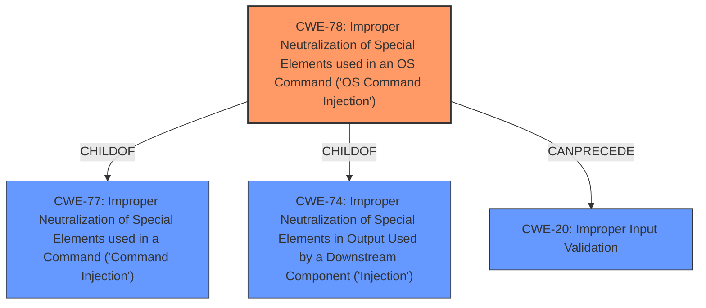

# Enhanced Analysis for CVE-2020-15180

# Summary
| CWE ID | CWE Name | Confidence | CWE Abstraction Level | CWE Vulnerability Mapping Label | CWE-Vulnerability Mapping Notes |
|---|---|---|---|---|---|
| CWE-78 | Improper Neutralization of Special Elements used in an OS Command ('OS Command Injection') | 1.0 | Base | Allowed | Primary CWE |
| CWE-20 | Improper Input Validation | 0.7 | Class | Discouraged | Secondary CWE |

## Evidence and Confidence

*   **Confidence Score:** 0.9
*   **Evidence Strength:** HIGH

## Relationship Analysis
The primary CWE is CWE-78, which is a base-level CWE and a child of CWE-77 (Improper Neutralization of Special Elements used in a Command) and CWE-74 (Improper Neutralization of Special Elements in Output Used by a Downstream Component ('Injection')). CWE-78 is the more specific case of command injection, focusing on OS commands. CWE-20 is related as the **lack of input validation** directly leads to the command injection.



## Vulnerability Chain
The chain of events is as follows:
1.  **Root Cause:** **Lack of input sanitization** (Improper Input Validation - CWE-20) on the `wsrep_sst_method` field.
2.  **Weakness:** This leads to **command injection** (Improper Neutralization of Special Elements used in an OS Command - CWE-78).
3.  **Impact:** A remote attacker can execute arbitrary commands on galera cluster nodes, threatening confidentiality, integrity, and availability.

## Summary of Analysis
The initial assessment identified the **lack of input sanitization** as the root cause, leading to **command injection**.

The vulnerability description states: "Lack of input sanitization in `wsrep_sst_method` allows for **command injection** that can be exploited by a remote attacker to execute arbitrary commands on galera cluster nodes." This directly supports the selection of CWE-78 as the primary weakness.

The "CVE Reference Links Content Summary" section provides further evidence: "The mysql-wsrep component of Galera Cluster is vulnerable to command injection in the `wsrep_sst_method` field due to insufficient input sanitization."

CWE-78 is the most specific and accurate representation of the vulnerability. While CWE-77 (Improper Neutralization of Special Elements used in a Command) could also be considered, CWE-78 is preferred because the commands are executed at the OS level. CWE-20 (Improper Input Validation) is a contributing factor, but not the primary weakness.

The retriever results also support this conclusion, with CWE-78 being a strong candidate.

The selection is based on the provided evidence, graph relationships, and the goal of identifying the most specific CWE.

Relevant CWE Information:

# Enhanced Context (25 CWEs)

## CWE-1289: Improper Validation of Unsafe Equivalence in Input
**Abstraction Level**: Base
**Similarity Score**: 0.76
**Source**: dense

**Description**:
The product receives an input value that is used as a resource identifier or other type of reference, but it does not validate or incorrectly validates that the input is equivalent to a potentially-unsafe value.

**Mapping Guidance**:
- Usage: Allowed
- Rationale: This CWE entry is at the Base level of abstraction, which is a preferred level of abstraction for mapping to the root causes of vulnerabilities.

*Not selected.* This CWE is too specific. The input is not necessarily being checked for equivalence to unsafe values.

## CWE-74: Improper Neutralization of Special Elements in Output Used by a Downstream Component ('Injection')
**Abstraction Level**: Class
**Similarity Score**: 0.76
**Source**: dense

**Description**:
The product constructs all or part of a command, data structure, or record using externally-influenced input from an upstream component, but it does not neutralize or incorrectly neutralizes special elements that could modify how it is parsed or interpreted when it is sent to a downstream component.

**Mapping Guidance**:
- Usage: Discouraged
- Rationale: CWE-74 is high-level and often misused when lower-level weaknesses are more appropriate.

*Not selected.* This is a higher-level class and CWE-78 is more specific.

## CWE-184: Incomplete List of Disallowed Inputs
**Abstraction Level**: Base
**Similarity Score**: 0.75
**Source**: dense

**Description**:
The product implements a protection mechanism that relies on a list of inputs (or properties of inputs) that are not allowed by policy or otherwise require other action to neutralize before additional processing takes place, but the list is incomplete.

**Mapping Guidance**:
- Usage: Allowed
- Rationale: This CWE entry is at the Base level of abstraction, which is a preferred level of abstraction for mapping to the root causes of vulnerabilities.

*Not selected.* This is not about an incomplete list.

## CWE-113: Improper Neutralization of CRLF Sequences in HTTP Headers ('HTTP Request/Response Splitting')
**Abstraction Level**: Variant
**Similarity Score**: 0.74
**Source**: dense

**Description**:
The product receives data from an HTTP agent/component (e.g., web server, proxy, browser, etc.), but it does not neutralize or incorrectly neutralizes CR and LF characters before the data is included in outgoing HTTP headers.

**Mapping Guidance**:
- Usage: Allowed
- Rationale: This CWE entry is at the Variant level of abstraction, which is a preferred level of abstraction for mapping to the root causes of vulnerabilities.

*Not selected.* This is related to HTTP headers, not command injection.

## CWE-138: Improper Neutralization of Special Elements
**Abstraction Level**: Class
**Similarity Score**: 0.74
**Source**: dense

**Description**:
The product receives input from an upstream component, but it does not neutralize or incorrectly neutralizes special elements that could be interpreted as control elements or syntactic markers when they are sent to a downstream component.

**Mapping Guidance**:
- Usage: Discouraged
- Rationale: This CWE entry is a level-1 Class (i.e., a child of a Pillar). It might have lower-level children that would be more appropriate

*Not selected.* This is a higher-level class and CWE-78 is more specific.

## CWE-807: Reliance on Untrusted Inputs in a Security Decision
**Abstraction Level**: Base
**Similarity Score**: 0.74
**Source**: dense

**Description**:
The product uses a protection mechanism that relies on the existence or values of an input, but the input can be modified by an untrusted actor in a way that bypasses the protection mechanism.

**Mapping Guidance**:
- Usage: Allowed
- Rationale: This CWE entry is at the Base level of abstraction, which is a preferred level of abstraction for mapping to the root causes of vulnerabilities.

*Not selected.* This is not about a security decision.

## CWE-183: Permissive List of Allowed Inputs
**Abstraction Level**: Base
**Similarity Score**: 0.74
**Source**: dense

**Description**:
The product implements a protection mechanism that relies on a list of inputs (or properties of inputs) that are explicitly allowed by policy because the inputs are assumed to be safe, but the list is too permissive - that is, it allows an input that is unsafe, leading to resultant weaknesses.

**Mapping Guidance**:
- Usage: Allowed
- Rationale: This CWE entry is at the Base level of abstraction, which is a preferred level of abstraction for mapping to the root causes of vulnerabilities.

*Not selected.* This is not about a permissive list.

## CWE-93: Improper Neutralization of CRLF Sequences ('CRLF Injection')
**Abstraction Level**: Base
**Similarity Score**: 0.73
**Source**: dense

**Description**:
The product uses CRLF (carriage return line feeds) as a special element, e.g. to separate lines or records, but it does not neutralize or incorrectly neutralizes CRLF sequences from inputs.

**Mapping Guidance**:
- Usage: Allowed
- Rationale: This CWE entry is at the Base level of abstraction, which is a preferred level of abstraction for mapping to the root causes of vulnerabilities.

*Not selected.* This is not about CRLF injection.

## CWE-


## CWE Relationship Analysis

Current CWEs represent these abstraction levels: .


### Vulnerability Chain Analysis

**Chain starting from CWE-113:**
- 113 (Improper Neutralization of CRLF Sequences in HTTP Headers ('HTTP Request/Response Splitting')) - ROOT


**Chain starting from CWE-78:**
- 78 (Improper Neutralization of Special Elements used in an OS Command ('OS Command Injection')) - ROOT


### CWE Relationship Diagram

```mermaid
graph TD
    classDef primary fill:#f96,stroke:#333,stroke-width:2px
    classDef secondary fill:#69f,stroke:#333
    classDef tertiary fill:#9e9,stroke:#333
```