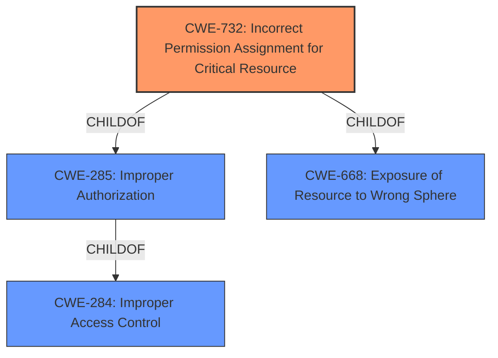

# Analysis Report for CVE-2020-15279

# Vulnerability Analysis Report: CVE-2020-15279

## Description


## Analysis (with Relationship Data)

# Summary
| CWE ID | CWE Name | Confidence | CWE Abstraction Level | CWE Vulnerability Mapping Label | CWE-Vulnerability Mapping Notes |
|---|---|---|---|---|---|
| CWE-732 | Incorrect Permission Assignment for Critical Resource | 0.8 | Class | Allowed-with-Review | Primary CWE |
| CWE-284 | Improper Access Control | 0.5 | Pillar | Discouraged | Secondary Candidate |
| CWE-269 | Improper Privilege Management | 0.3 | Class | Discouraged | Secondary Candidate |

## Evidence and Confidence

*   **Confidence Score:** 0.8
*   **Evidence Strength:** HIGH

## Relationship Analysis
The primary CWE is CWE-732, which is a child of both CWE-285 (Improper Authorization) and CWE-668 (Exposure of Resource to Wrong Sphere). CWE-285, in turn, is a child of CWE-284 (Improper Access Control). This hierarchy shows a progression from a general access control issue (CWE-284) to a more specific incorrect authorization (CWE-285), culminating in the most precise classification of incorrect permission assignment for a critical resource (CWE-732). The relationships informed the decision to select CWE-732 as the primary CWE, as it represents the most specific and accurate description of the vulnerability.



## Vulnerability Chain
The vulnerability chain begins with **Improper Access Control** in the logging component. This leads to the exposure of scanning exclusion paths to a regular user, which could potentially be used to craft malware or other malicious attacks to avoid detection.

Root Cause: **Improper Access Control** (CWE-284 or a more specific child like CWE-732)
Weakness: Incorrect permissions on the logging component's resource (CWE-732)
Impact: Information Disclosure (scanning exclusion paths are revealed)

## Summary of Analysis
The initial analysis focused on the **Improper Access Control** as the root cause. The evidence clearly states, "Root cause of vulnerability: **Improper Access Control** in the logging component of Bitdefender Endpoint Security Tools for Windows." However, CWE-284 is a Pillar-level CWE and is discouraged. Therefore, a more specific CWE was sought.

CWE-732, Incorrect Permission Assignment for Critical Resource, was selected as the primary CWE because it accurately describes the vulnerability: the logging component, a critical resource, has incorrect permissions allowing a regular user to access sensitive information (scanning exclusion paths).

The retriever results also suggested CWE-269, Improper Privilege Management, but this is also a Class-level CWE that is commonly misused and conflated with privilege escalation, which is a technical impact. Therefore, it was not selected as the primary CWE.

The final decision to use CWE-732 is based on the evidence provided and the CWE's description aligning with the vulnerability details. It is at the Class level, which is higher than ideal, but it is the most specific option given the available information and the discouragement of using CWE-284. The confidence level is high due to the clear indication of access control issues and the specific resource involved.

Relevant CWE Information:

# Enhanced Context (25 CWEs)
The following CWEs were identified as potentially relevant to this vulnerability:

## CWE-23: Relative Path Traversal
**Abstraction Level**: Base
**Similarity Score**: 0.79
**Source**: dense

**Description**:
The product uses external input to construct a pathname that should be within a restricted directory, but it does not properly neutralize sequences such as ".." that can resolve to a location that is outside of that directory.

**Mapping Guidance**:
- Usage: Allowed
- Rationale: This CWE entry is at the Base level of abstraction, which is a preferred level of abstraction for mapping to the root causes of vulnerabilities.

## CWE-59: Improper Link Resolution Before File Access ('Link Following')
**Abstraction Level**: Base
**Similarity Score**: 0.77
**Source**: dense

**Description**:
The product attempts to access a file based on the filename, but it does not properly prevent that filename from identifying a link or shortcut that resolves to an unintended resource.

**Mapping Guidance**:
- Usage: Allowed
- Rationale: This CWE entry is at the Base level of abstraction, which is a preferred level of abstraction for mapping to the root causes of vulnerabilities.

## CWE-73: External Control of File Name or Path
**Abstraction Level**: Base
**Similarity Score**: 0.77
**Source**: dense

**Description**:
The product allows user input to control or influence paths or file names that are used in filesystem operations.

**Mapping Guidance**:
- Usage: Allowed
- Rationale: This CWE entry is at the Base level of abstraction, which is a preferred level of abstraction for mapping to the root causes of vulnerabilities.

## CWE-41: Improper Resolution of Path Equivalence
**Abstraction Level**: Base
**Similarity Score**: 0.77
**Source**: dense

**Description**:
The product is vulnerable to file system contents disclosure through path equivalence. Path equivalence involves the use of special characters in file and directory names. The associated manipulations are intended to generate multiple names for the same object.

**Mapping Guidance**:
- Usage: Allowed
- Rationale: This CWE entry is at the Base level of abstraction, which is a preferred level of abstraction for mapping to the root causes of vulnerabilities.

## CWE-36: Absolute Path Traversal
**Abstraction Level**: Base
**Similarity Score**: 0.76
**Source**: dense

**Description**:
The product uses external input to construct a pathname that should be within a restricted directory, but it does not properly neutralize absolute path sequences such as "/abs/path" that can resolve to a location that is outside of that directory.

**Mapping Guidance**:
- Usage: Allowed
- Rationale: This CWE entry is at the Base level of abstraction, which is a preferred level of abstraction for mapping to the root causes of vulnerabilities.

## CWE-668: Exposure of Resource to Wrong Sphere
**Abstraction Level**: Class
**Similarity Score**: 0.76
**Source**: dense

**Description**:
The product exposes a resource to the wrong control sphere, providing unintended actors with inappropriate access to the resource.

**Mapping Guidance**:
- Usage: Discouraged
- Rationale: CWE-668 is high-level and is often misused as a catch-all when lower-level CWE IDs might be applicable. It is sometimes used for low-information vulnerability reports [REF-1287]. It is a level-1 Class (i.e., a child of a Pillar). It is not useful for trend analysis.

## CWE-274: Improper Handling of Insufficient Privileges
**Abstraction Level**: Base
**Similarity Score**: 0.76
**Source**: dense

**Description**:
The product does not handle or incorrectly handles when it has insufficient privileges to perform an operation, leading to resultant weaknesses.

**Mapping Guidance**:
- Usage: Discouraged
- Rationale: This CWE entry could be deprecated in a future version of CWE.

## CWE-552: Files or Directories Accessible to External Parties
**Abstraction Level**: Base
**Similarity Score**: 0.76
**Source**: dense

**Description**:
The product makes files or directories accessible to unauthorized actors, even though they should not be.

**Mapping Guidance**:
- Usage: Allowed
- Rationale: This CWE entry is at the Base level of abstraction, which is a preferred level of abstraction for mapping to the root causes of vulnerabilities.

## CWE-424: Improper Protection of Alternate Path
**Abstraction Level**: Class
**Similarity Score**: 0.75
**Source**: dense

**Description**:
The product does not sufficiently protect all possible paths that a user can take to access restricted functionality or resources.

**Mapping Guidance**:
- Usage: Allowed-with-Review
- Rationale: This CWE entry is a Class and might have Base-level children that would be more appropriate

## CWE-427: Uncontrolled Search Path Element
**Abstraction Level**: Base
**Similarity Score**: 0.75
**Source**: dense

**Description**:
The product uses a fixed or controlled search path to find resources, but one or more locations in that path can be under the control of unintended actors.

**Mapping Guidance**:
- Usage: Allowed


## CWE Relationship Analysis

Current CWEs represent these abstraction levels: .


### Vulnerability Chain Analysis

**Chain starting from CWE-732:**
- 732 (Incorrect Permission Assignment for Critical Resource) - ROOT


**Chain starting from CWE-36:**
- 36 (Absolute Path Traversal) - ROOT


### CWE Relationship Diagram

```mermaid
graph TD
    classDef primary fill:#f96,stroke:#333,stroke-width:2px
    classDef secondary fill:#69f,stroke:#333
    classDef tertiary fill:#9e9,stroke:#333
```


*Report generated on 2025-04-02 05:23:07*
