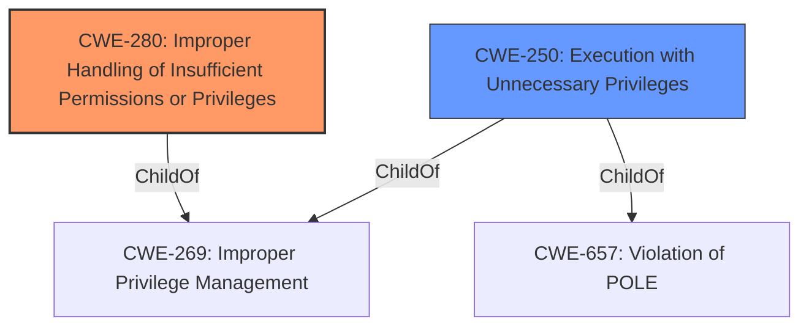

# Analysis for CVE-2020-15360

# Summary
| CWE ID | CWE Name | Confidence | CWE Abstraction Level | CWE Vulnerability Mapping Label | CWE-Vulnerability Mapping Notes |
|---|---|---|---|---|---|
| CWE-280 | Improper Handling of Insufficient Permissions or Privileges | 0.75 | Base | Allowed | Primary CWE |
| CWE-250 | Execution with Unnecessary Privileges | 0.6 | Base | Allowed | Secondary Candidate |

## Evidence and Confidence

*   **Confidence Score:** 0.7
*   **Evidence Strength:** MEDIUM

## Relationship Analysis
The primary relationship that impacted the decision was the hierarchical relationship. CWE-280 and CWE-250 are both base-level CWEs, however, CWE-280 seemed to fit better with the provided description, with the **lack of client verification** leading to **improper handling of insufficient privileges**.

## Vulnerability Chain
The vulnerability chain starts with the **lack of client verification**, leading to **improper handling of insufficient privileges** and ultimately resulting in privilege escalation.
  - Lack of Client Verification (CWE-N/A - no specific CWE for this, could be seen as a missing authentication step) -> Improper Handling of Insufficient Privileges (CWE-280) -> Privilege Escalation (Impact)

## Summary of Analysis
The initial assessment focused on the **lack of client verification** as the root cause, leading to privilege escalation. The primary CWE selected was CWE-280 (Improper Handling of Insufficient Permissions or Privileges), as it directly addresses the vulnerability's core issue: the service communicates without verifying the client, leading to improper privilege handling.

The selection is based on the provided evidence, specifically:
  - Vulnerability Description Key Phrases: "**rootcause:** **lack of client verification**"
  - CVE Reference Links Content Summary: "The `com.docker.vmnetd` launch service, which runs at root authority, communicates with the client (Docker) through a local socket without verifying the client during the communication process." and "Weaknesses/vulnerabilities present: Lack of client verification during communication, allowing for privilege escalation."

The graph relationships influenced the final selection by highlighting the hierarchical structure and alternative classifications. CWE-250 was considered but deemed less specific than CWE-280.

The selected CWE is at the optimal level of specificity because it directly represents the weakness described in the vulnerability report, focusing on the **improper handling of insufficient privileges** due to the **lack of client verification**, rather than a more general class.

Relevant CWE Information:

# Enhanced Context (25 CWEs)
The following CWEs were identified as potentially relevant to this vulnerability:

## CWE-280: Improper Handling of Insufficient Permissions or Privileges 
**Abstraction Level**: Base
**Similarity Score**: 0.78
**Source**: dense

**Description**:
The product does not handle or incorrectly handles when it has insufficient privileges to access resources or functionality as specified by their permissions. This may cause it to follow unexpected code paths that may leave the product in an invalid state.

**Mapping Guidance**:
- Usage: Allowed
- Rationale: This CWE entry is at the Base level of abstraction, which is a preferred level of abstraction for mapping to the root causes of vulnerabilities.

## CWE-250: Execution with Unnecessary Privileges
**Abstraction Level**: Base
**Similarity Score**: 0.499
**Source**: dense

**Description**:
The product performs an operation at a privilege level that is higher than the minimum level required, which creates new weaknesses or amplifies the consequences of other weaknesses.

**Mapping Guidance**:
- Usage: Allowed
- Rationale: This CWE entry is at the Base level of abstraction, which is a preferred level of abstraction for mapping to the root causes of vulnerabilities.