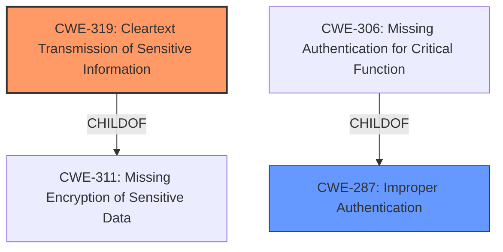

# Analysis for CVE-2020-15381

# Summary
| CWE ID | CWE Name | Confidence | CWE Abstraction Level | CWE Vulnerability Mapping Label | CWE-Vulnerability Mapping Notes |
|---|---|---|---|---|---|
| CWE-319 | Cleartext Transmission of Sensitive Information | 1.0 | Base | Primary | Allowed |
| CWE-287 | Improper Authentication | 0.7 | Class | Secondary | Discouraged |

## Evidence and Confidence

*   **Confidence Score:** 0.9
*   **Evidence Strength:** HIGH

## Relationship Analysis
The primary CWE is CWE-319, which is a child of CWE-311 (Missing Encryption of Sensitive Data). CWE-287 (Improper Authentication) is a class-level CWE and a parent to CWE-306 (Missing Authentication for Critical Function). The vulnerability involves **improper authentication** leading to **cleartext transmission of authentication credentials**. CWE-319 directly addresses the **cleartext transmission**, making it a more specific and appropriate choice than the broader CWE-287.

## Vulnerability Chain
The chain of events is:
1.  **Improper Authentication (CWE-287)**: Authentication process is flawed.
2.  **Cleartext Transmission of Credentials (CWE-319)**: As a result of the flawed authentication, credentials are sent without encryption.

## Summary of Analysis
The initial vulnerability description points to **Improper Authentication**, but the supporting details and CVE summary strongly indicate that the core issue is the **cleartext transmission of authentication credentials**. The vulnerability description mentions "**Improper Authentication** vulnerability that allows cleartext transmission of authentication credentials of the jmx server". The CVE Reference Links Content Summary highlights the "Cleartext transmission of authentication credentials of the JMX server."

CWE-319 (Cleartext Transmission of Sensitive Information) is a Base-level CWE that directly addresses the vulnerability. While **Improper Authentication** is a contributing factor, the immediate weakness is the transmission of credentials in cleartext.

CWE-287 (Improper Authentication) is considered but not chosen as the primary CWE because it is a Class-level CWE, and the evidence supports a more specific Base-level CWE. The mapping guidance for CWE-287 discourages its use when lower-level CWE entries are applicable.

Therefore, CWE-319 is the most appropriate primary CWE, with CWE-287 as a secondary contributing factor.

Relevant CWE Information:

# Enhanced Context (25 CWEs)
The following CWEs were identified as potentially relevant to this vulnerability:

## CWE-303: Incorrect Implementation of Authentication Algorithm
**Abstraction Level**: Base
**Similarity Score**: 0.78
**Source**: dense

**Description**:
The requirements for the product dictate the use of an established authentication algorithm, but the implementation of the algorithm is incorrect.

**Mapping Guidance**:
- Usage: Allowed
- Rationale: This CWE entry is at the Base level of abstraction, which is a preferred level of abstraction for mapping to the root causes of vulnerabilities.

I am not choosing this CWE because the information provided doesn't include whether an authentication algorithm was implemented incorrectly.

## CWE-1391: Use of Weak Credentials
**Abstraction Level**: Class
**Similarity Score**: 0.78
**Source**: dense

**Description**:
The product uses weak credentials (such as a default key or hard-coded password) that can be calculated, derived, reused, or guessed by an attacker.

**Mapping Guidance**:
- Usage: Allowed-with-Review
- Rationale: This CWE entry is a Class and might have Base-level children that would be more appropriate

I am not choosing this CWE because the information provided doesn't include whether weak credentials were used.

## CWE-1240: Use of a Cryptographic Primitive with a Risky Implementation
**Abstraction Level**: Base
**Similarity Score**: 0.77
**Source**: dense

**Description**:
To fulfill the need for a cryptographic primitive, the product implements a cryptographic algorithm using a non-standard, unproven, or disallowed/non-compliant cryptographic implementation.

**Mapping Guidance**:
- Usage: Allowed
- Rationale: This CWE entry is at the Base level of abstraction, which is a preferred level of abstraction for mapping to the root causes of vulnerabilities.

I am not choosing this CWE because the description mentions cleartext transmission of authentication credentials, indicating a lack of encryption rather than a risky cryptographic implementation.

## CWE-311: Missing Encryption of Sensitive Data
**Abstraction Level**: Class
**Similarity Score**: 0.77
**Source**: dense

**Description**:
The product does not encrypt sensitive or critical information before storage or transmission.

**Mapping Guidance**:
- Usage: Discouraged
- Rationale: CWE-311 is high-level with more precise children available. It is a level-1 Class (i.e., a child of a Pillar).

I am not choosing this CWE because the description mentions cleartext transmission of authentication credentials, and CWE-319 is a better fit.

## CWE-312: Cleartext Storage of Sensitive Information
**Abstraction Level**: Base
**Similarity Score**: 0.77
**Source**: dense

**Description**:
The product stores sensitive information in cleartext within a resource that might be accessible to another control sphere.

**Mapping Guidance**:
- Usage: Allowed
- Rationale: This CWE entry is at the Base level of abstraction, which is a preferred level of abstraction for mapping to the root causes of vulnerabilities.

I am not choosing this CWE because the description mentions cleartext transmission of authentication credentials and storage of sensitive information in cleartext.

## CWE-319: Cleartext Transmission of Sensitive Information
**Abstraction Level**: Base
**Similarity Score**: 0.77
**Source**: dense

**Description**:
The product transmits sensitive or security-critical data in cleartext in a communication channel that can be sniffed by unauthorized actors.

**Mapping Guidance**:
- Usage: Allowed
- Rationale: This CWE entry is at the Base level of abstraction, which is a preferred level of abstraction for mapping to the root causes of vulnerabilities.

I am choosing this CWE because the description mentions cleartext transmission of authentication credentials.

## CWE-807: Reliance on Untrusted Inputs in a Security Decision
**Abstraction Level**: Base
**Similarity Score**: 0.76
**Source**: dense

**Description**:
The product uses a protection mechanism that relies on the existence or values of an input, but the input can be modified by an untrusted actor in a way that bypasses the protection mechanism.

**Mapping Guidance**:
- Usage: Allowed
- Rationale: This CWE entry is at the Base level of abstraction, which is a preferred level of abstraction for mapping to the root causes of vulnerabilities.

I am not choosing this CWE because the information provided doesn't mention reliance on untrusted inputs.

## CWE-345: Insufficient Verification of Data Authenticity
**Abstraction Level**: Class
**Similarity Score**: 0.76
**Source**: dense

**Description**:
The product does not sufficiently verify the origin or authenticity of data, in a way that causes it to accept invalid data.

**Mapping Guidance**:
- Usage: Discouraged
- Rationale: This CWE entry is a level-1 Class (i.e., a child of a Pillar). It might have lower-level children that would be more appropriate

I am not choosing this CWE because the information provided doesn't mention insufficient verification of data authenticity.

## CWE-657: Violation of Secure Design Principles
**Abstraction Level**: Class
**Similarity Score**: 0.76
**Source**: dense

**Description**:
The product violates well-established principles for secure design.

**Mapping Guidance**:
- Usage: Discouraged
- Rationale: This CWE entry is a level-1 Class (i.e., a child of a Pillar). It might have lower-level children that would be more appropriate

I am not choosing this CWE because the information provided is too broad and doesn't indicate which secure design principles are violated.

## CWE-1390: Weak Authentication
**Abstraction Level**: Class
**Similarity Score**: 0.76
**Source**: dense

**Description**:
The product uses an authentication mechanism to restrict access to specific users or identities, but the mechanism does not sufficiently prove that the claimed identity is correct.

**Mapping Guidance**:
- Usage: Allowed-with-Review
- Rationale: This CWE entry is a Class and might have Base-level children that would be more appropriate

I am not choosing