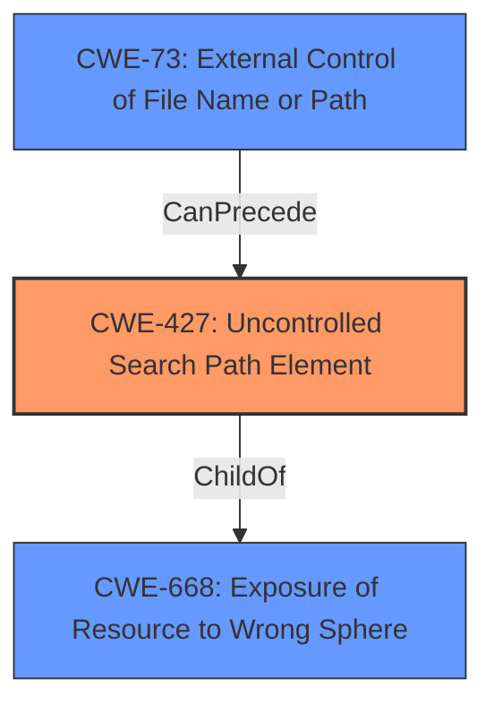

# Analysis Report for CVE-2020-15397

# Vulnerability Analysis Report: CVE-2020-15397

## Description


## Analysis (with Relationship Data)

# Summary
| CWE ID    | CWE Name                                                                  | Confidence | CWE Abstraction Level | CWE Vulnerability Mapping Label | CWE-Vulnerability Mapping Notes |
| :--------- | :------------------------------------------------------------------------ | :--------- | :-------------------- | :------------------------------ | :------------------------------ |
| CWE-427    | Uncontrolled Search Path Element                                          | 0.9        | Base                  | Primary                         | Allowed                       |
| CWE-73     | External Control of File Name or Path                                    | 0.7        | Base                  | Secondary                       | Allowed                       |
| CWE-668    | Exposure of Resource to Wrong Sphere                                    | 0.6        | Class                  | Secondary                       | Discouraged                    |

## Evidence and Confidence

*   **Confidence Score:** 0.8
*   **Evidence Strength:** HIGH

## Relationship Analysis
The primary CWE is CWE-427 **Uncontrolled Search Path Element**, which indicates that the program uses a search path that includes locations under the control of unintended actors. CWE-427 is related to CWE-668 **Exposure of Resource to Wrong Sphere** because the uncontrolled search path element effectively exposes the resource (the ability to execute code) to the wrong sphere of control (unprivileged users). CWE-73 **External Control of File Name or Path** is related because the vulnerability allows external users to control the path where the executable is located. The abstraction levels influenced the selection to prefer the base level CWE-427 and CWE-73 over the higher-level class CWE-668.



## Vulnerability Chain
The chain of vulnerabilities starts with scripts executing binaries from directories writable by unprivileged users. This leads to the **root cause**, CWE-427 **Uncontrolled Search Path Element**, which then allows for arbitrary code execution with elevated privileges. CWE-73 **External Control of File Name or Path** allows the unprivileged users to control which files will be executed.

## Summary of Analysis
The primary assessment is based on the provided evidence that HylaFAX+ scripts execute binaries from directories writable by unprivileged users. The **weakness** is that these scripts do not properly control the search path for binaries, leading to CWE-427 **Uncontrolled Search Path Element**.

The "CVE Reference Links Content Summary" section confirms that the **root cause** is the "unsafe sourcing of files" and "lack of input sanitization." This allows "privilege escalation" and "arbitrary code execution." The "attacker needs local access to the system to modify the user-writable directories."

The graph relationships influenced the final selection by showing how CWE-427 relates to other potential CWEs like CWE-668 and CWE-73. CWE-427 is a more specific, base-level weakness than CWE-668, which is a class-level weakness, and thus it is a better fit. The selected CWEs are at the optimal level of specificity because they directly address the **root cause** of the vulnerability and describe the specific mechanism by which the vulnerability can be exploited.

Relevant CWE Information:

# Enhanced Context (25 CWEs)
The following CWEs were identified as potentially relevant to this vulnerability:

## CWE-59: Improper Link Resolution Before File Access ('Link Following')
**Abstraction Level**: Base
**Similarity Score**: 0.84
**Source**: dense

**Description**:
The product attempts to access a file based on the filename, but it does not properly prevent that filename from identifying a link or shortcut that resolves to an unintended resource.

**Mapping Guidance**:
- Usage: Allowed
- Rationale: This CWE entry is at the Base level of abstraction, which is a preferred level of abstraction for mapping to the root causes of vulnerabilities.

## CWE-61: UNIX Symbolic Link (Symlink) Following
**Abstraction Level**: Compound
**Similarity Score**: 0.82
**Source**: dense

**Description**:
The product, when opening a file or directory, does not sufficiently account for when the file is a symbolic link that resolves to a target outside of the intended control sphere. This could allow an attacker to cause the product to operate on unauthorized files.

**Mapping Guidance**:
- Usage: Allowed
- Rationale: This is a well-known Composite of multiple weaknesses that must all occur simultaneously, although it is attack-oriented in nature.

## CWE-41: Improper Resolution of Path Equivalence
**Abstraction Level**: Base
**Similarity Score**: 0.79
**Source**: dense

**Description**:
The product is vulnerable to file system contents disclosure through path equivalence. Path equivalence involves the use of special characters in file and directory names. The associated manipulations are intended to generate multiple names for the same object.

**Mapping Guidance**:
- Usage: Allowed
- Rationale: This CWE entry is at the Base level of abstraction, which is a preferred level of abstraction for mapping to the root causes of vulnerabilities.

## CWE-23: Relative Path Traversal
**Abstraction Level**: Base
**Similarity Score**: 0.78
**Source**: dense

**Description**:
The product uses external input to construct a pathname that should be within a restricted directory, but it does not properly neutralize sequences such as ".." that can resolve to a location that is outside of that directory.

**Mapping Guidance**:
- Usage: Allowed
- Rationale: This CWE entry is at the Base level of abstraction, which is a preferred level of abstraction for mapping to the root causes of vulnerabilities.

## CWE-427: Uncontrolled Search Path Element
**Abstraction Level**: Base
**Similarity Score**: 0.77
**Source**: dense

**Description**:
The product uses a fixed or controlled search path to find resources, but one or more locations in that path can be under the control of unintended actors.

**Mapping Guidance**:
- Usage: Allowed
- Rationale: This CWE entry is at the Base level of abstraction, which is a preferred level of abstraction for mapping to the root causes of vulnerabilities.

## CWE-73: External Control of File Name or Path
**Abstraction Level**: Base
**Similarity Score**: 0.76
**Source**: dense

**Description**:
The product allows user input to control or influence paths or file names that are used in filesystem operations.

**Mapping Guidance**:
- Usage: Allowed
- Rationale: This CWE entry is at the Base level of abstraction, which is a preferred level of abstraction for mapping to the root causes of vulnerabilities.

## CWE-668: Exposure of Resource to Wrong Sphere
**Abstraction Level**: Class
**Similarity Score**: 0.76
**Source**: dense

**Description**:
The product exposes a resource to the wrong control sphere, providing unintended actors with inappropriate access to the resource.

**Mapping Guidance**:
- Usage: Discouraged
- Rationale: CWE-668 is high-level and is often misused as a catch-all when lower-level CWE IDs might be applicable. It is sometimes used for low-information vulnerability reports [REF-1287]. It is a level-1 Class (i.e., a child of a Pillar). It is not useful for trend analysis.

## CWE-184: Incomplete List of Disallowed Inputs
**Abstraction Level**: Base
**Similarity Score**: 0.75
**Source**: dense

**Description**:
The product implements a protection mechanism that relies on a list of inputs (or properties of inputs) that are not allowed by policy or otherwise require other action to neutralize before additional processing takes place, but the list is incomplete.

**Mapping Guidance**:
- Usage: Allowed
- Rationale: This CWE entry is at the Base level of abstraction, which is a preferred level of abstraction for mapping to the root causes of vulnerabilities.

## CWE-74: Improper Neutralization of Special Elements in Output Used by a Downstream Component ('Injection')
**Abstraction Level**: Class
**Similarity Score**: 0.75
**Source**: dense

**Description**:
The product constructs all or part of a command, data structure, or record using externally-influenced input from an upstream component, but it does not neutralize or incorrectly neutralizes special elements that could modify how it is parsed or interpreted when it is sent to a downstream component.

**Mapping Guidance**:
- Usage: Discouraged
- Rationale: CWE-74 is high-level and often misused when lower-level weaknesses are more appropriate.

## CWE-36: Absolute Path Traversal
**Abstraction Level**: Base
**Similarity Score**: 0.75
**Source**: dense

**Description**:
The product uses external input to construct a pathname that should be within a restricted directory, but it does not properly neutralize absolute


## CWE Relationship Analysis

Current CWEs represent these abstraction levels: .


### Vulnerability Chain Analysis

**Chain starting from CWE-36:**
- 36 (Absolute Path Traversal) - ROOT


**Chain starting from CWE-73:**
- 73 (External Control of File Name or Path) - ROOT


### CWE Relationship Diagram

```mermaid
graph TD
    classDef primary fill:#f96,stroke:#333,stroke-width:2px
    classDef secondary fill:#69f,stroke:#333
    classDef tertiary fill:#9e9,stroke:#333
```


*Report generated on 2025-04-01 17:28:20*
