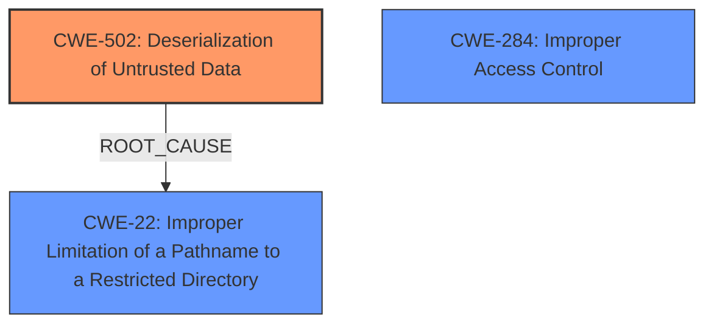

# Analysis Report for CVE-2020-15505

# Vulnerability Analysis Report: CVE-2020-15505

## Description


## Analysis (with Relationship Data)

# Summary
| CWE ID | CWE Name | Confidence | CWE Abstraction Level | CWE Vulnerability Mapping Label | CWE-Vulnerability Mapping Notes |
|---|---|---|---|---|---|
| CWE-502 | Deserialization of Untrusted Data | 1 | Base | Primary | Allowed |
| CWE-22 | Improper Limitation of a Pathname to a Restricted Directory ('Path Traversal') | 0.75 | Base | Secondary | Allowed |
| CWE-284 | Improper Access Control | 0.50 | Pillar | Secondary | Discouraged |

## Evidence and Confidence

*   **Confidence Score:** 0.8
*   **Evidence Strength:** HIGH

## Relationship Analysis
The primary weakness is **CWE-502 Deserialization of Untrusted Data**, which is a **Base** level CWE. This is related to the **improper input validation** that allows the deserialization to occur. The **CWE-22 Path Traversal** is a secondary weakness that allows the bypass of access controls. The **CWE-284 Improper Access Control** is a high-level **Pillar** that represents the general category of access control issues, but is too broad for this specific vulnerability.



## Vulnerability Chain
The vulnerability chain starts with the **improper input validation** that allows the deserialization of untrusted data (**CWE-502**). This leads to a bypass of access controls (**CWE-22**), which ultimately allows for remote code execution.

## Summary of Analysis
The initial assessment and criticism focused on identifying the root cause and the chain of weaknesses that lead to the remote code execution vulnerability. The primary weakness, **CWE-502 Deserialization of Untrusted Data**, is the root cause because it directly relates to the **insecure deserialization** of user-provided input in Hessian format. The bypass of access control via path traversal (**CWE-22**) is an important secondary factor. The evidence from the CVE reference links strongly supports this classification, especially the details about the vulnerable endpoint, the bypass technique, and the ability to execute arbitrary code.

The graph relationships influenced the final selection by highlighting the connections between **CWE-502**, **CWE-22**, and **CWE-284**. While **CWE-284** is a parent class, it is too general for this specific vulnerability. **CWE-502** and **CWE-22** are more specific and accurately represent the weaknesses.

The selected CWEs are at the optimal level of specificity because they directly address the root cause and contributing factors of the vulnerability. **CWE-502** identifies the insecure deserialization, and **CWE-22** identifies the path traversal that allows the access control bypass. These are more specific than the general **CWE-20** and **CWE-284**.

Relevant CWE Information:

# Enhanced Context (25 CWEs)

## CWE-538: Insertion of Sensitive Information into Externally-Accessible File or Directory
**Abstraction Level**: Base
**Similarity Score**: 0.76
**Source**: dense

**Description**:
The product places sensitive information into files or directories that are accessible to actors who are allowed to have access to the files, but not to the sensitive information.

**Mapping Guidance**:
- Usage: Allowed
- Rationale: This CWE entry is at the Base level of abstraction, which is a preferred level of abstraction for mapping to the root causes of vulnerabilities.

*This CWE was not selected as it does not directly relate to the deserialization or path traversal issues present in the vulnerability.*

## CWE-497: Exposure of Sensitive System Information to an Unauthorized Control Sphere
**Abstraction Level**: Base
**Similarity Score**: 0.76
**Source**: dense

**Description**:
The product does not properly prevent sensitive system-level information from being accessed by unauthorized actors who do not have the same level of access to the underlying system as the product does.

**Mapping Guidance**:
- Usage: Allowed
- Rationale: This CWE entry is at the Base level of abstraction, which is a preferred level of abstraction for mapping to the root causes of vulnerabilities.

*This CWE was not selected as it represents the impact rather than the root cause of the vulnerability.*

## CWE-807: Reliance on Untrusted Inputs in a Security Decision
**Abstraction Level**: Base
**Similarity Score**: 0.75
**Source**: dense

**Description**:
The product uses a protection mechanism that relies on the existence or values of an input, but the input can be modified by an untrusted actor in a way that bypasses the protection mechanism.

**Mapping Guidance**:
- Usage: Allowed
- Rationale: This CWE entry is at the Base level of abstraction, which is a preferred level of abstraction for mapping to the root causes of vulnerabilities.

*This CWE was not selected because it doesn't capture the specifics of the insecure deserialization.*

## CWE-213: Exposure of Sensitive Information Due to Incompatible Policies
**Abstraction Level**: Base
**Similarity Score**: 0.74
**Source**: dense

**Description**:
The product's intended functionality exposes information to certain actors in accordance with the developer's security policy, but this information is regarded as sensitive according to the intended security policies of other stakeholders such as the product's administrator, users, or others whose information is being processed.

**Mapping Guidance**:
- Usage: Allowed
- Rationale: This CWE entry is at the Base level of abstraction, which is a preferred level of abstraction for mapping to the root causes of vulnerabilities.

*This CWE was not selected because it relates to policy conflicts, which is not present in the vulnerability.*

## CWE-552: Files or Directories Accessible to External Parties
**Abstraction Level**: Base
**Similarity Score**: 0.74
**Source**: dense

**Description**:
The product makes files or directories accessible to unauthorized actors, even though they should not be.

**Mapping Guidance**:
- Usage: Allowed
- Rationale: This CWE entry is at the Base level of abstraction, which is a preferred level of abstraction for mapping to the root causes of vulnerabilities.

*This CWE was not selected as it doesn't explain how the files or directories were accessed.*

## CWE-226: Sensitive Information in Resource Not Removed Before Reuse
**Abstraction Level**: Base
**Similarity Score**: 0.74
**Source**: dense

**Description**:
The product releases a resource such as memory or a file so that it can be made available for reuse, but it does not clear or "zeroize" the information contained in the resource before the product performs a critical state transition or makes the resource available for reuse by other entities.

**Mapping Guidance**:
- Usage: Allowed
- Rationale: This CWE entry is at the Base level of abstraction, which is a preferred level of abstraction for mapping to the root causes of vulnerabilities.

*This CWE was not selected as it relates to resource reuse and does not fit the vulnerability.*

## CWE-274: Improper Handling of Insufficient Privileges
**Abstraction Level**: Base
**Similarity Score**: 0.74
**Source**: dense

**Description**:
The product does not handle or incorrectly handles when it has insufficient privileges to perform an operation, leading to resultant weaknesses.

**Mapping Guidance**:
- Usage: Discouraged
- Rationale: This CWE entry could be deprecated in a future version of CWE.

*This CWE was not selected because the root cause is not insufficient privileges but insecure deserialization.*

## CWE-668: Exposure of Resource to Wrong Sphere
**Abstraction Level**: Class
**Similarity Score**: 0.74
**Source**: dense

**Description**:
The product exposes a resource to the wrong control sphere, providing unintended actors with inappropriate access to the resource.

**Mapping Guidance**:
- Usage: Discouraged
- Rationale: CWE-668 is high-level and is often misused as a catch-all when lower-level CWE IDs might be applicable. It is sometimes used for low-information vulnerability reports [REF-1287]. It is a level-1 Class (i.e., a child of a Pillar). It is not useful for trend analysis.

*This CWE was not selected as it is too generic and doesn't describe the actual weakness.*

## CWE-653: Improper Isolation or Compartmentalization
**Abstraction Level**: Class
**Similarity Score**: 0.74
**Source**: dense

**Description**:
The product does not properly compartmentalize or isolate functionality, processes, or resources that require different privilege levels, rights, or permissions.

**Mapping Guidance**:
- Usage: Allowed
- Rationale: This CWE entry


## CWE Relationship Analysis

Current CWEs represent these abstraction levels: .


### Vulnerability Chain Analysis

**Chain starting from CWE-502:**
- 502 (Deserialization of Untrusted Data) - ROOT


**Chain starting from CWE-497:**
- 497 (Exposure of Sensitive System Information to an Unauthorized Control Sphere) - ROOT


### CWE Relationship Diagram

```mermaid
graph TD
    classDef primary fill:#f96,stroke:#333,stroke-width:2px
    classDef secondary fill:#69f,stroke:#333
    classDef tertiary fill:#9e9,stroke:#333
```


*Report generated on 2025-04-01 18:31:08*
