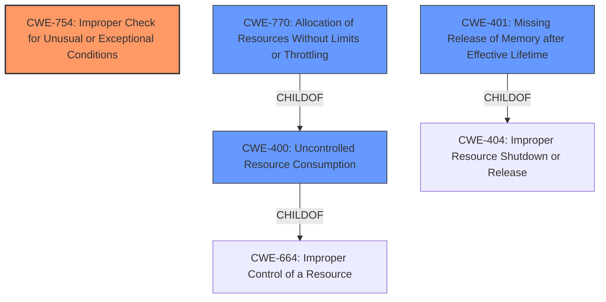

# Raw Analyzer Response for CVE-2020-15566

# Summary
| CWE ID | CWE Name | Confidence | CWE Abstraction Level | CWE Vulnerability Mapping Label | CWE-Vulnerability Mapping Notes |
|---|---|---|---|---|---|
| CWE-754 | Improper Check for Unusual or Exceptional Conditions | 0.9 | Class | Allowed-with-Review | Primary CWE |
| CWE-400 | Uncontrolled Resource Consumption | 0.7 | Class | Discouraged | Secondary Candidate |
| CWE-770 | Allocation of Resources Without Limits or Throttling | 0.6 | Base | Allowed | Secondary Candidate |
| CWE-401 | Missing Release of Memory after Effective Lifetime | 0.5 | Variant | Allowed | Secondary Candidate |

## Evidence and Confidence

*   **Confidence Score:** 0.9
*   **Evidence Strength:** HIGH

## Relationship Analysis
The primary CWE selected is CWE-754, which is a Class-level CWE. While it would be better to have a Base or Variant level CWE, there isn't a more specific CWE that truly fits. CWE-754 relates to not checking for unusual or exceptional conditions. The description specifies that the **incorrect error handling** is the root cause which leads to not handling these conditions.
CWE-400 and CWE-770 are children of CWE-664, which deals with improper control of a resource. CWE-401 is a child of CWE-404, which deals with improper shutdown or release of a resource.

## Vulnerability Chain
The vulnerability chain starts with **incorrect error handling** during event channel port allocation. This leads to a situation where the system attempts to access an invalid event channel, ultimately causing a host OS crash.

## Summary of Analysis
The primary assessment focuses on the **incorrect error handling** in event channel port allocation. The vulnerability description and CVE details support this. The allocation of an event-channel port may fail for multiple reasons (1) port is already in use, (2) the memory allocation failed, or (3) the port we try to allocate is higher than what is supported by the ABI (e.g., 2L or FIFO) used by the guest or the limit set by an administrator (max_event_channels in xl cfg). Due to the **missing error checks**, only (1) will be considered an error. All the other cases will provide a valid port and will result in a crash when trying to access the event channel.

The other CWEs describe the results of the **missing error checks**, such as uncontrolled resource consumption if there is no limit to the number of resources allocated or missing release of memory if the allocation fails.

Relevant CWE Information:

# Enhanced Context (25 CWEs)

## CWE-191: Integer Underflow (Wrap or Wraparound)
**Abstraction Level**: Base
**Similarity Score**: 0.78
**Source**: dense

**Description**:
The product subtracts one value from another, such that the result is less than the minimum allowable integer value, which produces a value that is not equal to the correct result.

**Mapping Guidance**:
- Usage: Allowed
- Rationale: This CWE entry is at the Base level of abstraction, which is a preferred level of abstraction for mapping to the root causes of vulnerabilities.

## CWE-789: Memory Allocation with Excessive Size Value
**Abstraction Level**: Variant
**Similarity Score**: 0.77
**Source**: dense

**Description**:
The product allocates memory based on an untrusted, large size value, but it does not ensure that the size is within expected limits, allowing arbitrary amounts of memory to be allocated.

**Mapping Guidance**:
- Usage: Allowed
- Rationale: This CWE entry is at the Variant level of abstraction, which is a preferred level of abstraction for mapping to the root causes of vulnerabilities.

## CWE-197: Numeric Truncation Error
**Abstraction Level**: Base
**Similarity Score**: 0.76
**Source**: dense

**Description**:
Truncation errors occur when a primitive is cast to a primitive of a smaller size and data is lost in the conversion.

**Mapping Guidance**:
- Usage: Allowed
- Rationale: This CWE entry is at the Base level of abstraction, which is a preferred level of abstraction for mapping to the root causes of vulnerabilities.

## CWE-190: Integer Overflow or Wraparound
**Abstraction Level**: Base
**Similarity Score**: 0.76
**Source**: dense

**Description**:
The product performs a calculation that can
         produce an integer overflow or wraparound when the logic
         assumes that the resulting value will always be larger than
         the original value. This occurs when an integer value is
         incremented to a value that is too large to store in the
         associated representation. When this occurs, the value may
         become a very small or negative number.

**Mapping Guidance**:
- Usage: Allowed
- Rationale: This CWE entry is at the Base level of abstraction, which is a preferred level of abstraction for mapping to the root causes of vulnerabilities.

## CWE-404: Improper Resource Shutdown or Release
**Abstraction Level**: Class
**Similarity Score**: 0.76
**Source**: dense

**Description**:
The product does not release or incorrectly releases a resource before it is made available for re-use.

**Mapping Guidance**:
- Usage: Allowed-with-Review
- Rationale: This CWE entry is a Class and might have Base-level children that would be more appropriate

## CWE-1325: Improperly Controlled Sequential Memory Allocation
**Abstraction Level**: Base
**Similarity Score**: 0.75
**Source**: dense

**Description**:
The product manages a group of objects or resources and performs a separate memory allocation for each object, but it does not properly limit the total amount of memory that is consumed by all of the combined objects.

**Mapping Guidance**:
- Usage: Allowed
- Rationale: This CWE entry is at the Base level of abstraction, which is a preferred level of abstraction for mapping to the root causes of vulnerabilities.

## CWE-131: Incorrect Calculation of Buffer Size
**Abstraction Level**: Base
**Similarity Score**: 0.75
**Source**: dense

**Description**:
The product does not correctly calculate the size to be used when allocating a buffer, which could lead to a buffer overflow.

**Mapping Guidance**:
- Usage: Allowed
- Rationale: This CWE entry is at the Base level of abstraction, which is a preferred level of abstraction for mapping to the root causes of vulnerabilities.

## CWE-681: Incorrect Conversion between Numeric Types
**Abstraction Level**: Base
**Similarity Score**: 0.75
**Source**: dense

**Description**:
When converting from one data type to another, such as long to integer, data can be omitted or translated in a way that produces unexpected values. If the resulting values are used in a sensitive context, then dangerous behaviors may occur.

**Mapping Guidance**:
- Usage: Allowed
- Rationale: This CWE entry is at the Base level of abstraction, which is a preferred level of abstraction for mapping to the root causes of vulnerabilities.

## CWE-405: Asymmetric Resource Consumption (Amplification)
**Abstraction Level**: Class
**Similarity Score**: 0.74
**Source**: dense

**Description**:
The product does not properly control situations in which an adversary can cause the product to consume or produce excessive resources without requiring the adversary to invest equivalent work or otherwise prove authorization, i.e., the adversary's influence is "asymmetric."

**Mapping Guidance**:
- Usage: Allowed-with-Review
- Rationale: This CWE entry is a Class and might have Base-level children that would be more appropriate

## CWE-667: Improper Locking
**Abstraction Level**: Class
**Similarity Score**: 0.74
**Source**: dense

**Description**:
The product does not properly acquire or release a lock on a resource, leading to unexpected resource state changes and behaviors.

**Mapping Guidance**:
- Usage: Allowed-with-Review
- Rationale: This CWE entry is a Class and might have Base-level children that would be more appropriate

## CWE-754: