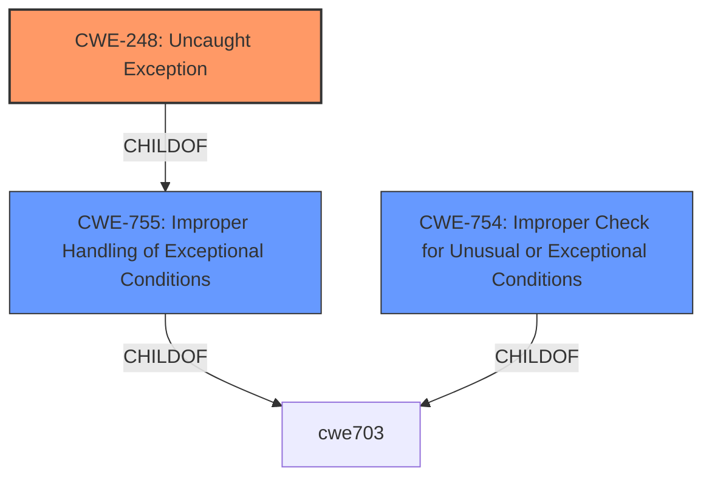

# Analysis for CVE-2020-15701

# Summary
| CWE ID | CWE Name | Confidence | CWE Abstraction Level | CWE Vulnerability Mapping Label | CWE-Vulnerability Mapping Notes |
|---|---|---|---|---|---|
| CWE-248 | Uncaught Exception | 1.0 | Base | Primary | Allowed |
| CWE-754 | Improper Check for Unusual or Exceptional Conditions | 0.7 | Class | Secondary | Allowed-with-Review |
| CWE-755 | Improper Handling of Exceptional Conditions | 0.6 | Class | Secondary | Discouraged |

## Evidence and Confidence

*   **Confidence Score:** 0.9
*   **Evidence Strength:** HIGH

## Relationship Analysis
The primary CWE selected is CWE-248, which is a Base level CWE that accurately captures the root cause of the vulnerability: an **uncaught exception**. CWE-248 is related to CWE-755 (Improper Handling of Exceptional Conditions) as a child. This indicates that CWE-755 is a broader category, while CWE-248 is a more specific type of improper handling related to exceptions. CWE-754 (Improper Check for Unusual or Exceptional Conditions) is a parent of CWE-252 (Unchecked Return Value), and also a parent of CWE-476 (NULL Pointer Dereference), but these do not clearly fit the description.

## Vulnerability Chain
The chain of events is as follows:

1.  The application receives input (`mtime` attribute in `apport-ignore.xml`).
2.  The input is a string value when it should be numeric (Improper Input Validation).
3.  The application attempts to convert the string to a float.
4.  An **unhandled exception** (CWE-248) occurs due to the failed conversion.
5.  The application crashes, leading to a denial of service.

The root cause is the **unhandled exception** (CWE-248). The impact is a denial of service.

## Summary of Analysis
The initial analysis identified an **unhandled exception** leading to a denial of service. The retriever results suggested CWE-248 (Uncaught Exception) as the top candidate. This aligns with the vulnerability description, which explicitly mentions an **unhandled exception**. The supporting evidence in the "CVE Reference Links Content Summary" confirms that the application **does not properly handle exceptions** when a non-numeric string value is encountered for the `mtime` attribute.

The relationship analysis reinforces this selection. CWE-248 is a Base level CWE, providing a specific classification for the **uncaught exception**. The alternative CWEs considered, such as CWE-755 (Improper Handling of Exceptional Conditions) are broader and less precise. While CWE-755 is a parent of CWE-248, the evidence strongly supports the more specific child CWE.

The final decision is based on the explicit mention of an **unhandled exception** in the vulnerability description and the supporting evidence from the CVE reference, which clearly indicates that the application fails to handle exceptions properly. This justifies selecting CWE-248 as the primary CWE.

Relevant CWE Information:

# Enhanced Context (25 CWEs)
The following CWEs were identified as potentially relevant to this vulnerability:

## CWE-404: Improper Resource Shutdown or Release
**Abstraction Level**: Class
**Similarity Score**: 0.79
**Source**: dense

**Description**:
The product does not release or incorrectly releases a resource before it is made available for re-use.

**Mapping Guidance**:
- Usage: Allowed-with-Review
- Rationale: This CWE entry is a Class and might have Base-level children that would be more appropriate

## CWE-405: Asymmetric Resource Consumption (Amplification)
**Abstraction Level**: Class
**Similarity Score**: 0.78
**Source**: dense

**Description**:
The product does not properly control situations in which an adversary can cause the product to consume or produce excessive resources without requiring the adversary to invest equivalent work or otherwise prove authorization, i.e., the adversary's influence is "asymmetric."

**Mapping Guidance**:
- Usage: Allowed-with-Review
- Rationale: This CWE entry is a Class and might have Base-level children that would be more appropriate

## CWE-664: Improper Control of a Resource Through its Lifetime
**Abstraction Level**: Pillar
**Similarity Score**: 0.78
**Source**: dense

**Description**:
The product does not maintain or incorrectly maintains control over a resource throughout its lifetime of creation, use, and release.

**Mapping Guidance**:
- Usage: Discouraged
- Rationale: This CWE entry is high-level when lower-level children are available.

## CWE-789: Memory Allocation with Excessive Size Value
**Abstraction Level**: Variant
**Similarity Score**: 0.77
**Source**: dense

**Description**:
The product allocates memory based on an untrusted, large size value, but it does not ensure that the size is within expected limits, allowing arbitrary amounts of memory to be allocated.

**Mapping Guidance**:
- Usage: Allowed
- Rationale: This CWE entry is at the Variant level of abstraction, which is a preferred level of abstraction for mapping to the root causes of vulnerabilities.

## CWE-1325: Improperly Controlled Sequential Memory Allocation
**Abstraction Level**: Base
**Similarity Score**: 0.77
**Source**: dense

**Description**:
The product manages a group of objects or resources and performs a separate memory allocation for each object, but it does not properly limit the total amount of memory that is consumed by all of the combined objects.

**Mapping Guidance**:
- Usage: Allowed
- Rationale: This CWE entry is at the Base level of abstraction, which is a preferred level of abstraction for mapping to the root causes of vulnerabilities.

## CWE-226: Sensitive Information in Resource Not Removed Before Reuse
**Abstraction Level**: Base
**Similarity Score**: 0.76
**Source**: dense

**Description**:
The product releases a resource such as memory or a file so that it can be made available for reuse, but it does not clear or "zeroize" the information contained in the resource before the product performs a critical state transition or makes the resource available for reuse by other entities.

**Mapping Guidance**:
- Usage: Allowed
- Rationale: This CWE entry is at the Base level of abstraction, which is a preferred level of abstraction for mapping to the root causes of vulnerabilities.

## CWE-754: Improper Check for Unusual or Exceptional Conditions
**Abstraction Level**: Class
**Similarity Score**: 0.76
**Source**: dense

**Description**:
The product does not check or incorrectly checks for unusual or exceptional conditions that are not expected to occur frequently during day to day operation of the product.

**Mapping Guidance**:
- Usage: Allowed-with-Review
- Rationale: This CWE entry is a Class and might have Base-level children that would be more appropriate

## CWE-799: Improper Control of Interaction Frequency
**Abstraction Level**: Class
**Similarity Score**: 0.75
**Source**: dense

**Description**:
The product does not properly limit the number or frequency of interactions that it has with an actor, such as the number of incoming requests.

**Mapping Guidance**:
- Usage: Allowed-with-Review
- Rationale: This CWE entry is a Class and might have Base-level children that would be more appropriate

## CWE-667: Improper Locking
**Abstraction Level**: Class
**Similarity Score**: 0.75
**Source**: dense

**Description**:
The product does not properly acquire or release a lock on a resource, leading to unexpected resource state changes and behaviors.

**Mapping Guidance**:
- Usage: Allowed-with-Review
- Rationale: This CWE entry is a Class and might have Base-level children that would be more appropriate

## CWE-668: Exposure of Resource to Wrong Sphere
**Abstraction Level**: Class
**Similarity Score**: 0.75
**Source**: dense

**Description**:
The product exposes a resource to the wrong control sphere, providing unintended actors with inappropriate access to the resource.

**Mapping Guidance**:
- Usage: Discouraged
- Rationale: CWE-668 is high-level and is often misused as a catch-all when lower-level CWE IDs might be applicable. It is sometimes used for low-information vulnerability reports [REF-1287]. It is a level-1 Class (i.e., a child of a Pillar).