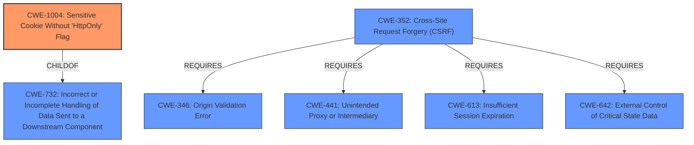

# Analysis for CVE-2020-15776

# Summary
| CWE ID    | CWE Name                                                  | Confidence | CWE Abstraction Level | CWE Vulnerability Mapping Label | CWE-Vulnerability Mapping Notes |
| :-------- | :-------------------------------------------------------- | :--------- | :-------------------- | :------------------------------ | :------------------------------ |
| CWE-1004  | Sensitive Cookie Without 'HttpOnly' Flag                | 1          | Variant               | Primary CWE                    | Allowed                       |
| CWE-352   | Cross-Site Request Forgery (CSRF)                         | 0.7        | Compound              | Secondary CWE                  | Allowed                       |

## Evidence and Confidence

*   **Confidence Score:** 0.85
*   **Evidence Strength:** HIGH

## Relationship Analysis
The primary CWE is CWE-1004, which is a variant of CWE-732 (Incorrect or Incomplete Handling of Data Sent to a Downstream Component). CWE-352 (Cross-Site Request Forgery (CSRF)) is a compound CWE that represents the broader attack, which relies on the weakness of the **missing HttpOnly flag**. CWE-352 also requires CWE-346 (Origin Validation Error), CWE-441 (Unintended Proxy or Intermediary), CWE-613 (Insufficient Session Expiration), and CWE-642 (External Control of Critical State Data) to be successful.

## Vulnerability Chain
The vulnerability chain starts with the **missing HttpOnly flag** on the CSRF prevention token cookie (CWE-1004), which allows an attacker to execute arbitrary code in the user's browser. This leads to the ability to impose an arbitrary value for the CSRF token, thus enabling a **cross-site request forgery** attack (CWE-352).

## Summary of Analysis
The primary weakness is the **Sensitive Cookie Without 'HttpOnly' Flag (CWE-1004)**. The vulnerability description states, "The CSRF prevention token is stored in a request cookie that is not annotated as HttpOnly." This directly matches the description of CWE-1004: "The product uses a cookie to store sensitive information, but the cookie is not marked with the HttpOnly flag." The **cross-site request forgery** (CWE-352) is the result of this **missing flag**.

The evidence is strong because the vulnerability description explicitly mentions the **missing HttpOnly flag** and the resulting **cross-site request forgery**. The retriever results also list CWE-1004 as the top combined result.

CWE-79 (Improper Neutralization of Input During Web Page Generation ('Cross-site Scripting')), CWE-918 (Server-Side Request Forgery (SSRF)), CWE-89 (Improper Neutralization of Special Elements used in an SQL Command ('SQL Injection')), and CWE-614 (Sensitive Cookie in HTTPS Session Without 'Secure' Attribute) were considered, but they do not accurately describe the root cause of this vulnerability. CWE-79 relates to improper neutralization of input, which is not the case here. CWE-918 and CWE-89 are related to server-side request forgery and SQL injection, respectively, which are also not relevant. CWE-614 is about the absence of the Secure attribute, but the reported weakness is about the absence of the HttpOnly attribute.