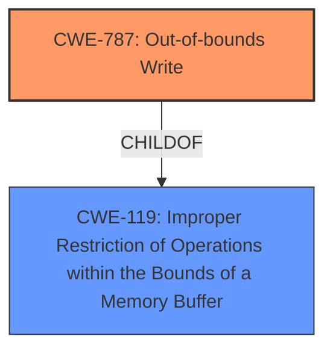

# Raw Analyzer Response for CVE-2020-15782

# Summary

| CWE ID | CWE Name | Confidence | CWE Abstraction Level | CWE Vulnerability Mapping Label | CWE-Vulnerability Mapping Notes |
|---|---|---|---|---|---|
| CWE-787 | Out-of-bounds Write | 0.9 | Base | Primary | Allowed |
| CWE-119 | Improper Restriction of Operations within the Bounds of a Memory Buffer | 0.7 | Class | Secondary | Discouraged |

## Evidence and Confidence

*   **Confidence Score:** 0.8
*   **Evidence Strength:** HIGH

## Relationship Analysis
The primary CWE selected is CWE-787, which is a child of CWE-119. CWE-119 is a more general class describing improper memory buffer operation restrictions, while CWE-787 specifically focuses on out-of-bounds writes. The relationship influenced the selection because the vulnerability description clearly indicates an ability to "write arbitrary data and code to protected memory areas," making CWE-787 the more precise and appropriate choice.

## Vulnerability Chain
The vulnerability chain starts with the **memory protection bypass** (**weakness**). This allows a remote attacker to write arbitrary data (**impact**) to protected memory. The root cause is the **memory protection bypass** itself, leading directly to the **out-of-bounds write**.

## Summary of Analysis
The initial analysis strongly suggested **CWE-787 (Out-of-bounds Write)** as the primary CWE due to the explicit mention of writing arbitrary data to protected memory. The **CVE Reference Links Content Summary** reinforces this by stating that the core issue is the ability to circumvent memory protection mechanisms, allowing unauthorized memory access. The provided vulnerability description states that "A remote unauthenticated attacker with network access to port 102/tcp could potentially write arbitrary data and code to protected memory areas or read sensitive data to launch further attacks."

The retriever results also listed CWE-119 as a top candidate, but the MITRE mapping guidance discourages the use of CWE-119 when more specific CWEs are available. Since the vulnerability description explicitly mentions the ability to "write arbitrary data and code to protected memory areas", **CWE-787** is a more accurate and specific representation of the vulnerability than its parent, **CWE-119**.

Relevant CWE Information:

# Enhanced Context (25 CWEs)

## CWE-226: Sensitive Information in Resource Not Removed Before Reuse
**Abstraction Level**: Base
**Similarity Score**: 0.74
**Source**: dense

**Description**:
The product releases a resource such as memory or a file so that it can be made available for reuse, but it does not clear or "zeroize" the information contained in the resource before the product performs a critical state transition or makes the resource available for reuse by other entities.

**Mapping Guidance**:
- Usage: Allowed
- Rationale: This CWE entry is at the Base level of abstraction, which is a preferred level of abstraction for mapping to the root causes of vulnerabilities.

*This CWE was not selected because the vulnerability is about writing to memory, not about reusing a resource.*

## CWE-838: Inappropriate Encoding for Output Context
**Abstraction Level**: Base
**Similarity Score**: 0.74
**Source**: dense

**Description**:
The product uses or specifies an encoding when generating output to a downstream component, but the specified encoding is not the same as the encoding that is expected by the downstream component.

**Mapping Guidance**:
- Usage: Allowed
- Rationale: This CWE entry is at the Base level of abstraction, which is a preferred level of abstraction for mapping to the root causes of vulnerabilities.

*This CWE was not selected because the vulnerability is not related to encoding issues.*

## CWE-405: Asymmetric Resource Consumption (Amplification)
**Abstraction Level**: Class
**Similarity Score**: 0.73
**Source**: dense

**Description**:
The product does not properly control situations in which an adversary can cause the product to consume or produce excessive resources without requiring the adversary to invest equivalent work or otherwise prove authorization, i.e., the adversary's influence is "asymmetric."

**Mapping Guidance**:
- Usage: Allowed-with-Review
- Rationale: This CWE entry is a Class and might have Base-level children that would be more appropriate

*This CWE was not selected because the vulnerability is not about resource consumption.*

## CWE-74: Improper Neutralization of Special Elements in Output Used by a Downstream Component ('Injection')
**Abstraction Level**: Class
**Similarity Score**: 0.73
**Source**: dense

**Description**:
The product constructs all or part of a command, data structure, or record using externally-influenced input from an upstream component, but it does not neutralize or incorrectly neutralizes special elements that could modify how it is parsed or interpreted when it is sent to a downstream component.

**Mapping Guidance**:
- Usage: Discouraged
- Rationale: CWE-74 is high-level and often misused when lower-level weaknesses are more appropriate.

*This CWE was not selected because the vulnerability is not related to injection.*

## CWE-915: Improperly Controlled Modification of Dynamically-Determined Object Attributes
**Abstraction Level**: Base
**Similarity Score**: 0.73
**Source**: dense

**Description**:
The product receives input from an upstream component that specifies multiple attributes, properties, or fields that are to be initialized or updated in an object, but it does not properly control which attributes can be modified.

**Mapping Guidance**:
- Usage: Allowed
- Rationale: This CWE entry is at the Base level of abstraction, which is a preferred level of abstraction for mapping to the root causes of vulnerabilities.

*This CWE was not selected because the vulnerability is about writing to memory, not object attribute modification.*

## CWE-99: Improper Control of Resource Identifiers ('Resource Injection')
**Abstraction Level**: Class
**Similarity Score**: 0.73
**Source**: dense

**Description**:
The product receives input from an upstream component, but it does not restrict or incorrectly restricts the input before it is used as an identifier for a resource that may be outside the intended sphere of control.

**Mapping Guidance**:
- Usage: Allowed-with-Review
- Rationale: This CWE entry is a Class and might have Base-level children that would be more appropriate

*This CWE was not selected because the vulnerability is not related to resource injection.*

## CWE-691: Insufficient Control Flow Management
**Abstraction Level**: Pillar
**Similarity Score**: 0.72
**Source**: dense

**Description**:
The code does not sufficiently manage its control flow during execution, creating conditions in which the control flow can be modified in unexpected ways.

**Mapping Guidance**:
- Usage: Discouraged
- Rationale: This CWE entry is extremely high-level, a Pillar. However, classification research is limited for weaknesses of this type, so there can be gaps or organizational difficulties within CWE that force use of this weakness, even at such a high level of abstraction.

*This CWE was not selected because it is too abstract.*

## CWE-470: Use of Externally-Controlled Input to Select Classes or Code ('Unsafe Reflection')
**Abstraction Level**: Base
**Similarity Score**: 0.72
**Source**: dense

**Description**:
The product uses external input with reflection to select which classes or code to use, but it does not sufficiently prevent the input from selecting improper classes or code.

**Mapping Guidance**:
- Usage: Allowed
- Rationale: This CWE entry is at the Base level of abstraction, which is a preferred level of abstraction for mapping to the root causes of vulnerabilities.

*This CWE was not selected because the vulnerability is not related to unsafe reflection.*

## CWE-799: Improper Control of Interaction Frequency
**Abstraction Level**: Class
**Similarity Score**: 0.72
**Source**: dense

**Description**:
The product does not properly limit the number or frequency of interactions that it has with an actor, such as the number of incoming requests.

**Mapping Guidance**:
- Usage: Allowed-with-Review
- Rationale: This CWE entry is a Class and might have Base-level children that would be more appropriate

*This CWE was not selected because the vulnerability is not related to interaction frequency.*

## CWE-664: Improper Control of a Resource Through its Lifetime
**Abstraction Level**: Pillar
**Similarity Score**: 0.72
**Source**: dense

**Description**:
The product does not maintain or incorrectly maintains control over a resource throughout its lifetime of creation, use, and release.

**Mapping Guidance**:
- Usage: Discouraged
- Rationale: This CWE entry is high-level when lower-level children are available.

*This CWE was not selected because it is too abstract.*

## CWE-119: Improper Restriction of Operations within the