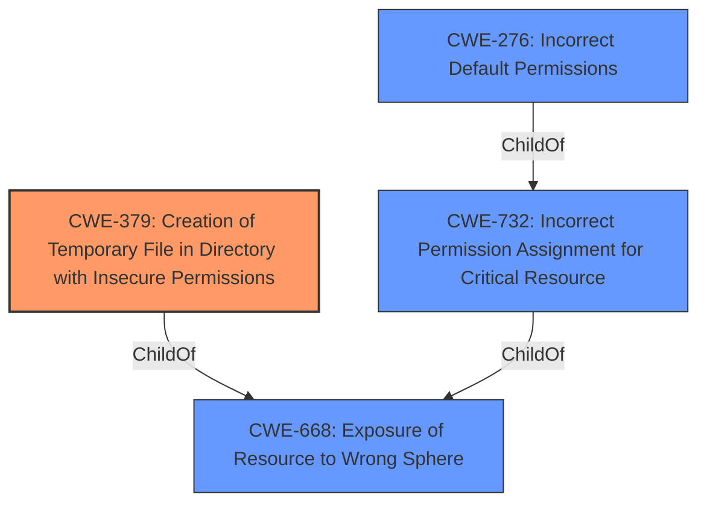

# Analysis for CVE-2020-15824

# Summary
| CWE ID | CWE Name | Confidence | CWE Abstraction Level | CWE Vulnerability Mapping Label | CWE-Vulnerability Mapping Notes |
|---|---|---|---|---|---|
| CWE-379 | Creation of Temporary File in Directory with Insecure Permissions | 0.9 | Base | Allowed | Primary CWE |
| CWE-668 | Exposure of Resource to Wrong Sphere | 0.7 | Class | Discouraged | Secondary Candidate |
| CWE-276 | Incorrect Default Permissions | 0.6 | Base | Allowed | Secondary Candidate |
| CWE-732 | Incorrect Permission Assignment for Critical Resource | 0.5 | Class | Allowed-with-Review | Secondary Candidate |

## Evidence and Confidence

*   **Confidence Score:** 0.9
*   **Evidence Strength:** HIGH

## Relationship Analysis
The primary CWE selected is CWE-379 (Base), indicating a specific flaw in the creation of temporary files. CWE-668 (Class) is a broader categorization, suggesting that the resource (the temporary file) is exposed to the wrong control sphere, which aligns with the vulnerability description, but is discouraged. CWE-276 and CWE-732 represent permission-related issues, with the former focusing on default permissions and the latter on incorrect assignment, also aligning with the **insecure permissions** issue. The relationship analysis indicates that CWE-379 is the most specific and appropriate choice, while the others offer broader perspectives.

## Vulnerability Chain
The vulnerability chain starts with the creation of temporary directories with overly permissive file permissions, leading to potential information disclosure and privilege escalation.

1.  **Root Cause:** **Insecure default file permissions on temporary directories** (CWE-379).
2.  **Weakness:** The `com.google.common.io.Files.createTempDir` method in Google Guava creates temporary directories with overly permissive file permissions.
3.  **Impact:** Local information disclosure and potential privilege escalation.

## Summary of Analysis
Initially, the analysis focused on identifying the root cause of the vulnerability. The **rootcause**, as explicitly stated, is the "**kotlin-main-kts cached scripts in the system temp directory**", highlighting the use of a shared temp directory and related to how the temporary directory is created. The CVE Reference Links Content Summary confirms this, stating that the `com.google.common.io.Files.createTempDir` method creates temporary directories with **overly permissive file permissions**. This directly points to CWE-379, which describes the "**Creation of Temporary File in Directory with Insecure Permissions**".

The retriever results also listed CWE-668 (Exposure of Resource to Wrong Sphere), CWE-732 (Incorrect Permission Assignment for Critical Resource), and CWE-276 (Incorrect Default Permissions) as potential matches. While these CWEs are relevant to the broader issue of insecure permissions, they are less specific than CWE-379. CWE-668 is a Class-level CWE and is discouraged for use when more specific CWEs are available. CWE-732, while related to permissions, is more about the incorrect assignment of permissions for critical resources, which is a consequence rather than the direct cause. CWE-276 is about incorrect default permissions during installation, which is not the case here as the permissions are incorrectly set during the creation of the temporary directory.

Therefore, the final selection is CWE-379, as it directly addresses the **root cause** of the vulnerability: the creation of a temporary file in a directory with **insecure permissions**. This aligns with the evidence and mapping guidance provided, ensuring the most specific and accurate classification.

Relevant CWE Information:
- CWE-379 Creation of Temporary File in Directory with Insecure Permissions
- CWE-668 Exposure of Resource to Wrong Sphere
- CWE-276 Incorrect Default Permissions
- CWE-732 Incorrect Permission Assignment for Critical Resource