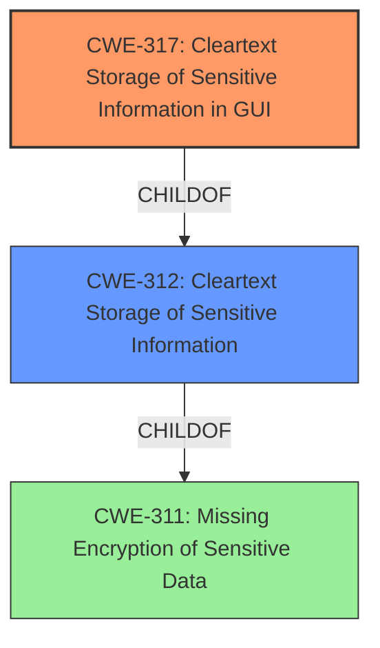

# Analysis Report for CVE-2020-15935

# Vulnerability Analysis Report: CVE-2020-15935

## Description


## Analysis (with Relationship Data)

# Summary
| CWE ID | CWE Name | Confidence | CWE Abstraction Level | CWE Vulnerability Mapping Label | CWE-Vulnerability Mapping Notes |
|---|---|---|---|---|---|
| CWE-317 | Cleartext Storage of Sensitive Information in GUI | 1.0 | Variant | Allowed | Primary CWE |
| CWE-312 | Cleartext Storage of Sensitive Information | 0.75 | Base | Allowed | Secondary Candidate |
| CWE-311 | Missing Encryption of Sensitive Data | 0.5 | Class | Discouraged | Secondary Candidate |

## Evidence and Confidence

*   **Confidence Score:** 0.9
*   **Evidence Strength:** HIGH

## Relationship Analysis
The primary CWE selected is CWE-317 (Cleartext Storage of Sensitive Information in GUI), which is a Variant of CWE-312 (Cleartext Storage of Sensitive Information). CWE-312, in turn, is a child of CWE-311 (Missing Encryption of Sensitive Data). This hierarchical relationship helped to narrow down the most specific CWE.



## Vulnerability Chain
The vulnerability chain starts with the **cleartext storage of sensitive information** in the GUI, which leads to a remote authenticated attacker being able to retrieve sensitive information by deobfuscating the password entry fields.

Root Cause: **Cleartext Storage of Sensitive Information** in the GUI (CWE-317)
Impact: Remote authenticated attacker can retrieve sensitive information.

## Summary of Analysis
The primary CWE selected is CWE-317 (Cleartext Storage of Sensitive Information in GUI) because the vulnerability description specifically states "**cleartext storage of sensitive information** in GUI". The evidence is strong because the "**rootcause:** **cleartext storage of sensitive information**" is explicitly mentioned in the "Vulnerability Description Key Phrases" and the "CVE Reference Links Content Summary" indicates that user passwords (LDAP), RADIUS shared secret, and the Elastic Cloud database password are not properly encrypted in the GUI.

CWE-312 (Cleartext Storage of Sensitive Information) was considered as a secondary CWE because it is a more general form of CWE-317. However, since the vulnerability is specifically related to the GUI, CWE-317 is a better fit.

CWE-311 (Missing Encryption of Sensitive Data) was also considered because the root cause involves the lack of encryption. However, CWE-312 and CWE-317 are more specific and thus more appropriate. The MITRE mapping guidance discourages the use of CWE-311 in favor of its more specific children.
The retriever also suggests the use of the lowest level that matches, so I am choosing the variant.

Relevant CWE Information:

# Enhanced Context (25 CWEs)

## CWE-312: Cleartext Storage of Sensitive Information
**Abstraction Level**: Base
**Similarity Score**: 0.84
**Source**: dense

**Description**:
The product stores sensitive information in cleartext within a resource that might be accessible to another control sphere.

**Mapping Guidance**:
- Usage: Allowed
- Rationale: This CWE entry is at the Base level of abstraction, which is a preferred level of abstraction for mapping to the root causes of vulnerabilities.

## CWE-316: Cleartext Storage of Sensitive Information in Memory
**Abstraction Level**: Variant
**Similarity Score**: 0.82
**Source**: dense

**Description**:
The product stores sensitive information in cleartext in memory.

**Mapping Guidance**:
- Usage: Allowed
- Rationale: This CWE entry is at the Variant level of abstraction, which is a preferred level of abstraction for mapping to the root causes of vulnerabilities.

## CWE-311: Missing Encryption of Sensitive Data
**Abstraction Level**: Class
**Similarity Score**: 0.80
**Source**: dense

**Description**:
The product does not encrypt sensitive or critical information before storage or transmission.

**Mapping Guidance**:
- Usage: Discouraged
- Rationale: CWE-311 is high-level with more precise children available. It is a level-1 Class (i.e., a child of a Pillar).

## CWE-313: Cleartext Storage in a File or on Disk
**Abstraction Level**: Variant
**Similarity Score**: 0.79
**Source**: dense

**Description**:
The product stores sensitive information in cleartext in a file, or on disk.

**Mapping Guidance**:
- Usage: Allowed
- Rationale: This CWE entry is at the Variant level of abstraction, which is a preferred level of abstraction for mapping to the root causes of vulnerabilities.

## CWE-317: Cleartext Storage of Sensitive Information in GUI
**Abstraction Level**: Variant
**Similarity Score**: 0.78
**Source**: dense

**Description**:
The product stores sensitive information in cleartext within the GUI.

**Mapping Guidance**:
- Usage: Allowed
- Rationale: This CWE entry is at the Variant level of abstraction, which is a preferred level of abstraction for mapping to the root causes of vulnerabilities.

## CWE-922: Insecure Storage of Sensitive Information
**Abstraction Level**: Class
**Similarity Score**: 0.77
**Source**: dense

**Description**:
The product stores sensitive information without properly limiting read or write access by unauthorized actors.

**Mapping Guidance**:
- Usage: Allowed-with-Review
- Rationale: This CWE entry is a Class and might have Base-level children that would be more appropriate

## CWE-319: Cleartext Transmission of Sensitive Information
**Abstraction Level**: Base
**Similarity Score**: 0.76
**Source**: dense

**Description**:
The product transmits sensitive or security-critical data in cleartext in a communication channel that can be sniffed by unauthorized actors.

**Mapping Guidance**:
- Usage: Allowed
- Rationale: This CWE entry is at the Base level of abstraction, which is a preferred level of abstraction for mapping to the root causes of vulnerabilities.

## CWE-538: Insertion of Sensitive Information into Externally-Accessible File or Directory
**Abstraction Level**: Base
**Similarity Score**: 0.76
**Source**: dense

**Description**:
The product places sensitive information into files or directories that are accessible to actors who are allowed to have access to the files, but not to the sensitive information.

**Mapping Guidance**:
- Usage: Allowed
- Rationale: This CWE entry is at the Base level of abstraction, which is a preferred level of abstraction for mapping to the root causes of vulnerabilities.

## CWE-226: Sensitive Information in Resource Not Removed Before Reuse
**Abstraction Level**: Base
**Similarity Score**: 0.75
**Source**: dense

**Description**:
The product releases a resource such as memory or a file so that it can be made available for reuse, but it does not clear or "zeroize" the information contained in the resource before the product performs a critical state transition or makes the resource available for reuse by other entities.

**Mapping Guidance**:
- Usage: Allowed
- Rationale: This CWE entry is at the Base level of abstraction, which is a preferred level of abstraction for mapping to the root causes of vulnerabilities.

## CWE-257: Storing Passwords in a Recoverable Format
**Abstraction Level**: Base
**Similarity Score**: 0.75
**Source**: dense

**Description**:
The storage of passwords in a recoverable format makes them subject to password reuse attacks by malicious users. In fact, it should be noted that recoverable encrypted passwords provide no significant benefit over plaintext passwords since they are subject not only to reuse by malicious attackers but also by malicious insiders. If a system administrator can recover a password directly, or use a brute force search on the available information, the administrator can use the password on other accounts.

**Mapping Guidance**:
- Usage: Allowed
- Rationale: This CWE entry is at the Base level of abstraction, which is a preferred level of abstraction for mapping to the root causes of vulnerabilities.

## CWE-312: Cleartext Storage of Sensitive Information
**Abstraction Level**: Base
**Similarity Score**: 5147.10
**Source**: sparse

**Description**:
The product stores sensitive information in cleartext within a resource that might be accessible to another control sphere.

**Mapping Guidance**:
- Usage: Allowed
- Rationale: This CWE entry is at the Base level of abstraction, which is a preferred level of abstraction for mapping to the root causes of vulnerabilities.

## CWE-319: Cleartext Transmission of Sensitive Information
**Abstraction Level**: Base
**Similarity Score**: 4878.83
**Source**: sparse


## CWE Relationship Analysis

Current CWEs represent these abstraction levels: .


### Vulnerability Chain Analysis

**Chain starting from CWE-312:**
- 312 (Cleartext Storage of Sensitive Information) - ROOT


**Chain starting from CWE-311:**
- 311 (Missing Encryption of Sensitive Data) - ROOT


### CWE Relationship Diagram

```mermaid
graph TD
    classDef primary fill:#f96,stroke:#333,stroke-width:2px
    classDef secondary fill:#69f,stroke:#333
    classDef tertiary fill:#9e9,stroke:#333
```


*Report generated on 2025-04-02 07:29:16*
