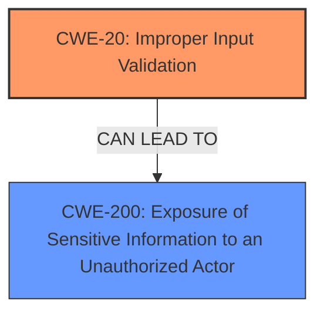

# Analysis for CVE-2020-15936

# Summary
| CWE ID | CWE Name | Confidence | CWE Abstraction Level | CWE Vulnerability Mapping Label | CWE-Vulnerability Mapping Notes |
|---|---|---|---|---|---|
| CWE-20 | Improper Input Validation | 0.9 | Class | Primary | Allowed |
| CWE-200 | Exposure of Sensitive Information to an Unauthorized Actor | 0.7 | Class | Secondary | Discouraged |

## Evidence and Confidence

*   **Confidence Score:** 0.8
*   **Evidence Strength:** HIGH

## Relationship Analysis
The primary CWE is CWE-20, which is a parent of many other CWEs. CWE-200 is related as an impact of the **improper input validation**.



## Vulnerability Chain
The vulnerability chain starts with **improper input validation** (CWE-20), which then leads to the disclosure of sensitive information (CWE-200).

## Summary of Analysis
The vulnerability description indicates that there is an **improper input validation** issue that leads to sensitive information disclosure. The retriever results also list CWE-200, Exposure of Sensitive Information to an Unauthorized Actor.

Based on the provided evidence, the primary weakness is CWE-20 Improper Input Validation. The vulnerability description explicitly mentions **"improper input validation"** as the root cause. The description also mentions that this leads to the disclosure of sensitive information. Therefore, CWE-200 is listed as secondary.

The selection of CWE-20 is based on the root cause identified in the vulnerability description. CWE-200 is chosen as an impact.

Relevant CWE Information:

# Enhanced Context (25 CWEs)
The following CWEs were identified as potentially relevant to this vulnerability:

## CWE-23: Relative Path Traversal
**Abstraction Level**: Base
**Similarity Score**: 0.79
**Source**: dense

**Description**:
The product uses external input to construct a pathname that should be within a restricted directory, but it does not properly neutralize sequences such as ".." that can resolve to a location that is outside of that directory.

**Mapping Guidance**:
- Usage: Allowed
- Rationale: This CWE entry is at the Base level of abstraction, which is a preferred level of abstraction for mapping to the root causes of vulnerabilities.

## CWE-41: Improper Resolution of Path Equivalence
**Abstraction Level**: Base
**Similarity Score**: 0.78
**Source**: dense

**Description**:
The product is vulnerable to file system contents disclosure through path equivalence. Path equivalence involves the use of special characters in file and directory names. The associated manipulations are intended to generate multiple names for the same object.

**Mapping Guidance**:
- Usage: Allowed
- Rationale: This CWE entry is at the Base level of abstraction, which is a preferred level of abstraction for mapping to the root causes of vulnerabilities.

## CWE-73: External Control of File Name or Path
**Abstraction Level**: Base
**Similarity Score**: 0.78
**Source**: dense

**Description**:
The product allows user input to control or influence paths or file names that are used in filesystem operations.

**Mapping Guidance**:
- Usage: Allowed
- Rationale: This CWE entry is at the Base level of abstraction, which is a preferred level of abstraction for mapping to the root causes of vulnerabilities.

## CWE-36: Absolute Path Traversal
**Abstraction Level**: Base
**Similarity Score**: 0.77
**Source**: dense

**Description**:
The product uses external input to construct a pathname that should be within a restricted directory, but it does not properly neutralize absolute path sequences such as "/abs/path" that can resolve to a location that is outside of that directory.

**Mapping Guidance**:
- Usage: Allowed
- Rationale: This CWE entry is at the Base level of abstraction, which is a preferred level of abstraction for mapping to the root causes of vulnerabilities.

## CWE-668: Exposure of Resource to Wrong Sphere
**Abstraction Level**: Class
**Similarity Score**: 0.77
**Source**: dense

**Description**:
The product exposes a resource to the wrong control sphere, providing unintended actors with inappropriate access to the resource.

**Mapping Guidance**:
- Usage: Discouraged
- Rationale: CWE-668 is high-level and is often misused as a catch-all when lower-level CWE IDs might be applicable. It is sometimes used for low-information vulnerability reports [REF-1287]. It is a level-1 Class (i.e., a child of a Pillar). It is not useful for trend analysis.

## CWE-59: Improper Link Resolution Before File Access ('Link Following')
**Abstraction Level**: Base
**Similarity Score**: 0.77
**Source**: dense

**Description**:
The product attempts to access a file based on the filename, but it does not properly prevent that filename from identifying a link or shortcut that resolves to an unintended resource.

**Mapping Guidance**:
- Usage: Allowed
- Rationale: This CWE entry is at the Base level of abstraction, which is a preferred level of abstraction for mapping to the root causes of vulnerabilities.

## CWE-538: Insertion of Sensitive Information into Externally-Accessible File or Directory
**Abstraction Level**: Base
**Similarity Score**: 0.77
**Source**: dense

**Description**:
The product places sensitive information into files or directories that are accessible to actors who are allowed to have access to the files, but not to the sensitive information.

**Mapping Guidance**:
- Usage: Allowed
- Rationale: This CWE entry is at the Base level of abstraction, which is a preferred level of abstraction for mapping to the root causes of vulnerabilities.

## CWE-552: Files or Directories Accessible to External Parties
**Abstraction Level**: Base
**Similarity Score**: 0.76
**Source**: dense

**Description**:
The product makes files or directories accessible to unauthorized actors, even though they should not be.

**Mapping Guidance**:
- Usage: Allowed
- Rationale: This CWE entry is at the Base level of abstraction, which is a preferred level of abstraction for mapping to the root causes of vulnerabilities.

## CWE-74: Improper Neutralization of Special Elements in Output Used by a Downstream Component ('Injection')
**Abstraction Level**: Class
**Similarity Score**: 0.76
**Source**: dense

**Description**:
The product constructs all or part of a command, data structure, or record using externally-influenced input from an upstream component, but it does not neutralize or incorrectly neutralizes special elements that could modify how it is parsed or interpreted when it is sent to a downstream component.

**Mapping Guidance**:
- Usage: Discouraged
- Rationale: CWE-74 is high-level and often misused when lower-level weaknesses are more appropriate.

## CWE-1289: Improper Validation of Unsafe Equivalence in Input
**Abstraction Level**: Base
**Similarity Score**: 0.76
**Source**: dense

**Description**:
The product receives an input value that is used as a resource identifier or other type of reference, but it does not validate or incorrectly validates that the input is equivalent to a potentially-unsafe value.

**Mapping Guidance**:
- Usage: Allowed
- Rationale: This CWE entry is at the Base level of abstraction, which is a preferred level of abstraction for mapping to the root causes of vulnerabilities.

## CWE-79: Improper Neutralization of Input During Web Page Generation ('Cross-site Scripting')
**Abstraction Level**: Base
**Similarity Score**: 8926.75
**Source**: sparse

**Description**:
The product does not neutralize or incorrectly neutralizes user-controllable input before it is placed in output that is used as a web page that is served to other users.

**Mapping Guidance**:
- Usage: Allowed
- Rationale: This CWE entry is at the Base level of abstraction, which is a preferred level of abstraction for mapping to the root causes of vulnerabilities.

## CWE-22: Improper Limitation of a Pathname to a Restricted Directory ('Path Traversal')
**Abstraction Level**: Base
**Similarity Score**: 8876.48
**Source**: sparse

**Description**:
The product uses external input to construct a pathname that is intended to identify a file or directory that is located underneath a restricted parent directory, but the product does not properly neutralize special elements within the pathname that can cause the pathname to resolve to a location that is outside of the restricted directory.

**Mapping Guidance**:
- Usage: Allowed
- Rationale: This CWE entry is at the Base level of abstraction, which is a preferred level of abstraction for mapping to the root causes of vulnerabilities.

## CWE-200: Exposure of Sensitive Information to an Unauthorized Actor
**Abstraction Level**: Class
**Similarity Score**: 8675.77
**Source**: sparse

**Description**:
The product exposes sensitive information to an actor that

# Enhanced Query for CVE-2020-15936

## Vulnerability Description
A **improper input validation** in Fortinet FortiGate version 6.4.3 and below, version 6.2.5 and below, version 6.0.11 and below, version 5.6.13 and below allows attacker to disclose sensitive information via SNI Client Hello TLS packets.

### Vulnerability Description Key Phrases
- **rootcause:** **improper input validation**
- **impact:** disclose sensitive information
- **attacker:** attacker
- **product:** Fortinet FortiGate
- **version:** version 6.4.3 and below and version 6.2.5 and below and version 6.0.11 and below and version 5.6.13 and below

## Retriever Results

### Top Combined Results

| Rank | CWE ID | Name | Abstraction | Usage  | Retrievers | Individual Scores |
|------|--------|------|-------------|-------|------------|-------------------|
| 1 | 73 | External Control of File Name or Path | Base | Allowed | sparse | 0.255 |
| 2 | 1286 | Improper Validation of Syntactic Correctness of Input | Base | Allowed | sparse | 0.251 |
| 3 | 78 | Improper Neutralization of Special Elements used in an OS Command ('OS Command Injection') | Base | Allowed | sparse | 0.248 |
| 4 | 444 | Inconsistent Interpretation of HTTP Requests ('HTTP Request/Response Smuggling') | Base | Allowed | sparse | 0.244 |
| 5 | 297 | Improper Validation of Certificate with Host Mismatch | Variant | Allowed | sparse | 0.244 |
| 6 | 550 | Server-generated Error Message Containing Sensitive Information | Variant | Allowed | dense | 0.548 |
| 7 | 79 | Improper Neutralization of Input During Web Page Generation ('Cross-site Scripting') | Base | Allowed | graph | 0.002 |
| 8 | 200 | Exposure of Sensitive Information to an Unauthorized Actor | Class | Discouraged | sparse | 0.239 |
| 9 | 284 | Improper Access Control | Pillar | Discouraged | sparse | 0.238 |
| 10 | 23 | Relative Path Traversal | Base | Allowed | sparse | 0.233 |


# Complete CWE Specifications


## CWE-73: External Control of File Name or Path
**Abstraction:** Base
**Status:** Draft

### Description
The product allows user input to control or influence paths or file names that are used in filesystem operations.

### Extended Description


This could allow an attacker to access or modify system files or other files that are critical to the application.


Path manipulation errors occur when the following two conditions are met:

```
		1. An attacker can specify a path used in an operation on the filesystem.
		2. By specifying the resource, the attacker gains a capability that would not otherwise be permitted.
```
For example, the program may give the attacker the ability to overwrite the specified file or run with a configuration controlled by the attacker.

### Alternative Terms
None

### Relationships
ChildOf -> CWE-642
ChildOf -> CWE-610
ChildOf -> CWE-20
CanPrecede -> CWE-22
CanPrecede -> CWE-41
CanPrecede -> CWE-98
CanPrecede -> CWE-434
CanPrecede -> CWE-59

### Mapping Guidance
**Usage:** Allowed
**Rationale:** This CWE entry is at the Base level of abstraction, which is a preferred level of abstraction for mapping to the root causes of vulnerabilities.
**Comments:** Carefully read both the name and description to ensure that this mapping is an appropriate fit. Do not try to 'force' a mapping to a lower-level Base/Variant simply to comply with this preferred level of abstraction.
**Reasons:**
- Acceptable-Use


### Additional Notes
**[Maintenance]** CWE-114 is a Class, but it is listed a child of CWE-73 in view 1000. This suggests some abstraction problems that should be resolved in future versions.

**[Relationship]** 

The external control of filenames can be the primary link in chains with other file-related weaknesses, as seen in the CanPrecede relationships. This is because software systems use files for many different purposes: to execute programs, load code libraries, to store application data, to store configuration settings, record temporary data, act as signals or semaphores to other processes, etc.


However, those weaknesses do not always require external control. For example, link-following weaknesses (CWE-59) often involve pathnames that are not controllable by the attacker at all.


The external control can be resultant from other issues. For example, in PHP applications, the register_globals setting can allow an attacker to modify variables that the programmer thought were immutable, enabling file inclusion (CWE-98) and path traversal (CWE-22). Operating with excessive privileges (CWE-250) might allow an attacker to specify an input filename that is not directly readable by the attacker, but is accessible to the privileged program. A buffer overflow (CWE-119) might give an attacker control over nearby memory locations that are related to pathnames, but were not directly modifiable by the attacker.


### Observed Examples
- **CVE-2022-45918:** Chain: a learning management tool debugger uses external input to locate previous session logs (CWE-73) and does not properly validate the given path (CWE-20), allowing for filesystem path traversal using "../" sequences (CWE-24)
- **CVE-2008-5748:** Chain: external control of values for user's desired language and theme enables path traversal.
- **CVE-2008-5764:** Chain: external control of user's target language enables remote file inclusion.


## CWE-1286: Improper Validation of Syntactic Correctness of Input
**Abstraction:** Base
**Status:** Incomplete

### Description
The product receives input that is expected to be well-formed - i.e., to comply with a certain syntax - but it does not validate or incorrectly validates that the input complies with the syntax.

### Extended Description


Often, complex inputs are expected to follow a particular syntax, which is either assumed by the input itself, or declared within metadata such as headers. The syntax could be for data exchange formats, markup languages, or even programming languages. When untrusted input is not properly validated for the expected syntax, attackers could cause parsing failures, trigger unexpected errors, or expose latent vulnerabilities that might not be directly exploitable if the input had conformed to the syntax.


### Alternative Terms
None

### Relationships
ChildOf -> CWE-20

### Mapping Guidance
**Usage:** Allowed
**Rationale:** This CWE entry is at the Base level of abstraction, which is a preferred level of abstraction for mapping to the root causes of vulnerabilities.
**Comments:** Carefully read both the name and description to ensure that this mapping is an appropriate fit. Do not try to 'force' a mapping to a lower-level Base/Variant simply to comply with this preferred level of abstraction.
**Reasons:**
- Acceptable-Use


### Additional Notes
**[Maintenance]** This entry is still under development and will continue to see updates and content improvements.


### Observed Examples
- **CVE-2016-4029:** Chain: incorrect validation of intended decimal-based IP address format (CWE-1286) enables parsing of octal or hexadecimal formats (CWE-1389), allowing bypass of an SSRF protection mechanism (CWE-918).
- **CVE-2007-5893:** HTTP request with missing protocol version number leads to crash


## CWE-78: Improper Neutralization of Special Elements used in an OS Command ('OS Command Injection')
**Abstraction:** Base
**Status:** Stable

### Description
The product constructs all or part of an OS command using externally-influenced input from an upstream component, but it does not neutralize or incorrectly neutralizes special elements that could modify the intended OS command when it is sent to a downstream component.

### Extended Description


This weakness can lead to a vulnerability in environments in which the attacker does not have direct access to the operating system, such as in web applications. Alternately, if the weakness occurs in a privileged program, it could allow the attacker to specify commands that normally would not be accessible, or to call alternate commands with privileges that the attacker does not have. The problem is exacerbated if the compromised process does not follow the principle of least privilege, because the attacker-controlled commands may run with special system privileges that increases the amount of damage.


There are at least two subtypes of OS command injection:


  - The application intends to execute a single, fixed program that is under its own control. It intends to use externally-supplied inputs as arguments to that program. For example, the program might use system("nslookup [HOSTNAME]") to run nslookup and allow the user to supply a HOSTNAME, which is used as an argument. Attackers cannot prevent nslookup from executing. However, if the program does not remove command separators from the HOSTNAME argument, attackers could place the separators into the arguments, which allows them to execute their own program after nslookup has finished executing.

  - The application accepts an input that it uses to fully select which program to run, as well as which commands to use. The application simply redirects this entire command to the operating system. For example, the program might use "exec([COMMAND])" to execute the [COMMAND] that was supplied by the user. If the COMMAND is under attacker control, then the attacker can execute arbitrary commands or programs. If the command is being executed using functions like exec() and CreateProcess(), the attacker might not be able to combine multiple commands together in the same line.

From a weakness standpoint, these variants represent distinct programmer errors. In the first variant, the programmer clearly intends that input from untrusted parties will be part of the arguments in the command to be executed. In the second variant, the programmer does not intend for the command to be accessible to any untrusted party, but the programmer probably has not accounted for alternate ways in which malicious attackers can provide input.

### Alternative Terms
Shell injection
Shell metacharacters
OS Command Injection

### Relationships
ChildOf -> CWE-77
ChildOf -> CWE-74
ChildOf -> CWE-77
ChildOf -> CWE-77
CanAlsoBe -> CWE-88

### Mapping Guidance
**Usage:** Allowed
**Rationale:** This CWE entry is at the Base level of abstraction, which is a preferred level of abstraction for mapping to the root causes of vulnerabilities.
**Comments:** Carefully read both the name and description to ensure that this mapping is an appropriate fit. Do not try to 'force' a mapping to a lower-level Base/Variant simply to comply with this preferred level of abstraction.
**Reasons:**
- Acceptable-Use


### Additional Notes
**[Terminology]** The "OS command injection" phrase carries different meanings to different people. For some people, it only refers to cases in which the attacker injects command separators into arguments for an application-controlled program that is being invoked. For some people, it refers to any type of attack that can allow the attacker to execute OS commands of their own choosing. This usage could include untrusted search path weaknesses (CWE-426) that cause the application to find and execute an attacker-controlled program. Further complicating the issue is the case when argument injection (CWE-88) allows alternate command-line switches or options to be inserted into the command line, such as an "-exec" switch whose purpose may be to execute the subsequent argument as a command (this -exec switch exists in the UNIX "find" command, for example). In this latter case, however, CWE-88 could be regarded as the primary weakness in a chain with CWE-78.

**[Research Gap]** More investigation is needed into the distinction between the OS command injection variants, including the role with argument injection (CWE-88). Equivalent distinctions may exist in other injection-related problems such as SQL injection.


### Observed Examples
- **CVE-2020-10987:** OS command injection in Wi-Fi router, as exploited in the wild per CISA KEV.
- **CVE-2020-10221:** Template functionality in network configuration management tool allows OS command injection, as exploited in the wild per CISA KEV.
- **CVE-2020-9054:** Chain: improper input validation (CWE-20) in username parameter, leading to OS command injection (CWE-78), as exploited in the wild per CISA KEV.


## CWE-444: Inconsistent Interpretation of HTTP Requests ('HTTP Request/Response Smuggling')
**Abstraction:** Base
**Status:** Incomplete

### Description
The product acts as an intermediary HTTP agent
         (such as a proxy or firewall) in the data flow between two
         entities such as a client and server, but it does not
         interpret malformed HTTP requests or responses in ways that
         are consistent with how the messages will be processed by
         those entities that are at the ultimate destination.

### Extended Description


HTTP requests or responses ("messages") can be malformed or unexpected in ways that cause web servers or clients to interpret the messages in different ways than intermediary HTTP agents such as load balancers, reverse proxies, web caching proxies, application firewalls, etc. For example, an adversary may be able to add duplicate or different header fields that a client or server might interpret as one set of messages, whereas the intermediary might interpret the same sequence of bytes as a different set of messages. For example, discrepancies can arise in how to handle duplicate headers like two Transfer-encoding (TE) or two Content-length (CL), or the malicious HTTP message will have different headers for TE and CL.


The inconsistent parsing and interpretation of messages can allow the adversary to "smuggle" a message to the client/server without the intermediary being aware of it.


This weakness is usually the result of the usage of outdated or incompatible HTTP protocol versions in the HTTP agents.


### Alternative Terms
HTTP Request Smuggling
HTTP Response Smuggling
HTTP Smuggling

### Relationships
ChildOf -> CWE-436
ChildOf -> CWE-436

### Mapping Guidance
**Usage:** Allowed
**Rationale:** This CWE entry is at the Base level of abstraction, which is a preferred level of abstraction for mapping to the root causes of vulnerabilities.
**Comments:** Carefully read both the name and description to ensure that this mapping is an appropriate fit. Do not try to 'force' a mapping to a lower-level Base/Variant simply to comply with this preferred level of abstraction.
**Reasons:**
- Acceptable-Use


### Additional Notes
**[Theoretical]** Request smuggling can be performed due to a multiple interpretation error, where the target is an intermediary or monitor, via a consistency manipulation (Transfer-Encoding and Content-Length headers).


### Observed Examples
- **CVE-2022-24766:** SSL/TLS-capable proxy allows HTTP smuggling when used in tandem with HTTP/1.0 services, due to inconsistent interpretation and input sanitization of HTTP messages within the body of another message
- **CVE-2021-37147:** Chain: caching proxy server has improper input validation (CWE-20) of headers, allowing HTTP response smuggling (CWE-444) using an "LF line ending"
- **CVE-2020-8287:** Node.js platform allows request smuggling via two Transfer-Encoding headers


## CWE-297: Improper Validation of Certificate with Host Mismatch
**Abstraction:** Variant
**Status:** Incomplete

### Description
The product communicates with a host that provides a certificate, but the product does not properly ensure that the certificate is actually associated with that host.

### Extended Description


Even if a certificate is well-formed, signed, and follows the chain of trust, it may simply be a valid certificate for a different site than the site that the product is interacting with. If the certificate's host-specific data is not properly checked - such as the Common Name (CN) in the Subject or the Subject Alternative Name (SAN) extension of an X.509 certificate - it may be possible for a redirection or spoofing attack to allow a malicious host with a valid certificate to provide data, impersonating a trusted host. In order to ensure data integrity, the certificate must be valid and it must pertain to the site that is being accessed.


Even if the product attempts to check the hostname, it is still possible to incorrectly check the hostname. For example, attackers could create a certificate with a name that begins with a trusted name followed by a NUL byte, which could cause some string-based comparisons to only examine the portion that contains the trusted name.


This weakness can occur even when the product uses Certificate Pinning, if the product does not verify the hostname at the time a certificate is pinned.


### Alternative Terms
None

### Relationships
ChildOf -> CWE-923
ChildOf -> CWE-295

### Mapping Guidance
**Usage:** Allowed
**Rationale:** This CWE entry is at the Variant level of abstraction, which is a preferred level of abstraction for mapping to the root causes of vulnerabilities.
**Comments:** Carefully read both the name and description to ensure that this mapping is an appropriate fit. Do not try to 'force' a mapping to a lower-level Base/Variant simply to comply with this preferred level of abstraction.
**Reasons:**
- Acceptable-Use


### Observed Examples
- **CVE-2012-5810:** Mobile banking application does not verify hostname, leading to financial loss.
- **CVE-2012-5811:** Mobile application for printing documents does not verify hostname, allowing attackers to read sensitive documents.
- **CVE-2012-5807:** Software for electronic checking does not verify hostname, leading to financial loss.


## CWE-550: Server-generated Error Message Containing Sensitive Information
**Abstraction:** Variant
**Status:** Incomplete

### Description
Certain conditions, such as network failure, will cause a server error message to be displayed.

### Extended Description
While error messages in and of themselves are not dangerous, per se, it is what an attacker can glean from them that might cause eventual problems.

### Alternative Terms
None

### Relationships
ChildOf -> CWE-209

### Mapping Guidance
**Usage:** Allowed
**Rationale:** This CWE entry is at the Variant level of abstraction, which is a preferred level of abstraction for mapping to the root causes of vulnerabilities.
**Comments:** Carefully read both the name and description to ensure that this mapping is an appropriate fit. Do not try to 'force' a mapping to a lower-level Base/Variant simply to comply with this preferred level of abstraction.
**Reasons:**
- Acceptable-Use


## CWE-79: Improper Neutralization of Input During Web Page Generation ('Cross-site Scripting')
**Abstraction:** Base
**Status:** Stable

### Description
The product does not neutralize or incorrectly neutralizes user-controllable input before it is placed in output that is used as a web page that is served to other users.

### Extended Description


Cross-site scripting (XSS) vulnerabilities occur when:


  1. Untrusted data enters a web application, typically from a web request.

  1. The web application dynamically generates a web page that contains this untrusted data.

  1. During page generation, the application does not prevent the data from containing content that is executable by a web browser, such as JavaScript, HTML tags, HTML attributes, mouse events, Flash, ActiveX, etc.

  1. A victim visits the generated web page through a web browser, which contains malicious script that was injected using the untrusted data.

  1. Since the script comes from a web page that was sent by the web server, the victim's web browser executes the malicious script in the context of the web server's domain.

  1. This effectively violates the intention of the web browser's same-origin policy, which states that scripts in one domain should not be able to access resources or run code in a different domain.

There are three main kinds of XSS:

  -  **Type 1: Reflected XSS (or Non-Persistent)**  - The server reads data directly from the HTTP request and reflects it back in the HTTP response. Reflected XSS exploits occur when an attacker causes a victim to supply dangerous content to a vulnerable web application, which is then reflected back to the victim and executed by the web browser. The most common mechanism for delivering malicious content is to include it as a parameter in a URL that is posted publicly or e-mailed directly to the victim. URLs constructed in this manner constitute the core of many phishing schemes, whereby an attacker convinces a victim to visit a URL that refers to a vulnerable site. After the site reflects the attacker's content back to the victim, the content is executed by the victim's browser.

  -  **Type 2: Stored XSS (or Persistent)**  - The application stores dangerous data in a database, message forum, visitor log, or other trusted data store. At a later time, the dangerous data is subsequently read back into the application and included in dynamic content. From an attacker's perspective, the optimal place to inject malicious content is in an area that is displayed to either many users or particularly interesting users. Interesting users typically have elevated privileges in the application or interact with sensitive data that is valuable to the attacker. If one of these users executes malicious content, the attacker may be able to perform privileged operations on behalf of the user or gain access to sensitive data belonging to the user. For example, the attacker might inject XSS into a log message, which might not be handled properly when an administrator views the logs. 

  -  **Type 0: DOM-Based XSS**  - In DOM-based XSS, the client performs the injection of XSS into the page; in the other types, the server performs the injection. DOM-based XSS generally involves server-controlled, trusted script that is sent to the client, such as Javascript that performs sanity checks on a form before the user submits it. If the server-supplied script processes user-supplied data and then injects it back into the web page (such as with dynamic HTML), then DOM-based XSS is possible. 

Once the malicious script is injected, the attacker can perform a variety of malicious activities. The attacker could transfer private information, such as cookies that may include session information, from the victim's machine to the attacker. The attacker could send malicious requests to a web site on behalf of the victim, which could be especially dangerous to the site if the victim has administrator privileges to manage that site. Phishing attacks could be used to emulate trusted web sites and trick the victim into entering a password, allowing the attacker to compromise the victim's account on that web site. Finally, the script could exploit a vulnerability in the web browser itself possibly taking over the victim's machine, sometimes referred to as "drive-by hacking."

In many cases, the attack can be launched without the victim even being aware of it. Even with careful users, attackers frequently use a variety of methods to encode the malicious portion of the attack, such as URL encoding or Unicode, so the request looks less suspicious.


### Alternative Terms
XSS: A common abbreviation for Cross-Site Scripting.
HTML Injection: Used as a synonym of stored (Type 2) XSS.
CSS: In the early years after initial discovery of XSS, "CSS" was a commonly-used acronym. However, this would cause confusion with "Cascading Style Sheets," so usage of this acronym has declined significantly.

### Relationships
ChildOf -> CWE-74
ChildOf -> CWE-74
CanPrecede -> CWE-494
PeerOf -> CWE-352

### Mapping Guidance
**Usage:** Allowed
**Rationale:** This CWE entry is at the Base level of abstraction, which is a preferred level of abstraction for mapping to the root causes of vulnerabilities.
**Comments:** Carefully read both the name and description to ensure that this mapping is an appropriate fit. Do not try to 'force' a mapping to a lower-level Base/Variant simply to comply with this preferred level of abstraction.
**Reasons:**
- Acceptable-Use


### Additional Notes
**[Relationship]** 

There can be a close relationship between XSS and CSRF (CWE-352). An attacker might use CSRF in order to trick the victim into submitting requests to the server in which the requests contain an XSS payload. A well-known example of this was the Samy worm on MySpace [REF-956]. The worm used XSS to insert malicious HTML sequences into a user's profile and add the attacker as a MySpace friend. MySpace friends of that victim would then execute the payload to modify their own profiles, causing the worm to propagate exponentially. Since the victims did not intentionally insert the malicious script themselves, CSRF was a root cause.


**[Applicable Platform]** 

XSS flaws are very common in web applications, since they require a great deal of developer discipline to avoid them.


### Observed Examples
- **CVE-2021-25926:** Python Library Manager did not sufficiently neutralize a user-supplied search term, allowing reflected XSS.
- **CVE-2021-25963:** Python-based e-commerce platform did not escape returned content on error pages, allowing for reflected Cross-Site Scripting attacks.
- **CVE-2021-1879:** Universal XSS in mobile operating system, as exploited in the wild per CISA KEV.


## CWE-200: Exposure of Sensitive Information to an Unauthorized Actor
**Abstraction:** Class
**Status:** Draft

### Description
The product exposes sensitive information to an actor that is not explicitly authorized to have access to that information.

### Extended Description


There are many different kinds of mistakes that introduce information exposures. The severity of the error can range widely, depending on the context in which the product operates, the type of sensitive information that is revealed, and the benefits it may provide to an attacker. Some kinds of sensitive information include:


  - private, personal information, such as personal messages, financial data, health records, geographic location, or contact details

  - system status and environment, such as the operating system and installed packages

  - business secrets and intellectual property

  - network status and configuration

  - the product's own code or internal state

  - metadata, e.g. logging of connections or message headers

  - indirect information, such as a discrepancy between two internal operations that can be observed by an outsider

Information might be sensitive to different parties, each of which may have their own expectations for whether the information should be protected. These parties include:

  - the product's own users

  - people or organizations whose information is created or used by the product, even if they are not direct product users

  - the product's administrators, including the admins of the system(s) and/or networks on which the product operates

  - the developer

Information exposures can occur in different ways:

  - the code  **explicitly inserts**  sensitive information into resources or messages that are intentionally made accessible to unauthorized actors, but should not contain the information - i.e., the information should have been "scrubbed" or "sanitized"

  - a different weakness or mistake  **indirectly inserts**  the sensitive information into resources, such as a web script error revealing the full system path of the program.

  - the code manages resources that intentionally contain sensitive information, but the resources are  **unintentionally made accessible**  to unauthorized actors. In this case, the information exposure is resultant - i.e., a different weakness enabled the access to the information in the first place.

It is common practice to describe any loss of confidentiality as an "information exposure," but this can lead to overuse of CWE-200 in CWE mapping. From the CWE perspective, loss of confidentiality is a technical impact that can arise from dozens of different weaknesses, such as insecure file permissions or out-of-bounds read. CWE-200 and its lower-level descendants are intended to cover the mistakes that occur in behaviors that explicitly manage, store, transfer, or cleanse sensitive information.

### Alternative Terms
Information Disclosure: This term is frequently used in vulnerability advisories to describe a consequence or technical impact, for any vulnerability that has a loss of confidentiality. Often, CWE-200 can be misused to represent the loss of confidentiality, even when the mistake - i.e., the weakness - is not directly related to the mishandling of the information itself, such as an out-of-bounds read that accesses sensitive memory contents; here, the out-of-bounds read is the primary weakness, not the disclosure of the memory. In addition, this phrase is also used frequently in policies and legal documents, but it does not refer to any disclosure of security-relevant information.
Information Leak: This is a frequently used term, however the "leak" term has multiple uses within security. In some cases it deals with the accidental exposure of information from a different weakness, but in other cases (such as "memory leak"), this deals with improper tracking of resources, which can lead to exhaustion. As a result, CWE is actively avoiding usage of the "leak" term.

### Relationships
ChildOf -> CWE-668

### Mapping Guidance
**Usage:** Discouraged
**Rationale:** CWE-200 is commonly misused to represent the loss of confidentiality in a vulnerability, but confidentiality loss is a technical impact - not a root cause error. As of CWE 4.9, over 400 CWE entries can lead to a loss of confidentiality. Other options are often available. [REF-1287].
**Comments:** If an error or mistake causes information to be disclosed, then use the CWE ID for that error. Consider starting with improper authorization (CWE-285), insecure permissions (CWE-732), improper authentication (CWE-287), etc. Also consider children such as Insertion of Sensitive Information Into Sent Data (CWE-201), Observable Discrepancy (CWE-203), Insertion of Sensitive Information into Externally-Accessible File or Directory (CWE-538), or others.
**Reasons:**
- Frequent Misuse


### Additional Notes
**[Maintenance]** As a result of mapping analysis in the 2020 Top 25 and more recent versions, this weakness is under review, since it is frequently misused in mapping to cover many problems that lead to loss of confidentiality. See Mapping Notes, Extended Description, and Alternate Terms.


### Observed Examples
- **CVE-2022-31162:** Rust library leaks Oauth client details in application debug logs
- **CVE-2021-25476:** Digital Rights Management (DRM) capability for mobile platform leaks pointer information, simplifying ASLR bypass
- **CVE-2001-1483:** Enumeration of valid usernames based on inconsistent responses


## CWE-284: Improper Access Control
**Abstraction:** Pillar
**Status:** Incomplete

### Description
The product does not restrict or incorrectly restricts access to a resource from an unauthorized actor.

### Extended Description


Access control involves the use of several protection mechanisms such as:


  - Authentication (proving the identity of an actor)

  - Authorization (ensuring that a given actor can access a resource), and

  - Accountability (tracking of activities that were performed)

When any mechanism is not applied or otherwise fails, attackers can compromise the security of the product by gaining privileges, reading sensitive information, executing commands, evading detection, etc.

There are two distinct behaviors that can introduce access control weaknesses:


  - Specification: incorrect privileges, permissions, ownership, etc. are explicitly specified for either the user or the resource (for example, setting a password file to be world-writable, or giving administrator capabilities to a guest user). This action could be performed by the program or the administrator.

  - Enforcement: the mechanism contains errors that prevent it from properly enforcing the specified access control requirements (e.g., allowing the user to specify their own privileges, or allowing a syntactically-incorrect ACL to produce insecure settings). This problem occurs within the program itself, in that it does not actually enforce the intended security policy that the administrator specifies.


### Alternative Terms
Authorization: The terms "access control" and "authorization" are often used interchangeably, although many people have distinct definitions. The CWE usage of "access control" is intended as a general term for the various mechanisms that restrict which users can access which resources, and "authorization" is more narrowly defined. It is unlikely that there will be community consensus on the use of these terms.

### Relationships
None

### Mapping Guidance
**Usage:** Discouraged
**Rationale:** CWE-284 is extremely high-level, a Pillar. Its name, "Improper Access Control," is often misused in low-information vulnerability reports [REF-1287] or by active use of the OWASP Top Ten, such as "A01:2021-Broken Access Control". It is not useful for trend analysis.
**Comments:** Consider using descendants of CWE-284 that are more specific to the kind of access control involved, such as those involving authorization (Missing Authorization (CWE-862), Incorrect Authorization (CWE-863), Incorrect Permission Assignment for Critical Resource (CWE-732), etc.); authentication (Missing Authentication (CWE-306) or Weak Authentication (CWE-1390)); Incorrect User Management (CWE-286); Improper Restriction of Communication Channel to Intended Endpoints (CWE-923); etc.
**Reasons:**
- Frequent Misuse
- Abstraction
**Suggested Alternatives:**
- CWE-862: Missing Authorization
- CWE-863: Incorrect Authorization
- CWE-732: Incorrect Permission Assignment for Critical Resource
- CWE-306: Missing Authentication
- CWE-1390: Weak Authentication
- CWE-923: Improper Restriction of Communication Channel to Intended Endpoints


### Additional Notes
**[Maintenance]** 

This entry needs more work. Possible sub-categories include:


  - Trusted group includes undesired entities (partially covered by CWE-286)

  - Group can perform undesired actions

  - ACL parse error does not fail closed


### Observed Examples
- **CVE-2022-24985:** A form hosting website only checks the session authentication status for a single form, making it possible to bypass authentication when there are multiple forms
- **CVE-2022-29238:** Access-control setting in web-based document collaboration tool is not properly implemented by the code, which prevents listing hidden directories but does not prevent direct requests to files in those directories.
- **CVE-2022-23607:** Python-based HTTP library did not scope cookies to a particular domain such that "supercookies" could be sent to any domain on redirect


## CWE-23: Relative Path Traversal
**Abstraction:** Base
**Status:** Draft

### Description
The product uses external input to construct a pathname that should be within a restricted directory, but it does not properly neutralize sequences such as ".." that can resolve to a location that is outside of that directory.

### Extended Description
This allows attackers to traverse the file system to access files or directories that are outside of the restricted directory.

### Alternative Terms
Zip Slip: "Zip slip" is an attack that uses file archives (e.g., ZIP, tar, rar, etc.) that contain filenames with path traversal sequences that cause the files to be written outside of the directory under which the archive is expected to be extracted [REF-1282]. It is most commonly used for relative path traversal (CWE-23) and link following (CWE-59).

### Relationships
ChildOf -> CWE-22
ChildOf -> CWE-22
ChildOf -> CWE-22

### Mapping Guidance
**Usage:** Allowed
**Rationale:** This CWE entry is at the Base level of abstraction, which is a preferred level of abstraction for mapping to the root causes of vulnerabilities.
**Comments:** Carefully read both the name and description to ensure that this mapping is an appropriate fit. Do not try to 'force' a mapping to a lower-level Base/Variant simply to comply with this preferred level of abstraction.
**Reasons:**
- Acceptable-Use


### Observed Examples
- **CVE-2024-37032:** Large language model (LLM) management tool does not validate the format of a digest value (CWE-1287) from a private, untrusted model registry, enabling relative path traversal (CWE-23), a.k.a. Probllama
- **CVE-2022-45918:** Chain: a learning management tool debugger uses external input to locate previous session logs (CWE-73) and does not properly validate the given path (CWE-20), allowing for filesystem path traversal using "../" sequences (CWE-24)
- **CVE-2019-20916:** Python package manager does not correctly restrict the filename specified in a Content-Disposition header, allowing arbitrary file read using path traversal sequences such as "../"

