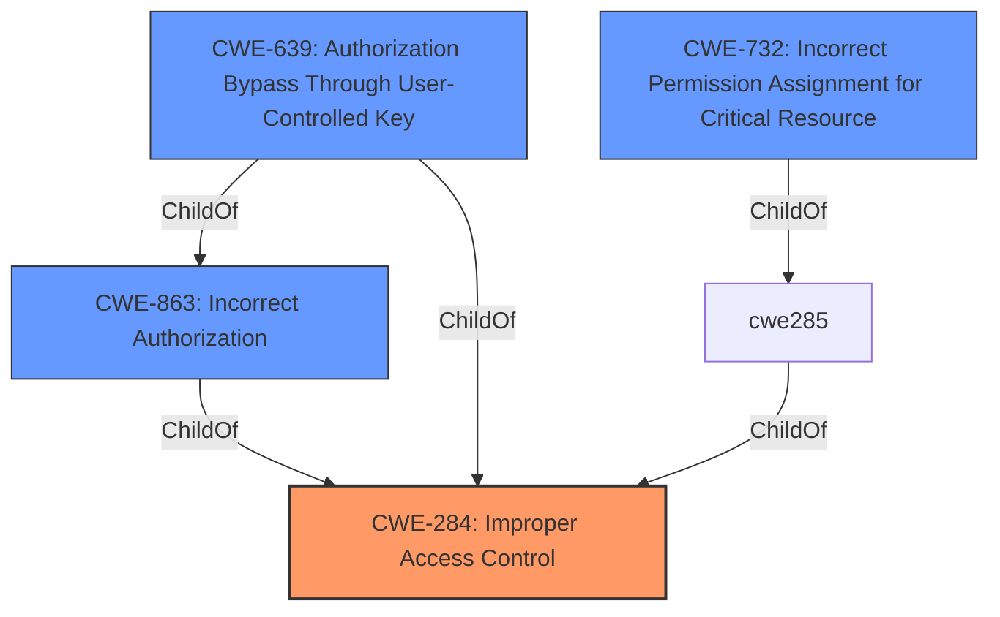

# Enhanced Analysis for CVE-2020-15939

# Summary
| CWE ID | CWE Name | Confidence | CWE Abstraction Level | CWE Vulnerability Mapping Label | CWE-Vulnerability Mapping Notes |
|---|---|---|---|---|---|
| CWE-284 | Improper Access Control | 0.75 | Pillar | Primary | Discouraged  |
| CWE-639 | Authorization Bypass Through User-Controlled Key | 0.65 | Base | Secondary | Allowed |

## Evidence and Confidence

*   **Confidence Score:** 0.70
*   **Evidence Strength:** MEDIUM

## Relationship Analysis
The primary CWE is CWE-284, which is a Pillar-level CWE. The Retriever Results suggested alternative mappings such as CWE-639 (Authorization Bypass Through User-Controlled Key), a Base-level CWE, and CWE-732 (Incorrect Permission Assignment for Critical Resource), a Class-level CWE.



## Vulnerability Chain
The vulnerability chain starts with **improper access control**, which leads to an unprivileged attacker being able to download the device configuration file.

## Summary of Analysis
The initial analysis identified CWE-284 as the primary weakness based on the vulnerability description stating "**improper access control**". However, CWE-284 is a high-level (Pillar) CWE and is discouraged. The retriever results suggested more specific alternatives. Among them, CWE-639 "Authorization Bypass Through User-Controlled Key" is a base level CWE and seems appropriate as the attacker is authenticated but unprivileged. The vulnerability description states that an authenticated, unprivileged attacker can download the device configuration file via the recovery URL. This could mean that the attacker is using a user-controlled key to bypass authorization.

Relevant CWE Information:

# Enhanced Context (25 CWEs)

## CWE-23: Relative Path Traversal
**Abstraction Level**: Base
**Similarity Score**: 0.80
**Source**: dense

## CWE-41: Improper Resolution of Path Equivalence
**Abstraction Level**: Base
**Similarity Score**: 0.78
**Source**: dense

## CWE-36: Absolute Path Traversal
**Abstraction Level**: Base
**Similarity Score**: 0.77
**Source**: dense

## CWE-59: Improper Link Resolution Before File Access ('Link Following')
**Abstraction Level**: Base
**Similarity Score**: 0.77
**Source**: dense

## CWE-73: External Control of File Name or Path
**Abstraction Level**: Base
**Similarity Score**: 0.77
**Source**: dense

## CWE-24: Path Traversal: '../filedir'
**Abstraction Level**: Variant
**Similarity Score**: 0.77
**Source**: dense

## CWE-552: Files or Directories Accessible to External Parties
**Abstraction Level**: Base
**Similarity Score**: 0.76
**Source**: dense

## CWE-668: Exposure of Resource to Wrong Sphere
**Abstraction Level**: Class
**Similarity Score**: 0.75
**Source**: dense

## CWE-538: Insertion of Sensitive Information into Externally-Accessible File or Directory
**Abstraction Level**: Base
**Similarity Score**: 0.74
**Source**: dense

## CWE-25: Path Traversal: '/../filedir'
**Abstraction Level**: Variant
**Similarity Score**: 0.74
**Source**: dense

## CWE-639: Authorization Bypass Through User-Controlled Key
**Abstraction Level**: Base
**Similarity Score**: 7877.44
**Source**: sparse

**Description**:
The system's authorization functionality does not prevent one user from gaining access to another user's data or record by modifying the key value identifying the data.

**Mapping Guidance**:
- Usage: Allowed
- Rationale: This CWE entry is at the Base level of abstraction, which is a preferred level of abstraction for mapping to the root causes of vulnerabilities.

## CWE-22: Improper Limitation of a Pathname to a Restricted Directory ('Path Traversal')
**Abstraction Level**: Base
**Similarity Score**: 7741.90
**Source**: sparse

## CWE-23: Relative Path Traversal
**Abstraction Level**: Base
**Similarity Score**: 7612.47
**Source**: sparse

## CWE-863: Incorrect Authorization
**Abstraction Level**: Class
**Similarity Score**: 7563.90
**Source**: sparse

## CWE-184: Incomplete List of Disallowed Inputs
**Abstraction Level**: Base
**Similarity Score**: 7534.69
**Source**: sparse

## CWE-79: Improper Neutralization of Input During Web Page Generation ('Cross-site Scripting')
**Abstraction Level**: base
**Similarity Score**: 4.33
**Source**: graph

## CWE-22: Improper Limitation of a Pathname to a Restricted Directory ('Path Traversal')
**Abstraction Level**: base
**Similarity Score**: 4.33
**Source**: graph

## CWE-434: Unrestricted Upload of File with Dangerous Type
**Abstraction Level**: base
**Similarity Score**: 4.33
**Source**: graph

## CWE-78: Improper Neutralization of Special Elements used in an OS Command ('OS Command Injection')
**Abstraction Level**: base
**Similarity Score**: 4.33
**Source**: graph

## CWE-98: Improper Control of Filename for Include/Require Statement in PHP Program ('PHP Remote File Inclusion')
**Abstraction Level**: variant
**Similarity Score**: 3.88
**Source**: graph

## CWE-266: Incorrect Privilege Assignment
**Abstraction Level**: base
**Similarity Score**: 3.64
**Source**: graph

## CWE-280: Improper Handling of Insufficient Permissions or Privileges
**Abstraction Level**: base
**Similarity Score**: 3.64
**Source**: graph

## CWE-73: External Control of File Name or Path
**Abstraction Level**: Base
**Similarity Score**: 3.20
**Source**: graph

## CWE-41: Improper Resolution of Path Equivalence
**Abstraction Level**: Base
**Similarity Score**: 2.91
**Source**: graph

## CWE-59: Improper Link Resolution Before File Access ('Link Following')
**Abstraction Level**: Base
**Similarity Score**: 2.91
**Source**: graph

CWE-732 (Incorrect Permission Assignment for Critical Resource) was considered but not used because the vulnerability description focuses on access control and authorization, rather than incorrect permission assignment for resources.

CWE-280 (Improper Handling of Insufficient Permissions or Privileges) was considered, but it describes a situation where the product itself does not have sufficient privileges, whereas this vulnerability describes a situation where an attacker is granted excessive privileges.

The final decision is to map CWE-284, a high level description of the vulnerability, and also CWE-639 as the root cause.


## CWE Relationship Analysis

Current CWEs represent these abstraction levels: .


### Vulnerability Chain Analysis

**Chain starting from CWE-36:**
- 36 (Absolute Path Traversal) - ROOT


**Chain starting from CWE-434:**
- 434 (Unrestricted Upload of File with Dangerous Type) - ROOT


### CWE Relationship Diagram

```mermaid
graph TD
    classDef primary fill:#f96,stroke:#333,stroke-width:2px
    classDef secondary fill:#69f,stroke:#333
    classDef tertiary fill:#9e9,stroke:#333
```