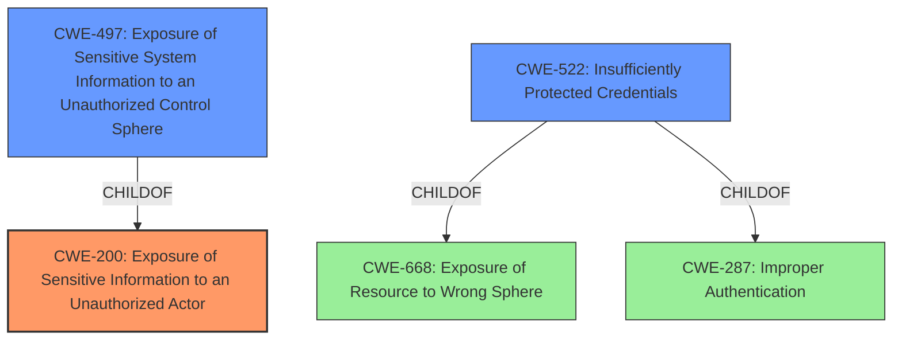

# Analysis for CVE-2020-15942

# Summary
| CWE ID | CWE Name | Confidence | CWE Abstraction Level | CWE Vulnerability Mapping Label | CWE-Vulnerability Mapping Notes |
|---|---|---|---|---|---|
| CWE-200 | Exposure of Sensitive Information to an Unauthorized Actor | 0.9 | Class | Allowed-with-Review | The password being stored in clear text within the Web Vulnerability Scan profile allows a remote authenticated attacker to read the password used by the FortiWeb scanner.|
| CWE-522 | Insufficiently Protected Credentials | 0.7 | Class | Allowed-with-Review | The cleartext password qualifies as insufficiently protected credentials, although the broader class of CWE-200 is a more direct fit. |
| CWE-497 | Exposure of Sensitive System Information to an Unauthorized Control Sphere | 0.6 | Base | Allowed | The password qualifies as sensitive system information.|

## Evidence and Confidence

*   **Confidence Score:** 0.9
*   **Evidence Strength:** HIGH

## Relationship Analysis
The primary CWE is CWE-200, which is a class-level weakness. The relationship analysis shows that CWE-497 is a child of CWE-200, making it a more specific instance of sensitive information exposure. CWE-522 is a child of CWE-668 and CWE-287, highlighting a connection to resource exposure and authentication issues. While CWE-497 is a more specific base CWE, the evidence supports the broader Class of CWE-200 due to the high-level nature of the description.

## Vulnerability Chain
The vulnerability chain starts with the **root cause** of storing the password in clear text, leading to the **weakness** of **information disclosure**, and the **impact** of allowing a remote authenticated attacker to read the password.

## Summary of Analysis
The initial analysis identified the **information disclosure** vulnerability due to the password being stored in clear text.

The primary selection is CWE-200 (Exposure of Sensitive Information to an Unauthorized Actor) because the vulnerability description explicitly states that the password used by the FortiWeb scanner can be read by a remote authenticated attacker. The **root cause** is the password being stored in clear text.

CWE-522 (Insufficiently Protected Credentials) was considered because the cleartext password qualifies as insufficiently protected credentials. However, since the high-level description focuses on the exposure itself, CWE-200 is a more direct fit.
CWE-497 (Exposure of Sensitive System Information to an Unauthorized Control Sphere) was also considered because the password qualifies as sensitive system information. However, CWE-200 is a broader class that encompasses this specific scenario.

The selection of CWE-200 is at the optimal level of specificity because it directly addresses the **information disclosure** aspect of the vulnerability, which is the primary concern.

Relevant CWE Information:
- Vulnerability Description Key Phrases:
  - **weakness:** **information disclosure**
- CVE Reference Links Content Summary:
  - **Root cause of vulnerability**: The vulnerability is due to the password being stored in clear text within the Web Vulnerability Scan profile.
  - **Weaknesses/vulnerabilities present**: **Information disclosure** vulnerability.