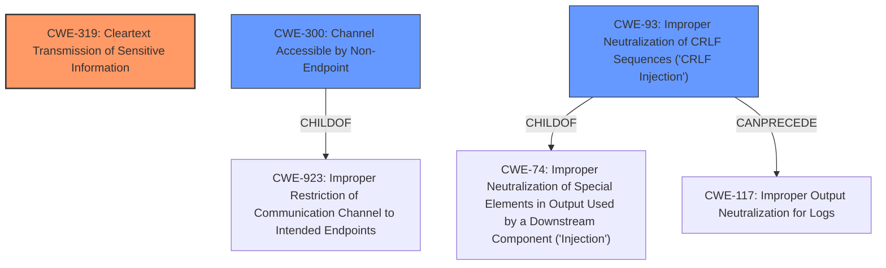

# Enhanced Analysis for CVE-2020-15955

# Summary
| CWE ID | CWE Name | Confidence | CWE Abstraction Level | CWE Vulnerability Mapping Label | CWE-Vulnerability Mapping Notes |
|---|---|---|---|---|---|
| CWE-319 | Cleartext Transmission of Sensitive Information | 0.9 | Base | Primary | Allowed |
| CWE-300 | Channel Accessible by Non-Endpoint | 0.7 | Class | Secondary | Discouraged |
| CWE-93 | Improper Neutralization of CRLF Sequences ('CRLF Injection') | 0.6 | Base | Secondary | Allowed |

## Evidence and Confidence

*   **Confidence Score:** 0.9
*   **Evidence Strength:** HIGH

## Relationship Analysis
The primary CWE is CWE-319 (Cleartext Transmission of Sensitive Information), representing the core issue of transmitting sensitive data unencrypted. CWE-300 (Channel Accessible by Non-Endpoint) is a related class that encompasses MitM attacks, but is discouraged as a primary mapping. CWE-93 (Improper Neutralization of CRLF Sequences ('CRLF Injection')) is related because the **injection** occurs due to the lack of proper handling of control characters.



## Vulnerability Chain
The chain starts with a **missing** or **improper** implementation of STARTTLS, which allows an attacker in a MitM position to **inject** arbitrary plaintext commands (CWE-93) into the session, leading to **cleartext transmission of sensitive information** (CWE-319) and potential credential theft.

## Summary of Analysis
The initial analysis identified CWE-319 as the primary weakness due to the **cleartext transmission** resulting from the STARTTLS command **injection**. This is supported by the vulnerability description stating that an active MitM can **inject** arbitrary plaintext commands, allowing e-mail messages and user credentials to be sent to the MitM attacker.

The evidence includes the "CVE Reference Links Content Summary" which explicitly mentions the "**command injection:** The primary vulnerability is the ability to inject arbitrary SMTP commands into the server's command stream before the TLS handshake completes. This is due to the server processing commands received along with the STARTTLS request before the connection is actually encrypted." and the "**Credential theft:** An attacker can inject commands to authenticate with their own account and then store the victim's credentials in an email accessible by the attacker."

The "Retriever Results" also lists CWE-319 as a relevant CWE with a score of 0.085. The "Complete CWE Specifications" section confirms that CWE-319 is a Base level weakness that involves the transmission of sensitive data in cleartext.

CWE-300 was considered due to the MitM attack vector, but it is discouraged by MITRE because it focuses on the attack setup rather than the root cause.

CWE-93 was considered because it involves **Improper Neutralization of CRLF Sequences ('CRLF Injection')**. The "CVE Reference Links Content Summary" states that the root cause is "The vulnerability stems from a flaw in how STARTTLS implementations handle command pipelining. Specifically, an attacker can inject plaintext commands alongside the STARTTLS command within the same TCP segment." This is a contributing factor, but not the primary issue.

Based on the evidence and relationship analysis, the selected CWEs are at the optimal level of specificity. CWE-319 accurately captures the core issue of **cleartext transmission**, while CWE-93 captures the mechanism of **command injection**. The discouragement of CWE-300 for MitM vulnerabilities further supports the selection of CWE-319 as the primary weakness.

Relevant CWE Information:

# Enhanced Context (25 CWEs)
The following CWEs were identified as potentially relevant to this vulnerability:

## CWE-1391: Use of Weak Credentials
**Abstraction Level**: Class
**Similarity Score**: 0.77
**Source**: dense

**Description**:
The product uses weak credentials (such as a default key or hard-coded password) that can be calculated, derived, reused, or guessed by an attacker.

**Mapping Guidance**:
- Usage: Allowed-with-Review
- Rationale: This CWE entry is a Class and might have Base-level children that would be more appropriate

## CWE-319: Cleartext Transmission of Sensitive Information
**Abstraction Level**: Base
**Similarity Score**: 0.77
**Source**: dense

**Description**:
The product transmits sensitive or security-critical data in cleartext in a communication channel that can be sniffed by unauthorized actors.

**Mapping Guidance**:
- Usage: Allowed
- Rationale: This CWE entry is at the Base level of abstraction, which is a preferred level of abstraction for mapping to the root causes of vulnerabilities.

## CWE-303: Incorrect Implementation of Authentication Algorithm
**Abstraction Level**: Base
**Similarity Score**: 0.77
**Source**: dense

**Description**:
The requirements for the product dictate the use of an established authentication algorithm, but the implementation of the algorithm is incorrect.

**Mapping Guidance**:
- Usage: Allowed
- Rationale: This CWE entry is at the Base level of abstraction, which is a preferred level of abstraction for mapping to the root causes of vulnerabilities.

## CWE-345: Insufficient Verification of Data Authenticity
**Abstraction Level**: Class
**Similarity Score**: 0.77
**Source**: dense

**Description**:
The product does not sufficiently verify the origin or authenticity of data, in a way that causes it to accept invalid data.

**Mapping Guidance**:
- Usage: Discouraged
- Rationale: This CWE entry is a level-1 Class (i.e., a child of a Pillar). It might have lower-level children that would be more appropriate

## CWE-294: Authentication Bypass by Capture-replay
**Abstraction Level**: Base
**Similarity Score**: 0.77
**Source**: dense

**Description**:
A capture-replay flaw exists when the design of the product makes it possible for a malicious user to sniff network traffic and bypass authentication by replaying it to the server in question to the same effect as the original message (or with minor changes).

**Mapping Guidance**:
- Usage: Allowed
- Rationale: This CWE entry is at the Base level of abstraction, which is a preferred level of abstraction for mapping to the root causes of vulnerabilities.

## CWE-1240: Use of a Cryptographic Primitive with a Risky Implementation
**Abstraction Level**: Base
**Similarity Score**: 0.76
**Source**: dense

**Description**:
To fulfill the need for a cryptographic primitive, the product implements a cryptographic algorithm using a non-standard, unproven, or disallowed/non-compliant cryptographic implementation.

**Mapping Guidance**:
- Usage: Allowed
- Rationale: This CWE entry is at the Base level of abstraction, which is a preferred level of abstraction for mapping to the root causes of vulnerabilities.

## CWE-300: Channel Accessible by Non-Endpoint
**Abstraction Level**: Class
**Similarity Score**: 0.76
**Source**: dense

**Description**:
The product does not adequately verify the identity of actors at both ends of a communication channel, or does not adequately ensure the integrity of the channel, in a way that allows the channel to be accessed or influenced by an actor that is not an endpoint.

**Mapping Guidance**:
- Usage: Discouraged
- Rationale: CWE-300 is commonly misused for vulnerabilities in which the prerequisites for exploitation require the adversary to be in a privileged "in-the-middle" position.

## CWE-807: Reliance on Untrusted Inputs in a Security Decision
**Abstraction Level**: Base
**Similarity Score**: 0.76
**Source**: dense

**Description**:
The product uses a protection mechanism that relies on the existence or values of an input, but the input can be modified by an untrusted actor in a way that bypasses the protection mechanism.

**Mapping Guidance**:
- Usage: Allowed
- Rationale: This CWE entry is at the Base level of abstraction, which is a preferred level of abstraction for mapping to the root causes of vulnerabilities.

## CWE-74: Improper Neutralization of Special Elements in Output Used by a Downstream Component ('Injection')
**Abstraction Level**: Class
**Similarity Score**: 0.76
**Source**: dense


## CWE Relationship Analysis

Current CWEs represent these abstraction levels: .


### Vulnerability Chain Analysis

**Chain starting from CWE-303:**
- 303 (Incorrect Implementation of Authentication Algorithm) - ROOT


**Chain starting from CWE-294:**
- 294 (Authentication Bypass by Capture-replay) - ROOT


### CWE Relationship Diagram

```mermaid
graph TD
    classDef primary fill:#f96,stroke:#333,stroke-width:2px
    classDef secondary fill:#69f,stroke:#333
    classDef tertiary fill:#9e9,stroke:#333
```