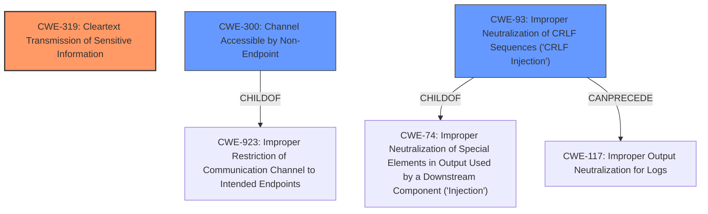

# Analysis for CVE-2020-15955

# Summary
| CWE ID | CWE Name | Confidence | CWE Abstraction Level | CWE Vulnerability Mapping Label | CWE-Vulnerability Mapping Notes |
|---|---|---|---|---|---|
| CWE-319 | Cleartext Transmission of Sensitive Information | 0.9 | Base | Primary | Allowed |
| CWE-300 | Channel Accessible by Non-Endpoint | 0.7 | Class | Secondary | Discouraged |
| CWE-93 | Improper Neutralization of CRLF Sequences ('CRLF Injection') | 0.6 | Base | Secondary | Allowed |

## Evidence and Confidence

*   **Confidence Score:** 0.9
*   **Evidence Strength:** HIGH

## Relationship Analysis
The primary CWE is CWE-319 (Cleartext Transmission of Sensitive Information), representing the core issue of transmitting sensitive data unencrypted. CWE-300 (Channel Accessible by Non-Endpoint) is a related class that encompasses MitM attacks, but is discouraged as a primary mapping. CWE-93 (Improper Neutralization of CRLF Sequences ('CRLF Injection')) is related because the **injection** occurs due to the lack of proper handling of control characters.



## Vulnerability Chain
The chain starts with a **missing** or **improper** implementation of STARTTLS, which allows an attacker in a MitM position to **inject** arbitrary plaintext commands (CWE-93) into the session, leading to **cleartext transmission of sensitive information** (CWE-319) and potential credential theft.

## Summary of Analysis
The initial analysis identified CWE-319 as the primary weakness due to the **cleartext transmission** resulting from the STARTTLS command **injection**. This is supported by the vulnerability description stating that an active MitM can **inject** arbitrary plaintext commands, allowing e-mail messages and user credentials to be sent to the MitM attacker.

The evidence includes the "CVE Reference Links Content Summary" which explicitly mentions the "**command injection:** The primary vulnerability is the ability to inject arbitrary SMTP commands into the server's command stream before the TLS handshake completes. This is due to the server processing commands received along with the STARTTLS request before the connection is actually encrypted." and the "**Credential theft:** An attacker can inject commands to authenticate with their own account and then store the victim's credentials in an email accessible by the attacker."

The "Retriever Results" also lists CWE-319 as a relevant CWE with a score of 0.085. The "Complete CWE Specifications" section confirms that CWE-319 is a Base level weakness that involves the transmission of sensitive data in cleartext.

CWE-300 was considered due to the MitM attack vector, but it is discouraged by MITRE because it focuses on the attack setup rather than the root cause.

CWE-93 was considered because it involves **Improper Neutralization of CRLF Sequences ('CRLF Injection')**. The "CVE Reference Links Content Summary" states that the root cause is "The vulnerability stems from a flaw in how STARTTLS implementations handle command pipelining. Specifically, an attacker can inject plaintext commands alongside the STARTTLS command within the same TCP segment." This is a contributing factor, but not the primary issue.

Based on the evidence and relationship analysis, the selected CWEs are at the optimal level of specificity. CWE-319 accurately captures the core issue of **cleartext transmission**, while CWE-93 captures the mechanism of **command injection**. The discouragement of CWE-300 for MitM vulnerabilities further supports the selection of CWE-319 as the primary weakness.

Relevant CWE Information:

# Enhanced Context (25 CWEs)
The following CWEs were identified as potentially relevant to this vulnerability:

## CWE-1391: Use of Weak Credentials
**Abstraction Level**: Class
**Similarity Score**: 0.77
**Source**: dense

**Description**:
The product uses weak credentials (such as a default key or hard-coded password) that can be calculated, derived, reused, or guessed by an attacker.

**Mapping Guidance**:
- Usage: Allowed-with-Review
- Rationale: This CWE entry is a Class and might have Base-level children that would be more appropriate

## CWE-319: Cleartext Transmission of Sensitive Information
**Abstraction Level**: Base
**Similarity Score**: 0.77
**Source**: dense

**Description**:
The product transmits sensitive or security-critical data in cleartext in a communication channel that can be sniffed by unauthorized actors.

**Mapping Guidance**:
- Usage: Allowed
- Rationale: This CWE entry is at the Base level of abstraction, which is a preferred level of abstraction for mapping to the root causes of vulnerabilities.

## CWE-303: Incorrect Implementation of Authentication Algorithm
**Abstraction Level**: Base
**Similarity Score**: 0.77
**Source**: dense

**Description**:
The requirements for the product dictate the use of an established authentication algorithm, but the implementation of the algorithm is incorrect.

**Mapping Guidance**:
- Usage: Allowed
- Rationale: This CWE entry is at the Base level of abstraction, which is a preferred level of abstraction for mapping to the root causes of vulnerabilities.

## CWE-345: Insufficient Verification of Data Authenticity
**Abstraction Level**: Class
**Similarity Score**: 0.77
**Source**: dense

**Description**:
The product does not sufficiently verify the origin or authenticity of data, in a way that causes it to accept invalid data.

**Mapping Guidance**:
- Usage: Discouraged
- Rationale: This CWE entry is a level-1 Class (i.e., a child of a Pillar). It might have lower-level children that would be more appropriate

## CWE-294: Authentication Bypass by Capture-replay
**Abstraction Level**: Base
**Similarity Score**: 0.77
**Source**: dense

**Description**:
A capture-replay flaw exists when the design of the product makes it possible for a malicious user to sniff network traffic and bypass authentication by replaying it to the server in question to the same effect as the original message (or with minor changes).

**Mapping Guidance**:
- Usage: Allowed
- Rationale: This CWE entry is at the Base level of abstraction, which is a preferred level of abstraction for mapping to the root causes of vulnerabilities.

## CWE-1240: Use of a Cryptographic Primitive with a Risky Implementation
**Abstraction Level**: Base
**Similarity Score**: 0.76
**Source**: dense

**Description**:
To fulfill the need for a cryptographic primitive, the product implements a cryptographic algorithm using a non-standard, unproven, or disallowed/non-compliant cryptographic implementation.

**Mapping Guidance**:
- Usage: Allowed
- Rationale: This CWE entry is at the Base level of abstraction, which is a preferred level of abstraction for mapping to the root causes of vulnerabilities.

## CWE-300: Channel Accessible by Non-Endpoint
**Abstraction Level**: Class
**Similarity Score**: 0.76
**Source**: dense

**Description**:
The product does not adequately verify the identity of actors at both ends of a communication channel, or does not adequately ensure the integrity of the channel, in a way that allows the channel to be accessed or influenced by an actor that is not an endpoint.

**Mapping Guidance**:
- Usage: Discouraged
- Rationale: CWE-300 is commonly misused for vulnerabilities in which the prerequisites for exploitation require the adversary to be in a privileged "in-the-middle" position.

## CWE-807: Reliance on Untrusted Inputs in a Security Decision
**Abstraction Level**: Base
**Similarity Score**: 0.76
**Source**: dense

**Description**:
The product uses a protection mechanism that relies on the existence or values of an input, but the input can be modified by an untrusted actor in a way that bypasses the protection mechanism.

**Mapping Guidance**:
- Usage: Allowed
- Rationale: This CWE entry is at the Base level of abstraction, which is a preferred level of abstraction for mapping to the root causes of vulnerabilities.

## CWE-74: Improper Neutralization of Special Elements in Output Used by a Downstream Component ('Injection')
**Abstraction Level**: Class
**Similarity Score**: 0.76
**Source**: dense

# Enhanced Query for CVE-2020-15955

## Vulnerability Description
In s/qmail through 4.0.07, an active MitM can inject arbitrary plaintext commands into a STARTTLS encrypted session between an SMTP client and s/qmail. This allows e-mail messages and user credentials to be sent to the MitM attacker.

### Vulnerability Description Key Phrases
- **impact:** inject arbitrary plaintext commands
- **attacker:** active MitM
- **product:** s/qmail
- **version:** through 4.0.07

## CVE Reference Links Content Summary
Based on the provided content, here's an analysis related to CVE-2020-15955:

**Verification:**

The content directly references CVE-2020-15955, describing it as a "StartTLS command injection" vulnerability. The provided information also identifies the specific software, s/qmail, as being vulnerable.

**Root cause of vulnerability:**

The vulnerability stems from a flaw in how STARTTLS implementations handle command pipelining. Specifically, an attacker can inject plaintext commands alongside the STARTTLS command within the same TCP segment. The server then interprets these injected commands as if they were part of the encrypted session after the STARTTLS upgrade.

**Weaknesses/vulnerabilities present:**

*   **Command injection:** The primary vulnerability is the ability to inject arbitrary SMTP commands into the server's command stream before the TLS handshake completes. This is due to the server processing commands received along with the STARTTLS request before the connection is actually encrypted.

**Impact of exploitation:**

*   **Credential theft:** An attacker can inject commands to authenticate with their own account and then store the victim's credentials in an email accessible by the attacker.
*   **Cross-protocol attacks:** The vulnerability can also be used to serve HTTPS content using the mail server’s certificate.

**Attack vectors:**

*   **Meddler-in-the-Middle (MitM) position:** The attack requires an attacker positioned to intercept and modify network traffic between an email client and server.

**Required attacker capabilities/position:**

*   The attacker needs to be a MitM, capable of modifying TCP connections.
*   The attacker must have valid login credentials for their own account on the same mail server as the victim.

**Additional notes:**

*   The provided content details a broader range of STARTTLS vulnerabilities discovered by the researchers, beyond the command injection issue. However, it clearly identifies and explains the specific mechanics of the vulnerability described in CVE-2020-15955 and its impact.
*   The content also notes that the vulnerability was addressed in s/qmail version 4.0.08.
*   The research found this vulnerability is still present in a surprising number of email server implementations despite being known since 2011 and also provides tools and recommendations to identify vulnerable software.

## Retriever Results

### Top Combined Results

| Rank | CWE ID | Name | Abstraction | Usage  | Retrievers | Individual Scores |
|------|--------|------|-------------|-------|------------|-------------------|
| 1 | 757 | Selection of Less-Secure Algorithm During Negotiation ('Algorithm Downgrade') | Base | Allowed | sparse | 0.094 |
| 2 | 300 | Channel Accessible by Non-Endpoint | Class | Discouraged | sparse | 0.086 |
| 3 | 319 | Cleartext Transmission of Sensitive Information | Base | Allowed | sparse | 0.085 |
| 4 | 295 | Improper Certificate Validation | Base | Allowed | sparse | 0.079 |
| 5 | 321 | Use of Hard-coded Cryptographic Key | Variant | Allowed | sparse | 0.077 |
| 6 | 150 | Improper Neutralization of Escape, Meta, or Control Sequences | Variant | Allowed | dense | 0.445 |
| 7 | 259 | Use of Hard-coded Password | Variant | Allowed | graph | 0.002 |
| 8 | 93 | Improper Neutralization of CRLF Sequences ('CRLF Injection') | Base | Allowed | sparse | 0.077 |
| 9 | 327 | Use of a Broken or Risky Cryptographic Algorithm | Class | Allowed-with-Review | sparse | 0.075 |
| 10 | 290 | Authentication Bypass by Spoofing | Base | Allowed | sparse | 0.075 |


# Complete CWE Specifications


## CWE-757: Selection of Less-Secure Algorithm During Negotiation ('Algorithm Downgrade')
**Abstraction:** Base
**Status:** Incomplete

### Description
A protocol or its implementation supports interaction between multiple actors and allows those actors to negotiate which algorithm should be used as a protection mechanism such as encryption or authentication, but it does not select the strongest algorithm that is available to both parties.

### Extended Description
When a security mechanism can be forced to downgrade to use a less secure algorithm, this can make it easier for attackers to compromise the product by exploiting weaker algorithm. The victim might not be aware that the less secure algorithm is being used. For example, if an attacker can force a communications channel to use cleartext instead of strongly-encrypted data, then the attacker could read the channel by sniffing, instead of going through extra effort of trying to decrypt the data using brute force techniques.

### Alternative Terms
None

### Relationships
ChildOf -> CWE-693

### Mapping Guidance
**Usage:** Allowed
**Rationale:** This CWE entry is at the Base level of abstraction, which is a preferred level of abstraction for mapping to the root causes of vulnerabilities.
**Comments:** Carefully read both the name and description to ensure that this mapping is an appropriate fit. Do not try to 'force' a mapping to a lower-level Base/Variant simply to comply with this preferred level of abstraction.
**Reasons:**
- Acceptable-Use


### Additional Notes
**[Relationship]** This is related to CWE-300, although not all downgrade attacks necessarily require an entity that redirects or interferes with the network. See examples.


### Observed Examples
- **CVE-2006-4302:** Attacker can select an older version of the software to exploit its vulnerabilities.
- **CVE-2006-4407:** Improper prioritization of encryption ciphers during negotiation leads to use of a weaker cipher.
- **CVE-2005-2969:** chain: SSL/TLS implementation disables a verification step (CWE-325) that enables a downgrade attack to a weaker protocol.


## CWE-300: Channel Accessible by Non-Endpoint
**Abstraction:** Class
**Status:** Draft

### Description
The product does not adequately verify the identity of actors at both ends of a communication channel, or does not adequately ensure the integrity of the channel, in a way that allows the channel to be accessed or influenced by an actor that is not an endpoint.

### Extended Description
In order to establish secure communication between two parties, it is often important to adequately verify the identity of entities at each end of the communication channel. Inadequate or inconsistent verification may result in insufficient or incorrect identification of either communicating entity. This can have negative consequences such as misplaced trust in the entity at the other end of the channel. An attacker can leverage this by interposing between the communicating entities and masquerading as the original entity. In the absence of sufficient verification of identity, such an attacker can eavesdrop and potentially modify the communication between the original entities.

### Alternative Terms
Adversary-in-the-Middle / AITM
Man-in-the-Middle / MITM
Person-in-the-Middle / PITM
Monkey-in-the-Middle
Monster-in-the-Middle
Manipulator-in-the-Middle
On-path attack
Interception attack

### Relationships
ChildOf -> CWE-923

### Mapping Guidance
**Usage:** Discouraged
**Rationale:** CWE-300 is commonly misused for vulnerabilities in which the prerequisites for exploitation require the adversary to be in a privileged "in-the-middle" position.
**Comments:** Consider root-cause weaknesses that allow adversary-in-the-middle attacks to happen, such as CWEs involving poor integrity protection.
**Reasons:**
- Frequent Misuse


### Additional Notes
**[Maintenance]** The summary identifies multiple distinct possibilities, suggesting that this is a category that must be broken into more specific weaknesses.


### Observed Examples
- **CVE-2014-1266:** chain: incorrect "goto" in Apple SSL product bypasses certificate validation, allowing Adversry-in-the-Middle (AITM) attack (Apple "goto fail" bug). CWE-705 (Incorrect Control Flow Scoping) -> CWE-561 (Dead Code) -> CWE-295 (Improper Certificate Validation) -> CWE-393 (Return of Wrong Status Code) -> CWE-300 (Channel Accessible by Non-Endpoint).


## CWE-319: Cleartext Transmission of Sensitive Information
**Abstraction:** Base
**Status:** Draft

### Description
The product transmits sensitive or security-critical data in cleartext in a communication channel that can be sniffed by unauthorized actors.

### Extended Description


Many communication channels can be "sniffed" (monitored) by adversaries during data transmission. For example, in networking, packets can traverse many intermediary nodes from the source to the destination, whether across the internet, an internal network, the cloud, etc. Some actors might have privileged access to a network interface or any link along the channel, such as a router, but they might not be authorized to collect the underlying data. As a result, network traffic could be sniffed by adversaries, spilling security-critical data.


Applicable communication channels are not limited to software products. Applicable channels include hardware-specific technologies such as internal hardware networks and external debug channels, supporting remote JTAG debugging. When mitigations are not applied to combat adversaries within the product's threat model, this weakness significantly lowers the difficulty of exploitation by such adversaries.


When full communications are recorded or logged, such as with a packet dump, an adversary could attempt to obtain the dump long after the transmission has occurred and try to "sniff" the cleartext from the recorded communications in the dump itself. Even if the information is encoded in a way that is not human-readable, certain techniques could determine which encoding is being used, then decode the information. 


### Alternative Terms
None

### Relationships
ChildOf -> CWE-311
ChildOf -> CWE-311

### Mapping Guidance
**Usage:** Allowed
**Rationale:** This CWE entry is at the Base level of abstraction, which is a preferred level of abstraction for mapping to the root causes of vulnerabilities.
**Comments:** Carefully read both the name and description to ensure that this mapping is an appropriate fit. Do not try to 'force' a mapping to a lower-level Base/Variant simply to comply with this preferred level of abstraction.
**Reasons:**
- Acceptable-Use


### Additional Notes
**[Maintenance]** The Taxonomy_Mappings to ISA/IEC 62443 were added in CWE 4.10, but they are still under review and might change in future CWE versions. These draft mappings were performed by members of the "Mapping CWE to 62443" subgroup of the CWE-CAPEC ICS/OT Special Interest Group (SIG), and their work is incomplete as of CWE 4.10. The mappings are included to facilitate discussion and review by the broader ICS/OT community, and they are likely to change in future CWE versions.


### Observed Examples
- **CVE-2022-29519:** Programmable Logic Controller (PLC) sends sensitive information in plaintext, including passwords and session tokens.
- **CVE-2022-30312:** Building Controller uses a protocol that transmits authentication credentials in plaintext.
- **CVE-2022-31204:** Programmable Logic Controller (PLC) sends password in plaintext.


## CWE-295: Improper Certificate Validation
**Abstraction:** Base
**Status:** Draft

### Description
The product does not validate, or incorrectly validates, a certificate.

### Extended Description
When a certificate is invalid or malicious, it might allow an attacker to spoof a trusted entity by interfering in the communication path between the host and client. The product might connect to a malicious host while believing it is a trusted host, or the product might be deceived into accepting spoofed data that appears to originate from a trusted host.

### Alternative Terms
None

### Relationships
ChildOf -> CWE-287
ChildOf -> CWE-287
PeerOf -> CWE-322

### Mapping Guidance
**Usage:** Allowed
**Rationale:** This CWE entry is at the Base level of abstraction, which is a preferred level of abstraction for mapping to the root causes of vulnerabilities.
**Comments:** Carefully read both the name and description to ensure that this mapping is an appropriate fit. Do not try to 'force' a mapping to a lower-level Base/Variant simply to comply with this preferred level of abstraction.
**Reasons:**
- Acceptable-Use


### Observed Examples
- **CVE-2019-12496:** A Go framework for robotics, drones, and IoT devices skips verification of root CA certificates by default.
- **CVE-2014-1266:** chain: incorrect "goto" in Apple SSL product bypasses certificate validation, allowing Adversary-in-the-Middle (AITM) attack (Apple "goto fail" bug). CWE-705 (Incorrect Control Flow Scoping) -> CWE-561 (Dead Code) -> CWE-295 (Improper Certificate Validation) -> CWE-393 (Return of Wrong Status Code) -> CWE-300 (Channel Accessible by Non-Endpoint).
- **CVE-2021-22909:** Chain: router's firmware update procedure uses curl with "-k" (insecure) option that disables certificate validation (CWE-295), allowing adversary-in-the-middle (AITM) compromise with a malicious firmware image (CWE-494).


## CWE-321: Use of Hard-coded Cryptographic Key
**Abstraction:** Variant
**Status:** Draft

### Description
The use of a hard-coded cryptographic key significantly increases the possibility that encrypted data may be recovered.

### Extended Description
Not provided

### Alternative Terms
None

### Relationships
ChildOf -> CWE-798
ChildOf -> CWE-798
ChildOf -> CWE-798

### Mapping Guidance
**Usage:** Allowed
**Rationale:** This CWE entry is at the Variant level of abstraction, which is a preferred level of abstraction for mapping to the root causes of vulnerabilities.
**Comments:** Carefully read both the name and description to ensure that this mapping is an appropriate fit. Do not try to 'force' a mapping to a lower-level Base/Variant simply to comply with this preferred level of abstraction.
**Reasons:**
- Acceptable-Use


### Additional Notes
**[Other]** The main difference between the use of hard-coded passwords and the use of hard-coded cryptographic keys is the false sense of security that the former conveys. Many people believe that simply hashing a hard-coded password before storage will protect the information from malicious users. However, many hashes are reversible (or at least vulnerable to brute force attacks) -- and further, many authentication protocols simply request the hash itself, making it no better than a password.

**[Maintenance]** The Taxonomy_Mappings to ISA/IEC 62443 were added in CWE 4.10, but they are still under review and might change in future CWE versions. These draft mappings were performed by members of the "Mapping CWE to 62443" subgroup of the CWE-CAPEC ICS/OT Special Interest Group (SIG), and their work is incomplete as of CWE 4.10. The mappings are included to facilitate discussion and review by the broader ICS/OT community, and they are likely to change in future CWE versions.


### Observed Examples
- **CVE-2022-29960:** Engineering Workstation uses hard-coded cryptographic keys that could allow for unathorized filesystem access and privilege escalation
- **CVE-2022-30271:** Remote Terminal Unit (RTU) uses a hard-coded SSH private key that is likely to be used by default.
- **CVE-2020-10884:** WiFi router service has a hard-coded encryption key, allowing root access


## CWE-150: Improper Neutralization of Escape, Meta, or Control Sequences
**Abstraction:** Variant
**Status:** Incomplete

### Description
The product receives input from an upstream component, but it does not neutralize or incorrectly neutralizes special elements that could be interpreted as escape, meta, or control character sequences when they are sent to a downstream component.

### Extended Description
As data is parsed, an injected/absent/malformed delimiter may cause the process to take unexpected actions.

### Alternative Terms
None

### Relationships
ChildOf -> CWE-138

### Mapping Guidance
**Usage:** Allowed
**Rationale:** This CWE entry is at the Variant level of abstraction, which is a preferred level of abstraction for mapping to the root causes of vulnerabilities.
**Comments:** Carefully read both the name and description to ensure that this mapping is an appropriate fit. Do not try to 'force' a mapping to a lower-level Base/Variant simply to comply with this preferred level of abstraction.
**Reasons:**
- Acceptable-Use


### Observed Examples
- **CVE-2002-0542:** The mail program processes special "~" escape sequence even when not in interactive mode.
- **CVE-2000-0703:** Setuid program does not filter escape sequences before calling mail program.
- **CVE-2002-0986:** Mail function does not filter control characters from arguments, allowing mail message content to be modified.


## CWE-259: Use of Hard-coded Password
**Abstraction:** Variant
**Status:** Draft

### Description
The product contains a hard-coded password, which it uses for its own inbound authentication or for outbound communication to external components.

### Extended Description


A hard-coded password typically leads to a significant authentication failure that can be difficult for the system administrator to detect. Once detected, it can be difficult to fix, so the administrator may be forced into disabling the product entirely. There are two main variations:

```
		Inbound: the product contains an authentication mechanism that checks for a hard-coded password.
		Outbound: the product connects to another system or component, and it contains hard-coded password for connecting to that component.
```
In the Inbound variant, a default administration account is created, and a simple password is hard-coded into the product and associated with that account. This hard-coded password is the same for each installation of the product, and it usually cannot be changed or disabled by system administrators without manually modifying the program, or otherwise patching the product. If the password is ever discovered or published (a common occurrence on the Internet), then anybody with knowledge of this password can access the product. Finally, since all installations of the product will have the same password, even across different organizations, this enables massive attacks such as worms to take place.

The Outbound variant applies to front-end systems that authenticate with a back-end service. The back-end service may require a fixed password which can be easily discovered. The programmer may simply hard-code those back-end credentials into the front-end product. Any user of that program may be able to extract the password. Client-side systems with hard-coded passwords pose even more of a threat, since the extraction of a password from a binary is usually very simple.


### Alternative Terms
None

### Relationships
ChildOf -> CWE-798
ChildOf -> CWE-798
ChildOf -> CWE-798
PeerOf -> CWE-321
PeerOf -> CWE-257

### Mapping Guidance
**Usage:** Allowed
**Rationale:** This CWE entry is at the Variant level of abstraction, which is a preferred level of abstraction for mapping to the root causes of vulnerabilities.
**Comments:** Carefully read both the name and description to ensure that this mapping is an appropriate fit. Do not try to 'force' a mapping to a lower-level Base/Variant simply to comply with this preferred level of abstraction.
**Reasons:**
- Acceptable-Use


### Additional Notes
**[Maintenance]** This entry could be split into multiple variants: an inbound variant (as seen in the second demonstrative example) and an outbound variant (as seen in the first demonstrative example). These variants are likely to have different consequences, detectability, etc. More importantly, from a vulnerability theory perspective, they could be characterized as different behaviors.


### Observed Examples
- **CVE-2022-29964:** Distributed Control System (DCS) has hard-coded passwords for local shell access
- **CVE-2021-37555:** Telnet service for IoT feeder for dogs and cats has hard-coded password [REF-1288]
- **CVE-2021-35033:** Firmware for a WiFi router uses a hard-coded password for a BusyBox shell, allowing bypass of authentication through the UART port


## CWE-93: Improper Neutralization of CRLF Sequences ('CRLF Injection')
**Abstraction:** Base
**Status:** Draft

### Description
The product uses CRLF (carriage return line feeds) as a special element, e.g. to separate lines or records, but it does not neutralize or incorrectly neutralizes CRLF sequences from inputs.

### Extended Description
Not provided

### Alternative Terms
None

### Relationships
ChildOf -> CWE-74
CanPrecede -> CWE-117

### Mapping Guidance
**Usage:** Allowed
**Rationale:** This CWE entry is at the Base level of abstraction, which is a preferred level of abstraction for mapping to the root causes of vulnerabilities.
**Comments:** Carefully read both the name and description to ensure that this mapping is an appropriate fit. Do not try to 'force' a mapping to a lower-level Base/Variant simply to comply with this preferred level of abstraction.
**Reasons:**
- Acceptable-Use


### Observed Examples
- **CVE-2002-1771:** CRLF injection enables spam proxy (add mail headers) using email address or name.
- **CVE-2002-1783:** CRLF injection in API function arguments modify headers for outgoing requests.
- **CVE-2004-1513:** Spoofed entries in web server log file via carriage returns


## CWE-327: Use of a Broken or Risky Cryptographic Algorithm
**Abstraction:** Class
**Status:** Draft

### Description
The product uses a broken or risky cryptographic algorithm or protocol.

### Extended Description


Cryptographic algorithms are the methods by which data is scrambled to prevent observation or influence by unauthorized actors. Insecure cryptography can be exploited to expose sensitive information, modify data in unexpected ways, spoof identities of other users or devices, or other impacts.


It is very difficult to produce a secure algorithm, and even high-profile algorithms by accomplished cryptographic experts have been broken. Well-known techniques exist to break or weaken various kinds of cryptography. Accordingly, there are a small number of well-understood and heavily studied algorithms that should be used by most products. Using a non-standard or known-insecure algorithm is dangerous because a determined adversary may be able to break the algorithm and compromise whatever data has been protected.


Since the state of cryptography advances so rapidly, it is common for an algorithm to be considered "unsafe" even if it was once thought to be strong. This can happen when new attacks are discovered, or if computing power increases so much that the cryptographic algorithm no longer provides the amount of protection that was originally thought.


For a number of reasons, this weakness is even more challenging to manage with hardware deployment of cryptographic algorithms as opposed to software implementation. First, if a flaw is discovered with hardware-implemented cryptography, the flaw cannot be fixed in most cases without a recall of the product, because hardware is not easily replaceable like software. Second, because the hardware product is expected to work for years, the adversary's computing power will only increase over time.


### Alternative Terms
None

### Relationships
ChildOf -> CWE-693
PeerOf -> CWE-311

### Mapping Guidance
**Usage:** Allowed-with-Review
**Rationale:** This CWE entry is a Class and might have Base-level children that would be more appropriate
**Comments:** Examine children of this entry to see if there is a better fit
**Reasons:**
- Abstraction


### Additional Notes
**[Maintenance]** Since CWE 4.4, various cryptography-related entries, including CWE-327 and CWE-1240, have been slated for extensive research, analysis, and community consultation to define consistent terminology, improve relationships, and reduce overlap or duplication. As of CWE 4.6, this work is still ongoing.

**[Maintenance]** The Taxonomy_Mappings to ISA/IEC 62443 were added in CWE 4.10, but they are still under review and might change in future CWE versions. These draft mappings were performed by members of the "Mapping CWE to 62443" subgroup of the CWE-CAPEC ICS/OT Special Interest Group (SIG), and their work is incomplete as of CWE 4.10. The mappings are included to facilitate discussion and review by the broader ICS/OT community, and they are likely to change in future CWE versions.


### Observed Examples
- **CVE-2022-30273:** SCADA-based protocol supports a legacy encryption mode that uses Tiny Encryption Algorithm (TEA) in ECB mode, which leaks patterns in messages and cannot protect integrity
- **CVE-2022-30320:** Programmable Logic Controller (PLC) uses a protocol with a cryptographically insecure hashing algorithm for passwords.
- **CVE-2008-3775:** Product uses "ROT-25" to obfuscate the password in the registry.


## CWE-290: Authentication Bypass by Spoofing
**Abstraction:** Base
**Status:** Incomplete

### Description
This attack-focused weakness is caused by incorrectly implemented authentication schemes that are subject to spoofing attacks.

### Extended Description
Not provided

### Alternative Terms
None

### Relationships
ChildOf -> CWE-1390
ChildOf -> CWE-287

### Mapping Guidance
**Usage:** Allowed
**Rationale:** This CWE entry is at the Base level of abstraction, which is a preferred level of abstraction for mapping to the root causes of vulnerabilities.
**Comments:** Carefully read both the name and description to ensure that this mapping is an appropriate fit. Do not try to 'force' a mapping to a lower-level Base/Variant simply to comply with this preferred level of abstraction.
**Reasons:**
- Acceptable-Use


### Additional Notes
**[Relationship]** This can be resultant from insufficient verification.


### Observed Examples
- **CVE-2022-30319:** S-bus functionality in a home automation product performs access control using an IP allowlist, which can be bypassed by a forged IP address.
- **CVE-2009-1048:** VOIP product allows authentication bypass using 127.0.0.1 in the Host header.

