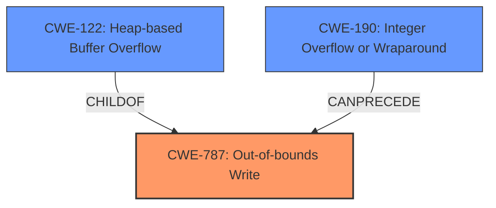

# Analysis for CVE-2020-15999

# Summary
| CWE ID | CWE Name | Confidence | CWE Abstraction Level | CWE Vulnerability Mapping Label | CWE-Vulnerability Mapping Notes |
|---|---|---|---|---|---|
| CWE-787 | Out-of-bounds Write | 1.0 | Base | Allowed | Primary CWE |
| CWE-190 | Integer Overflow or Wraparound | 0.7 | Base | Allowed | Secondary Candidate |
| CWE-122 | Heap-based Buffer Overflow | 0.7 | Variant | Allowed | Secondary Candidate |

## Evidence and Confidence

*   **Confidence Score:** 0.9
*   **Evidence Strength:** HIGH

## Relationship Analysis
The primary CWE is CWE-787, which represents the out-of-bounds write. CWE-122 (Heap-based Buffer Overflow) is a variant of CWE-787 and describes the location where the overflow occurs. The integer overflow (CWE-190) can often precede the out-of-bounds write, which is also present in the reference content. The relationships are:
  - CWE-787 is a base CWE and represents a general out-of-bounds write.
  - CWE-122 is a variant of CWE-787, specifying that the overflow occurs on the heap.
  - CWE-190 can precede CWE-787, as an integer overflow can lead to an incorrect buffer size calculation, ultimately causing an out-of-bounds write.

## Vulnerability Chain
The vulnerability chain starts with a potentially **integer truncation** or **integer overflow** (CWE-190) during the bitmap size calculation. This leads to an undersized buffer allocation on the heap. When data is written into this buffer without proper bounds checking, it results in a **heap buffer overflow** (CWE-122), which is a specific type of **out-of-bounds write** (CWE-787).

## Summary of Analysis
The initial analysis based on the vulnerability description key phrases points to **Heap buffer overflow** as the primary weakness. The reference links summary confirms this with details about **integer truncation** leading to **heap buffer overflow**. The retriever results also lists CWE-787, CWE-190, and CWE-122 as potential candidates.

Based on the evidence:
- The vulnerability description mentions **Heap buffer overflow**.
- The CVE reference link content summary indicates that an **integer truncation** in the `Load_SBit_Png` function leads to a **heap buffer overflow**. "The function `Load_SBit_Png` truncates the image height and width to 16-bit integers when calculating the bitmap size. This size is used to allocate the buffer. However, later the code passes the original 32-bit values for the height and width along with the allocated buffer to libpng for further processing."

CWE-787 is the most accurate and general representation of the weakness because it describes the **out-of-bounds write** condition. CWE-122 is a more specific variant that describes the location of the buffer. CWE-190 describes a common root cause that leads to the out-of-bounds write because it can lead to an incorrect size calculation.

I considered CWE-119, Improper Restriction of Operations within the Bounds of a Memory Buffer, but it is a Class-level CWE and is too general. The description for CWE-119 also says its usage is discouraged. "CWE-119 is commonly misused in low-information vulnerability reports when lower-level CWEs could be used instead, or when more details about the vulnerability are available."

CWE-416 Use After Free was considered but did not match the vulnerability well because the vulnerability was related to a buffer overflow not an access after the memory has been freed.

CWE-120, Buffer Copy without Checking Size of Input ('Classic Buffer Overflow'), was considered because of the term "buffer overflow". However, the reference summary pointed to a more specific problem of integer truncation when calculating bitmap size which resulted in a heap buffer overflow.

Based on this analysis, CWE-787 is the primary CWE, and CWE-190 and CWE-122 are related contributing factors. The selected CWEs are at the optimal level of specificity, with CWE-787 being a base CWE and CWE-122 being a variant.