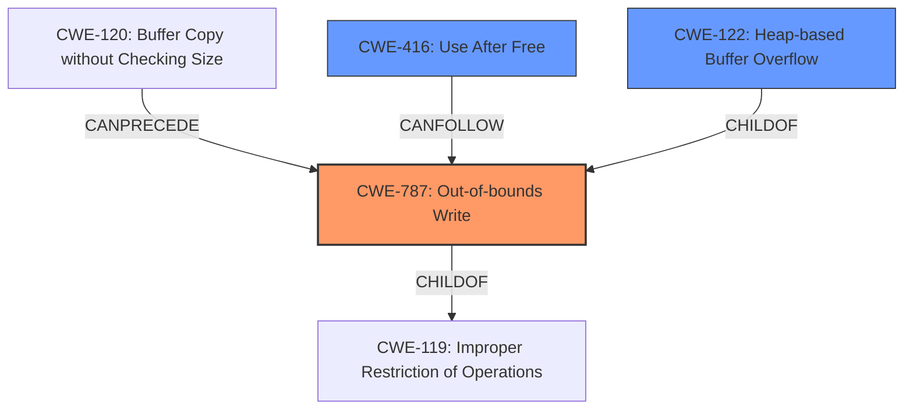

# Enhanced Analysis for CVE-2020-16009

# Summary
| CWE ID | CWE Name | Confidence | CWE Abstraction Level | CWE Vulnerability Mapping Label | CWE-Vulnerability Mapping Notes |
|---|---|---|---|---|---|
| CWE-787 | Out-of-bounds Write | 0.8 | Base | Allowed | Primary CWE |
| CWE-416 | Use After Free | 0.6 | Variant | Allowed | Secondary Candidate |
| CWE-122 | Heap-based Buffer Overflow | 0.5 | Variant | Allowed | Secondary Candidate |

## Evidence and Confidence

*   **Confidence Score:** 0.7
*   **Evidence Strength:** MEDIUM

## Relationship Analysis
The primary CWE selected is CWE-787, Out-of-bounds Write, which is a **Base** level CWE. CWE-787 is related to other CWEs through hierarchical and chain relationships. For instance, CWE-119, Improper Restriction of Operations within a Memory Buffer, is a parent of CWE-787. CWE-120, Buffer Copy without Checking Size of Input, can precede CWE-787.



## Vulnerability Chain
The vulnerability chain starts with an **inappropriate implementation** in the V8 JavaScript engine, leading to **heap corruption**, which can be exploited by a remote attacker via a crafted HTML page.

## Summary of Analysis
The initial assessment focused on the provided vulnerability description, key phrases, and CVE reference links. The description clearly states "**heap corruption**" as the **weakness** and "**inappropriate implementation**" as the **root cause**. The CVE reference confirms these findings, stating "Inappropriate implementation in the V8 JavaScript engine" as the **root_cause** and "**Heap corruption**" as one of the **weaknesses**.

The primary CWE match from similar CVE descriptions is CWE-NVD-noinfo, which is not a specific CWE. The top CWEs listed include CWE-787 (Out-of-bounds Write). The Retriever Results suggest several candidate CWEs, including CWE-843 (Access of Resource Using Incompatible Type), CWE-416 (Use After Free), and CWE-122 (Heap-based Buffer Overflow).

Considering the evidence and the relationships between CWEs, CWE-787 (Out-of-bounds Write) is the most appropriate primary CWE. The vulnerability involves **heap corruption**, which often results from writing data beyond the intended buffer boundary. CWE-416 (Use After Free) and CWE-122 (Heap-based Buffer Overflow) are also considered as secondary candidates because **heap corruption** can happen if memory is freed and then reused (**Use After Free**), or it can happen because of a buffer overflow in the heap.

The final decision is based on the provided evidence and the need for a specific and accurate CWE.

Relevant CWE Information:

# Enhanced Context (25 CWEs)
The following CWEs were identified as potentially relevant to this vulnerability:

## CWE-1289: Improper Validation of Unsafe Equivalence in Input
**Abstraction Level**: Base
**Similarity Score**: 0.78
**Source**: dense

**Description**:
The product receives an input value that is used as a resource identifier or other type of reference, but it does not validate or incorrectly validates that the input is equivalent to a potentially-unsafe value.

**Mapping Guidance**:
- Usage: Allowed
- Rationale: This CWE entry is at the Base level of abstraction, which is a preferred level of abstraction for mapping to the root causes of vulnerabilities.

## CWE-356: Product UI does not Warn User of Unsafe Actions
**Abstraction Level**: Base
**Similarity Score**: 0.77
**Source**: dense

**Description**:
The product's user interface does not warn the user before undertaking an unsafe action on behalf of that user. This makes it easier for attackers to trick users into inflicting damage to their system.

**Mapping Guidance**:
- Usage: Allowed
- Rationale: This CWE entry is at the Base level of abstraction, which is a preferred level of abstraction for mapping to the root causes of vulnerabilities.

## CWE-451: User Interface (UI) Misrepresentation of Critical Information
**Abstraction Level**: Class
**Similarity Score**: 0.76
**Source**: dense

**Description**:
The user interface (UI) does not properly represent critical information to the user, allowing the information - or its source - to be obscured or spoofed. This is often a component in phishing attacks.

**Mapping Guidance**:
- Usage: Allowed-with-Review
- Rationale: This CWE entry is a Class and might have Base-level children that would be more appropriate

## CWE-404: Improper Resource Shutdown or Release
**Abstraction Level**: Class
**Similarity Score**: 0.75
**Source**: dense

**Description**:
The product does not release or incorrectly releases a resource before it is made available for re-use.

**Mapping Guidance**:
- Usage: Allowed-with-Review
- Rationale: This CWE entry is a Class and might have Base-level children that would be more appropriate

## CWE-843: Access of Resource Using Incompatible Type ('Type Confusion')
**Abstraction Level**: Base
**Similarity Score**: 0.75
**Source**: dense

**Description**:
The product allocates or initializes a resource such as a pointer, object, or variable using one type, but it later accesses that resource using a type that is incompatible with the original type.

**Mapping Guidance**:
- Usage: Allowed
- Rationale: This CWE entry is at the Base level of abstraction, which is a preferred level of abstraction for mapping to the root causes of vulnerabilities.

## CWE-226: Sensitive Information in Resource Not Removed Before Reuse
**Abstraction Level**: Base
**Similarity Score**: 0.75
**Source**: dense

**Description**:
The product releases a resource such as memory or a file so that it can be made available for reuse, but it does not clear or "zeroize" the information contained in the resource before the product performs a critical state transition or makes the resource available for reuse by other entities.

**Mapping Guidance**:
- Usage: Allowed
- Rationale: This CWE entry is at the Base level of abstraction, which is a preferred level of abstraction for mapping to the root causes of vulnerabilities.

## CWE-657: Violation of Secure Design Principles
**Abstraction Level**: Class
**Similarity Score**: 0.74
**Source**: dense

**Description**:
The product violates well-established principles for secure design.

**Mapping Guidance**:
- Usage: Discouraged
- Rationale: This CWE entry is a level-1 Class (i.e., a child of a Pillar). It might have lower-level children that would be more appropriate

## CWE-754: Improper Check for Unusual or Exceptional Conditions
**Abstraction Level**: Class
**Similarity Score**: 0.74
**Source**: dense

**Description**:
The product does not check or incorrectly checks for unusual or exceptional conditions that are not expected to occur frequently during day to day operation of the product.

**Mapping Guidance**:
- Usage: Allowed-with-Review
- Rationale: This CWE entry is a Class and might have Base-level children that would be more appropriate

## CWE-204: Observable Response Discrepancy
**Abstraction Level**: Base
**Similarity Score**: 0.74
**Source**: dense

**Description**:
The product provides different responses to incoming requests in a way that reveals internal state information to an unauthorized actor outside of the intended control sphere.

**Mapping Guidance**:
- Usage: Allowed
- Rationale: This CWE entry is at the Base level of abstraction, which is a preferred level of abstraction for mapping to the root causes of vulnerabilities.

## CWE-41: Improper Resolution of Path Equivalence
**Abstraction Level**: Base
**Similarity Score**: 0.74
**Source**: dense

**Description**:
The product is vulnerable to file system contents disclosure through path equivalence. Path equivalence involves the use of special characters in file and directory names. The associated manipulations are intended to generate multiple names for the same object.

**Mapping Guidance**:
- Usage: Allowed
- Rationale: This CWE entry is at the Base level of abstraction, which is a preferred level of


## CWE Relationship Analysis

Current CWEs represent these abstraction levels: .


### Vulnerability Chain Analysis

**Chain starting from CWE-754:**
- 754 (Improper Check for Unusual or Exceptional Conditions) - ROOT


**Chain starting from CWE-787:**
- 787 (Out-of-bounds Write) - ROOT


### CWE Relationship Diagram

```mermaid
graph TD
    classDef primary fill:#f96,stroke:#333,stroke-width:2px
    classDef secondary fill:#69f,stroke:#333
    classDef tertiary fill:#9e9,stroke:#333
```