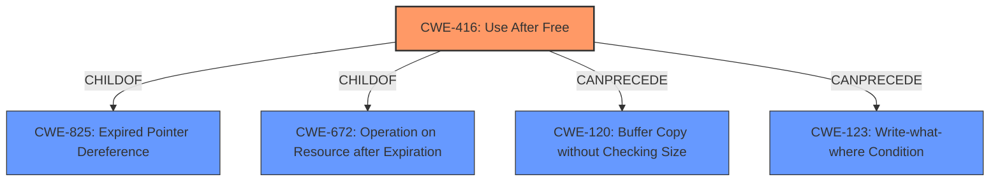

# Analysis for CVE-2020-16017

# Summary
| CWE ID | CWE Name | Confidence | CWE Abstraction Level | CWE Vulnerability Mapping Label | CWE-Vulnerability Mapping Notes |
|---|---|---|---|---|---|
| CWE-416 | Use After Free | 1.0 | Variant | Primary | Allowed |

## Evidence and Confidence

*   **Confidence Score:** 1.0
*   **Evidence Strength:** HIGH

## Relationship Analysis
The primary CWE selected is CWE-416. It's a variant of CWE-825 (Expired Pointer Dereference) and CWE-672 (Operation on Resource after Expiration). The vulnerability description clearly states "**use after free**" as the root cause which aligns perfectly with CWE-416's description. The relationships indicate that CWE-416 can lead to other issues like buffer overflows (CWE-120) or write-what-where conditions (CWE-123), but these are not explicitly mentioned in the description.

## Vulnerability Chain
The chain of events is as follows:
1.  **Root Cause:** **Use after free** (CWE-416)
2.  **Impact:** Sandbox escape

The vulnerability description indicates a direct link between the **use after free** condition and the sandbox escape.

## Summary of Analysis
The primary CWE is CWE-416 because the vulnerability description explicitly mentions "**use after free**".
The "Vulnerability Description Key Phrases" section lists "**use after free**" as the **rootcause**.
The "CVE Reference Links Content Summary" further confirms this: `"root_cause": "Use after free in site isolation."` and `"weaknesses": ["Use after free"]`.
This direct and explicit evidence justifies the selection of CWE-416 with high confidence.

The retriever results also list CWE-416 as the top candidate, which supports this decision.

CWE-122 (Heap-based Buffer Overflow), CWE-366 (Race Condition within a Thread), CWE-843 (Access of Resource Using Incompatible Type ('Type Confusion')), and CWE-123 (Write-what-where Condition) were considered, but they were not selected because the vulnerability description specifically indicates a **use after free** condition. While these other CWEs might be potential consequences or related issues, they are not the primary **rootcause** described in the vulnerability.
Relevant CWE Information:

# Enhanced Context (25 CWEs)
The following CWEs were identified as potentially relevant to this vulnerability:

## CWE-366: Race Condition within a Thread
**Abstraction Level**: Base
**Similarity Score**: 0.80
**Source**: dense

**Description**:
If two threads of execution use a resource simultaneously, there exists the possibility that resources may be used while invalid, in turn making the state of execution undefined.

**Mapping Guidance**:
- Usage: Allowed
- Rationale: This CWE entry is at the Base level of abstraction, which is a preferred level of abstraction for mapping to the root causes of vulnerabilities.

## CWE-415: Double Free
**Abstraction Level**: Variant
**Similarity Score**: 0.79
**Source**: dense

**Description**:
The product calls free() twice on the same memory address, potentially leading to modification of unexpected memory locations.

**Mapping Guidance**:
- Usage: Allowed
- Rationale: This CWE entry is at the Variant level of abstraction, which is a preferred level of abstraction for mapping to the root causes of vulnerabilities.

## CWE-226: Sensitive Information in Resource Not Removed Before Reuse
**Abstraction Level**: Base
**Similarity Score**: 0.77
**Source**: dense

**Description**:
The product releases a resource such as memory or a file so that it can be made available for reuse, but it does not clear or "zeroize" the information contained in the resource before the product performs a critical state transition or makes the resource available for reuse by other entities.

**Mapping Guidance**:
- Usage: Allowed
- Rationale: This CWE entry is at the Base level of abstraction, which is a preferred level of abstraction for mapping to the root causes of vulnerabilities.

## CWE-404: Improper Resource Shutdown or Release
**Abstraction Level**: Class
**Similarity Score**: 0.77
**Source**: dense

**Description**:
The product does not release or incorrectly releases a resource before it is made available for re-use.

**Mapping Guidance**:
- Usage: Allowed-with-Review
- Rationale: This CWE entry is a Class and might have Base-level children that would be more appropriate

## CWE-667: Improper Locking
**Abstraction Level**: Class
**Similarity Score**: 0.76
**Source**: dense

**Description**:
The product does not properly acquire or release a lock on a resource, leading to unexpected resource state changes and behaviors.

**Mapping Guidance**:
- Usage: Allowed-with-Review
- Rationale: This CWE entry is a Class and might have Base-level children that would be more appropriate

## CWE-362: Concurrent Execution using Shared Resource with Improper Synchronization ('Race Condition')
**Abstraction Level**: Class
**Similarity Score**: 0.76
**Source**: dense

**Description**:
The product contains a concurrent code sequence that requires temporary, exclusive access to a shared resource, but a timing window exists in which the shared resource can be modified by another code sequence operating concurrently.

**Mapping Guidance**:
- Usage: Allowed-with-Review
- Rationale: This CWE entry is a Class and might have Base-level children that would be more appropriate

## CWE-416: Use After Free
**Abstraction Level**: Variant
**Similarity Score**: 0.75
**Source**: dense

**Description**:
The product reuses or references memory after it has been freed. At some point afterward, the memory may be allocated again and saved in another pointer, while the original pointer references a location somewhere within the new allocation. Any operations using the original pointer are no longer valid because the memory "belongs" to the code that operates on the new pointer.

**Mapping Guidance**:
- Usage: Allowed
- Rationale: This CWE entry is at the Variant level of abstraction, which is a preferred level of abstraction for mapping to the root causes of vulnerabilities.

## CWE-367: Time-of-check Time-of-use (TOCTOU) Race Condition
**Abstraction Level**: Base
**Similarity Score**: 0.74
**Source**: dense

**Description**:
The product checks the state of a resource before using that resource, but the resource's state can change between the check and the use in a way that invalidates the results of the check. This can cause the product to perform invalid actions when the resource is in an unexpected state.

**Mapping Guidance**:
- Usage: Allowed
- Rationale: This CWE entry is at the Base level of abstraction, which is a preferred level of abstraction for mapping to the root causes of vulnerabilities.

## CWE-843: Access of Resource Using Incompatible Type ('Type Confusion')
**Abstraction Level**: Base
**Similarity Score**: 0.73
**Source**: dense

**Description**:
The product allocates or initializes a resource such as a pointer, object, or variable using one type, but it later accesses that resource using a type that is incompatible with the original type.

**Mapping Guidance**:
- Usage: Allowed
- Rationale: This CWE entry is at the Base level of abstraction, which is a preferred level of abstraction for mapping to the root causes of vulnerabilities.

## CWE-662: Improper Synchronization
**Abstraction Level**: Class
**Similarity Score**: 0.73
**Source**: dense

**Description**:
The product utilizes multiple threads or processes to allow temporary access to a shared resource that can only be exclusive to one process at a time, but it does not properly synchronize these actions, which might cause simultaneous accesses of this resource by multiple threads or processes.

**Mapping Guidance**:
- Usage: Discouraged
- Rationale: This CWE entry is a level-1 Class (i.e., a child of a Pillar). It might have lower-level children that would be more appropriate

## CWE-362: Concurrent