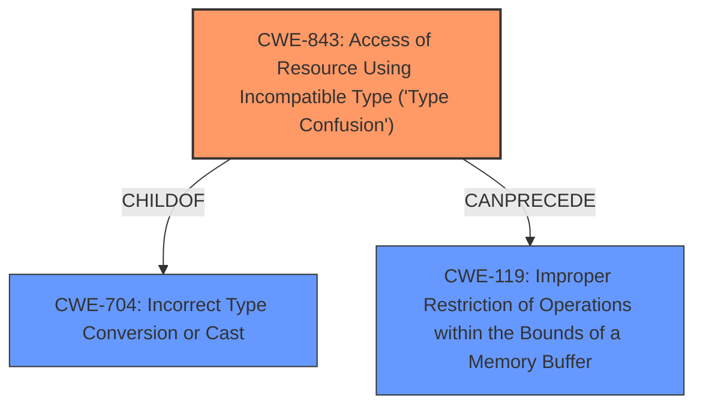

# Enhanced Analysis for CVE-2020-16103

# Summary
| CWE ID | CWE Name | Confidence | CWE Abstraction Level | CWE Vulnerability Mapping Label | CWE-Vulnerability Mapping Notes |
|---|---|---|---|---|---|
| CWE-843 | Access of Resource Using Incompatible Type ('Type Confusion') | 1.0 | Base | Allowed | Primary CWE |

## Evidence and Confidence

*   **Confidence Score:** 1.0
*   **Evidence Strength:** HIGH

## Relationship Analysis
The primary relationship influencing the CWE selection is the direct match of the vulnerability description to **CWE-843 (Access of Resource Using Incompatible Type ('Type Confusion'))**. The vulnerability explicitly states "Type confusion" as the root cause, and CWE-843 accurately describes this weakness.



## Vulnerability Chain
The vulnerability chain starts with the **CWE-843 (Access of Resource Using Incompatible Type ('Type Confusion'))** weakness, which can lead to a crash of the server or potentially remote code execution.

## Summary of Analysis
The initial analysis strongly pointed towards **CWE-843 (Access of Resource Using Incompatible Type ('Type Confusion'))** due to the explicit mention of "type confusion" in the vulnerability description and CVE Reference Links Content Summary. The retriever results also listed CWE-843 as the top candidate.

*   **Vulnerability Description Key Phrases:** "**rootcause:** **type confusion**"
*   **CVE Reference Links Content Summary:** "**Root cause of vulnerability**: Type confusion in Gallagher Command Centre Server."

The description of **CWE-843 (Access of Resource Using Incompatible Type ('Type Confusion'))** perfectly matches the vulnerability: "The product allocates or initializes a resource such as a pointer, object, or variable using one type, but it later accesses that resource using a type that is incompatible with the original type."

The other CWEs from the retriever results were considered but not used because they did not directly address the root cause of the vulnerability, which is type confusion. For example, while **CWE-200 (Exposure of Sensitive Information to an Unauthorized Actor)** could be a consequence of the vulnerability if remote code execution is achieved, it is not the root cause. Similarly, **CWE-184 (Incomplete List of Disallowed Inputs)** and **CWE-121 (Stack-based Buffer Overflow)** do not directly relate to the type confusion aspect of the vulnerability.
The selected CWE, **CWE-843 (Access of Resource Using Incompatible Type ('Type Confusion'))**, is at the optimal level of specificity (Base) as it accurately represents the weakness described in the vulnerability.


## CWE Relationship Analysis

Current CWEs represent these abstraction levels: .


### Vulnerability Chain Analysis

**Chain starting from CWE-121:**
- 121 (Stack-based Buffer Overflow) - ROOT


**Chain starting from CWE-843:**
- 843 (Access of Resource Using Incompatible Type ('Type Confusion')) - ROOT


### CWE Relationship Diagram

```mermaid
graph TD
    classDef primary fill:#f96,stroke:#333,stroke-width:2px
    classDef secondary fill:#69f,stroke:#333
    classDef tertiary fill:#9e9,stroke:#333
```