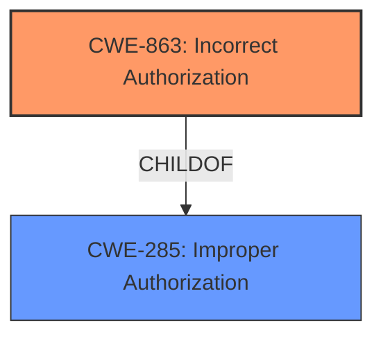

# Raw Analyzer Response for CVE-2020-16122

# Summary
| CWE ID | CWE Name | Confidence | CWE Abstraction Level | CWE Vulnerability Mapping Label | CWE-Vulnerability Mapping Notes |
|---|---|---|---|---|---|
| CWE-863 | Incorrect Authorization | 0.9 | Class | Primary | Allowed-with-Review |
| CWE-285 | Improper Authorization | 0.7 | Class | Secondary | Discouraged |

## Evidence and Confidence

*   **Confidence Score:** 0.8
*   **Evidence Strength:** HIGH

## Relationship Analysis
The primary CWE identified is CWE-863, "Incorrect Authorization," which is a child of CWE-285, "Improper Authorization." While CWE-285 is a broader class, CWE-863 more precisely captures the vulnerability where the system incorrectly performs an authorization check, leading to the bypass. The relationship informs the decision to prefer the more specific CWE-863.

## Vulnerability Chain
The chain of events is as follows:
1.  **Root Cause:** The PackageKit `apt` backend **incorrectly assumes** all local debs are trusted.
2.  **Weakness:** **Incorrect Authorization** (CWE-863) due to the failure to properly identify and handle untrusted local packages.
3.  **Impact:** Users can install malicious packages, potentially leading to privilege escalation and system compromise.

## Summary of Analysis
The analysis is primarily based on the provided vulnerability description and the CVE reference summary. The key evidence lies in the description of how the `aptcc` backend mistakenly treats local debs as trusted, leading to a bypass of policy restrictions.

> "The vulnerability stems from the PackageKit's `aptcc` backend incorrectly handling local package installations. The `packagekitd` daemon **assumes** that packages are inherently trusted."

> "The `aptcc` backend **does not explicitly reject** local packages as untrusted. Thus, when a user attempts to install a local `.deb` package using `pkcon install-local`, the system triggers the `org.freedesktop.packagekit.package-install` action instead of `org.freedesktop.packagekit.package-install-untrusted`. This **bypasses** the intended policy that requires administrator authentication for installing untrusted packages."

The graph relationships confirm that selecting a child CWE of a class CWE is more appropriate.
CWE-863 accurately reflects that the authorization check is present, but is performed incorrectly. This leads to a bypass of the intended security policy. This is at the optimal level of specificity, as it identifies the exact mechanism that is failing.

# Relevant CWE Information:

## CWE-274: Improper Handling of Insufficient Privileges
**Abstraction Level**: Base
**Similarity Score**: 0.77
**Source**: dense
**Description**: The product does not handle or incorrectly handles when it has insufficient privileges to perform an operation, leading to resultant weaknesses.
**Mapping Guidance**:
- Usage: Discouraged
- Rationale: This CWE entry could be deprecated in a future version of CWE.

*Not Selected:* This CWE is focused on handling of insufficient privileges, which isn't the core issue here. The problem is that the system is authorizing actions that should not be allowed, not necessarily failing to handle cases where privileges are insufficient.

## CWE-345: Insufficient Verification of Data Authenticity
**Abstraction Level**: Class
**Similarity Score**: 0.77
**Source**: dense
**Description**: The product does not sufficiently verify the origin or authenticity of data, in a way that causes it to accept invalid data.
**Mapping Guidance**:
- Usage: Discouraged
- Rationale: This CWE entry is a level-1 Class (i.e., a child of a Pillar). It might have lower-level children that would be more appropriate

*Not Selected:* While data authenticity is a concern, the primary issue is the authorization process. The system isn't correctly verifying whether the user should be allowed to install the package.

## CWE-280: Improper Handling of Insufficient Permissions or Privileges
**Abstraction Level**: Base
**Similarity Score**: 0.76
**Source**: dense
**Description**: The product does not handle or incorrectly handles when it has insufficient privileges to access resources or functionality as specified by their permissions. This may cause it to follow unexpected code paths that may leave the product in an invalid state.
**Mapping Guidance**:
- Usage: Allowed
- Rationale: This CWE entry is at the Base level of abstraction, which is a preferred level of abstraction for mapping to the root causes of vulnerabilities.

*Not Selected:* Similar to CWE-274, this focuses on handling insufficient privileges, which is not the core problem.

## CWE-639: Authorization Bypass Through User-Controlled Key
**Abstraction Level**: Base
**Similarity Score**: 0.76
**Source**: dense
**Description**: The system's authorization functionality does not prevent one user from gaining access to another user's data or record by modifying the key value identifying the data.
**Mapping Guidance**:
- Usage: Allowed
- Rationale: This CWE entry is at the Base level of abstraction, which is a preferred level of abstraction for mapping to the root causes of vulnerabilities.

*Not Selected:* This CWE describes a specific bypass scenario involving user-controlled keys, which is not relevant to the described vulnerability.

## CWE-807: Reliance on Untrusted Inputs in a Security Decision
**Abstraction Level**: Base
**Similarity Score**: 0.76
**Source**: dense
**Description**: The product uses a protection mechanism that relies on the existence or values of an input, but the input can be modified by an untrusted actor in a way that bypasses the protection mechanism.
**Mapping Guidance**:
- Usage: Allowed
- Rationale: This CWE entry is at the Base level of abstraction, which is a preferred level of abstraction for mapping to the root causes of vulnerabilities.

*Not Selected:* While the system is making a decision based on the package, the core issue is that authorization is incorrect, not that an input is directly influencing a security decision.

## CWE-59: Improper Link Resolution Before File Access ('Link Following')
**Abstraction Level**: Base
**Similarity Score**: 0.76
**Source**: dense
**Description**: The product attempts to access a file based on the filename, but it does not properly prevent that filename from identifying a link or shortcut that resolves to an unintended resource.
**Mapping Guidance**:
- Usage: Allowed
- Rationale: This CWE entry is at the Base level of abstraction, which is a preferred level of abstraction for mapping to the root causes of vulnerabilities.

*Not Selected:* This CWE relates to issues with file access and symbolic links, which is not directly relevant.

## CWE-184: Incomplete List of Disallowed Inputs
**Abstraction Level**: Base
**Similarity Score**: 0.76
**Source**: dense
**Description**: The product implements a protection mechanism that relies on a list of inputs (or properties of inputs) that are not allowed by policy or otherwise require other action to neutralize before additional processing takes place, but the list is incomplete.
**Mapping Guidance**:
- Usage: Allowed
- Rationale: This CWE entry is at the Base level of abstraction, which is a preferred level of abstraction for mapping to the root causes of vulnerabilities.

*Not Selected:* The problem is not related to a list of disallowed inputs.

## CWE-1289: Improper Validation of Unsafe Equivalence in Input
**Abstraction Level**: Base
**Similarity Score**: 0.76
**Source**: dense
**Description**: The product receives an input value that is used as a resource identifier or other type of reference, but it does not validate or incorrectly validates that the input is equivalent to a potentially-unsafe value.
**Mapping Guidance**:
- Usage: Allowed
- Rationale: This CWE entry is at the Base level of abstraction, which is a preferred level of abstraction for mapping to the root causes of vulnerabilities.

*Not Selected:* This is not about unsafe equivalence in input.

## CWE-668: Exposure of Resource to Wrong Sphere
**Abstraction Level**: Class
**Similarity Score**: 0.76
**Source**: dense
**Description**: The product exposes a resource to the wrong control sphere, providing unintended actors with inappropriate access to the resource.
**Mapping Guidance**:
- Usage: Discouraged
- Rationale: CWE-668 is high-level and is often misused as a catch-all when lower-level CWE IDs might be applicable. It is sometimes used for low-information vulnerability reports [REF-1287]. It is a level-1 Class (i.e., a child of a Pillar). It is not useful for trend analysis.

*Not Selected:* Too broad.

## CWE-41: Improper Resolution of Path Equivalence
**Abstraction Level**: Base
**Similarity Score**: 0.75
**Source**: dense