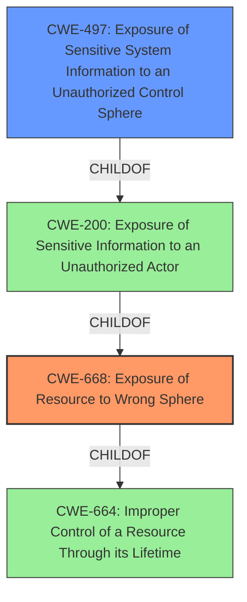

# Enhanced Analysis for CVE-2020-16247

# Summary
| CWE ID | CWE Name | Confidence | CWE Abstraction Level | CWE Vulnerability Mapping Label | CWE-Vulnerability Mapping Notes |
|---|---|---|---|---|---|
| CWE-668 | Exposure of Resource to Wrong Sphere | 1.0 | Class | Primary | Discouraged |
| CWE-497 | Exposure of Sensitive System Information to an Unauthorized Control Sphere | 0.75 | Base | Secondary | Allowed |

## Evidence and Confidence

*   **Confidence Score:** 0.9
*   **Evidence Strength:** HIGH

## Relationship Analysis
The primary CWE selected is CWE-668, a Class-level weakness. While Class-level CWEs are generally discouraged, in this case, the provided information does not allow for a more specific Base or Variant CWE to be selected. CWE-668 is a child of CWE-664 (Improper Control of a Resource Through its Lifetime), indicating a broader category of resource control issues. CWE-497 (Exposure of Sensitive System Information to an Unauthorized Control Sphere) is a potential secondary CWE, as it is a Base-level weakness and a child of CWE-200 (Exposure of Sensitive Information to an Unauthorized Actor). However, CWE-497 is not selected as the primary CWE because the provided description doesn't explicitly mention sensitive *system* information being exposed, only that a resource is exposed to the wrong sphere.



## Vulnerability Chain
The vulnerability chain is relatively simple: The **incorrect configuration** (the **weakness**) of the Philips Clinical Collaboration Platform results in a resource being exposed to the wrong control sphere, leading to potential modification of data or denial of service (the impact).

## Summary of Analysis
The analysis is based on the provided evidence, specifically the "Vulnerability Description Key Phrases" and "CVE Reference Links Content Summary." The key phrase "provide unintended actors with inappropriate access to the resource" directly aligns with the description of CWE-668: "The product exposes a resource to the wrong control sphere, providing unintended actors with inappropriate access to the resource." The retriever results also list CWE-668 as the top candidate. While CWE-668 is generally discouraged, the provided information doesn't allow for a more specific Base or Variant CWE to be selected.

CWE-497 was considered as a secondary weakness since system-level information is often sensitive. However, the description only talks about resource exposure, but not explicitly about exposure of sensitive *system* information.

The chosen CWEs are at the most specific level possible given the available information. More specific CWEs might be applicable if more details about the exposed resource and the mechanism of exposure were available.


## CWE Relationship Analysis

Current CWEs represent these abstraction levels: .


### Vulnerability Chain Analysis

**Chain starting from CWE-664:**
- 664 (Improper Control of a Resource Through its Lifetime) - ROOT


**Chain starting from CWE-200:**
- 200 (Exposure of Sensitive Information to an Unauthorized Actor) - ROOT


### CWE Relationship Diagram

```mermaid
graph TD
    classDef primary fill:#f96,stroke:#333,stroke-width:2px
    classDef secondary fill:#69f,stroke:#333
    classDef tertiary fill:#9e9,stroke:#333
```