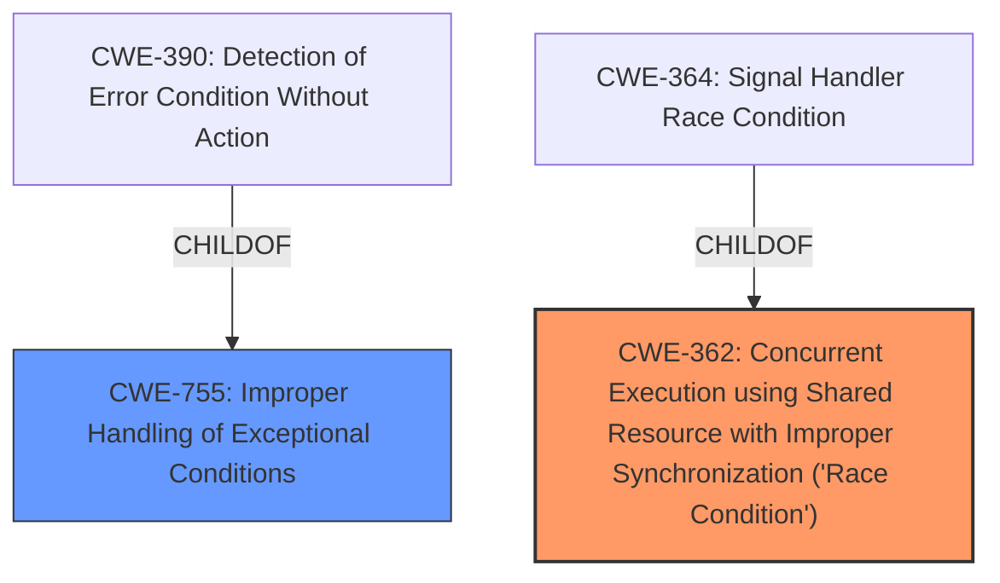

# Analysis for CVE-2020-1629

# Summary
| CWE ID | CWE Name | Confidence | CWE Abstraction Level | CWE Vulnerability Mapping Label | CWE-Vulnerability Mapping Notes |
|---|---|---|---|---|---|
| CWE-362 | Concurrent Execution using Shared Resource with Improper Synchronization ('Race Condition') | 0.9 | Class | Primary | Allowed-with-Review |
| CWE-755 | Improper Handling of Exceptional Conditions | 0.6 | Class | Secondary | Discouraged |

## Evidence and Confidence

*   **Confidence Score:** 0.75
*   **Evidence Strength:** MEDIUM

## Relationship Analysis
The primary CWE selected is CWE-362 (Concurrent Execution using Shared Resource with Improper Synchronization ('Race Condition')), which is a Class-level CWE. A related CWE considered was CWE-755 (Improper Handling of Exceptional Conditions), which is also a Class-level CWE and a parent of CWE-390 (Detection of Error Condition Without Action). The relationship between CWE-362 and its potential child CWEs such as CWE-364 (Signal Handler Race Condition) was considered. The decision to map to CWE-362 was influenced by the direct mention of a **race condition** in the vulnerability description.

## Vulnerability Chain
The vulnerability chain starts with a **race condition** (CWE-362) during the processing of a BGP NOTIFICATION message, leading to the crash and restart of the routing protocol daemon (RPD) process.

## Summary of Analysis
The initial analysis focused on identifying the root cause of the vulnerability. The vulnerability description explicitly mentions a **race condition**, which strongly suggests CWE-362. The "Retriever Results" also list CWE-362 as the top candidate. The description states: "A **race condition** vulnerability on Juniper Network Junos OS devices may cause the routing protocol daemon (RPD) process to crash and restart while processing a BGP NOTIFICATION message."

The secondary consideration was CWE-755 (Improper Handling of Exceptional Conditions) because the crash of the RPD process could be viewed as an unhandled exceptional condition. However, the explicit mention of the **race condition** makes CWE-362 the more appropriate primary CWE. While CWE-364 (Signal Handler Race Condition) is more specific, there's no evidence the race condition is specifically in a signal handler.

The final decision is based on the evidence provided, primarily the explicit mention of a **race condition**. The selected CWEs are at an appropriate level of specificity given the available information.

Relevant CWE Information:

# Enhanced Context (25 CWEs)
The following CWEs were identified as potentially relevant to this vulnerability:

## CWE-754: Improper Check for Unusual or Exceptional Conditions
**Abstraction Level**: Class
**Similarity Score**: 0.78
**Source**: dense

**Description**:
The product does not check or incorrectly checks for unusual or exceptional conditions that are not expected to occur frequently during day to day operation of the product.

**Mapping Guidance**:
- Usage: Allowed-with-Review
- Rationale: This CWE entry is a Class and might have Base-level children that would be more appropriate

## CWE-703: Improper Check or Handling of Exceptional Conditions
**Abstraction Level**: Pillar
**Similarity Score**: 0.77
**Source**: dense

**Description**:
The product does not properly anticipate or handle exceptional conditions that rarely occur during normal operation of the product.

**Mapping Guidance**:
- Usage: Discouraged
- Rationale: This CWE entry is extremely high-level, a Pillar.

## CWE-364: Signal Handler Race Condition
**Abstraction Level**: Base
**Similarity Score**: 0.76
**Source**: dense

**Description**:
The product uses a signal handler that introduces a race condition.

**Mapping Guidance**:
- Usage: Allowed
- Rationale: This CWE entry is at the Base level of abstraction, which is a preferred level of abstraction for mapping to the root causes of vulnerabilities.

## CWE-667: Improper Locking
**Abstraction Level**: Class
**Similarity Score**: 0.76
**Source**: dense

**Description**:
The product does not properly acquire or release a lock on a resource, leading to unexpected resource state changes and behaviors.

**Mapping Guidance**:
- Usage: Allowed-with-Review
- Rationale: This CWE entry is a Class and might have Base-level children that would be more appropriate

## CWE-362: Concurrent Execution using Shared Resource with Improper Synchronization ('Race Condition')
**Abstraction Level**: Class
**Similarity Score**: 0.76
**Source**: dense

**Description**:
The product contains a concurrent code sequence that requires temporary, exclusive access to a shared resource, but a timing window exists in which the shared resource can be modified by another code sequence operating concurrently.

**Mapping Guidance**:
- Usage: Allowed-with-Review
- Rationale: This CWE entry is a Class and might have Base-level children that would be more appropriate

## CWE-606: Unchecked Input for Loop Condition
**Abstraction Level**: Base
**Similarity Score**: 0.75
**Source**: dense

**Description**:
The product does not properly check inputs that are used for loop conditions, potentially leading to a denial of service or other consequences because of excessive looping.

**Mapping Guidance**:
- Usage: Allowed
- Rationale: This CWE entry is at the Base level of abstraction, which is a preferred level of abstraction for mapping to the root causes of vulnerabilities.

## CWE-366: Race Condition within a Thread
**Abstraction Level**: Base
**Similarity Score**: 0.75
**Source**: dense

**Description**:
If two threads of execution use a resource simultaneously, there exists the possibility that resources may be used while invalid, in turn making the state of execution undefined.

**Mapping Guidance**:
- Usage: Allowed
- Rationale: This CWE entry is at the Base level of abstraction, which is a preferred level of abstraction for mapping to the root causes of vulnerabilities.

## CWE-404: Improper Resource Shutdown or Release
**Abstraction Level**: Class
**Similarity Score**: 0.75
**Source**: dense

**Description**:
The product does not release or incorrectly releases a resource before it is made available for re-use.

**Mapping Guidance**:
- Usage: Allowed-with-Review
- Rationale: This CWE entry is a Class and might have Base-level children that would be more appropriate

## CWE-662: Improper Synchronization
**Abstraction Level**: Class
**Similarity Score**: 0.75
**Source**: dense

**Description**:
The product utilizes multiple threads or processes to allow temporary access to a shared resource that can only be exclusive to one process at a time, but it does not properly synchronize these actions, which might cause simultaneous accesses of this resource by multiple threads or processes.

**Mapping Guidance**:
- Usage: Discouraged
- Rationale: This CWE entry is a level-1 Class (i.e., a child of a Pillar). It might have lower-level children that would be more appropriate

## CWE-755: Improper Handling of Exceptional Conditions
**Abstraction Level**: Class
**Similarity Score**: 0.74
**Source**: dense

**Description**:
The product does not handle or incorrectly handles an exceptional condition.

**Mapping Guidance**:
- Usage: Discouraged
- Rationale: This CWE entry is a level-1 Class (i.e., a child of a Pillar). It might have lower-level children that would be more appropriate

## CWE-364: Signal Handler Race Condition
**Abstraction Level**: Base
**Similarity Score**: 6941.18
**Source**: sparse

**Description**:
The product uses a signal handler that introduces a race condition.

**Mapping Guidance**:
- Usage: Allowed
- Rationale: This CWE entry is at the Base level of abstraction, which is a preferred level of abstraction for mapping to the root causes of vulnerabilities.

## CWE-362: Concurrent Execution using Shared Resource with Improper Synchronization ('Race Condition')
**Abstraction Level**: Class
**Similarity Score**: 5980.58
**Source**: sparse

**Description**:
The product contains a concurrent code sequence that requires temporary, exclusive access to a shared resource, but a timing window exists in which the shared resource can be modified by another code sequence operating concurrently.

**Mapping Guidance**:
- Usage: Allowed-with-Review
- Rationale: This CWE entry is a Class and might have Base-level children that would be more appropriate

## CWE-754: Improper

# Enhanced Query for CVE-2020-1629

## Vulnerability Description
A **race condition** vulnerability on Juniper Network Junos OS devices may cause the routing protocol daemon (RPD) process to crash and restart while processing a BGP NOTIFICATION message. This issue affects Juniper Networks Junos OS 16.1 versions prior to 16.1R7-S6 16.2 versions prior to 16.2R2-S11 17.1 versions prior to 17.1R2-S11, 17.1R3-S1 17.2 versions prior to 17.2R1-S9, 17.2R3-S3 17.2 version 17.2R2 and later versions 17.2X75 versions prior to 17.2X75-D105, 17.2X75-D110 17.3 versions prior to 17.3R2-S5, 17.3R3-S6 17.4 versions prior to 17.4R2-S7, 17.4R3 18.1 versions prior to 18.1R3-S8 18.2 versions prior to 18.2R3-S3 18.2X75 versions prior to 18.2X75-D410, 18.2X75-D420, 18.2X75-D50, 18.2X75-D60 18.3 versions prior to 18.3R1-S5, 18.3R2-S2, 18.3R3 18.4 versions prior to 18.4R2-S2, 18.4R3 19.1 versions prior to 19.1R1-S2, 19.1R2 19.2 versions prior to 19.2R1-S4, 19.2R2. This issue does not affect Juniper Networks Junos OS prior to version 16.1R1.

### Vulnerability Description Key Phrases
- **rootcause:** **race condition**
- **impact:** crash and restart of routing protocol daemon (RPD) process
- **vector:** BGP NOTIFICATION message
- **product:** Juniper Networks Junos OS
- **version:** 16.1 to 19.2R2

## Retriever Results

### Top Combined Results

| Rank | CWE ID | Name | Abstraction | Usage  | Retrievers | Individual Scores |
|------|--------|------|-------------|-------|------------|-------------------|
| 1 | 362 | Concurrent Execution using Shared Resource with Improper Synchronization ('Race Condition') | Class | Allowed-with-Review | alternate_terms | 1.000 |
| 2 | 755 | Improper Handling of Exceptional Conditions | Class | Discouraged | sparse | 2.014 |
| 3 | 606 | Unchecked Input for Loop Condition | Base | Allowed | sparse | 1.973 |
| 4 | 401 | Missing Release of Memory after Effective Lifetime | Variant | Allowed | sparse | 1.776 |
| 5 | 250 | Execution with Unnecessary Privileges | Base | Allowed | sparse | 1.730 |
| 6 | 1285 | Improper Validation of Specified Index, Position, or Offset in Input | Base | Allowed | dense | 0.552 |
| 7 | 390 | Detection of Error Condition Without Action | Base | Allowed | graph | 0.003 |
| 8 | 364 | Signal Handler Race Condition | Base | Allowed | sparse | 1.717 |
| 9 | 696 | Incorrect Behavior Order | Class | Allowed-with-Review | sparse | 1.666 |
| 10 | 754 | Improper Check for Unusual or Exceptional Conditions | Class | Allowed-with-Review | sparse | 1.656 |

# Complete CWE Specifications

## CWE-362: Concurrent Execution using Shared Resource with Improper Synchronization ('Race Condition')
**Abstraction:** Class
**Status:** Draft

### Description
The product contains a concurrent code sequence that requires temporary, exclusive access to a shared resource, but a timing window exists in which the shared resource can be modified by another code sequence operating concurrently.

### Extended Description

A race condition occurs within concurrent environments, and it is effectively a property of a code sequence. Depending on the context, a code sequence may be in the form of a function call, a small number of instructions, a series of program invocations, etc.

A race condition violates these properties, which are closely related:

  - Exclusivity - the code sequence is given exclusive access to the shared resource, i.e., no other code sequence can modify properties of the shared resource before the original sequence has completed execution.

  - Atomicity - the code sequence is behaviorally atomic, i.e., no other thread or process can concurrently execute the same sequence of instructions (or a subset) against the same resource.

A race condition exists when an "interfering code sequence" can still access the shared resource, violating exclusivity.

The interfering code sequence could be "trusted" or "untrusted." A trusted interfering code sequence occurs within the product; it cannot be modified by the attacker, and it can only be invoked indirectly. An untrusted interfering code sequence can be authored directly by the attacker, and typically it is external to the vulnerable product.

### Alternative Terms
Race Condition

### Relationships
ChildOf -> CWE-691
CanPrecede -> CWE-416
CanPrecede -> CWE-476

### Mapping Guidance
**Usage:** Allowed-with-Review
**Rationale:** This CWE entry is a Class and might have Base-level children that would be more appropriate
**Comments:** Examine children of this entry to see if there is a better fit
**Reasons:**
- Abstraction

### Additional Notes
**[Maintenance]** The relationship between race conditions and synchronization problems (CWE-662) needs to be further developed. They are not necessarily two perspectives of the same core concept, since synchronization is only one technique for avoiding race conditions, and synchronization can be used for other purposes besides race condition prevention.

**[Research Gap]** Race conditions in web applications are under-studied and probably under-reported. However, in 2008 there has been growing interest in this area.

**[Research Gap]** Much of the focus of race condition research has been in Time-of-check Time-of-use (TOCTOU) variants (CWE-367), but many race conditions are related to synchronization problems that do not necessarily require a time-of-check.

**[Research Gap]** From a classification/taxonomy perspective, the relationships between concurrency and program state need closer investigation and may be useful in organizing related issues.

### Observed Examples
- **CVE-2022-29527:** Go application for cloud management creates a world-writable sudoers file that allows local attackers to inject sudo rules and escalate privileges to root by winning a race condition.
- **CVE-2021-1782:** Chain: improper locking (CWE-667) leads to race condition (CWE-362), as exploited in the wild per CISA KEV.
- **CVE-2021-0920:** Chain: mobile platform race condition (CWE-362) leading to use-after-free (CWE-416), as exploited in the wild per CISA KEV.

## CWE-755: Improper Handling of Exceptional Conditions
**Abstraction:** Class
**Status:** Incomplete

### Description
The product does not handle or incorrectly handles an exceptional condition.

### Extended Description
Not provided

### Alternative Terms
None

### Relationships
ChildOf -> CWE-703

### Mapping Guidance
**Usage:** Discouraged
**Rationale:** This CWE entry is a level-1 Class (i.e., a child of a Pillar). It might have lower-level children that would be more appropriate
**Comments:** Examine children of this entry to see if there is a better fit
**Reasons:**
- Abstraction

### Observed Examples
- **CVE-2023-41151:** SDK for OPC Unified Architecture (OPC UA) server has uncaught exception when a socket is blocked for writing but the server tries to send an error
- **[REF-1374]:** Chain: JavaScript-based cryptocurrency library can fall back to the insecure Math.random() function instead of reporting a failure (CWE-392), thus reducing the entropy (CWE-332) and leading to generation of non-unique cryptographic keys for Bitcoin wallets (CWE-1391)
- **CVE-2021-3011:** virtual interrupt controller in a virtualization product allows crash of host by writing a certain invalid value to a register, which triggers a fatal error instead of returning an error code

## CWE-606: Unchecked Input for Loop Condition
**Abstraction:** Base
**Status:** Draft

### Description
The product does not properly check inputs that are used for loop conditions, potentially leading to a denial of service or other consequences because of excessive looping.

### Extended Description
Not provided

### Alternative Terms
None

### Relationships
ChildOf -> CWE-1284
CanPrecede -> CWE-834

### Mapping Guidance
**Usage:** Allowed
**Rationale:** This CWE entry is at the Base level of abstraction, which is a preferred level of abstraction for mapping to the root causes of vulnerabilities.
**Comments:** Carefully read both the name and description to ensure that this mapping is an appropriate fit. Do not try to 'force' a mapping to a lower-level Base/Variant simply to comply with this preferred level of abstraction.
**Reasons:**
- Acceptable-Use

## CWE-401: Missing Release of Memory after Effective Lifetime
**Abstraction:** Variant
**Status:** Draft

### Description
The product does not sufficiently track and release allocated memory after it has been used, which slowly consumes remaining memory.

### Extended Description
This is often triggered by improper handling of malformed data or unexpectedly interrupted sessions. In some languages, developers are responsible for tracking memory allocation and releasing the memory. If there are no more pointers or references to the memory, then it can no longer be tracked and identified for release.

### Alternative Terms
Memory Leak

### Relationships
ChildOf -> CWE-772
ChildOf -> CWE-404
ChildOf -> CWE-404

### Mapping Guidance
**Usage:** Allowed
**Rationale:** This CWE entry is at the Variant level of abstraction, which is a preferred level of abstraction for mapping to the root causes of vulnerabilities.
**Comments:** Carefully read both the name and description to ensure that this mapping is an appropriate fit. Do not try to 'force' a mapping to a lower-level Base/Variant simply to comply with this preferred level of abstraction.
**Reasons:**
- Acceptable-Use

### Additional Notes
**[Relationship]** This is often a resultant weakness due to improper handling of malformed data or early termination of sessions.

**[Terminology]** "memory leak" has sometimes been used to describe other kinds of issues, e.g. for information leaks in which the contents of memory are inadvertently leaked (CVE-2003-0400 is one such example of this terminology conflict).

### Observed Examples
- **CVE-2005-3119:** Memory leak because function does not free() an element of a data structure.
- **CVE-2004-0427:** Memory leak when counter variable is not decremented.
- **CVE-2002-0574:** chain: reference count is not decremented, leading to memory leak in OS by sending ICMP packets.

## CWE-250: Execution with Unnecessary Privileges
**Abstraction:** Base
**Status:** Draft

### Description
The product performs an operation at a privilege level that is higher than the minimum level required, which creates new weaknesses or amplifies the consequences of other weaknesses.

### Extended Description

New weaknesses can be exposed because running with extra privileges, such as root or Administrator, can disable the normal security checks being performed by the operating system or surrounding environment. Other pre-existing weaknesses can turn into security vulnerabilities if they occur while operating at raised privileges.

Privilege management functions can behave in some less-than-obvious ways, and they have different quirks on different platforms. These inconsistencies are particularly pronounced if you are transitioning from one non-root user to another. Signal handlers and spawned processes run at the privilege of the owning process, so if a process is running as root when a signal fires or a sub-process is executed, the signal handler or sub-process will operate with root privileges.

### Alternative Terms
None

### Relationships
ChildOf -> CWE-269
ChildOf -> CWE-657

### Mapping Guidance
**Usage:** Allowed
**Rationale:** This CWE entry is at the Base level of abstraction, which is a preferred level of abstraction for mapping to the root causes of vulnerabilities.
**Comments:** Carefully read both the name and description to ensure that this mapping is an appropriate fit. Do not try to 'force' a mapping to a lower-level Base/Variant simply to comply with this preferred level of abstraction.
**Reasons:**
- Acceptable-Use

### Additional Notes
**[Relationship]** There is a close association with CWE-653 (Insufficient Separation of Privileges). CWE-653 is about providing separate components for each privilege; CWE-250 is about ensuring that each component has the least amount of privileges possible.

**[Maintenance]** CWE-271, CWE-272, and CWE-250 are all closely related and possibly overlapping. CWE-271 is probably better suited as a category. Both CWE-272 and CWE-250 are in active use by the community. The "least privilege" phrase has multiple interpretations.

**[Maintenance]** The Taxonomy_Mappings to ISA/IEC 62443 were added in CWE 4.10, but they are still under review and might change in future CWE versions. These draft mappings were performed by members of the "Mapping CWE to 62443" subgroup of the CWE-CAPEC ICS/OT Special Interest Group (SIG), and their work is incomplete as of CWE 4.10. The mappings are included to facilitate discussion and review by the broader ICS/OT community, and they are likely to change in future CWE versions.

### Observed Examples
- **CVE-2007-4217:** FTP client program on a certain OS runs with setuid privileges and has a buffer overflow. Most clients do not need extra privileges, so an overflow is not a vulnerability for those clients.
- **CVE-2008-1877:** Program runs with privileges and calls another program with the same privileges, which allows read of arbitrary files.
- **CVE-2007-5159:** OS incorrectly installs a program with setuid privileges, allowing users to gain privileges.

## CWE-1285: Improper Validation of Specified Index, Position, or Offset in Input
**Abstraction:** Base
**Status:** Incomplete

### Description
The product receives input that is expected to specify an index, position, or offset into an indexable resource such as a buffer or file, but it does not validate or incorrectly validates that the specified index/position/offset has the required properties.

### Extended Description

Often, indexable resources such as memory buffers or files can be accessed using a specific position, index, or offset, such as an index for an array or a position for a file. When untrusted input is not properly validated before it is used as an index, attackers could access (or attempt to access) unauthorized portions of these resources. This could be used to cause buffer overflows, excessive resource allocation, or trigger unexpected failures. 

### Alternative Terms
None

### Relationships
ChildOf -> CWE-20

### Mapping Guidance
**Usage:** Allowed
**Rationale:** This CWE entry is at the Base level of abstraction, which is a preferred level of abstraction for mapping to the root causes of vulnerabilities.
**Comments:** Carefully read both the name and description to ensure that this mapping is an appropriate fit. Do not try to 'force' a mapping to a lower-level Base/Variant simply to comply with this preferred level of abstraction.
**Reasons:**
- Acceptable-Use

### Additional Notes
**[Maintenance]** This entry is still under development and will continue to see updates and content improvements.

### Observed Examples
- **CVE-2005-0369:** large ID in packet used as array index
- **CVE-2001-1009:** negative array index as argument to POP LIST command

## CWE-390: Detection of Error Condition Without Action
**Abstraction:** Base
**Status:** Draft

### Description
The product detects a specific error, but takes no actions to handle the error.

### Extended Description
Not provided

### Alternative Terms
None

### Relationships
ChildOf -> CWE-755
CanPrecede -> CWE-401

### Mapping Guidance
**Usage:** Allowed
**Rationale:** This CWE entry is at the Base level of abstraction, which is a preferred level of abstraction for mapping to the root causes of vulnerabilities.
**Comments:** Carefully read both the name and description to ensure that this mapping is an appropriate fit. Do not try to 'force' a mapping to a lower-level Base/Variant simply to comply with this preferred level of abstraction.
**Reasons:**
- Acceptable-Use

### Observed Examples
- **CVE-2022-21820:** A GPU data center manager detects an error due to a malformed request but does not act on it, leading to memory corruption.

## CWE-364: Signal Handler Race Condition
**Abstraction:** Base
**Status:** Incomplete

### Description
The product uses a signal handler that introduces a race condition.

### Extended Description

Race conditions frequently occur in signal handlers, since signal handlers support asynchronous actions. These race conditions have a variety of root causes and symptoms. Attackers may be able to exploit a signal handler race condition to cause the product state to be corrupted, possibly leading to a denial of service or even code execution.

These issues occur when non-reentrant functions, or state-sensitive actions occur in the signal handler, where they may be called at any time. These behaviors can violate assumptions being made by the "regular" code that is interrupted, or by other signal handlers that may also be invoked. If these functions are called at an inopportune moment - such as while a non-reentrant function is already running - memory corruption could occur that may be exploitable for code execution. Another signal race condition commonly found occurs when free is called within a signal handler, resulting in a double free and therefore a write-what-where condition. Even if a given pointer is set to NULL after it has been freed, a race condition still exists between the time the memory was freed and the pointer was set to NULL. This is especially problematic if the same signal handler has been set for more than one signal -- since it means that the signal handler itself may be reentered.

There are several known behaviors related to signal handlers that have received the label of "signal handler race condition":

  - Shared state (e.g. global data or static variables) that are accessible to both a signal handler and "regular" code

  - Shared state between a signal handler and other signal handlers

  - Use of non-reentrant functionality within a signal handler - which generally implies that shared state is being used. For example, malloc() and free() are non-reentrant because they may use global or static data structures for managing memory, and they are indirectly used by innocent-seeming functions such as syslog(); these functions could be exploited for memory corruption and, possibly, code execution.

  - Association of the same signal handler function with multiple signals - which might imply shared state, since the same code and resources are accessed. For example, this can be a source of double-free and use-after-free weaknesses.

  - Use of setjmp and longjmp, or other mechanisms that prevent a signal handler from returning control back to the original functionality

  - While not technically a race condition, some signal handlers are designed to be called at most once, and being called more than once can introduce security problems, even when there are not any concurrent calls to the signal handler. This can be a source of double-free and use-after-free weaknesses.

Signal handler vulnerabilities are often classified based on the absence of a specific protection mechanism, although this style of classification is discouraged in CWE because programmers often have a choice of several different mechanisms for addressing the weakness. Such protection mechanisms may preserve exclusivity of access to the shared resource, and behavioral atomicity for the relevant code:

  - Avoiding shared state

  - Using synchronization in the signal handler

  - Using synchronization in the regular code

  - Disabling or masking other signals, which provides atomicity (which effectively ensures exclusivity)

### Alternative Terms
None

### Relationships
ChildOf -> CWE-362
CanPrecede -> CWE-415
CanPrecede -> CWE-416
CanPrecede -> CWE-123

### Mapping Guidance
**Usage:** Allowed
**Rationale:** This CWE entry is at the Base level of abstraction, which is a preferred level of abstraction for mapping to the root causes of vulnerabilities.
**Comments:** Carefully read both the name and description to ensure that this mapping is an appropriate fit. Do not try to 'force' a mapping to a lower-level Base/Variant simply to comply with this preferred level of abstraction.
**Reasons:**
- Acceptable-Use

### Observed Examples
- **CVE-1999-0035:** Signal handler does not disable other signal handlers, allowing it to be interrupted, causing other functionality to access files/etc. with raised privileges
- **CVE-2001-0905:** Attacker can send a signal while another signal handler is already running, leading to crash or execution with root privileges
- **CVE-2001-1349:** unsafe calls to library functions from signal handler

## CWE-696: Incorrect Behavior Order
**Abstraction:** Class
**Status:** Incomplete

### Description
The product performs multiple related behaviors, but the behaviors are performed in the wrong order in ways which may produce resultant weaknesses.

### Extended Description
Not provided

### Alternative Terms
None

### Relationships
ChildOf -> CWE-691

### Mapping Guidance
**Usage:** Allowed-with-Review
**Rationale:** This CWE entry is a Class and might have Base-level children that would be more appropriate
**Comments:** Examine children of this entry to see if there is a better fit
**Reasons:**
- Abstraction

### Observed Examples
- **CVE-2019-9805:** Chain: Creation of the packet client occurs before initialization is complete (CWE-696) resulting in a read from uninitialized memory (CWE-908), causing memory corruption.
- **CVE-2007-5191:** file-system management programs call the setuid and setgid functions in the wrong order and do not check the return values, allowing attackers to gain unintended privileges
- **CVE-2007-1588:** C++ web server program calls Process::setuid before calling Process::setgid, preventing it from dropping privileges, potentially allowing CGI programs to be called with higher privileges than intended

## CWE-754: Improper Check for Unusual or Exceptional Conditions
**Abstraction:** Class
**Status:** Incomplete

### Description
The product does not check or incorrectly checks for unusual or exceptional conditions that are not expected to occur frequently during day to day operation of the product.

### Extended Description

The programmer may assume that certain events or conditions will never occur or do not need to be worried about, such as low memory conditions, lack of access to resources due to restrictive permissions, or misbehaving clients or components. However, attackers may intentionally trigger these unusual conditions, thus violating the programmer's assumptions, possibly introducing instability, incorrect behavior, or a vulnerability.

Note that this entry is not exclusively about the use of exceptions and exception handling, which are mechanisms for both checking and handling unusual or unexpected conditions.

### Alternative Terms
None

### Relationships
ChildOf -> CWE-703
CanPrecede -> CWE-416

### Mapping Guidance
**Usage:** Allowed-with-Review
**Rationale:** This CWE entry is a Class and might have Base-level children that would be more appropriate
**Comments:** Examine children of this entry to see if there is a better fit
**Reasons:**
- Abstraction

### Additional Notes
**[Relationship]** Sometimes, when a return value can be used to indicate an error, an unchecked return value is a code-layer instance of a missing application-layer check for exceptional conditions. However, return values are not always needed to communicate exceptional conditions. For example, expiration of resources, values passed by reference, asynchronously modified data, sockets, etc. may indicate exceptional conditions without the use of a return value.

### Observed Examples
- **CVE-2023-49286:** Chain: function in web caching proxy does not correctly check a return value (CWE-253) leading to a reachable assertion (CWE-617)
- **CVE-2007-3798:** Unchecked return value leads to resultant integer overflow and code execution.
- **CVE-2006-4447:** Program does not check return value when invoking functions to drop privileges, which could leave users with higher privileges than expected by forcing those functions to fail.

