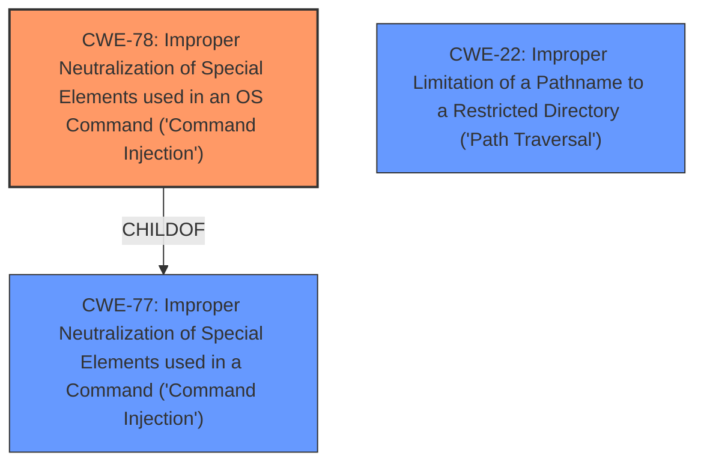

# Raw Analyzer Response for CVE-2020-1631

# Summary
| CWE ID | CWE Name | Confidence | CWE Abstraction Level | CWE Vulnerability Mapping Label | CWE-Vulnerability Mapping Notes |
|---|---|---|---|---|---|
| CWE-78 | Improper Neutralization of Special Elements used in an OS Command ('Command Injection') | 0.9 | Base | Primary | Allowed |
| CWE-22 | Improper Limitation of a Pathname to a Restricted Directory ('Path Traversal') | 0.8 | Base | Secondary | Allowed |

## Evidence and Confidence

*   **Confidence Score:** 0.85
*   **Evidence Strength:** HIGH

## Relationship Analysis
The primary weakness is **CWE-78** [Improper Neutralization of Special Elements used in an OS Command ('Command Injection')], a **Base** level CWE. This is supported by the vulnerability description mentioning **command injection** as a key phrase and the retriever results listing it as the top match. **CWE-78** [Improper Neutralization of Special Elements used in an OS Command ('Command Injection')] is a child of **CWE-77** [Improper Neutralization of Special Elements used in a Command ('Command Injection')], which is more general. **CWE-22** [Improper Limitation of a Pathname to a Restricted Directory ('Path Traversal')] is a secondary weakness due to the possibility of local file inclusion (LFI) or path traversal, both resulting from **improper** input validation.

## Vulnerability Chain
The vulnerability chain starts with the **improper** handling of input, leading to either **CWE-78** [Improper Neutralization of Special Elements used in an OS Command ('Command Injection')] or **CWE-22** [Improper Limitation of a Pathname to a Restricted Directory ('Path Traversal')], which allows an attacker to read world-readable files, obtain J-Web session tokens, or inject commands. The impact varies based on whether J-Web is enabled and the privileges of the logged-in user.

## Summary of Analysis
The initial assessment identified **CWE-78** [Improper Neutralization of Special Elements used in an OS Command ('Command Injection')] as the primary weakness, with **CWE-22** [Improper Limitation of a Pathname to a Restricted Directory ('Path Traversal')] as a potential secondary weakness. This assessment is based on the explicit mention of **command injection** in the vulnerability description and the retriever results.

"A vulnerability in the HTTP/HTTPS service used by J-Web, Web Authentication, Dynamic-VPN (DVPN), Firewall Authentication Pass-Through with Web-Redirect, and Zero Touch Provisioning (ZTP) allows an unauthenticated attacker to perform local file inclusion (LFI) or path traversal. Using this vulnerability, an attacker may be able to inject commands into the httpd.log, read files with world readable permission file or obtain J-Web session tokens. In the case of **command injection**, as the HTTP service runs as user nobody, the impact of this **command injection** is limited."

The graph relationships support this, with **CWE-78** [Improper Neutralization of Special Elements used in an OS Command ('Command Injection')] being a child of **CWE-77** [Improper Neutralization of Special Elements used in a Command ('Command Injection')], indicating a more specific type of command injection. The selection of **CWE-78** [Improper Neutralization of Special Elements used in an OS Command ('Command Injection')] and **CWE-22** [Improper Limitation of a Pathname to a Restricted Directory ('Path Traversal')] is at the optimal level of specificity because they directly represent the two main attack vectors described in the vulnerability.

Relevant CWE Information:
INSERT