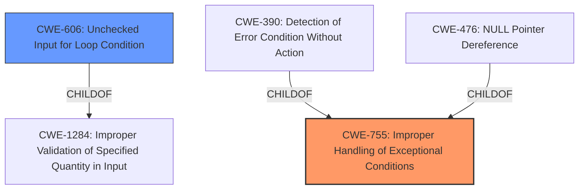

# Raw Analyzer Response for CVE-2020-1632

# Summary
| CWE ID  | CWE Name                                                                                                       | Confidence | CWE Abstraction Level | CWE Vulnerability Mapping Label | CWE-Vulnerability Mapping Notes |
| ------- | -------------------------------------------------------------------------------------------------------------- | ---------- | ----------------------- | ------------------------------- | ------------------------------- |
| CWE-755 | Improper Handling of Exceptional Conditions                                                                    | 0.7        | Class                   | Primary CWE                     | Discouraged                     |
| CWE-606 | Unchecked Input for Loop Condition                                                                             | 0.5        | Base                    | Secondary                       | Allowed                         |

## Evidence and Confidence

*   **Confidence Score:** 0.6
*   **Evidence Strength:** LOW

## Relationship Analysis
The primary relationship considered was that CWE-755 is a parent of CWE-390 (Detection of Error Condition Without Action) and CWE-476 (NULL Pointer Dereference), which suggests a more general category of error handling issues. The relationship between CWE-606 (Unchecked Input for Loop Condition) and CWE-1284 (Improper Validation of Specified Quantity in Input), with CWE-606 being a child, indicates a specific type of input validation problem. The other CWEs did not have strong enough links to be relevant.

## Vulnerability Chain
The vulnerability chain starts with a specific BGP UPDATE message causing a device to advertise an invalid BGP UPDATE message. This leads to the termination of BGP sessions, resulting in a denial of service. The **improper handling** of the specific BGP UPDATE message is the root cause, leading to a DoS. There's a potential missing link regarding the exact mechanism of how the invalid message is formed, which would provide a more complete chain.

## Summary of Analysis
The initial assessment focused on the **improper handling** of BGP UPDATE messages, leading to a denial-of-service condition. The evidence for this is in the "Vulnerability Description" key phrases: impact (denial of service) and vector (specific BGP UPDATE message).

The final decision was influenced by the retriever results, which highlighted CWE-755 (Improper Handling of Exceptional Conditions) as the primary candidate. Despite being a Class-level CWE (and thus less specific), it aligns with the general **improper handling** of the BGP UPDATE message. CWE-606 (Unchecked Input for Loop Condition) was considered because the vulnerability involves a specific BGP UPDATE message, suggesting an input validation issue, though there isn't enough evidence to confirm that a loop condition is involved.

The selected CWEs are at an appropriate level of specificity given the available information. CWE-755 captures the general error handling problem, while CWE-606 suggests a possible input validation issue. The evidence is somewhat limited, resulting in a moderate confidence level.

Relevant CWE Information:

# Enhanced Context (25 CWEs)
The following CWEs were identified as potentially relevant to this vulnerability:

## CWE-606: Unchecked Input for Loop Condition
**Abstraction Level**: Base
**Similarity Score**: 0.78
**Source**: dense

**Description**:
The product does not properly check inputs that are used for loop conditions, potentially leading to a denial of service or other consequences because of excessive looping.

**Mapping Guidance**:
- Usage: Allowed
- Rationale: This CWE entry is at the Base level of abstraction, which is a preferred level of abstraction for mapping to the root causes of vulnerabilities.

## CWE-1289: Improper Validation of Unsafe Equivalence in Input
**Abstraction Level**: Base
**Similarity Score**: 0.78
**Source**: dense

**Description**:
The product receives an input value that is used as a resource identifier or other type of reference, but it does not validate or incorrectly validates that the input is equivalent to a potentially-unsafe value.

**Mapping Guidance**:
- Usage: Allowed
- Rationale: This CWE entry is at the Base level of abstraction, which is a preferred level of abstraction for mapping to the root causes of vulnerabilities.

## CWE-703: Improper Check or Handling of Exceptional Conditions
**Abstraction Level**: Pillar
**Similarity Score**: 0.78
**Source**: dense

**Description**:
The product does not properly anticipate or handle exceptional conditions that rarely occur during normal operation of the product.

**Mapping Guidance**:
- Usage: Discouraged
- Rationale: This CWE entry is extremely high-level, a Pillar.

## CWE-754: Improper Check for Unusual or Exceptional Conditions
**Abstraction Level**: Class
**Similarity Score**: 0.78
**Source**: dense

**Description**:
The product does not check or incorrectly checks for unusual or exceptional conditions that are not expected to occur frequently during day to day operation of the product.

**Mapping Guidance**:
- Usage: Allowed-with-Review
- Rationale: This CWE entry is a Class and might have Base-level children that would be more appropriate

## CWE-755: Improper Handling of Exceptional Conditions
**Abstraction Level**: Class
**Similarity Score**: 0.77
**Source**: dense

**Description**:
The product does not handle or incorrectly handles an exceptional condition.

**Mapping Guidance**:
- Usage: Discouraged
- Rationale: This CWE entry is a level-1 Class (i.e., a child of a Pillar). It might have lower-level children that would be more appropriate

## CWE-696: Incorrect Behavior Order
**Abstraction Level**: Class
**Similarity Score**: 0.77
**Source**: dense

**Description**:
The product performs multiple related behaviors, but the behaviors are performed in the wrong order in ways which may produce resultant weaknesses.

**Mapping Guidance**:
- Usage: Allowed-with-Review
- Rationale: This CWE entry is a Class and might have Base-level children that would be more appropriate

## CWE-362: Concurrent Execution using Shared Resource with Improper Synchronization ('Race Condition')
**Abstraction Level**: Class
**Similarity Score**: 0.76
**Source**: dense

**Description**:
The product contains a concurrent code sequence that requires temporary, exclusive access to a shared resource, but a timing window exists in which the shared resource can be modified by another code sequence operating concurrently.

**Mapping Guidance**:
- Usage: Allowed-with-Review
- Rationale: This CWE entry is a Class and might have Base-level children that would be more appropriate

## CWE-252: Unchecked Return Value
**Abstraction Level**: Base
**Similarity Score**: 0.76
**Source**: dense

**Description**:
The product does not check the return value from a method or function, which can prevent it from detecting unexpected states and conditions.

**Mapping Guidance**:
- Usage: Allowed
- Rationale: This CWE entry is at the Base level of abstraction, which is a preferred level of abstraction for mapping to the root causes of vulnerabilities.

## CWE-184: Incomplete List of Disallowed Inputs
**Abstraction Level**: Base
**Similarity Score**: 0.76
**Source**: dense

**Description**:
The product implements a protection mechanism that relies on a list of inputs (or properties of inputs) that are not allowed by policy or otherwise require other action to neutralize before additional processing takes place, but the list is incomplete.

**Mapping Guidance**:
- Usage: Allowed
- Rationale: This CWE entry is at the Base level of abstraction, which is a preferred level of abstraction for mapping to the root causes of vulnerabilities.

## CWE-667: Improper Locking
**Abstraction Level**: Class
**Similarity Score**: 0.76
**Source**: dense

**Description**:
The product does not properly acquire or release a lock on a resource, leading to unexpected resource state changes and behaviors.

**Mapping Guidance**:
- Usage: Allowed-with-Review
- Rationale: This CWE entry is a Class and might have Base-level children that would be more appropriate

## CWE-364: Signal Handler Race Condition
**Abstraction Level**: Base
**Similarity Score**: 7050.74
**Source**: sparse

**Description**:
The product uses a signal handler that introduces a race condition.

**Mapping Guidance**:
- Usage: Allowed
- Rationale: This CWE entry is at the Base level of abstraction, which is a preferred level of abstraction for mapping to the root causes of vulnerabilities.

## CWE-362: Concurrent Execution using Shared Resource