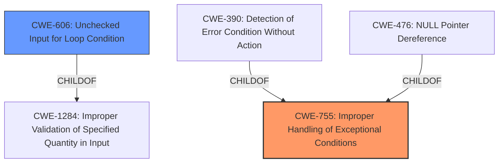

# Analysis for CVE-2020-1632

# Summary
| CWE ID  | CWE Name                                                                                                       | Confidence | CWE Abstraction Level | CWE Vulnerability Mapping Label | CWE-Vulnerability Mapping Notes |
| ------- | -------------------------------------------------------------------------------------------------------------- | ---------- | ----------------------- | ------------------------------- | ------------------------------- |
| CWE-755 | Improper Handling of Exceptional Conditions                                                                    | 0.7        | Class                   | Primary CWE                     | Discouraged                     |
| CWE-606 | Unchecked Input for Loop Condition                                                                             | 0.5        | Base                    | Secondary                       | Allowed                         |

## Evidence and Confidence

*   **Confidence Score:** 0.6
*   **Evidence Strength:** LOW

## Relationship Analysis
The primary relationship considered was that CWE-755 is a parent of CWE-390 (Detection of Error Condition Without Action) and CWE-476 (NULL Pointer Dereference), which suggests a more general category of error handling issues. The relationship between CWE-606 (Unchecked Input for Loop Condition) and CWE-1284 (Improper Validation of Specified Quantity in Input), with CWE-606 being a child, indicates a specific type of input validation problem. The other CWEs did not have strong enough links to be relevant.

## Vulnerability Chain
The vulnerability chain starts with a specific BGP UPDATE message causing a device to advertise an invalid BGP UPDATE message. This leads to the termination of BGP sessions, resulting in a denial of service. The **improper handling** of the specific BGP UPDATE message is the root cause, leading to a DoS. There's a potential missing link regarding the exact mechanism of how the invalid message is formed, which would provide a more complete chain.

## Summary of Analysis
The initial assessment focused on the **improper handling** of BGP UPDATE messages, leading to a denial-of-service condition. The evidence for this is in the "Vulnerability Description" key phrases: impact (denial of service) and vector (specific BGP UPDATE message).

The final decision was influenced by the retriever results, which highlighted CWE-755 (Improper Handling of Exceptional Conditions) as the primary candidate. Despite being a Class-level CWE (and thus less specific), it aligns with the general **improper handling** of the BGP UPDATE message. CWE-606 (Unchecked Input for Loop Condition) was considered because the vulnerability involves a specific BGP UPDATE message, suggesting an input validation issue, though there isn't enough evidence to confirm that a loop condition is involved.

The selected CWEs are at an appropriate level of specificity given the available information. CWE-755 captures the general error handling problem, while CWE-606 suggests a possible input validation issue. The evidence is somewhat limited, resulting in a moderate confidence level.

Relevant CWE Information:

# Enhanced Context (25 CWEs)
The following CWEs were identified as potentially relevant to this vulnerability:

## CWE-606: Unchecked Input for Loop Condition
**Abstraction Level**: Base
**Similarity Score**: 0.78
**Source**: dense

**Description**:
The product does not properly check inputs that are used for loop conditions, potentially leading to a denial of service or other consequences because of excessive looping.

**Mapping Guidance**:
- Usage: Allowed
- Rationale: This CWE entry is at the Base level of abstraction, which is a preferred level of abstraction for mapping to the root causes of vulnerabilities.

## CWE-1289: Improper Validation of Unsafe Equivalence in Input
**Abstraction Level**: Base
**Similarity Score**: 0.78
**Source**: dense

**Description**:
The product receives an input value that is used as a resource identifier or other type of reference, but it does not validate or incorrectly validates that the input is equivalent to a potentially-unsafe value.

**Mapping Guidance**:
- Usage: Allowed
- Rationale: This CWE entry is at the Base level of abstraction, which is a preferred level of abstraction for mapping to the root causes of vulnerabilities.

## CWE-703: Improper Check or Handling of Exceptional Conditions
**Abstraction Level**: Pillar
**Similarity Score**: 0.78
**Source**: dense

**Description**:
The product does not properly anticipate or handle exceptional conditions that rarely occur during normal operation of the product.

**Mapping Guidance**:
- Usage: Discouraged
- Rationale: This CWE entry is extremely high-level, a Pillar.

## CWE-754: Improper Check for Unusual or Exceptional Conditions
**Abstraction Level**: Class
**Similarity Score**: 0.78
**Source**: dense

**Description**:
The product does not check or incorrectly checks for unusual or exceptional conditions that are not expected to occur frequently during day to day operation of the product.

**Mapping Guidance**:
- Usage: Allowed-with-Review
- Rationale: This CWE entry is a Class and might have Base-level children that would be more appropriate

## CWE-755: Improper Handling of Exceptional Conditions
**Abstraction Level**: Class
**Similarity Score**: 0.77
**Source**: dense

**Description**:
The product does not handle or incorrectly handles an exceptional condition.

**Mapping Guidance**:
- Usage: Discouraged
- Rationale: This CWE entry is a level-1 Class (i.e., a child of a Pillar). It might have lower-level children that would be more appropriate

## CWE-696: Incorrect Behavior Order
**Abstraction Level**: Class
**Similarity Score**: 0.77
**Source**: dense

**Description**:
The product performs multiple related behaviors, but the behaviors are performed in the wrong order in ways which may produce resultant weaknesses.

**Mapping Guidance**:
- Usage: Allowed-with-Review
- Rationale: This CWE entry is a Class and might have Base-level children that would be more appropriate

## CWE-362: Concurrent Execution using Shared Resource with Improper Synchronization ('Race Condition')
**Abstraction Level**: Class
**Similarity Score**: 0.76
**Source**: dense

**Description**:
The product contains a concurrent code sequence that requires temporary, exclusive access to a shared resource, but a timing window exists in which the shared resource can be modified by another code sequence operating concurrently.

**Mapping Guidance**:
- Usage: Allowed-with-Review
- Rationale: This CWE entry is a Class and might have Base-level children that would be more appropriate

## CWE-252: Unchecked Return Value
**Abstraction Level**: Base
**Similarity Score**: 0.76
**Source**: dense

**Description**:
The product does not check the return value from a method or function, which can prevent it from detecting unexpected states and conditions.

**Mapping Guidance**:
- Usage: Allowed
- Rationale: This CWE entry is at the Base level of abstraction, which is a preferred level of abstraction for mapping to the root causes of vulnerabilities.

## CWE-184: Incomplete List of Disallowed Inputs
**Abstraction Level**: Base
**Similarity Score**: 0.76
**Source**: dense

**Description**:
The product implements a protection mechanism that relies on a list of inputs (or properties of inputs) that are not allowed by policy or otherwise require other action to neutralize before additional processing takes place, but the list is incomplete.

**Mapping Guidance**:
- Usage: Allowed
- Rationale: This CWE entry is at the Base level of abstraction, which is a preferred level of abstraction for mapping to the root causes of vulnerabilities.

## CWE-667: Improper Locking
**Abstraction Level**: Class
**Similarity Score**: 0.76
**Source**: dense

**Description**:
The product does not properly acquire or release a lock on a resource, leading to unexpected resource state changes and behaviors.

**Mapping Guidance**:
- Usage: Allowed-with-Review
- Rationale: This CWE entry is a Class and might have Base-level children that would be more appropriate

## CWE-364: Signal Handler Race Condition
**Abstraction Level**: Base
**Similarity Score**: 7050.74
**Source**: sparse

**Description**:
The product uses a signal handler that introduces a race condition.

**Mapping Guidance**:
- Usage: Allowed
- Rationale: This CWE entry is at the Base level of abstraction, which is a preferred level of abstraction for mapping to the root causes of vulnerabilities.

## CWE-362: Concurrent Execution using Shared Resource

# Enhanced Query for CVE-2020-1632

## Vulnerability Description
In a certain condition, receipt of a specific BGP UPDATE message might cause Juniper Networks Junos OS and Junos OS Evolved devices to advertise an invalid BGP UPDATE message to other peers, causing the other peers to terminate the established BGP session, creating a Denial of Service (DoS) condition. For example, Router A sends a specific BGP UPDATE to Router B, causing Router B to send an invalid BGP UPDATE message to Router C, resulting in termination of the BGP session between Router B and Router C. This issue might occur when there is at least a single BGP session established on the device that does not support 4 Byte AS extension (RFC 4893). Repeated receipt of the same BGP UPDATE can result in an extended DoS condition. This issue affects Juniper Networks Junos OS 16.1 versions prior to 16.1R7-S6 16.2 versions prior to 16.2R2-S11 17.1 versions prior to 17.1R2-S11, 17.1R3-S2 17.2 versions prior to 17.2R1-S9, 17.2R2-S8, 17.2R3-S3 17.2X75 versions prior to 17.2X75-D105, 17.2X75-D110, 17.2X75-D44 17.3 versions prior to 17.3R2-S5, 17.3R3-S7 17.4 versions prior to 17.4R2-S8, 17.4R3 18.1 versions prior to 18.1R3-S8 18.2 versions prior to 18.2R2-S6, 18.2R3-S2 18.2X75 versions prior to 18.2X75-D12, 18.2X75-D33, 18.2X75-D411, 18.2X75-D420, 18.2X75-D51, 18.2X75-D60 18.3 versions prior to 18.3R1-S6, 18.3R2-S3, 18.3R3 18.4 versions prior to 18.4R1-S5, 18.4R3 18.4 version 18.4R2 and later versions 19.1 versions prior to 19.1R1-S3, 19.1R2 19.2 versions prior to 19.2R1-S2, 19.2R2. This issue does not affect Juniper Networks Junos OS prior to 16.1R1. This issue affects Juniper Networks Junos OS Evolved prior to 19.2R2-EVO.

### Vulnerability Description Key Phrases
- **impact:** denial of service
- **vector:** specific BGP UPDATE message
- **product:** Juniper Networks Junos OS and Junos OS Evolved
- **version:** multiple versions
- **component:** BGP

## Retriever Results

### Top Combined Results

| Rank | CWE ID | Name | Abstraction | Usage  | Retrievers | Individual Scores |
|------|--------|------|-------------|-------|------------|-------------------|
| 1 | 755 | Improper Handling of Exceptional Conditions | Class | Discouraged | sparse | 1.133 |
| 2 | 606 | Unchecked Input for Loop Condition | Base | Allowed | sparse | 0.877 |
| 3 | 401 | Missing Release of Memory after Effective Lifetime | Variant | Allowed | sparse | 0.836 |
| 4 | 362 | Concurrent Execution using Shared Resource with Improper Synchronization ('Race Condition') | Class | Allowed-with-Review | sparse | 0.828 |
| 5 | 696 | Incorrect Behavior Order | Class | Allowed-with-Review | sparse | 0.807 |
| 6 | 1285 | Improper Validation of Specified Index, Position, or Offset in Input | Base | Allowed | dense | 0.525 |
| 7 | 390 | Detection of Error Condition Without Action | Base | Allowed | graph | 0.003 |
| 8 | 250 | Execution with Unnecessary Privileges | Base | Allowed | sparse | 0.806 |
| 9 | 364 | Signal Handler Race Condition | Base | Allowed | sparse | 0.794 |
| 10 | 1286 | Improper Validation of Syntactic Correctness of Input | Base | Allowed | sparse | 0.779 |

# Complete CWE Specifications

## CWE-755: Improper Handling of Exceptional Conditions
**Abstraction:** Class
**Status:** Incomplete

### Description
The product does not handle or incorrectly handles an exceptional condition.

### Extended Description
Not provided

### Alternative Terms
None

### Relationships
ChildOf -> CWE-703

### Mapping Guidance
**Usage:** Discouraged
**Rationale:** This CWE entry is a level-1 Class (i.e., a child of a Pillar). It might have lower-level children that would be more appropriate
**Comments:** Examine children of this entry to see if there is a better fit
**Reasons:**
- Abstraction

### Observed Examples
- **CVE-2023-41151:** SDK for OPC Unified Architecture (OPC UA) server has uncaught exception when a socket is blocked for writing but the server tries to send an error
- **[REF-1374]:** Chain: JavaScript-based cryptocurrency library can fall back to the insecure Math.random() function instead of reporting a failure (CWE-392), thus reducing the entropy (CWE-332) and leading to generation of non-unique cryptographic keys for Bitcoin wallets (CWE-1391)
- **CVE-2021-3011:** virtual interrupt controller in a virtualization product allows crash of host by writing a certain invalid value to a register, which triggers a fatal error instead of returning an error code

## CWE-606: Unchecked Input for Loop Condition
**Abstraction:** Base
**Status:** Draft

### Description
The product does not properly check inputs that are used for loop conditions, potentially leading to a denial of service or other consequences because of excessive looping.

### Extended Description
Not provided

### Alternative Terms
None

### Relationships
ChildOf -> CWE-1284
CanPrecede -> CWE-834

### Mapping Guidance
**Usage:** Allowed
**Rationale:** This CWE entry is at the Base level of abstraction, which is a preferred level of abstraction for mapping to the root causes of vulnerabilities.
**Comments:** Carefully read both the name and description to ensure that this mapping is an appropriate fit. Do not try to 'force' a mapping to a lower-level Base/Variant simply to comply with this preferred level of abstraction.
**Reasons:**
- Acceptable-Use

## CWE-401: Missing Release of Memory after Effective Lifetime
**Abstraction:** Variant
**Status:** Draft

### Description
The product does not sufficiently track and release allocated memory after it has been used, which slowly consumes remaining memory.

### Extended Description
This is often triggered by improper handling of malformed data or unexpectedly interrupted sessions. In some languages, developers are responsible for tracking memory allocation and releasing the memory. If there are no more pointers or references to the memory, then it can no longer be tracked and identified for release.

### Alternative Terms
Memory Leak

### Relationships
ChildOf -> CWE-772
ChildOf -> CWE-404
ChildOf -> CWE-404

### Mapping Guidance
**Usage:** Allowed
**Rationale:** This CWE entry is at the Variant level of abstraction, which is a preferred level of abstraction for mapping to the root causes of vulnerabilities.
**Comments:** Carefully read both the name and description to ensure that this mapping is an appropriate fit. Do not try to 'force' a mapping to a lower-level Base/Variant simply to comply with this preferred level of abstraction.
**Reasons:**
- Acceptable-Use

### Additional Notes
**[Relationship]** This is often a resultant weakness due to improper handling of malformed data or early termination of sessions.

**[Terminology]** "memory leak" has sometimes been used to describe other kinds of issues, e.g. for information leaks in which the contents of memory are inadvertently leaked (CVE-2003-0400 is one such example of this terminology conflict).

### Observed Examples
- **CVE-2005-3119:** Memory leak because function does not free() an element of a data structure.
- **CVE-2004-0427:** Memory leak when counter variable is not decremented.
- **CVE-2002-0574:** chain: reference count is not decremented, leading to memory leak in OS by sending ICMP packets.

## CWE-362: Concurrent Execution using Shared Resource with Improper Synchronization ('Race Condition')
**Abstraction:** Class
**Status:** Draft

### Description
The product contains a concurrent code sequence that requires temporary, exclusive access to a shared resource, but a timing window exists in which the shared resource can be modified by another code sequence operating concurrently.

### Extended Description

A race condition occurs within concurrent environments, and it is effectively a property of a code sequence. Depending on the context, a code sequence may be in the form of a function call, a small number of instructions, a series of program invocations, etc.

A race condition violates these properties, which are closely related:

  - Exclusivity - the code sequence is given exclusive access to the shared resource, i.e., no other code sequence can modify properties of the shared resource before the original sequence has completed execution.

  - Atomicity - the code sequence is behaviorally atomic, i.e., no other thread or process can concurrently execute the same sequence of instructions (or a subset) against the same resource.

A race condition exists when an "interfering code sequence" can still access the shared resource, violating exclusivity.

The interfering code sequence could be "trusted" or "untrusted." A trusted interfering code sequence occurs within the product; it cannot be modified by the attacker, and it can only be invoked indirectly. An untrusted interfering code sequence can be authored directly by the attacker, and typically it is external to the vulnerable product.

### Alternative Terms
Race Condition

### Relationships
ChildOf -> CWE-691
CanPrecede -> CWE-416
CanPrecede -> CWE-476

### Mapping Guidance
**Usage:** Allowed-with-Review
**Rationale:** This CWE entry is a Class and might have Base-level children that would be more appropriate
**Comments:** Examine children of this entry to see if there is a better fit
**Reasons:**
- Abstraction

### Additional Notes
**[Maintenance]** The relationship between race conditions and synchronization problems (CWE-662) needs to be further developed. They are not necessarily two perspectives of the same core concept, since synchronization is only one technique for avoiding race conditions, and synchronization can be used for other purposes besides race condition prevention.

**[Research Gap]** Race conditions in web applications are under-studied and probably under-reported. However, in 2008 there has been growing interest in this area.

**[Research Gap]** Much of the focus of race condition research has been in Time-of-check Time-of-use (TOCTOU) variants (CWE-367), but many race conditions are related to synchronization problems that do not necessarily require a time-of-check.

**[Research Gap]** From a classification/taxonomy perspective, the relationships between concurrency and program state need closer investigation and may be useful in organizing related issues.

### Observed Examples
- **CVE-2022-29527:** Go application for cloud management creates a world-writable sudoers file that allows local attackers to inject sudo rules and escalate privileges to root by winning a race condition.
- **CVE-2021-1782:** Chain: improper locking (CWE-667) leads to race condition (CWE-362), as exploited in the wild per CISA KEV.
- **CVE-2021-0920:** Chain: mobile platform race condition (CWE-362) leading to use-after-free (CWE-416), as exploited in the wild per CISA KEV.

## CWE-696: Incorrect Behavior Order
**Abstraction:** Class
**Status:** Incomplete

### Description
The product performs multiple related behaviors, but the behaviors are performed in the wrong order in ways which may produce resultant weaknesses.

### Extended Description
Not provided

### Alternative Terms
None

### Relationships
ChildOf -> CWE-691

### Mapping Guidance
**Usage:** Allowed-with-Review
**Rationale:** This CWE entry is a Class and might have Base-level children that would be more appropriate
**Comments:** Examine children of this entry to see if there is a better fit
**Reasons:**
- Abstraction

### Observed Examples
- **CVE-2019-9805:** Chain: Creation of the packet client occurs before initialization is complete (CWE-696) resulting in a read from uninitialized memory (CWE-908), causing memory corruption.
- **CVE-2007-5191:** file-system management programs call the setuid and setgid functions in the wrong order and do not check the return values, allowing attackers to gain unintended privileges
- **CVE-2007-1588:** C++ web server program calls Process::setuid before calling Process::setgid, preventing it from dropping privileges, potentially allowing CGI programs to be called with higher privileges than intended

## CWE-1285: Improper Validation of Specified Index, Position, or Offset in Input
**Abstraction:** Base
**Status:** Incomplete

### Description
The product receives input that is expected to specify an index, position, or offset into an indexable resource such as a buffer or file, but it does not validate or incorrectly validates that the specified index/position/offset has the required properties.

### Extended Description

Often, indexable resources such as memory buffers or files can be accessed using a specific position, index, or offset, such as an index for an array or a position for a file. When untrusted input is not properly validated before it is used as an index, attackers could access (or attempt to access) unauthorized portions of these resources. This could be used to cause buffer overflows, excessive resource allocation, or trigger unexpected failures. 

### Alternative Terms
None

### Relationships
ChildOf -> CWE-20

### Mapping Guidance
**Usage:** Allowed
**Rationale:** This CWE entry is at the Base level of abstraction, which is a preferred level of abstraction for mapping to the root causes of vulnerabilities.
**Comments:** Carefully read both the name and description to ensure that this mapping is an appropriate fit. Do not try to 'force' a mapping to a lower-level Base/Variant simply to comply with this preferred level of abstraction.
**Reasons:**
- Acceptable-Use

### Additional Notes
**[Maintenance]** This entry is still under development and will continue to see updates and content improvements.

### Observed Examples
- **CVE-2005-0369:** large ID in packet used as array index
- **CVE-2001-1009:** negative array index as argument to POP LIST command

## CWE-390: Detection of Error Condition Without Action
**Abstraction:** Base
**Status:** Draft

### Description
The product detects a specific error, but takes no actions to handle the error.

### Extended Description
Not provided

### Alternative Terms
None

### Relationships
ChildOf -> CWE-755
CanPrecede -> CWE-401

### Mapping Guidance
**Usage:** Allowed
**Rationale:** This CWE entry is at the Base level of abstraction, which is a preferred level of abstraction for mapping to the root causes of vulnerabilities.
**Comments:** Carefully read both the name and description to ensure that this mapping is an appropriate fit. Do not try to 'force' a mapping to a lower-level Base/Variant simply to comply with this preferred level of abstraction.
**Reasons:**
- Acceptable-Use

### Observed Examples
- **CVE-2022-21820:** A GPU data center manager detects an error due to a malformed request but does not act on it, leading to memory corruption.

## CWE-250: Execution with Unnecessary Privileges
**Abstraction:** Base
**Status:** Draft

### Description
The product performs an operation at a privilege level that is higher than the minimum level required, which creates new weaknesses or amplifies the consequences of other weaknesses.

### Extended Description

New weaknesses can be exposed because running with extra privileges, such as root or Administrator, can disable the normal security checks being performed by the operating system or surrounding environment. Other pre-existing weaknesses can turn into security vulnerabilities if they occur while operating at raised privileges.

Privilege management functions can behave in some less-than-obvious ways, and they have different quirks on different platforms. These inconsistencies are particularly pronounced if you are transitioning from one non-root user to another. Signal handlers and spawned processes run at the privilege of the owning process, so if a process is running as root when a signal fires or a sub-process is executed, the signal handler or sub-process will operate with root privileges.

### Alternative Terms
None

### Relationships
ChildOf -> CWE-269
ChildOf -> CWE-657

### Mapping Guidance
**Usage:** Allowed
**Rationale:** This CWE entry is at the Base level of abstraction, which is a preferred level of abstraction for mapping to the root causes of vulnerabilities.
**Comments:** Carefully read both the name and description to ensure that this mapping is an appropriate fit. Do not try to 'force' a mapping to a lower-level Base/Variant simply to comply with this preferred level of abstraction.
**Reasons:**
- Acceptable-Use

### Additional Notes
**[Relationship]** There is a close association with CWE-653 (Insufficient Separation of Privileges). CWE-653 is about providing separate components for each privilege; CWE-250 is about ensuring that each component has the least amount of privileges possible.

**[Maintenance]** CWE-271, CWE-272, and CWE-250 are all closely related and possibly overlapping. CWE-271 is probably better suited as a category. Both CWE-272 and CWE-250 are in active use by the community. The "least privilege" phrase has multiple interpretations.

**[Maintenance]** The Taxonomy_Mappings to ISA/IEC 62443 were added in CWE 4.10, but they are still under review and might change in future CWE versions. These draft mappings were performed by members of the "Mapping CWE to 62443" subgroup of the CWE-CAPEC ICS/OT Special Interest Group (SIG), and their work is incomplete as of CWE 4.10. The mappings are included to facilitate discussion and review by the broader ICS/OT community, and they are likely to change in future CWE versions.

### Observed Examples
- **CVE-2007-4217:** FTP client program on a certain OS runs with setuid privileges and has a buffer overflow. Most clients do not need extra privileges, so an overflow is not a vulnerability for those clients.
- **CVE-2008-1877:** Program runs with privileges and calls another program with the same privileges, which allows read of arbitrary files.
- **CVE-2007-5159:** OS incorrectly installs a program with setuid privileges, allowing users to gain privileges.

## CWE-364: Signal Handler Race Condition
**Abstraction:** Base
**Status:** Incomplete

### Description
The product uses a signal handler that introduces a race condition.

### Extended Description

Race conditions frequently occur in signal handlers, since signal handlers support asynchronous actions. These race conditions have a variety of root causes and symptoms. Attackers may be able to exploit a signal handler race condition to cause the product state to be corrupted, possibly leading to a denial of service or even code execution.

These issues occur when non-reentrant functions, or state-sensitive actions occur in the signal handler, where they may be called at any time. These behaviors can violate assumptions being made by the "regular" code that is interrupted, or by other signal handlers that may also be invoked. If these functions are called at an inopportune moment - such as while a non-reentrant function is already running - memory corruption could occur that may be exploitable for code execution. Another signal race condition commonly found occurs when free is called within a signal handler, resulting in a double free and therefore a write-what-where condition. Even if a given pointer is set to NULL after it has been freed, a race condition still exists between the time the memory was freed and the pointer was set to NULL. This is especially problematic if the same signal handler has been set for more than one signal -- since it means that the signal handler itself may be reentered.

There are several known behaviors related to signal handlers that have received the label of "signal handler race condition":

  - Shared state (e.g. global data or static variables) that are accessible to both a signal handler and "regular" code

  - Shared state between a signal handler and other signal handlers

  - Use of non-reentrant functionality within a signal handler - which generally implies that shared state is being used. For example, malloc() and free() are non-reentrant because they may use global or static data structures for managing memory, and they are indirectly used by innocent-seeming functions such as syslog(); these functions could be exploited for memory corruption and, possibly, code execution.

  - Association of the same signal handler function with multiple signals - which might imply shared state, since the same code and resources are accessed. For example, this can be a source of double-free and use-after-free weaknesses.

  - Use of setjmp and longjmp, or other mechanisms that prevent a signal handler from returning control back to the original functionality

  - While not technically a race condition, some signal handlers are designed to be called at most once, and being called more than once can introduce security problems, even when there are not any concurrent calls to the signal handler. This can be a source of double-free and use-after-free weaknesses.

Signal handler vulnerabilities are often classified based on the absence of a specific protection mechanism, although this style of classification is discouraged in CWE because programmers often have a choice of several different mechanisms for addressing the weakness. Such protection mechanisms may preserve exclusivity of access to the shared resource, and behavioral atomicity for the relevant code:

  - Avoiding shared state

  - Using synchronization in the signal handler

  - Using synchronization in the regular code

  - Disabling or masking other signals, which provides atomicity (which effectively ensures exclusivity)

### Alternative Terms
None

### Relationships
ChildOf -> CWE-362
CanPrecede -> CWE-415
CanPrecede -> CWE-416
CanPrecede -> CWE-123

### Mapping Guidance
**Usage:** Allowed
**Rationale:** This CWE entry is at the Base level of abstraction, which is a preferred level of abstraction for mapping to the root causes of vulnerabilities.
**Comments:** Carefully read both the name and description to ensure that this mapping is an appropriate fit. Do not try to 'force' a mapping to a lower-level Base/Variant simply to comply with this preferred level of abstraction.
**Reasons:**
- Acceptable-Use

### Observed Examples
- **CVE-1999-0035:** Signal handler does not disable other signal handlers, allowing it to be interrupted, causing other functionality to access files/etc. with raised privileges
- **CVE-2001-0905:** Attacker can send a signal while another signal handler is already running, leading to crash or execution with root privileges
- **CVE-2001-1349:** unsafe calls to library functions from signal handler

## CWE-1286: Improper Validation of Syntactic Correctness of Input
**Abstraction:** Base
**Status:** Incomplete

### Description
The product receives input that is expected to be well-formed - i.e., to comply with a certain syntax - but it does not validate or incorrectly validates that the input complies with the syntax.

### Extended Description

Often, complex inputs are expected to follow a particular syntax, which is either assumed by the input itself, or declared within metadata such as headers. The syntax could be for data exchange formats, markup languages, or even programming languages. When untrusted input is not properly validated for the expected syntax, attackers could cause parsing failures, trigger unexpected errors, or expose latent vulnerabilities that might not be directly exploitable if the input had conformed to the syntax.

### Alternative Terms
None

### Relationships
ChildOf -> CWE-20

### Mapping Guidance
**Usage:** Allowed
**Rationale:** This CWE entry is at the Base level of abstraction, which is a preferred level of abstraction for mapping to the root causes of vulnerabilities.
**Comments:** Carefully read both the name and description to ensure that this mapping is an appropriate fit. Do not try to 'force' a mapping to a lower-level Base/Variant simply to comply with this preferred level of abstraction.
**Reasons:**
- Acceptable-Use

### Additional Notes
**[Maintenance]** This entry is still under development and will continue to see updates and content improvements.

### Observed Examples
- **CVE-2016-4029:** Chain: incorrect validation of intended decimal-based IP address format (CWE-1286) enables parsing of octal or hexadecimal formats (CWE-1389), allowing bypass of an SSRF protection mechanism (CWE-918).
- **CVE-2007-5893:** HTTP request with missing protocol version number leads to crash

