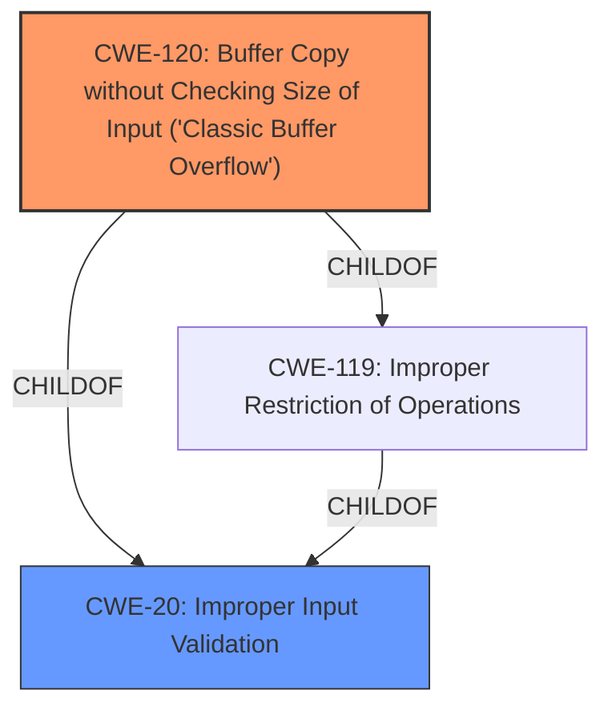

# Analysis for CVE-2020-1639

# Summary
| CWE ID | CWE Name | Confidence | CWE Abstraction Level | CWE Vulnerability Mapping Label | CWE-Vulnerability Mapping Notes |
|---|---|---|---|---|---|
| CWE-120 | Buffer Copy without Checking Size of Input ('Classic Buffer Overflow') | 0.9 | Base | Primary | Allowed-with-Review |
| CWE-20 | Improper Input Validation | 0.6 | Class | Secondary | Allowed |

## Evidence and Confidence

*   **Confidence Score:** 0.75
*   **Evidence Strength:** MEDIUM

## Relationship Analysis
The primary relationship that influenced my decision was the parent-child relationship between CWE-120 and CWE-119, and CWE-20. While CWE-119 is a broader category, CWE-120 more specifically addresses the "buffer copy without checking size" scenario, aligning well with the **root cause** described. CWE-20 represents the higher level class of **improper input validation** since the vulnerability stems from the **failure to sanitize incoming data**.

## Vulnerability Chain
The vulnerability chain begins with the **improper input validation** (**CWE-20**), which leads to a **buffer overflow** (**CWE-120**), ultimately resulting in a **denial of service**.

## Summary of Analysis
Initially, I considered only CWE-120 due to the explicit mention of a **buffer overflow** and the **failure to sanitize incoming data**. However, the description also points towards a lack of proper input validation. Therefore, I've included CWE-20 to represent the root cause of the vulnerability.

The primary selection of CWE-120 is strongly supported by the vulnerability description's key phrases: "**fail to sanitize incoming data**" and "**buffer overflow**." This directly aligns with CWE-120's description of copying a buffer without checking the input size. The impact, a denial of service, further supports this classification.

The relationship analysis helped refine the selection by highlighting that CWE-120 is a specific type of **improper restriction of operations within the bounds of a memory buffer** (CWE-119), and that a lack of **input validation** (CWE-20) is a contributing factor.

Relevant CWE Information:

# Enhanced Context (25 CWEs)
The following CWEs were identified as potentially relevant to this vulnerability:

## CWE-405: Asymmetric Resource Consumption (Amplification)
**Abstraction Level**: Class
**Similarity Score**: 0.78
**Source**: dense

**Description**:
The product does not properly control situations in which an adversary can cause the product to consume or produce excessive resources without requiring the adversary to invest equivalent work or otherwise prove authorization, i.e., the adversary's influence is "asymmetric."

**Mapping Guidance**:
- Usage: Allowed-with-Review
- Rationale: This CWE entry is a Class and might have Base-level children that would be more appropriate

*Not selected*: This CWE focuses on asymmetric consumption, which isn't the core issue here.

## CWE-404: Improper Resource Shutdown or Release
**Abstraction Level**: Class
**Similarity Score**: 0.78
**Source**: dense

**Description**:
The product does not release or incorrectly releases a resource before it is made available for re-use.

**Mapping Guidance**:
- Usage: Allowed-with-Review
- Rationale: This CWE entry is a Class and might have Base-level children that would be more appropriate

*Not selected*: This CWE is not relevant to this vulnerability

## CWE-789: Memory Allocation with Excessive Size Value
**Abstraction Level**: Variant
**Similarity Score**: 0.77
**Source**: dense

**Description**:
The product allocates memory based on an untrusted, large size value, but it does not ensure that the size is within expected limits, allowing arbitrary amounts of memory to be allocated.

**Mapping Guidance**:
- Usage: Allowed
- Rationale: This CWE entry is at the Variant level of abstraction, which is a preferred level of abstraction for mapping to the root causes of vulnerabilities.

*Not selected*: While memory allocation is involved, the core issue is the unchecked buffer copy, not the allocation size itself.

## CWE-664: Improper Control of a Resource Through its Lifetime
**Abstraction Level**: Pillar
**Similarity Score**: 0.77
**Source**: dense

**Description**:
The product does not maintain or incorrectly maintains control over a resource throughout its lifetime of creation, use, and release.

**Mapping Guidance**:
- Usage: Discouraged
- Rationale: This CWE entry is high-level when lower-level children are available.

*Not selected*: Too broad. More specific CWEs are available.

## CWE-226: Sensitive Information in Resource Not Removed Before Reuse
**Abstraction Level**: Base
**Similarity Score**: 0.76
**Source**: dense

**Description**:
The product releases a resource such as memory or a file so that it can be made available for reuse, but it does not clear or "zeroize" the information contained in the resource before the product performs a critical state transition or makes the resource available for reuse by other entities.

**Mapping Guidance**:
- Usage: Allowed
- Rationale: This CWE entry is at the Base level of abstraction, which is a preferred level of abstraction for mapping to the root causes of vulnerabilities.

*Not selected*: Not relevant.

## CWE-1325: Improperly Controlled Sequential Memory Allocation
**Abstraction Level**: Base
**Similarity Score**: 0.76
**Source**: dense

**Description**:
The product manages a group of objects or resources and performs a separate memory allocation for each object, but it does not properly limit the total amount of memory that is consumed by all of the combined objects.

**Mapping Guidance**:
- Usage: Allowed
- Rationale: This CWE entry is at the Base level of abstraction, which is a preferred level of abstraction for mapping to the root causes of vulnerabilities.

*Not selected*: This is about limiting total memory consumption across multiple allocations, not a single buffer overflow.

## CWE-754: Improper Check for Unusual or Exceptional Conditions
**Abstraction Level**: Class
**Similarity Score**: 0.76
**Source**: dense

**Description**:
The product does not check or incorrectly checks for unusual or exceptional conditions that are not expected to occur frequently during day to day operation of the product.

**Mapping Guidance**:
- Usage: Allowed-with-Review
- Rationale: This CWE entry is a Class and might have Base-level children that would be more appropriate

*Not selected*: This is not the primary issue, as the main concern is the lack of input sanitization and subsequent buffer overflow.

## CWE-799: Improper Control of Interaction Frequency
**Abstraction Level**: Class
**Similarity Score**: 0.76
**Source**: dense

**Description**:
The product does not properly limit the number or frequency of interactions that it has with an actor, such as the number of incoming requests.

**Mapping Guidance**:
- Usage: Allowed-with-Review
- Rationale: This CWE entry is a Class and might have Base-level children that would be more appropriate

*Not selected*: Not relevant.

## CWE-703: Improper Check or Handling of Exceptional Conditions
**Abstraction Level**: Pillar
**Similarity Score**: 0.76
**Source**: dense

**Description**:
The product does not properly anticipate or handle exceptional conditions that rarely occur during normal operation of the product.

**Mapping Guidance**:
- Usage: Discouraged
- Rationale: This CWE entry is extremely high-level, a Pillar.

*Not selected*: Too broad.

## CWE-119: Improper Restriction of Operations within the Bounds of a Memory Buffer
**Abstraction Level**: Class
**Similarity Score**: 0.76
**Source**: dense

**Description**:
The product performs operations on a memory buffer, but it reads from or writes to a memory location outside the buffer's intended boundary. This may result in read or write operations on unexpected memory locations that could be linked to other variables, data structures, or internal program data.

**Mapping Guidance**:
- Usage: Discouraged
- Rationale: CWE-119 is commonly misused in low-information vulnerability reports when lower-level CWEs could be used instead, or when more details about the vulnerability are available.

*Not selected*: While technically correct, CWE-120 provides a more specific classification.

## CWE-364: Signal Handler Race Condition
**Abstraction Level**:

# Enhanced Query for CVE-2020-1639

## Vulnerability Description
When an attacker sends a specific crafted Ethernet Operation, Administration, and Maintenance (Ethernet OAM) packet to a target device, it may improperly handle the incoming malformed data and fail to sanitize this incoming data resulting in an overflow condition. This overflow condition in Juniper Networks Junos OS allows an attacker to cause a Denial of Service (DoS) condition by coring the CFM daemon. Continued receipt of these packets may cause an extended Denial of Service condition. This issue affects Juniper Networks Junos OS 12.3 versions prior to 12.3R12-S15 12.3X48 versions prior to 12.3X48-D95 on SRX Series 14.1X50 versions prior to 14.1X50-D145 14.1X53 versions prior to 14.1X53-D47 15.1 versions prior to 15.1R2 15.1X49 versions prior to 15.1X49-D170 on SRX Series 15.1X53 versions prior to 15.1X53-D67.

### Vulnerability Description Key Phrases
- **rootcause:** **fail to sanitize incoming data**
- **weakness:** **buffer overflow**
- **impact:** denial of service
- **vector:** specific crafted Ethernet OAM packet
- **attacker:** attacker
- **product:** Juniper Networks Junos OS
- **version:** multiple versions
- **component:** CFM daemon

## Retriever Results

### Top Combined Results

| Rank | CWE ID | Name | Abstraction | Usage  | Retrievers | Individual Scores |
|------|--------|------|-------------|-------|------------|-------------------|
| 1 | 119 | Improper Restriction of Operations within the Bounds of a Memory Buffer | Class | Discouraged | alternate_terms | 1.000 |
| 2 | 190 | Integer Overflow or Wraparound | Base | Allowed | alternate_terms | 0.800 |
| 3 | 120 | Buffer Copy without Checking Size of Input ('Classic Buffer Overflow') | Base | Allowed-with-Review | alternate_terms | 0.700 |
| 4 | 703 | Improper Check or Handling of Exceptional Conditions | Pillar | Discouraged | sparse | 1.612 |
| 5 | 401 | Missing Release of Memory after Effective Lifetime | Variant | Allowed | sparse | 1.001 |
| 6 | 606 | Unchecked Input for Loop Condition | Base | Allowed | dense | 0.609 |
| 7 | 123 | Write-what-where Condition | Base | Allowed | graph | 0.003 |
| 8 | 755 | Improper Handling of Exceptional Conditions | Class | Discouraged | sparse | 0.981 |
| 9 | 364 | Signal Handler Race Condition | Base | Allowed | sparse | 0.931 |
| 10 | 400 | Uncontrolled Resource Consumption | Class | Discouraged | sparse | 0.919 |

# Complete CWE Specifications

## CWE-119: Improper Restriction of Operations within the Bounds of a Memory Buffer
**Abstraction:** Class
**Status:** Stable

### Description
The product performs operations on a memory buffer, but it reads from or writes to a memory location outside the buffer's intended boundary. This may result in read or write operations on unexpected memory locations that could be linked to other variables, data structures, or internal program data.

### Extended Description
Not provided

### Alternative Terms
Buffer Overflow: This term has many different meanings to different audiences. From a CWE mapping perspective, this term should be avoided where possible. Some researchers, developers, and tools intend for it to mean "write past the end of a buffer," whereas others use the same term to mean "any read or write outside the boundaries of a buffer, whether before the beginning of the buffer or after the end of the buffer." Others could mean "any action after the end of a buffer, whether it is a read or write." Since the term is commonly used for exploitation and for vulnerabilities, it further confuses things.
buffer overrun: Some prominent vendors and researchers use the term "buffer overrun," but most people use "buffer overflow." See the alternate term for "buffer overflow" for context.
memory safety: Generally used for techniques that avoid weaknesses related to memory access, such as those identified by CWE-119 and its descendants. However, the term is not formal, and there is likely disagreement between practitioners as to which weaknesses are implicitly covered by the "memory safety" term.

### Relationships
ChildOf -> CWE-118
ChildOf -> CWE-20

### Mapping Guidance
**Usage:** Discouraged
**Rationale:** CWE-119 is commonly misused in low-information vulnerability reports when lower-level CWEs could be used instead, or when more details about the vulnerability are available.
**Comments:** Look at CWE-119's children and consider mapping to CWEs such as CWE-787: Out-of-bounds Write, CWE-125: Out-of-bounds Read, or others.
**Reasons:**
- Frequent Misuse

### Additional Notes
**[Applicable Platform]** 

It is possible in any programming languages without memory management support to attempt an operation outside of the bounds of a memory buffer, but the consequences will vary widely depending on the language, platform, and chip architecture.

### Observed Examples
- **CVE-2021-22991:** Incorrect URI normalization in application traffic product leads to buffer overflow, as exploited in the wild per CISA KEV.
- **CVE-2020-29557:** Buffer overflow in Wi-Fi router web interface, as exploited in the wild per CISA KEV.
- **CVE-2009-2550:** Classic stack-based buffer overflow in media player using a long entry in a playlist

## CWE-190: Integer Overflow or Wraparound
**Abstraction:** Base
**Status:** Stable

### Description
The product performs a calculation that can
         produce an integer overflow or wraparound when the logic
         assumes that the resulting value will always be larger than
         the original value. This occurs when an integer value is
         incremented to a value that is too large to store in the
         associated representation. When this occurs, the value may
         become a very small or negative number.

### Extended Description
Not provided

### Alternative Terms
Overflow: The terms "overflow" and "wraparound" are used interchangeably by some people, but they can have more precise distinctions by others. See Terminology Notes.
Wraparound: The terms "overflow" and "wraparound" are used interchangeably by some people, but they can have more precise distinctions by others. See Terminology Notes.
wrap, wrap-around, wrap around: Alternate spellings of "wraparound"

### Relationships
ChildOf -> CWE-682
ChildOf -> CWE-682
ChildOf -> CWE-20
CanPrecede -> CWE-119

### Mapping Guidance
**Usage:** Allowed
**Rationale:** This CWE entry is at the Base level of abstraction, which is a preferred level of abstraction for mapping to the root causes of vulnerabilities.
**Comments:** Be careful of terminology problems with "overflow," "underflow," and "wraparound" - see Terminology Notes. Carefully read both the name and description to ensure that this mapping is an appropriate fit. Do not try to 'force' a mapping to a lower-level Base/Variant simply to comply with this preferred level of abstraction.
**Reasons:**
- Acceptable-Use
**Suggested Alternatives:**
- CWE-191: Integer Underflow (Wrap or Wraparound). Consider CWE-191 when the result is less than the minimum value that can be represented (sometimes called "underflows").

### Additional Notes
**[Relationship]** Integer overflows can be primary to buffer overflows when they cause less memory to be allocated than expected.

**[Terminology]** 

"Integer overflow" is sometimes used to cover several types of errors, including signedness errors, or buffer overflows that involve manipulation of integer data types instead of characters. Part of the confusion results from the fact that 0xffffffff is -1 in a signed context. Other confusion also arises because of the role that integer overflows have in chains.

A "wraparound" is a well-defined, standard behavior that follows specific rules for how to handle situations when the intended numeric value is too large or too small to be represented, as specified in standards such as C11.

"Overflow" is sometimes conflated with "wraparound" but typically indicates a non-standard or undefined behavior.

The "overflow" term is sometimes used to indicate cases where either the maximum or the minimum is exceeded, but others might only use "overflow" to indicate exceeding the maximum while using "underflow" for exceeding the minimum.

Some people use "overflow" to mean any value outside the representable range - whether greater than the maximum, or less than the minimum - but CWE uses "underflow" for cases in which the intended result is less than the minimum.

See [REF-1440] for additional explanation of the ambiguity of terminology.

**[Other]** While there may be circumstances in which the logic intentionally relies on wrapping - such as with modular arithmetic in timers or counters - it can have security consequences if the wrap is unexpected. This is especially the case if the integer overflow can be triggered using user-supplied inputs.

### Observed Examples
- **CVE-2021-43537:** Chain: in a web browser, an unsigned 64-bit integer is forcibly cast to a 32-bit integer (CWE-681) and potentially leading to an integer overflow (CWE-190). If an integer overflow occurs, this can cause heap memory corruption (CWE-122)
- **CVE-2022-21668:** Chain: Python library does not limit the resources used to process images that specify a very large number of bands (CWE-1284), leading to excessive memory consumption (CWE-789) or an integer overflow (CWE-190).
- **CVE-2022-0545:** Chain: 3D renderer has an integer overflow (CWE-190) leading to write-what-where condition (CWE-123) using a crafted image.

## CWE-120: Buffer Copy without Checking Size of Input ('Classic Buffer Overflow')
**Abstraction:** Base
**Status:** Incomplete

### Description
The product copies an input buffer to an output buffer without verifying that the size of the input buffer is less than the size of the output buffer, leading to a buffer overflow.

### Extended Description
A buffer overflow condition exists when a product attempts to put more data in a buffer than it can hold, or when it attempts to put data in a memory area outside of the boundaries of a buffer. The simplest type of error, and the most common cause of buffer overflows, is the "classic" case in which the product copies the buffer without restricting how much is copied. Other variants exist, but the existence of a classic overflow strongly suggests that the programmer is not considering even the most basic of security protections.

### Alternative Terms
Classic Buffer Overflow: This term was frequently used by vulnerability researchers during approximately 1995 to 2005 to differentiate buffer copies without length checks (which had been known about for decades) from other emerging weaknesses that still involved invalid accesses of buffers, as vulnerability researchers began to develop advanced exploitation techniques.
Unbounded Transfer

### Relationships
ChildOf -> CWE-119
ChildOf -> CWE-119
ChildOf -> CWE-119
ChildOf -> CWE-119
CanPrecede -> CWE-123
ChildOf -> CWE-20

### Mapping Guidance
**Usage:** Allowed-with-Review
**Rationale:** There are some indications that this CWE ID might be misused and selected simply because it mentions "buffer overflow" - an increasingly vague term. This CWE entry is only appropriate for "Buffer Copy" operations (not buffer reads), in which where there is no "Checking [the] Size of Input", and (by implication of the copy) writing past the end of the buffer.
**Comments:** If the vulnerability being analyzed involves out-of-bounds reads, then consider CWE-125 or descendants. For root cause analysis: if there is any input validation, consider children of CWE-20 such as CWE-1284. If there is a calculation error for buffer sizes, consider CWE-131 or similar.
**Reasons:**
- Frequent Misuse

### Additional Notes
**[Relationship]** At the code level, stack-based and heap-based overflows do not differ significantly, so there usually is not a need to distinguish them. From the attacker perspective, they can be quite different, since different techniques are required to exploit them.

**[Terminology]** Many issues that are now called "buffer overflows" are substantively different than the "classic" overflow, including entirely different bug types that rely on overflow exploit techniques, such as integer signedness errors, integer overflows, and format string bugs. This imprecise terminology can make it difficult to determine which variant is being reported.

### Observed Examples
- **CVE-2000-1094:** buffer overflow using command with long argument
- **CVE-1999-0046:** buffer overflow in local program using long environment variable
- **CVE-2002-1337:** buffer overflow in comment characters, when product increments a counter for a ">" but does not decrement for "<"

## CWE-703: Improper Check or Handling of Exceptional Conditions
**Abstraction:** Pillar
**Status:** Incomplete

### Description
The product does not properly anticipate or handle exceptional conditions that rarely occur during normal operation of the product.

### Extended Description
Not provided

### Alternative Terms
None

### Relationships
None

### Mapping Guidance
**Usage:** Discouraged
**Rationale:** This CWE entry is extremely high-level, a Pillar.
**Comments:** Consider children or descendants of this entry instead.
**Reasons:**
- Abstraction

### Additional Notes
**[Relationship]** This is a high-level class that might have some overlap with other classes. It could be argued that even "normal" weaknesses such as buffer overflows involve unusual or exceptional conditions. In that sense, this might be an inherent aspect of most other weaknesses within CWE, similar to API Abuse (CWE-227) and Indicator of Poor Code Quality (CWE-398). However, this entry is currently intended to unify disparate concepts that do not have other places within the Research Concepts view (CWE-1000).

### Observed Examples
- **[REF-1374]:** Chain: JavaScript-based cryptocurrency library can fall back to the insecure Math.random() function instead of reporting a failure (CWE-392), thus reducing the entropy (CWE-332) and leading to generation of non-unique cryptographic keys for Bitcoin wallets (CWE-1391)
- **CVE-2022-22224:** Chain: an operating system does not properly process malformed Open Shortest Path First (OSPF) Type/Length/Value Identifiers (TLV) (CWE-703), which can cause the process to enter an infinite loop (CWE-835)

## CWE-401: Missing Release of Memory after Effective Lifetime
**Abstraction:** Variant
**Status:** Draft

### Description
The product does not sufficiently track and release allocated memory after it has been used, which slowly consumes remaining memory.

### Extended Description
This is often triggered by improper handling of malformed data or unexpectedly interrupted sessions. In some languages, developers are responsible for tracking memory allocation and releasing the memory. If there are no more pointers or references to the memory, then it can no longer be tracked and identified for release.

### Alternative Terms
Memory Leak

### Relationships
ChildOf -> CWE-772
ChildOf -> CWE-404
ChildOf -> CWE-404

### Mapping Guidance
**Usage:** Allowed
**Rationale:** This CWE entry is at the Variant level of abstraction, which is a preferred level of abstraction for mapping to the root causes of vulnerabilities.
**Comments:** Carefully read both the name and description to ensure that this mapping is an appropriate fit. Do not try to 'force' a mapping to a lower-level Base/Variant simply to comply with this preferred level of abstraction.
**Reasons:**
- Acceptable-Use

### Additional Notes
**[Relationship]** This is often a resultant weakness due to improper handling of malformed data or early termination of sessions.

**[Terminology]** "memory leak" has sometimes been used to describe other kinds of issues, e.g. for information leaks in which the contents of memory are inadvertently leaked (CVE-2003-0400 is one such example of this terminology conflict).

### Observed Examples
- **CVE-2005-3119:** Memory leak because function does not free() an element of a data structure.
- **CVE-2004-0427:** Memory leak when counter variable is not decremented.
- **CVE-2002-0574:** chain: reference count is not decremented, leading to memory leak in OS by sending ICMP packets.

## CWE-606: Unchecked Input for Loop Condition
**Abstraction:** Base
**Status:** Draft

### Description
The product does not properly check inputs that are used for loop conditions, potentially leading to a denial of service or other consequences because of excessive looping.

### Extended Description
Not provided

### Alternative Terms
None

### Relationships
ChildOf -> CWE-1284
CanPrecede -> CWE-834

### Mapping Guidance
**Usage:** Allowed
**Rationale:** This CWE entry is at the Base level of abstraction, which is a preferred level of abstraction for mapping to the root causes of vulnerabilities.
**Comments:** Carefully read both the name and description to ensure that this mapping is an appropriate fit. Do not try to 'force' a mapping to a lower-level Base/Variant simply to comply with this preferred level of abstraction.
**Reasons:**
- Acceptable-Use

## CWE-123: Write-what-where Condition
**Abstraction:** Base
**Status:** Draft

### Description
Any condition where the attacker has the ability to write an arbitrary value to an arbitrary location, often as the result of a buffer overflow.

### Extended Description
Not provided

### Alternative Terms
None

### Relationships
ChildOf -> CWE-787
ChildOf -> CWE-119
ChildOf -> CWE-119

### Mapping Guidance
**Usage:** Allowed
**Rationale:** This CWE entry is at the Base level of abstraction, which is a preferred level of abstraction for mapping to the root causes of vulnerabilities.
**Comments:** Carefully read both the name and description to ensure that this mapping is an appropriate fit. Do not try to 'force' a mapping to a lower-level Base/Variant simply to comply with this preferred level of abstraction.
**Reasons:**
- Acceptable-Use

### Observed Examples
- **CVE-2022-21668:** Chain: Python library does not limit the resources used to process images that specify a very large number of bands (CWE-1284), leading to excessive memory consumption (CWE-789) or an integer overflow (CWE-190).
- **CVE-2022-0545:** Chain: 3D renderer has an integer overflow (CWE-190) leading to write-what-where condition (CWE-123) using a crafted image.

## CWE-755: Improper Handling of Exceptional Conditions
**Abstraction:** Class
**Status:** Incomplete

### Description
The product does not handle or incorrectly handles an exceptional condition.

### Extended Description
Not provided

### Alternative Terms
None

### Relationships
ChildOf -> CWE-703

### Mapping Guidance
**Usage:** Discouraged
**Rationale:** This CWE entry is a level-1 Class (i.e., a child of a Pillar). It might have lower-level children that would be more appropriate
**Comments:** Examine children of this entry to see if there is a better fit
**Reasons:**
- Abstraction

### Observed Examples
- **CVE-2023-41151:** SDK for OPC Unified Architecture (OPC UA) server has uncaught exception when a socket is blocked for writing but the server tries to send an error
- **[REF-1374]:** Chain: JavaScript-based cryptocurrency library can fall back to the insecure Math.random() function instead of reporting a failure (CWE-392), thus reducing the entropy (CWE-332) and leading to generation of non-unique cryptographic keys for Bitcoin wallets (CWE-1391)
- **CVE-2021-3011:** virtual interrupt controller in a virtualization product allows crash of host by writing a certain invalid value to a register, which triggers a fatal error instead of returning an error code

## CWE-364: Signal Handler Race Condition
**Abstraction:** Base
**Status:** Incomplete

### Description
The product uses a signal handler that introduces a race condition.

### Extended Description

Race conditions frequently occur in signal handlers, since signal handlers support asynchronous actions. These race conditions have a variety of root causes and symptoms. Attackers may be able to exploit a signal handler race condition to cause the product state to be corrupted, possibly leading to a denial of service or even code execution.

These issues occur when non-reentrant functions, or state-sensitive actions occur in the signal handler, where they may be called at any time. These behaviors can violate assumptions being made by the "regular" code that is interrupted, or by other signal handlers that may also be invoked. If these functions are called at an inopportune moment - such as while a non-reentrant function is already running - memory corruption could occur that may be exploitable for code execution. Another signal race condition commonly found occurs when free is called within a signal handler, resulting in a double free and therefore a write-what-where condition. Even if a given pointer is set to NULL after it has been freed, a race condition still exists between the time the memory was freed and the pointer was set to NULL. This is especially problematic if the same signal handler has been set for more than one signal -- since it means that the signal handler itself may be reentered.

There are several known behaviors related to signal handlers that have received the label of "signal handler race condition":

  - Shared state (e.g. global data or static variables) that are accessible to both a signal handler and "regular" code

  - Shared state between a signal handler and other signal handlers

  - Use of non-reentrant functionality within a signal handler - which generally implies that shared state is being used. For example, malloc() and free() are non-reentrant because they may use global or static data structures for managing memory, and they are indirectly used by innocent-seeming functions such as syslog(); these functions could be exploited for memory corruption and, possibly, code execution.

  - Association of the same signal handler function with multiple signals - which might imply shared state, since the same code and resources are accessed. For example, this can be a source of double-free and use-after-free weaknesses.

  - Use of setjmp and longjmp, or other mechanisms that prevent a signal handler from returning control back to the original functionality

  - While not technically a race condition, some signal handlers are designed to be called at most once, and being called more than once can introduce security problems, even when there are not any concurrent calls to the signal handler. This can be a source of double-free and use-after-free weaknesses.

Signal handler vulnerabilities are often classified based on the absence of a specific protection mechanism, although this style of classification is discouraged in CWE because programmers often have a choice of several different mechanisms for addressing the weakness. Such protection mechanisms may preserve exclusivity of access to the shared resource, and behavioral atomicity for the relevant code:

  - Avoiding shared state

  - Using synchronization in the signal handler

  - Using synchronization in the regular code

  - Disabling or masking other signals, which provides atomicity (which effectively ensures exclusivity)

### Alternative Terms
None

### Relationships
ChildOf -> CWE-362
CanPrecede -> CWE-415
CanPrecede -> CWE-416
CanPrecede -> CWE-123

### Mapping Guidance
**Usage:** Allowed
**Rationale:** This CWE entry is at the Base level of abstraction, which is a preferred level of abstraction for mapping to the root causes of vulnerabilities.
**Comments:** Carefully read both the name and description to ensure that this mapping is an appropriate fit. Do not try to 'force' a mapping to a lower-level Base/Variant simply to comply with this preferred level of abstraction.
**Reasons:**
- Acceptable-Use

### Observed Examples
- **CVE-1999-0035:** Signal handler does not disable other signal handlers, allowing it to be interrupted, causing other functionality to access files/etc. with raised privileges
- **CVE-2001-0905:** Attacker can send a signal while another signal handler is already running, leading to crash or execution with root privileges
- **CVE-2001-1349:** unsafe calls to library functions from signal handler

## CWE-400: Uncontrolled Resource Consumption
**Abstraction:** Class
**Status:** Draft

### Description
The product does not properly control the allocation and maintenance of a limited resource, thereby enabling an actor to influence the amount of resources consumed, eventually leading to the exhaustion of available resources.

### Extended Description

Limited resources include memory, file system storage, database connection pool entries, and CPU. If an attacker can trigger the allocation of these limited resources, but the number or size of the resources is not controlled, then the attacker could cause a denial of service that consumes all available resources. This would prevent valid users from accessing the product, and it could potentially have an impact on the surrounding environment. For example, a memory exhaustion attack against an application could slow down the application as well as its host operating system.

There are at least three distinct scenarios which can commonly lead to resource exhaustion:

  - Lack of throttling for the number of allocated resources

  - Losing all references to a resource before reaching the shutdown stage

  - Not closing/returning a resource after processing

Resource exhaustion problems are often result due to an incorrect implementation of the following situations:

  - Error conditions and other exceptional circumstances.

  - Confusion over which part of the program is responsible for releasing the resource.

### Alternative Terms
Resource Exhaustion

### Relationships
ChildOf -> CWE-664

### Mapping Guidance
**Usage:** Discouraged
**Rationale:** CWE-400 is intended for incorrect behaviors in which the product is expected to track and restrict how many resources it consumes, but CWE-400 is often misused because it is conflated with the "technical impact" of vulnerabilities in which resource consumption occurs. It is sometimes used for low-information vulnerability reports. It is a level-1 Class (i.e., a child of a Pillar).
**Comments:** Closely analyze the specific mistake that is causing resource consumption, and perform a CWE mapping for that mistake. Consider children/descendants such as CWE-770: Allocation of Resources Without Limits or Throttling, CWE-771: Missing Reference to Active Allocated Resource, CWE-410: Insufficient Resource Pool, CWE-772: Missing Release of Resource after Effective Lifetime, CWE-834: Excessive Iteration, CWE-405: Asymmetric Resource Consumption (Amplification), and others.
**Reasons:**
- Frequent Misuse

### Additional Notes
**[Maintenance]** "Resource consumption" could be interpreted as a consequence instead of an insecure behavior, so this entry is being considered for modification. It appears to be referenced too frequently when more precise mappings are available. Some of its children, such as CWE-771, might be better considered as a chain.

**[Theoretical]** Vulnerability theory is largely about how behaviors and resources interact. "Resource exhaustion" can be regarded as either a consequence or an attack, depending on the perspective. This entry is an attempt to reflect the underlying weaknesses that enable these attacks (or consequences) to take place.

**[Other]** 

Database queries that take a long time to process are good DoS targets. An attacker would have to write a few lines of Perl code to generate enough traffic to exceed the site's ability to keep up. This would effectively prevent authorized users from using the site at all. Resources can be exploited simply by ensuring that the target machine must do much more work and consume more resources in order to service a request than the attacker must do to initiate a request.

A prime example of this can be found in old switches that were vulnerable to "macof" attacks (so named for a tool developed by Dugsong). These attacks flooded a switch with random IP and MAC address combinations, therefore exhausting the switch's cache, which held the information of which port corresponded to which MAC addresses. Once this cache was exhausted, the switch would fail in an insecure way and would begin to act simply as a hub, broadcasting all traffic on all ports and allowing for basic sniffing attacks.

**[Maintenance]** The Taxonomy_Mappings to ISA/IEC 62443 were added in CWE 4.10, but they are still under review and might change in future CWE versions. These draft mappings were performed by members of the "Mapping CWE to 62443" subgroup of the CWE-CAPEC ICS/OT Special Interest Group (SIG), and their work is incomplete as of CWE 4.10. The mappings are included to facilitate discussion and review by the broader ICS/OT community, and they are likely to change in future CWE versions.

### Observed Examples
- **CVE-2022-21668:** Chain: Python library does not limit the resources used to process images that specify a very large number of bands (CWE-1284), leading to excessive memory consumption (CWE-789) or an integer overflow (CWE-190).
- **CVE-2020-7218:** Go-based workload orchestrator does not limit resource usage with unauthenticated connections, allowing a DoS by flooding the service
- **CVE-2020-3566:** Resource exhaustion in distributed OS because of "insufficient" IGMP queue management, as exploited in the wild per CISA KEV.

