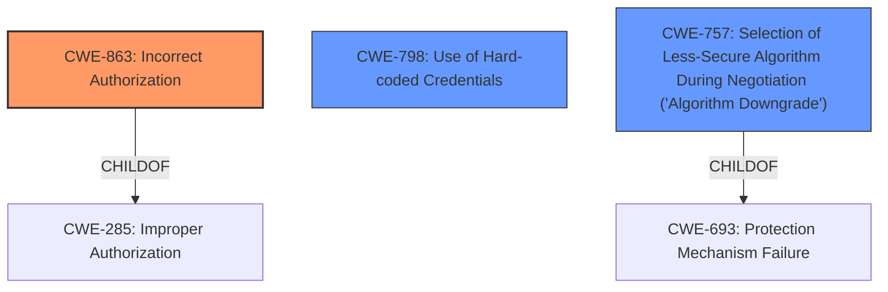

# Analysis for CVE-2020-16630

# Summary
| CWE ID | CWE Name | Confidence | CWE Abstraction Level | CWE Vulnerability Mapping Label | CWE-Vulnerability Mapping Notes |
|---|---|---|---|---|---|
| CWE-863 | Incorrect Authorization | 0.8 | Class | Primary | Allowed-with-Review |
| CWE-798 | Use of Hard-coded Credentials | 0.6 | Base | Secondary | Allowed |
| CWE-757 | Selection of Less-Secure Algorithm During Negotiation ('Algorithm Downgrade') | 0.5 | Base | Secondary | Allowed |

## Evidence and Confidence

*   **Confidence Score:** 0.7
*   **Evidence Strength:** MEDIUM

## Relationship Analysis
The primary relationship that impacted the decision was the parent-child relationship between CWE-285 (Improper Authorization) and CWE-863 (Incorrect Authorization). CWE-863 is a more specific type of improper authorization, making it a better fit. The retriever also suggested CWE-757 (Algorithm Downgrade) which has a child relationship to CWE-693 (Protection Mechanism Failure). CWE-798 (Hardcoded Credentials) is a possible weakness that could lead to the vulnerability.



## Vulnerability Chain
The vulnerability chain starts with the **BLE stack caching and reusing the LTK property**, which leads to a fake mobile being able to **access attributes with authenticated read/write permission**. The **root cause** is the reuse of the LTK property, and the impact is unauthorized access.

## Summary of Analysis
The initial analysis identified **CWE-863 (Incorrect Authorization)** as the primary weakness, supported by the fact that a fake mobile is able to access attributes it should not have access to. The vulnerability description states that the **BLE stack caches and reuses the LTK property** for a bonded mobile, which is the **root cause**. This leads to the impact of the fake mobile gaining unauthorized access. The CVE reference links content summary also supports this, stating that "Misuse of attribute permissions on BLE devices." is a weakness.

The retriever results also pointed to **CWE-285 (Improper Authorization)**, but the mapping guidance for CWE-285 discourages its use and suggests using more specific CWEs like **CWE-863 (Incorrect Authorization)**.

**CWE-798 (Use of Hard-coded Credentials)** was considered because the **root cause** could potentially involve the use of hard-coded credentials in the BLE stack. However, the vulnerability description focuses more on the **improper reuse** of existing credentials rather than the credentials themselves being hard-coded. If the LTK was derived from a hardcoded key that would be an issue. But that information is not provided.

**CWE-757 (Selection of Less-Secure Algorithm During Negotiation ('Algorithm Downgrade'))** could also be a contributing factor. The CVE Reference Links Content Summary notes "...allowing a malicious peer device to downgrade the connection to an insecure mode.". The evidence is not strong, so it is a secondary consideration.

Ultimately, the selected CWEs are at an optimal level of specificity, with **CWE-863 (Incorrect Authorization)** being the primary weakness and **CWE-798 (Use of Hard-coded Credentials)** and **CWE-757 (Selection of Less-Secure Algorithm During Negotiation ('Algorithm Downgrade'))** being secondary candidates.

Relevant CWE Information:

# Enhanced Context (25 CWEs)
The following CWEs were identified as potentially relevant to this vulnerability:

## CWE-312: Cleartext Storage of Sensitive Information
**Abstraction Level**: Base
**Similarity Score**: 0.78
**Source**: dense

**Description**:
The product stores sensitive information in cleartext within a resource that might be accessible to another control sphere.

**Mapping Guidance**:
- Usage: Allowed
- Rationale: This CWE entry is at the Base level of abstraction, which is a preferred level of abstraction for mapping to the root causes of vulnerabilities.

## CWE-1391: Use of Weak Credentials
**Abstraction Level**: Class
**Similarity Score**: 0.77
**Source**: dense

**Description**:
The product uses weak credentials (such as a default key or hard-coded password) that can be calculated, derived, reused, or guessed by an attacker.

**Mapping Guidance**:
- Usage: Allowed-with-Review
- Rationale: This CWE entry is a Class and might have Base-level children that would be more appropriate

## CWE-319: Cleartext Transmission of Sensitive Information
**Abstraction Level**: Base
**Similarity Score**: 0.77
**Source**: dense

**Description**:
The product transmits sensitive or security-critical data in cleartext in a communication channel that can be sniffed by unauthorized actors.

**Mapping Guidance**:
- Usage: Allowed
- Rationale: This CWE entry is at the Base level of abstraction, which is a preferred level of abstraction for mapping to the root causes of vulnerabilities.

## CWE-345: Insufficient Verification of Data Authenticity
**Abstraction Level**: Class
**Similarity Score**: 0.77
**Source**: dense

**Description**:
The product does not sufficiently verify the origin or authenticity of data, in a way that causes it to accept invalid data.

**Mapping Guidance**:
- Usage: Discouraged
- Rationale: This CWE entry is a level-1 Class (i.e., a child of a Pillar). It might have lower-level children that would be more appropriate

## CWE-203: Observable Discrepancy
**Abstraction Level**: Base
**Similarity Score**: 0.76
**Source**: dense

**Description**:
The product behaves differently or sends different responses under different circumstances in a way that is observable to an unauthorized actor, which exposes security-relevant information about the state of the product, such as whether a particular operation was successful or not.

**Mapping Guidance**:
- Usage: Allowed
- Rationale: This CWE entry is at the Base level of abstraction, which is a preferred level of abstraction for mapping to the root causes of vulnerabilities.

## CWE-798: Use of Hard-coded Credentials
**Abstraction Level**: Base
**Similarity Score**: 0.76
**Source**: dense

**Description**:
The product contains hard-coded credentials, such as a password or cryptographic key.

**Mapping Guidance**:
- Usage: Allowed
- Rationale: This CWE entry is at the Base level of abstraction, which is a preferred level of abstraction for mapping to the root causes of vulnerabilities.

## CWE-1390: Weak Authentication
**Abstraction Level**: Class
**Similarity Score**: 0.76
**Source**: dense

**Description**:
The product uses an authentication mechanism to restrict access to specific users or identities, but the mechanism does not sufficiently prove that the claimed identity is correct.

**Mapping Guidance**:
- Usage: Allowed-with-Review
- Rationale: This CWE entry is a Class and might have Base-level children that would be more appropriate

## CWE-1240: Use of a Cryptographic Primitive with a Risky Implementation
**Abstraction Level**: Base
**Similarity Score**: 0.76
**Source**: dense

**Description**:
To fulfill the need for a cryptographic primitive, the product implements a cryptographic algorithm using a non-standard, unproven, or disallowed/non-compliant cryptographic implementation.

**Mapping Guidance**:
- Usage: Allowed
- Rationale: This CWE entry is at the Base level of abstraction, which is a preferred level of abstraction for mapping to the root causes of vulnerabilities.

## CWE-226: Sensitive Information in Resource Not Removed Before Reuse
**Abstraction Level**: Base
**Similarity Score**: 0.76
**Source**: dense

**Description**:
The product releases a resource such as memory or a file so that it can be made available for reuse, but it does not clear or "zeroize" the information contained in the resource before the product performs a critical state transition or makes the resource available for reuse by other entities.

**Mapping Guidance**:
- Usage: Allowed
- Rationale: This CWE entry is at the Base level of abstraction, which is a preferred level of abstraction for mapping to the root causes of vulnerabilities.

## CWE-807: Reliance on Untrusted Inputs in a Security Decision
**Abstraction Level**: Base
**Similarity Score**: 0.75
**Source**: dense

**Description**:
The product

# Enhanced Query for CVE-2020-16630

## Vulnerability Description
TIs BLE stack caches and reuses the LTKs property for a bonded mobile. A LTK can be an unauthenticated-and-no-MITM-protection key created by Just Works or an authenticated-and-MITM-protection key created by Passkey Entry, Numeric Comparison or OOB. Assume that a victim mobile uses secure pairing to pair with a victim BLE device based on TI chips and generate an authenticated-and-MITM-protection LTK. If a fake mobile with the victim mobiles MAC address uses Just Works and pairs with the victim device, the generated LTK still has the property of authenticated-and-MITM-protection. Therefore, the fake mobile can access attributes with the authenticated read/write permission.

### Vulnerability Description Key Phrases
- **rootcause:** **BLE stack caches and reuses LTK property**
- **impact:** access attributes with authenticated read/write permission
- **vector:** fake mobile with victim's MAC address using Just Works
- **product:** TI chips

## CVE Reference Links Content Summary
```
{
  "vulnerability_details": {
    "root_cause": "The BLE specification does not require the initiator (e.g., a mobile device) to enforce Secure Connections Only (SCO) mode, allowing a malicious peer device to downgrade the connection to an insecure mode. Additionally, flaws in the BLE programming framework (specifically in Android) lead to vulnerabilities during pairing and error handling.",
    "weaknesses": [
      "Lack of enforcement of secure pairing methods by the initiator.",
      "Failure to properly handle pairing errors, leading to downgrade attacks.",
       "Inability of the application layer to specify secure association methods.",
      "Lack of timely notification to the application layer about the negotiated association method.",
      "Absence of mechanisms for an app to remove a broken bond programmatically.",
      "Misuse of attribute permissions on BLE devices."
    ],
    "impact": "Successful exploitation allows attackers to:",
    "attack_vectors": [
       "Spoofing a legitimate BLE device.",
      "Downgrading the pairing process to insecure methods (e.g., Just Works or plaintext communication).",
      "Exploiting vulnerabilities in the BLE protocol stack for malicious purposes.",
      "Manipulating error conditions during BLE communication.",
      "Bypassing whitelists on target BLE devices."

    ],
    "required_attacker_capabilities": [
      "Ability to sniff BLE traffic to obtain MAC addresses and device names.",
      "Capability to emulate a BLE device to spoof MAC addresses.",
      "Ability to create or manipulate error conditions in BLE communication.",
      "Ability to perform MITM attacks by relaying messages between devices"
    ],
     "additional_information": "The paper provides detailed attack scenarios, including data injection, sensitive information stealing, IRK and MAC address theft, and denial of service (DoS) attacks. It also notes that these vulnerabilities are not limited to Android, affecting other major OSes (iOS, macOS, Windows, and Linux). It also proposes countermeasures to address the vulnerabilities within the Android system."
  },
    "cve_information": {
    "cve_id": "CVE-2020-16630",
    "relevance": "The content is directly related to the CVE, describing vulnerabilities related to the Bluetooth Low Energy (BLE) protocol and its implementation, specifically focusing on downgrade attacks due to the lack of Secure Connections Only (SCO) mode enforcement and programming framework flaws."
    }
}
```

## Retriever Results

### Top Combined Results

| Rank | CWE ID | Name | Abstraction | Usage  | Retrievers | Individual Scores |
|------|--------|------|-------------|-------|------------|-------------------|
| 1 | 285 | Improper Authorization | Class | Discouraged | sparse | 0.733 |
| 2 | 319 | Cleartext Transmission of Sensitive Information | Base | Allowed | sparse | 0.582 |
| 3 | 367 | Time-of-check Time-of-use (TOCTOU) Race Condition | Base | Allowed | sparse | 0.580 |
| 4 | 1390 | Weak Authentication | Class | Allowed-with-Review | sparse | 0.579 |
| 5 | 306 | Missing Authentication for Critical Function | Base | Allowed | sparse | 0.578 |
| 6 | 1273 | Device Unlock Credential Sharing | Base | Allowed | dense | 0.451 |
| 7 | 609 | Double-Checked Locking | Base | Allowed | graph | 0.002 |
| 8 | 757 | Selection of Less-Secure Algorithm During Negotiation ('Algorithm Downgrade') | Base | Allowed | sparse | 0.569 |
| 9 | 321 | Use of Hard-coded Cryptographic Key | Variant | Allowed | sparse | 0.567 |
| 10 | 522 | Insufficiently Protected Credentials | Class | Allowed-with-Review | sparse | 0.549 |


# Complete CWE Specifications


## CWE-285: Improper Authorization
**Abstraction:** Class
**Status:** Draft

### Description
The product does not perform or incorrectly performs an authorization check when an actor attempts to access a resource or perform an action.

### Extended Description


Assuming a user with a given identity, authorization is the process of determining whether that user can access a given resource, based on the user's privileges and any permissions or other access-control specifications that apply to the resource.


When access control checks are not applied consistently - or not at all - users are able to access data or perform actions that they should not be allowed to perform. This can lead to a wide range of problems, including information exposures, denial of service, and arbitrary code execution.


### Alternative Terms
AuthZ: "AuthZ" is typically used as an abbreviation of "authorization" within the web application security community. It is distinct from "AuthN" (or, sometimes, "AuthC") which is an abbreviation of "authentication." The use of "Auth" as an abbreviation is discouraged, since it could be used for either authentication or authorization.

### Relationships
ChildOf -> CWE-284
ChildOf -> CWE-284

### Mapping Guidance
**Usage:** Discouraged
**Rationale:** CWE-285 is high-level and lower-level CWEs can frequently be used instead. It is a level-1 Class (i.e., a child of a Pillar).
**Comments:** Look at CWE-285's children and consider mapping to CWEs such as CWE-862: Missing Authorization, CWE-863: Incorrect Authorization, CWE-732: Incorrect Permission Assignment for Critical Resource, or others.
**Reasons:**
- Abstraction
**Suggested Alternatives:**
- CWE-862: Missing Authorization
- CWE-863: Incorrect Authorization
- CWE-732: Incorrect Permission Assignment for Critical Resource


### Observed Examples
- **CVE-2022-24730:** Go-based continuous deployment product does not check that a user has certain privileges to update or create an app, allowing adversaries to read sensitive repository information
- **CVE-2009-3168:** Web application does not restrict access to admin scripts, allowing authenticated users to reset administrative passwords.
- **CVE-2009-2960:** Web application does not restrict access to admin scripts, allowing authenticated users to modify passwords of other users.


## CWE-319: Cleartext Transmission of Sensitive Information
**Abstraction:** Base
**Status:** Draft

### Description
The product transmits sensitive or security-critical data in cleartext in a communication channel that can be sniffed by unauthorized actors.

### Extended Description


Many communication channels can be "sniffed" (monitored) by adversaries during data transmission. For example, in networking, packets can traverse many intermediary nodes from the source to the destination, whether across the internet, an internal network, the cloud, etc. Some actors might have privileged access to a network interface or any link along the channel, such as a router, but they might not be authorized to collect the underlying data. As a result, network traffic could be sniffed by adversaries, spilling security-critical data.


Applicable communication channels are not limited to software products. Applicable channels include hardware-specific technologies such as internal hardware networks and external debug channels, supporting remote JTAG debugging. When mitigations are not applied to combat adversaries within the product's threat model, this weakness significantly lowers the difficulty of exploitation by such adversaries.


When full communications are recorded or logged, such as with a packet dump, an adversary could attempt to obtain the dump long after the transmission has occurred and try to "sniff" the cleartext from the recorded communications in the dump itself. Even if the information is encoded in a way that is not human-readable, certain techniques could determine which encoding is being used, then decode the information. 


### Alternative Terms
None

### Relationships
ChildOf -> CWE-311
ChildOf -> CWE-311

### Mapping Guidance
**Usage:** Allowed
**Rationale:** This CWE entry is at the Base level of abstraction, which is a preferred level of abstraction for mapping to the root causes of vulnerabilities.
**Comments:** Carefully read both the name and description to ensure that this mapping is an appropriate fit. Do not try to 'force' a mapping to a lower-level Base/Variant simply to comply with this preferred level of abstraction.
**Reasons:**
- Acceptable-Use


### Additional Notes
**[Maintenance]** The Taxonomy_Mappings to ISA/IEC 62443 were added in CWE 4.10, but they are still under review and might change in future CWE versions. These draft mappings were performed by members of the "Mapping CWE to 62443" subgroup of the CWE-CAPEC ICS/OT Special Interest Group (SIG), and their work is incomplete as of CWE 4.10. The mappings are included to facilitate discussion and review by the broader ICS/OT community, and they are likely to change in future CWE versions.


### Observed Examples
- **CVE-2022-29519:** Programmable Logic Controller (PLC) sends sensitive information in plaintext, including passwords and session tokens.
- **CVE-2022-30312:** Building Controller uses a protocol that transmits authentication credentials in plaintext.
- **CVE-2022-31204:** Programmable Logic Controller (PLC) sends password in plaintext.


## CWE-367: Time-of-check Time-of-use (TOCTOU) Race Condition
**Abstraction:** Base
**Status:** Incomplete

### Description
The product checks the state of a resource before using that resource, but the resource's state can change between the check and the use in a way that invalidates the results of the check. This can cause the product to perform invalid actions when the resource is in an unexpected state.

### Extended Description
This weakness can be security-relevant when an attacker can influence the state of the resource between check and use. This can happen with shared resources such as files, memory, or even variables in multithreaded programs.

### Alternative Terms
TOCTTOU: The TOCTTOU acronym expands to "Time Of Check To Time Of Use".
TOCCTOU: The TOCCTOU acronym is most likely a typo of TOCTTOU, but it has been used in some influential documents, so the typo is repeated fairly frequently.

### Relationships
ChildOf -> CWE-362
ChildOf -> CWE-362

### Mapping Guidance
**Usage:** Allowed
**Rationale:** This CWE entry is at the Base level of abstraction, which is a preferred level of abstraction for mapping to the root causes of vulnerabilities.
**Comments:** Carefully read both the name and description to ensure that this mapping is an appropriate fit. Do not try to 'force' a mapping to a lower-level Base/Variant simply to comply with this preferred level of abstraction.
**Reasons:**
- Acceptable-Use


### Additional Notes
**[Relationship]** TOCTOU issues do not always involve symlinks, and not every symlink issue is a TOCTOU problem.

**[Research Gap]** Non-symlink TOCTOU issues are not reported frequently, but they are likely to occur in code that attempts to be secure.


### Observed Examples
- **CVE-2015-1743:** TOCTOU in sandbox process allows installation of untrusted browser add-ons by replacing a file after it has been verified, but before it is executed
- **CVE-2003-0813:** A multi-threaded race condition allows remote attackers to cause a denial of service (crash or reboot) by causing two threads to process the same RPC request, which causes one thread to use memory after it has been freed.
- **CVE-2004-0594:** PHP flaw allows remote attackers to execute arbitrary code by aborting execution before the initialization of key data structures is complete.


## CWE-1390: Weak Authentication
**Abstraction:** Class
**Status:** Incomplete

### Description
The product uses an authentication mechanism to restrict access to specific users or identities, but the mechanism does not sufficiently prove that the claimed identity is correct.

### Extended Description


Attackers may be able to bypass weak authentication faster and/or with less effort than expected.


### Alternative Terms
None

### Relationships
ChildOf -> CWE-287

### Mapping Guidance
**Usage:** Allowed-with-Review
**Rationale:** This CWE entry is a Class and might have Base-level children that would be more appropriate
**Comments:** Examine children of this entry to see if there is a better fit
**Reasons:**
- Abstraction


### Observed Examples
- **CVE-2022-30034:** Chain: Web UI for a Python RPC framework does not use regex anchors to validate user login emails (CWE-777), potentially allowing bypass of OAuth (CWE-1390).
- **CVE-2022-35248:** Chat application skips validation when Central Authentication Service (CAS) is enabled, effectively removing the second factor from two-factor authentication
- **CVE-2021-3116:** Chain: Python-based HTTP Proxy server uses the wrong boolean operators (CWE-480) causing an incorrect comparison (CWE-697) that identifies an authN failure if all three conditions are met instead of only one, allowing bypass of the proxy authentication (CWE-1390)


## CWE-306: Missing Authentication for Critical Function
**Abstraction:** Base
**Status:** Draft

### Description
The product does not perform any authentication for functionality that requires a provable user identity or consumes a significant amount of resources.

### Extended Description
Not provided

### Alternative Terms
None

### Relationships
ChildOf -> CWE-287
ChildOf -> CWE-287

### Mapping Guidance
**Usage:** Allowed
**Rationale:** This CWE entry is at the Base level of abstraction, which is a preferred level of abstraction for mapping to the root causes of vulnerabilities.
**Comments:** Carefully read both the name and description to ensure that this mapping is an appropriate fit. Do not try to 'force' a mapping to a lower-level Base/Variant simply to comply with this preferred level of abstraction.
**Reasons:**
- Acceptable-Use


### Observed Examples
- **CVE-2022-31260:** Chain: a digital asset management program has an undisclosed backdoor in the legacy version of a PHP script (CWE-912) that could allow an unauthenticated user to export metadata (CWE-306)
- **CVE-2022-29951:** TCP-based protocol in Programmable Logic Controller (PLC) has no authentication.
- **CVE-2022-29952:** Condition Monitor firmware uses a protocol that does not require authentication.


## CWE-1273: Device Unlock Credential Sharing
**Abstraction:** Base
**Status:** Incomplete

### Description
The credentials necessary for unlocking a device are shared across multiple parties and may expose sensitive information.

### Extended Description


"Unlocking a device" often means activating certain unadvertised debug and manufacturer-specific capabilities of a device using sensitive credentials. Unlocking a device might be necessary for the purpose of troubleshooting device problems. For example, suppose a device contains the ability to dump the content of the full system memory by disabling the memory-protection mechanisms. Since this is a highly security-sensitive capability, this capability is "locked" in the production part. Unless the device gets unlocked by supplying the proper credentials, the debug capabilities are not available. For cases where the chip designer, chip manufacturer (fabricator), and manufacturing and assembly testers are all employed by the same company, the risk of compromise of the credentials is greatly reduced. However, the risk is greater when the chip designer is employed by one company, the chip manufacturer is employed by another company (a foundry), and the assemblers and testers are employed by yet a third company. Since these different companies will need to perform various tests on the device to verify correct device function, they all need to share the unlock key. Unfortunately, the level of secrecy and policy might be quite different at each company, greatly increasing the risk of sensitive credentials being compromised.


### Alternative Terms
None

### Relationships
ChildOf -> CWE-200

### Mapping Guidance
**Usage:** Allowed
**Rationale:** This CWE entry is at the Base level of abstraction, which is a preferred level of abstraction for mapping to the root causes of vulnerabilities.
**Comments:** Carefully read both the name and description to ensure that this mapping is an appropriate fit. Do not try to 'force' a mapping to a lower-level Base/Variant simply to comply with this preferred level of abstraction.
**Reasons:**
- Acceptable-Use


### Additional Notes
**[Maintenance]** This entry is still under development and will continue to see updates and content improvements.


## CWE-609: Double-Checked Locking
**Abstraction:** Base
**Status:** Draft

### Description
The product uses double-checked locking to access a resource without the overhead of explicit synchronization, but the locking is insufficient.

### Extended Description
Double-checked locking refers to the situation where a programmer checks to see if a resource has been initialized, grabs a lock, checks again to see if the resource has been initialized, and then performs the initialization if it has not occurred yet. This should not be done, as it is not guaranteed to work in all languages and on all architectures. In summary, other threads may not be operating inside the synchronous block and are not guaranteed to see the operations execute in the same order as they would appear inside the synchronous block.

### Alternative Terms
None

### Relationships
ChildOf -> CWE-667
CanPrecede -> CWE-367

### Mapping Guidance
**Usage:** Allowed
**Rationale:** This CWE entry is at the Base level of abstraction, which is a preferred level of abstraction for mapping to the root causes of vulnerabilities.
**Comments:** Carefully read both the name and description to ensure that this mapping is an appropriate fit. Do not try to 'force' a mapping to a lower-level Base/Variant simply to comply with this preferred level of abstraction.
**Reasons:**
- Acceptable-Use


## CWE-757: Selection of Less-Secure Algorithm During Negotiation ('Algorithm Downgrade')
**Abstraction:** Base
**Status:** Incomplete

### Description
A protocol or its implementation supports interaction between multiple actors and allows those actors to negotiate which algorithm should be used as a protection mechanism such as encryption or authentication, but it does not select the strongest algorithm that is available to both parties.

### Extended Description
When a security mechanism can be forced to downgrade to use a less secure algorithm, this can make it easier for attackers to compromise the product by exploiting weaker algorithm. The victim might not be aware that the less secure algorithm is being used. For example, if an attacker can force a communications channel to use cleartext instead of strongly-encrypted data, then the attacker could read the channel by sniffing, instead of going through extra effort of trying to decrypt the data using brute force techniques.

### Alternative Terms
None

### Relationships
ChildOf -> CWE-693

### Mapping Guidance
**Usage:** Allowed
**Rationale:** This CWE entry is at the Base level of abstraction, which is a preferred level of abstraction for mapping to the root causes of vulnerabilities.
**Comments:** Carefully read both the name and description to ensure that this mapping is an appropriate fit. Do not try to 'force' a mapping to a lower-level Base/Variant simply to comply with this preferred level of abstraction.
**Reasons:**
- Acceptable-Use


### Additional Notes
**[Relationship]** This is related to CWE-300, although not all downgrade attacks necessarily require an entity that redirects or interferes with the network. See examples.


### Observed Examples
- **CVE-2006-4302:** Attacker can select an older version of the software to exploit its vulnerabilities.
- **CVE-2006-4407:** Improper prioritization of encryption ciphers during negotiation leads to use of a weaker cipher.
- **CVE-2005-2969:** chain: SSL/TLS implementation disables a verification step (CWE-325) that enables a downgrade attack to a weaker protocol.


## CWE-321: Use of Hard-coded Cryptographic Key
**Abstraction:** Variant
**Status:** Draft

### Description
The use of a hard-coded cryptographic key significantly increases the possibility that encrypted data may be recovered.

### Extended Description
Not provided

### Alternative Terms
None

### Relationships
ChildOf -> CWE-798
ChildOf -> CWE-798
ChildOf -> CWE-798

### Mapping Guidance
**Usage:** Allowed
**Rationale:** This CWE entry is at the Variant level of abstraction, which is a preferred level of abstraction for mapping to the root causes of vulnerabilities.
**Comments:** Carefully read both the name and description to ensure that this mapping is an appropriate fit. Do not try to 'force' a mapping to a lower-level Base/Variant simply to comply with this preferred level of abstraction.
**Reasons:**
- Acceptable-Use


### Additional Notes
**[Other]** The main difference between the use of hard-coded passwords and the use of hard-coded cryptographic keys is the false sense of security that the former conveys. Many people believe that simply hashing a hard-coded password before storage will protect the information from malicious users. However, many hashes are reversible (or at least vulnerable to brute force attacks) -- and further, many authentication protocols simply request the hash itself, making it no better than a password.

**[Maintenance]** The Taxonomy_Mappings to ISA/IEC 62443 were added in CWE 4.10, but they are still under review and might change in future CWE versions. These draft mappings were performed by members of the "Mapping CWE to 62443" subgroup of the CWE-CAPEC ICS/OT Special Interest Group (SIG), and their work is incomplete as of CWE 4.10. The mappings are included to facilitate discussion and review by the broader ICS/OT community, and they are likely to change in future CWE versions.


### Observed Examples
- **CVE-2022-29960:** Engineering Workstation uses hard-coded cryptographic keys that could allow for unathorized filesystem access and privilege escalation
- **CVE-2022-30271:** Remote Terminal Unit (RTU) uses a hard-coded SSH private key that is likely to be used by default.
- **CVE-2020-10884:** WiFi router service has a hard-coded encryption key, allowing root access


## CWE-522: Insufficiently Protected Credentials
**Abstraction:** Class
**Status:** Incomplete

### Description
The product transmits or stores authentication credentials, but it uses an insecure method that is susceptible to unauthorized interception and/or retrieval.

### Extended Description
Not provided

### Alternative Terms
None

### Relationships
ChildOf -> CWE-1390
ChildOf -> CWE-287
ChildOf -> CWE-668

### Mapping Guidance
**Usage:** Allowed-with-Review
**Rationale:** This CWE entry is a Class and might have Base-level children that would be more appropriate
**Comments:** Examine children of this entry to see if there is a better fit
**Reasons:**
- Abstraction


### Observed Examples
- **CVE-2022-30018:** A messaging platform serializes all elements of User/Group objects, making private information available to adversaries
- **CVE-2022-29959:** Initialization file contains credentials that can be decoded using a "simple string transformation"
- **CVE-2022-35411:** Python-based RPC framework enables pickle functionality by default, allowing clients to unpickle untrusted data.

