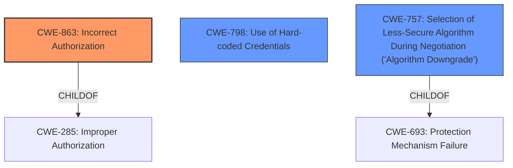

# Analysis Report for CVE-2020-16630

# Vulnerability Analysis Report: CVE-2020-16630

## Description


## Analysis (with Relationship Data)

# Summary
| CWE ID | CWE Name | Confidence | CWE Abstraction Level | CWE Vulnerability Mapping Label | CWE-Vulnerability Mapping Notes |
|---|---|---|---|---|---|
| CWE-863 | Incorrect Authorization | 0.8 | Class | Primary | Allowed-with-Review |
| CWE-798 | Use of Hard-coded Credentials | 0.6 | Base | Secondary | Allowed |
| CWE-757 | Selection of Less-Secure Algorithm During Negotiation ('Algorithm Downgrade') | 0.5 | Base | Secondary | Allowed |

## Evidence and Confidence

*   **Confidence Score:** 0.7
*   **Evidence Strength:** MEDIUM

## Relationship Analysis
The primary relationship that impacted the decision was the parent-child relationship between CWE-285 (Improper Authorization) and CWE-863 (Incorrect Authorization). CWE-863 is a more specific type of improper authorization, making it a better fit. The retriever also suggested CWE-757 (Algorithm Downgrade) which has a child relationship to CWE-693 (Protection Mechanism Failure). CWE-798 (Hardcoded Credentials) is a possible weakness that could lead to the vulnerability.



## Vulnerability Chain
The vulnerability chain starts with the **BLE stack caching and reusing the LTK property**, which leads to a fake mobile being able to **access attributes with authenticated read/write permission**. The **root cause** is the reuse of the LTK property, and the impact is unauthorized access.

## Summary of Analysis
The initial analysis identified **CWE-863 (Incorrect Authorization)** as the primary weakness, supported by the fact that a fake mobile is able to access attributes it should not have access to. The vulnerability description states that the **BLE stack caches and reuses the LTK property** for a bonded mobile, which is the **root cause**. This leads to the impact of the fake mobile gaining unauthorized access. The CVE reference links content summary also supports this, stating that "Misuse of attribute permissions on BLE devices." is a weakness.

The retriever results also pointed to **CWE-285 (Improper Authorization)**, but the mapping guidance for CWE-285 discourages its use and suggests using more specific CWEs like **CWE-863 (Incorrect Authorization)**.

**CWE-798 (Use of Hard-coded Credentials)** was considered because the **root cause** could potentially involve the use of hard-coded credentials in the BLE stack. However, the vulnerability description focuses more on the **improper reuse** of existing credentials rather than the credentials themselves being hard-coded. If the LTK was derived from a hardcoded key that would be an issue. But that information is not provided.

**CWE-757 (Selection of Less-Secure Algorithm During Negotiation ('Algorithm Downgrade'))** could also be a contributing factor. The CVE Reference Links Content Summary notes "...allowing a malicious peer device to downgrade the connection to an insecure mode.". The evidence is not strong, so it is a secondary consideration.

Ultimately, the selected CWEs are at an optimal level of specificity, with **CWE-863 (Incorrect Authorization)** being the primary weakness and **CWE-798 (Use of Hard-coded Credentials)** and **CWE-757 (Selection of Less-Secure Algorithm During Negotiation ('Algorithm Downgrade'))** being secondary candidates.

Relevant CWE Information:

# Enhanced Context (25 CWEs)
The following CWEs were identified as potentially relevant to this vulnerability:

## CWE-312: Cleartext Storage of Sensitive Information
**Abstraction Level**: Base
**Similarity Score**: 0.78
**Source**: dense

**Description**:
The product stores sensitive information in cleartext within a resource that might be accessible to another control sphere.

**Mapping Guidance**:
- Usage: Allowed
- Rationale: This CWE entry is at the Base level of abstraction, which is a preferred level of abstraction for mapping to the root causes of vulnerabilities.

## CWE-1391: Use of Weak Credentials
**Abstraction Level**: Class
**Similarity Score**: 0.77
**Source**: dense

**Description**:
The product uses weak credentials (such as a default key or hard-coded password) that can be calculated, derived, reused, or guessed by an attacker.

**Mapping Guidance**:
- Usage: Allowed-with-Review
- Rationale: This CWE entry is a Class and might have Base-level children that would be more appropriate

## CWE-319: Cleartext Transmission of Sensitive Information
**Abstraction Level**: Base
**Similarity Score**: 0.77
**Source**: dense

**Description**:
The product transmits sensitive or security-critical data in cleartext in a communication channel that can be sniffed by unauthorized actors.

**Mapping Guidance**:
- Usage: Allowed
- Rationale: This CWE entry is at the Base level of abstraction, which is a preferred level of abstraction for mapping to the root causes of vulnerabilities.

## CWE-345: Insufficient Verification of Data Authenticity
**Abstraction Level**: Class
**Similarity Score**: 0.77
**Source**: dense

**Description**:
The product does not sufficiently verify the origin or authenticity of data, in a way that causes it to accept invalid data.

**Mapping Guidance**:
- Usage: Discouraged
- Rationale: This CWE entry is a level-1 Class (i.e., a child of a Pillar). It might have lower-level children that would be more appropriate

## CWE-203: Observable Discrepancy
**Abstraction Level**: Base
**Similarity Score**: 0.76
**Source**: dense

**Description**:
The product behaves differently or sends different responses under different circumstances in a way that is observable to an unauthorized actor, which exposes security-relevant information about the state of the product, such as whether a particular operation was successful or not.

**Mapping Guidance**:
- Usage: Allowed
- Rationale: This CWE entry is at the Base level of abstraction, which is a preferred level of abstraction for mapping to the root causes of vulnerabilities.

## CWE-798: Use of Hard-coded Credentials
**Abstraction Level**: Base
**Similarity Score**: 0.76
**Source**: dense

**Description**:
The product contains hard-coded credentials, such as a password or cryptographic key.

**Mapping Guidance**:
- Usage: Allowed
- Rationale: This CWE entry is at the Base level of abstraction, which is a preferred level of abstraction for mapping to the root causes of vulnerabilities.

## CWE-1390: Weak Authentication
**Abstraction Level**: Class
**Similarity Score**: 0.76
**Source**: dense

**Description**:
The product uses an authentication mechanism to restrict access to specific users or identities, but the mechanism does not sufficiently prove that the claimed identity is correct.

**Mapping Guidance**:
- Usage: Allowed-with-Review
- Rationale: This CWE entry is a Class and might have Base-level children that would be more appropriate

## CWE-1240: Use of a Cryptographic Primitive with a Risky Implementation
**Abstraction Level**: Base
**Similarity Score**: 0.76
**Source**: dense

**Description**:
To fulfill the need for a cryptographic primitive, the product implements a cryptographic algorithm using a non-standard, unproven, or disallowed/non-compliant cryptographic implementation.

**Mapping Guidance**:
- Usage: Allowed
- Rationale: This CWE entry is at the Base level of abstraction, which is a preferred level of abstraction for mapping to the root causes of vulnerabilities.

## CWE-226: Sensitive Information in Resource Not Removed Before Reuse
**Abstraction Level**: Base
**Similarity Score**: 0.76
**Source**: dense

**Description**:
The product releases a resource such as memory or a file so that it can be made available for reuse, but it does not clear or "zeroize" the information contained in the resource before the product performs a critical state transition or makes the resource available for reuse by other entities.

**Mapping Guidance**:
- Usage: Allowed
- Rationale: This CWE entry is at the Base level of abstraction, which is a preferred level of abstraction for mapping to the root causes of vulnerabilities.

## CWE-807: Reliance on Untrusted Inputs in a Security Decision
**Abstraction Level**: Base
**Similarity Score**: 0.75
**Source**: dense

**Description**:
The product


## CWE Relationship Analysis

Current CWEs represent these abstraction levels: .


### Vulnerability Chain Analysis

**Chain starting from CWE-312:**
- 312 (Cleartext Storage of Sensitive Information) - ROOT


**Chain starting from CWE-285:**
- 285 (Improper Authorization) - ROOT


### CWE Relationship Diagram

```mermaid
graph TD
    classDef primary fill:#f96,stroke:#333,stroke-width:2px
    classDef secondary fill:#69f,stroke:#333
    classDef tertiary fill:#9e9,stroke:#333
```


*Report generated on 2025-04-01 17:08:18*
